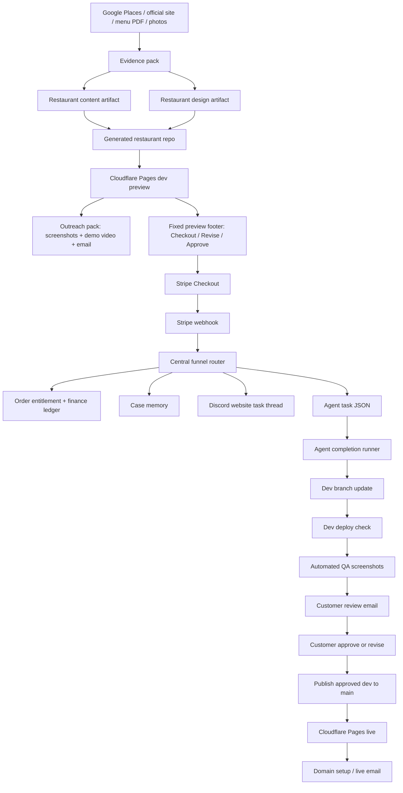

# ProfitsLocal / WebJuice Local Website Automation

AI-assisted local business website system for local service and hospitality businesses.

This repository is the central automation brain. It turns real business evidence into customer website artifacts, preview websites, sales/fulfillment tasks, customer review emails, live publishing, domain setup, and ROI records.

Current focus: **restaurant as the first niche**. Roofing is the planned second niche, but should reuse the website core and project capsule rather than inheriting restaurant-only menu behavior.

## Business Loop Status

The restaurant MVP loop is functionally complete.

Verified with Opa Bar & Mezze:

- Stripe test purchase completed.
- Central automation created entitlement, case memory, task, Discord thread, and revenue ledger state.
- Revision request matched `orderId + checkout email`, consumed quota, uploaded attachment to Cloudinary, and reused the same case/thread.
- Agent task applied real restaurant artifacts to `dev`.
- Automated QA screenshots can be captured before customer review email.
- Customer review email was sent.
- Approval publish moved approved `dev` tree to `main`.
- Cloudflare Pages live deploy succeeded.
- Live email was sent.
- `opa-controlled.profitslocal.com` is active and returns HTTP 200 for `/` and `/menu/`.

What remains is mostly production hardening, not core-loop invention:

- configure estimated Resend/runtime costs for cleaner ROI reports;
- harden the ProfitsLocal admin dashboard from repo-backed v1 into faster operator workflows.

Additional 2026-05-07 proof:

- Dedicated `ProfitsLocal Handoff` Discord sender bot posts website task packets and `website-agent` pickup was verified in `#website-tasks`.
- Rich & Rare dev preview now has the ProfitsLocal branded fixed-footer offer, `/demo-faq`, `/checkout`, `/thank-you`, `/revise`, `/approve`, `/domain-setup`, and `/domain-help`.
- Rich & Rare dev deploy commit `00bf29b` completed GitHub Actions run `25470867095`; all funnel URLs returned HTTP 200 and content checks found ProfitsLocal, `$399`, `$799/yr`, revision, approval, and domain guidance.

## Pricing

- `$399` one-time website, includes 3 revisions.
- `$799/year` website plus monthly maintenance.
- `$100` per extra revision.

## Architecture

The platform has four separate layers:

- **Client Website Core**: the actual customer website, usually a lead-generation site with a contact form.
- **Agent Handoff / Project Capsule**: portable project memory so Discord/Hermes, Codex, Claude Code, OpenCode, or Open Design can continue the same project.
- **Internal Sales + Fulfillment Ops**: ProfitsLocal preview footer, checkout, revision, approval, domain, email, Discord, and finance workflow.
- **Niche Adapters**: restaurant now, roofing next.

See `docs/MODULE_BOUNDARIES.md` for the full boundary rules.



## Core Data Flow

The system passes information through durable files instead of relying on chat memory.

| Stage | Main output | Why it matters |
|---|---|---|
| Evidence extraction | `clients/<client>/evidence/evidence.json` | Source of truth for address, phone, menu, photos, official links, and scrape provenance. |
| Website intake survey | `clients/<client>/intake/website-survey.json` (planned), `docs/WEBSITE_INTAKE_SURVEY.md` | Unified Open Design-style survey contract before website/menu generation. |
| Content build | `clients/<client>/content.restaurant.json` | Clean restaurant website/menu content used by renderer. |
| Design brief | `clients/<client>/design.restaurant.json`, `brand-spec.md` | Huashu/open-design guidance: palette, typography, layout, brand tone. |
| Checkout config | `clients/<client>/funnel/checkout.json` | Price/product metadata and preview utility links. |
| Outreach proof | `clients/<client>/outreach/*` | Screenshots, demo video, validated email material. |
| Paid order | `data/funnel/orders/<client>/<order>.json` | Entitlement, tier, revision policy, customer email. |
| Paid intake / admin ops | `data/paid-intakes/<client>/<order>.json`, `/admin/intakes` | Structured customer intake, Cloudinary references, lead recipient, revision state, and operator actions. |
| Case memory | `data/cases/<client>/<order>/` | Long-lived memory for agent, Discord thread ids, timeline, customer messages, runs. |
| Agent task | `data/agent-tasks/<client>/*.json` | Exact task packet for Hermes/OpenClaw/Codex-style agents. |
| Agent result | `data/agent-runs/*.json`, `agent-runs.jsonl` | Audit trail: context read, design protocol, screenshots, deploy, email. |
| Finance ledger | `data/finance/ledger.jsonl` | Revenue/cost events for ROI reporting. |
| Domain state | `data/domain/requests/<client>/*.json` | DNS route, Pages attach status, customer next step. |

## Main Modules

### Evidence Engine

Builds a reliable evidence pack before any page is rendered.

Inputs:

- Google Places details and photos.
- Official restaurant websites.
- Menu pages, PDFs, images, and scanned documents.
- Firecrawl / Firecrawl Parse output.
- OCR output from MarkItDown, OCRmyPDF, and PaddleOCR.

Useful commands:

```bash
npm run extract:google-places -- --query "restaurant Brisbane Australia" --niche restaurant --city Brisbane --count 20
npm run extract:google-places-photos -- --client opa-bar-mezze-restaurant
npm run extract:brand-assets -- --client opa-bar-mezze-restaurant
npm run extract:menu-document -- --input <menu.pdf-or-url> --client opa-bar-mezze-restaurant
npm run evidence:validate -- --client opa-bar-mezze-restaurant
```

### Restaurant Artifact Pipeline

Turns evidence into renderer-ready artifacts.

```bash
npm run pipeline:build-client -- --client opa-bar-mezze-restaurant
npm run restaurant:build-content -- --client opa-bar-mezze-restaurant
npm run design:restaurant-brief -- --client opa-bar-mezze-restaurant
```

The website route and menu route are treated as different products:

- website = official, brand-led, formal, conversion-oriented;
- menu = mobile-first, minimal, factual, fast to scan.

The shared survey standard is documented in `docs/WEBSITE_INTAKE_SURVEY.md`. It maps Open Design's first discovery form into ProfitsLocal fields so scraped leads, paid intakes, and Discord agent tasks all start from the same website-ready package.

Restaurant is a niche adapter, not the whole platform. Its mobile menu route is special to restaurants. Other niches, starting with roofing, should default to a formal lead-generation website with a contact/estimate form.

### Design System

Design quality is a core differentiator.

Required design principles:

- use real restaurant evidence before inventing content;
- prefer official logo, restaurant photos, menu photos, and real brand colors;
- use `huashu-design` and open-design thinking for the website design brief;
- avoid generic AI-looking pages;
- keep preview sales controls outside the restaurant content.

Important files:

- `DESIGN.md`
- `clients/<client>/design.restaurant.json`
- `clients/<client>/brand-spec.md`

### Generated Restaurant Repos

The central repo stores data and automation. Generated repos render the customer site.

Current Brisbane generated repos:

- `matthew6688/longwang-restaurant-restaurant`
- `matthew6688/babylon-brisbane-restaurant`
- `matthew6688/opa-bar-mezze-restaurant`
- `matthew6688/joey-s-restaurant`
- `matthew6688/chu-the-phat-restaurant`

Sync artifacts into a generated repo:

```bash
npm run clients:sync-artifacts -- \
  --client opa-bar-mezze-restaurant \
  --repo-dir /Users/matthew/Developer/webjuice-generated/opa-bar-mezze-restaurant \
  --build
```

### Outreach Pack

Creates proof material for sales.

```bash
npm run outreach:build-pack -- --client opa-bar-mezze-restaurant
npm run outreach:capture-assets -- --client opa-bar-mezze-restaurant
npm run outreach:validate-pack -- --client opa-bar-mezze-restaurant
npm run outreach:send-cold-email -- --client opa-bar-mezze-restaurant --to matthew6688@gmail.com --dry true
```

Output includes:

- preview URL;
- desktop/mobile screenshots;
- scroll demo video;
- real menu/source proof;
- local AI audit result;
- cold email JSON.

### Sales Funnel

The production path is first-party Stripe, not Tally.

Client pages:

- `/checkout`
- `/thank-you`
- `/revise`
- `/approve`
- `/domain-setup`
- `/domain-help`

Client APIs:

- `/api/create-checkout-session/`
- `/api/stripe-webhook/`
- `/api/revision-request/`
- `/api/approval-request/`
- `/api/order-status/`
- `/api/domain-request/`
- `/api/domain-status/`
- `/api/upload-attachment/`

Central router:

```bash
npm run funnel:route-event -- --input /tmp/stripe-event.json --provider auto --dry-run true
npm run funnel:route-stripe -- --input /tmp/stripe-event.json --dry-run true
npm run funnel:route-tally -- --input /tmp/revision.json --dry-run true
```

### Order Entitlements

Revision control is mandatory and identity-safe.

Rules:

- every revision must match both `orderId` and checkout `email`;
- one-time `$399` includes 3 revisions;
- yearly `$799/year` includes monthly maintenance policy;
- extra revision purchase adds `+1` to the original entitlement;
- denied revisions do not create agent tasks.

Status is exposed through `/api/order-status/` and shown on `/revise`.

### Case Memory

Every paid order gets a durable case folder:

```text
data/cases/<clientSlug>/<orderId>/
├── case.json
├── context-packet.json
├── timeline.jsonl
├── customer-messages.jsonl
├── decisions.jsonl
├── agent-runs.jsonl
└── artifacts/
```

This is what prevents the agent from forgetting:

- current order;
- customer email;
- repo and branch;
- source-of-truth files;
- requested changes;
- Discord thread ids;
- previous decisions;
- revision quota;
- review screenshots;
- publish history.

### Agent Task Runner

Creates and executes website work.

```bash
npm run agent:create-task -- --client opa-bar-mezze-restaurant
npm run agent:validate-task -- --task data/agent-tasks/<client>/<task>.json
npm run agent:run-task -- --task <task.json> --repo-dir <client-repo> --execute true
npm run agent:complete-task -- --task <task.json> --repo-dir <client-repo> --execute true --checkout true --push true --check-deploy true --send-email true
```

`agent:complete-task` now:

1. checks out the dev branch;
2. applies restaurant artifacts;
3. builds the site;
4. optionally pushes dev;
5. waits for dev deploy;
6. captures desktop/mobile QA screenshots if none were supplied;
7. enforces the pre-review gate;
8. sends the customer review email;
9. posts Discord follow-up when enabled;
10. writes case memory and run output.

### Approval Publish

Customer approval uses `orderId + checkout email`, resolves the same case, then publishes approved `dev` to `main`.

```bash
npm run agent:resolve-approved-task -- --order <orderId> --email <email>
npm run agent:publish-approved -- --task <task.json> --repo-dir <client-repo> --execute true --push true --check-deploy true --send-email true
```

The publisher avoids unrelated-history merges by creating a main commit from the approved dev tree.

### Discord Website Task Workspace

The internal workroom is Discord `#website-tasks`.

Each sale/revision should become one durable thread named from the business and order/task. Later agent completion, revision, approval, and publish messages reuse the same thread from `case.json.discord`.

Hermes / website-agent receives:

- client slug;
- repo;
- task path;
- case path;
- context packet;
- design protocol;
- source-of-truth files;
- customer request;
- allowed scope.

Remaining production polish: use a dedicated `ProfitsLocal Handoff` sender bot, so the website-agent is not also the task sender.

### Customer Emails

Resend handles transactional customer emails.

Implemented email nodes:

- payment receipt;
- revision received;
- revision accepted;
- revision denied / buy extra revision;
- dev preview ready;
- live published;
- domain setup status.

Cold outreach can be tested through Resend, but production cold email should use a separate sender/domain or a cold email platform.

### Domain Setup

Supported launch paths:

1. Free ProfitsLocal subdomain, such as `<client>.profitslocal.com`.
2. Customer subdomain, such as `menu.customer.com`.
3. Customer root domain, such as `customer.com`, after DNS/email audit.
4. Future ProfitsLocal subpage route, such as `profitslocal.com/<client>`, not currently sold as production route.

Commands:

```bash
npm run domain:test-launch-route
npm run domain:test-request
npm run domain:request -- --client opa-bar-mezze-restaurant --order <order> --email <email> --domain opa-controlled.profitslocal.com --execute true --send-email true
npm run domain:pages-status -- --project opa-bar-mezze-restaurant-live --domain opa-controlled.profitslocal.com
npm run domain:cleanup -- --domain <smoke-domain>.profitslocal.com --project <client>-live --execute true
```

`domain-request.yml` can:

- create/update ProfitsLocal subdomain DNS;
- attach the custom domain to Cloudflare Pages;
- wait for customer DNS on customer subdomains;
- stop root domains for manual review;
- email the customer with the next step.

### Finance / ROI

The finance ledger records revenue and costs.

Supported events:

- Stripe revenue;
- Tally fallback revenue;
- Google Places costs;
- Firecrawl / Firecrawl Parse costs;
- OpenAI usage;
- Resend email cost;
- image generation cost;
- agent runtime estimate.

Commands:

```bash
npm run finance:add
npm run finance:add-openai-usage
npm run finance:add-image-generation
npm run finance:add-agent-runtime
npm run finance:report
```

For cleaner ROI reports, configure:

- `RESEND_EMAIL_UNIT_COST`
- `AGENT_RUNTIME_COST_PER_MINUTE`

### Local AI Audit

Ollama can provide a cheap local quality gate before outreach.

```bash
npm run audit:restaurant-local-llm -- --client opa-bar-mezze-restaurant --fail-on high
```

The audit checks:

- menu facts are evidence-backed;
- phone/map/reservation links are mobile actionable;
- website and menu are not confused;
- OCR/CMS noise is flagged;
- core restaurant principles are followed.

### Cloudinary Attachments

Revision forms can upload attachments through the customer site.

Files are uploaded to Cloudinary and forwarded into:

- customer email;
- Discord task thread;
- agent task payload;
- case memory.

## GitHub Actions

Central workflows:

- `.github/workflows/deploy.yml`: main branch to live Pages.
- `.github/workflows/deploy-dev.yml`: dev branch to dev Pages.
- `.github/workflows/route-funnel-event.yml`: Stripe/revision event to central state, task, agent auto-run.
- `.github/workflows/publish-approved.yml`: approved dev tree to main/live.
- `.github/workflows/domain-request.yml`: DNS/Page custom domain workflow.

The main repo workflows are hardened for Node 24. Deploys use direct `npx wrangler@4 pages deploy`.

## Environment

Use local `.env.local` for development. Do not commit secrets.

```bash
npm run setup:local-env
npm run check:env -- --workflow funnel
npm run check:env -- --workflow scrape
npm run check:env -- --workflow deploy
npm run check:env -- --workflow localAudit
```

Important services:

- GitHub PAT / Actions secrets
- Cloudflare API token and account ID
- Stripe keys and webhook secret
- Resend API key
- Google Places API key
- Firecrawl API key
- Cloudinary config
- Discord webhooks / bot tokens
- Ollama local model

See `docs/SECURITY.md` for key handling.

## Standard Verification

Run from this repo:

```bash
npm run agent:test-approval-resolution
npm run agent:test-pre-review-gate
npm run funnel:test-domain-email-guidance
npm run funnel:test-extra-revision-entitlement
npm run funnel:test-route-idempotency
npm run domain:test-launch-route
npm run domain:test-request
npm run hermes:test-website-agent-closure
npm run qa:opa-full-loop-live-sim
```

Deploy checks:

```bash
npm run check:links -- --all clients --internal-links false
npm run check:deploys -- --all clients
```

## Evidence From Latest End-to-End Test

Opa Bar & Mezze production-like rehearsal:

- Order: `cs_test_b1NsMZTui0nhviPT4xGh6r5orYmCzLQjeDQCc5qnKgYe3BDUb0bb7etXY7`
- Review email Resend id: `73281496-4628-449a-8ff1-89cb6f81a5fd`
- Live publish commit: `418519767e480bf0bd0b8948e515851528f658d9`
- Deploy Live run: `25382781613`, `completed/success`
- Live email Resend id: `7f832951-4d8b-4ed8-8d25-627f5d0a2129`
- Live URL: `https://opa-controlled.profitslocal.com/`
- Menu URL: `https://opa-controlled.profitslocal.com/menu/`
- Domain status: Cloudflare Pages custom domain `active`

Latest main repo deploy after Node 24 hardening:

- Commit: `a6bd288`
- Deploy Live run: `25383883066`, `completed/success`

Generated restaurant repo Node 24 hardening:

- 5 generated restaurant repos updated on both `dev` and `main`.
- All 5 latest `Deploy Dev` runs completed success.
- All 5 latest `Deploy Live` runs completed success.
- No generated repo workflow still references `actions/checkout@v4`, `actions/setup-node@v4`, `node-version: 22`, or `cloudflare/wrangler-action`.

Repeat verification beyond Opa:

- Babylon Brisbane and Chu The Phat dev/live utility pages returned HTTP 200.
- Both outreach packs validated.
- Both desktop/mobile screenshot captures passed with 0 console errors.
- Both local Ollama audits passed with score 100 and 0 findings.

## Important Docs

- `HANDOFF.md`: operational state and latest handoff.
- `docs/MODULE_STATUS.md`: module-by-module status.
- `docs/RESTAURANT_LAUNCH_RUNBOOK.md`: launch checklist and evidence.
- `docs/SALES_FUNNEL.md`: checkout/revision/approval/customer email details.
- `docs/OCR_MENU_PIPELINE.md`: menu extraction and OCR.
- `docs/PAID_INTAKE_FLOW.md`: paid intake, admin dashboard, revision, and Cloudinary flow.
- `docs/MODULE_BOUNDARIES.md`: customer website core, sales ops, project capsule, and niche adapter boundaries.
- `docs/WEBSITE_INTAKE_SURVEY.md`: Open Design-style survey contract for website-ready project capsules.
- `docs/SECURITY.md`: secret handling.

## Current Next Work

1. Configure estimated Resend/runtime/provider costs so ROI reports are useful at scale.
2. Add a delivery QA pass for the ProfitsLocal branded funnel pages before every outreach/demo push.
3. Harden admin dashboard v1 with automatic rebuild after actions, operator filters, and email draft/send actions.
4. Keep generated client repos synced whenever the template funnel changes.
