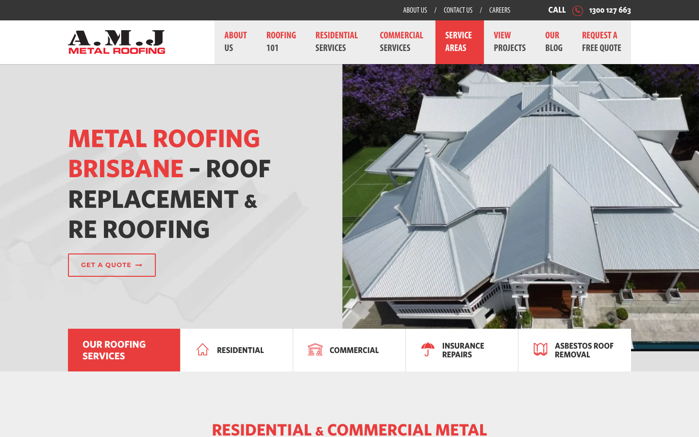
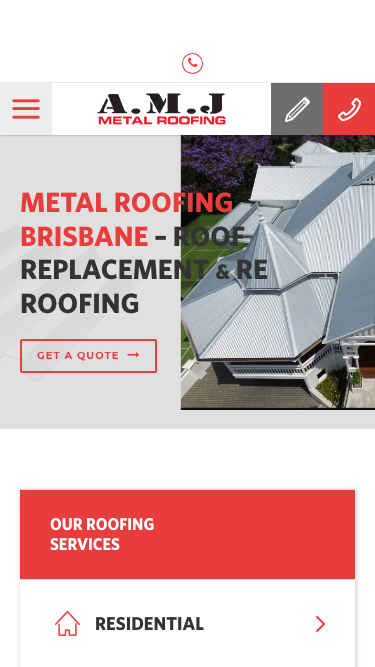

# A.M.J Metal Roofing Brisbane · 现状审计与重构提议

> **60/100** · moderate_candidate · 行业：roofer · 地区：Brisbane · Google 评价：4.8★ （72 条）

## 内部分级 · 运营优先看这段

**投入分级：** `C` 批量轻触 — 模板邮件 + 报告 PDF 链接，无主动跟进

**触发依据：**
- C · moderate_candidate · audit 60 · 72 评论 4.8★ (未达 B 标准)

**下一步行动：** 标准模板邮件 + master.md PDF 链接，无主动跟进。等客户回复触发后再投入。

## 一、店家现状速览

**线索来源 · 联系开场可用**:
- **来源**: Google Places API (官方搜索)
- **搜索关键词**: `roofer brisbane`
- **结果排名**: 第 2 位
- **首次发现**: 2026-05-14
- **Batch**: `places-roofer-brisbane-202605150200`

**审计结论：** audit_score=60 → moderate_candidate · weakest: gbp 37, visual 50

- 电话：1300 127 663
- 地址：1/15 Natasha St, Capalaba QLD 4157, Australia
- 网站：[https://www.amjmetalroofing.com.au/](https://www.amjmetalroofing.com.au/)

## 二、客户访问时看到的页面

**慢速 4G 加载实景视频**（1.6 Mbps · 150ms 延迟 · 4× CPU 节流，模拟真实手机访客的体验）：

[播放视频](./video/mobile-throttled.webm)

## 三、视觉审计 · Vision LLM 怎么看

> The site looks like a real roofing company, but the above-fold design feels heavy, crowded, and short on trust proof for a Brisbane customer ready to call.

新鲜度 **5/10** · 信任度 **6/10** · 转化准备度 **5/10** · 设计年代 `slightly_outdated`

**值得保留的优点：**
- The large roof photo clearly shows the type of work being offered.
- The phone number is visible in the top-right area on desktop.
- The red brand color creates clear recognition across the header and service sections.

## 五、当前网站在哪里"漏水"

### 主要问题 · 5 项（影响转化的明显短板）

### 主要 · homepage_title_clear

**技术事实**

title='# Metal Roofing Brisbane – Roof Replacement & Re Roofing' contains-name=false contains-niche=false

**普通话翻译**

你网站的浏览器标签 title 没把业务名字 + 服务关键词写清楚（比如该写「A.M.J Metal Roofing Brisbane - roofer Brisbane」，但目前是泛泛一句）。

**对客户的影响**

Google 搜索结果里展示的就是这个 title。写不清楚 = 排名靠后 + 即使排上来客户也不知道是不是匹配的服务。SEO 最便宜的修复，但很多本地企业完全没做。

### 主要 · local_schema_markup

**技术事实**

no LocalBusiness JSON-LD

**普通话翻译**

网站没有 LocalBusiness JSON-LD 结构化数据（让 Google / AI 知道你是本地企业、地址、电话、营业时间的标准格式）。

**对客户的影响**

Google「附近的服务」「Knowledge Panel」「AI Overview」都依赖这类结构化数据。没有 = 即使排名上去也不会出现在右侧 Knowledge Panel 或地图卡片里 — 错失高转化的展示位。AI agent / ChatGPT 引用本地商家时也是基于这些数据。

### 主要 · Quote button is visually too quiet

**技术事实**

The hero CTA is a thin red outline button reading "GET A QUOTE" on a pale grey background, placed below the large headline.

**普通话翻译**

首页最重要的“获取报价”按钮太轻，看起来不像主要按钮，容易被忽略。

**对客户的影响**

很多本地客户只会快速扫一眼页面，通常几秒内决定要不要联系。按钮不明显，会让已经有需求的客户少一步行动，直接减少电话和报价询盘。

**正确长啥样**

A solid high-contrast red button above the fold, paired with a secondary phone action, both large enough to scan quickly.

**Redesign 怎么改**

Replace the outlined hero button with a solid red "Get a Free Quote" button and add a nearby phone CTA such as "Call 1300 127 663" in a secondary style.

### 主要 · No proof before asking for action

**技术事实**

The visible hero area shows a roof photo, headline, navigation, phone number, and service tiles, but no reviews, years in business, licence, warranty, or local proof.

**普通话翻译**

首页第一屏没有马上告诉客户“我们靠谱”，比如评价、资质、经验年限或保修。

**对客户的影响**

换屋顶是高价决定，客户会更谨慎。缺少信任信息时，他们更可能返回 Google 去看下一家公司，特别是从 GBP 点进来的陌生客户。

**正确长啥样**

A compact trust row directly under the headline or CTA with items like star rating, years of experience, licensed and insured, and Brisbane service coverage.

**Redesign 怎么改**

Add a trust strip in the hero area with Google rating, review count if available, licence or insurance statement, and a short Brisbane-local claim.

### 主要 · Navigation feels crowded

**技术事实**

The header contains a dark top bar, logo area, multiple large menu blocks, a highlighted red "SERVICE AREAS" tab, and a separate phone number area.

**普通话翻译**

顶部菜单内容太多，客户第一眼不知道最该点哪里。

**对客户的影响**

本地搜索客户通常目标很直接：看是否可信，然后打电话或询价。选择太多会拖慢决定，增加离开的机会。

**正确长啥样**

A simpler header with logo, phone number, one strong quote button, and 4-5 clear menu items.

**Redesign 怎么改**

Collapse secondary links like About Us, Careers, and Blog out of the primary header; keep Services, Projects, Service Areas, phone, and quote CTA prominent.

## 六、Redesign 的发力点（综合视觉 + 评论数据）

1. [视觉] 1. Make phone and quote actions the strongest elements above the fold.
2. [视觉] 2. Add visible trust proof near the hero headline before asking visitors to act.
3. [视觉] 3. Simplify the header and rewrite the hero message for faster scanning.

## 真实速度数据 · Google PageSpeed Insights

我们前面那段「慢速 4G 加载视频」是我们这边的实验室结果。这一段是 **Google 自己**对你网站打的分，包括过去 28 天 **真实访客**的网络体验数据（CRUX field data）。

### 移动端（mobile）

**Lighthouse 分数（实验室）：**

| 维度 | 分数 |
|---|---|
| 性能 (Performance) | **29/100** |
| 可访问性 (Accessibility) | 58/100 |
| 最佳实践 (Best Practices) | 50/100 |
| SEO | 77/100 |

**Lab 关键指标：** LCP `24.3s` · FCP `16.5s` · CLS `0.000` · TBT `1597ms`

**真实用户体验（过去 28 天 CRUX field data）总评：** `SLOW`

| 指标 | 75% 用户值 | Google 评级 |
|---|---|---|
| LCP（最大内容绘制 p75） | 3.14s | AVERAGE |
| FCP（首次内容绘制 p75） | 2.42s | AVERAGE |
| TTFB（服务器响应 p75） | 2.05s | SLOW |
| CLS（布局抖动 p75） | 0.000 | FAST |

**这意味着：** 过去 28 天访问你网站的实际用户里，75% 的人遇到的体验就是上面这些数字 — 不是我们测的、是 Google 用真实 Chrome 用户数据统计出来的。

**Google 建议的优化项（按节省时间排序，前 4）：**

- **Reduce unused JavaScript** — 节省 9290ms · 节省 2837KB
- **Reduce unused CSS** — 节省 450ms · 节省 229KB
- **Minify JavaScript** — 节省 24KB
- **Minify CSS** — 节省 15KB

## 图片优化与第三方脚本体重

PSI 给的是宏观分数，下面是具体可改的两块：图片格式与 tracker 脚本。

### 图片优化（共 89 张）

- **优化率：** 0%（0/89 使用 WebP/AVIF/SVG）
- **响应式 srcset：** 9%
- **Lazy load：** 19%
- **Alt 文字（非空）：** 88%
- **显式 width/height：** 39%（防止 CLS 布局抖动）

**总评：** 基本未优化 — redesign 可显著降低图片下载量

**具体问题：**
- [major] 89 张图几乎全是 JPG/PNG，未用 WebP/AVIF — 估算可节省 30-50% 图片下载量
- [minor] 81/89 张图无响应式 srcset — 移动端浪费带宽
- [minor] 72/89 张图未 lazy load — 首屏外的图阻塞主线程
- [minor] 54/89 张图无显式 width/height — 加重 CLS 布局抖动

### 第三方脚本占用情况

- **总请求数：** 217（86 自有 + 131 第三方）
- **第三方占总下载量：** 94%（4576 KB / 4893 KB）
- **Tracker 脚本数：** 19（合计 1400 KB）

**已识别的 tracker：**

| 工具 | 类型 | 请求数 | 字节 |
|---|---|---|---|
| Google Tag Manager | analytics | 8 | 1278.1 KB |
| Meta Pixel | ad_pixel | 2 | 97.3 KB |
| Google Analytics | analytics | 4 | 20.3 KB |
| DoubleClick | ad_serving | 5 | 4.5 KB |

> **观察：** 19 个 tracker 合计加载了 1400 KB —— 这些都是阻塞主线程的脚本，是性能 + 隐私双角度的销售切入点。redesign 时可以建议清理不再使用的 tracker。

## SEO 迁移评估 与 运营活跃度

客户最常担心的问题：「我重做网站，会不会丢掉 Google 排名？」这一段直接回答。

### 现有页面盘点

- **Sitemap 状态：** 已检测到 → `https://amjmetalroofing.com.au/sitemap_index.xml`
- **页面总数：** 171
- **迁移复杂度：** 高（>80 页 — 需要分阶段迁移 + 完整 redirect map）

**页面分类：**

| 类型 | 数量 |
|---|---|
| service_area_page | 62 |
| 作品集 / 案例 | 57 |
| Blog 文章 | 22 |
| 服务详情页 | 18 |
| 联系 / 报价 | 3 |
| 顶层页面 | 3 |
| 关于 / 团队 | 2 |
| 首页 | 1 |
| 法律 / 隐私 | 1 |
| area_page | 1 |
| 内页 | 1 |

**Sitemap lastmod 跨度：** 最旧 2018-07-19 → 最新 2026-04-09

**Redirect 计划承诺：** redesign 上线时我们会附一份 50 条 1:1 redirect 表（旧 URL → 新 URL），保证 Google 已经索引的页面权重无损迁移。已经在 Google 第一二页的关键词不会丢。

### SEO 长尾结构（服务 × 区域 = 本地搜索流量金矿）

- **服务专项页（如 /metal-roofing/）：** 18 个
- **区域页（如 /service-areas/brisbane/）：** 1 个
- **服务×区域组合页（如 /metal-roofing-brisbane/）：** 62 个

**长尾覆盖：** 强 — 已有 5+ 服务×区域页，长尾流量基础在

**现有服务页样本：** `/roofing-buying-guide/` · `/7-mistakes-you-must-avoid-when-replacing-your-roof/` · `/careers/re-roofing-estimator/` · `/careers/gutter-fixers-apply/` · `/metal-roofing-toowoomba/patio-roof/`

**现有服务×区域页样本：** `/colorbond-roof-brisbane-north-northside-southside/` · `/colorbond-roofing-brisbane-north-northside-southside/` · `/colorbond-cladding-installation-gold-coast/` · `/commercial-roof-repair-gold-coast-brisbane-northside-southside/` · `/metal-roofing-gold-coast/patio-roof/`

### 运营活跃度

- **整体活跃度：** 活跃（30 天内有更新） （最近一次更新 1 天前）
- **Blog 板块：** 有，共 22 篇文章 
- **社交媒体链接：** 网站上引用了 3 个平台 — facebook, instagram, linkedin

## 域名历史与邮件信誉

### 邮件 DNS 配置（影响未来邮件营销 / 冷邮件投递率）

- **SPF (反垃圾发件验证)：** 已配置
- **DKIM (邮件签名)：** 已配置（selectors: selector1）
- **DMARC (策略)：** 已配置（policy: `none`）
- **整体邮件投递信誉：** `strong` (SPF + DKIM + DMARC 齐全)

## 技术栈与营销基建

从网站源码识别出来的工具，能帮我们判断这位客户的数字成熟度。

- **网站平台 (CMS)：** WordPress（迁移复杂度参考；WordPress / Wix / Squarespace 这类有标准导出工具，custom-coded 会复杂）
- **分析工具：** Google Tag Manager · Google Analytics 4
- **广告 Pixel：** Meta (Facebook) Pixel · Google Ads Conversion — 客户已经在投放（或投放过）付费广告，对营销预算不陌生

**数字成熟度打分：** 4 / 6 （高 — 客户懂数字营销，redesign 谈预算时不必从零教育）

### Redesign 时必须保留 / 重新安装的追踪代码

客户可能有数月 / 数年的历史数据 + 广告投放受众 sit 在这些 ID 上面。重做时**必须用同一套 ID 重新接进新网站**，否则等于清零所有累积。

- Google Tag Manager
- Google Analytics 4
- Meta (Facebook) Pixel
- Google Ads Conversion

我们 redesign 交付清单会把这些列为「必须 setup 项」。

## 信任凭证 · generic

本地服务的客户在掏钱之前会查这些凭证。缺失 = 客户跳到下一家。

**信任分：** 25/100

### 已显示的（2 项）

- **保修** (15 分) — "10-year warranty"
- **免费报价** (10 分) — "Free Quote"

### 缺失的（5 项 — redesign 必补 / 提醒客户提供素材）

- [行业惯例] **ABN** (20 分)
- [行业惯例] **保险** (15 分)
- [行业惯例] **从业年限** (15 分)
- [行业惯例] **行业证书** (15 分)
- [行业惯例] **荣誉 / 奖项** (10 分)

## AI 时代可发现性 · GEO Readiness

GEO = Generative Engine Optimization。ChatGPT、Perplexity、Google AI Overviews 这些 AI 搜索产品**不像传统搜索引擎那样按"关键词排名"工作**，它们直接抓取结构化数据并把答案合成给用户。如果你的网站在 AI 抓取这一块做得不到位，等于在生成式搜索时代隐身。

**AI 可发现性总分：** 45 / 100 — AI agent 抓取部分支持，但关键 schema / 凭证 / FAQ 缺失

### 已经做到的（5 项）

- [PASS] `localbusiness_schema` — Organization JSON-LD present (LocalBusiness preferred for local services)
- [PASS] `breadcrumb_schema` — BreadcrumbList JSON-LD present
- [PASS] `eeat_business_credentials` — 2/4 credentials in copy: license/QBCC, insurance
- [PASS] `eeat_warranty_trust` — warranty/guarantee mentioned
- [PASS] `jsonld_at_least_one` — 4 JSON-LD block(s) detected on page

### 还缺的（7 项 — 这些是 redesign 时一并补上的标准动作）

- [缺失] `llms_txt_present` (5 分) — no /llms.txt at standard path
- [缺失] `ai_bot_robots_policy` (5 分) — robots.txt has no explicit policy for AI crawlers (GPTBot/ClaudeBot/etc)
- [缺失] `service_schema` (10 分) — no Service JSON-LD
- [缺失] `faqpage_schema` (10 分) — no FAQPage JSON-LD (loses AI Overview / featured snippet eligibility)
- [缺失] `aggregaterating_schema` (5 分) — no AggregateRating JSON-LD (★ rating not shown in search snippets)
- [缺失] `semantic_landmarks` (10 分) — 3 semantic landmarks present: <nav, <header, <footer
- [缺失] `faq_qa_pattern` (10 分) — 2 question-style heading(s) found (Q&A format helps AI extraction)

> **销售切入：** 「ChatGPT 现在每月 30 亿次搜索，本地服务用户问『Brisbane 哪家屋顶公司靠谱』，AI 回答时只引用结构化数据完整的网站。你目前在这个新阵地的得分是 45/100。」

## 业务规模信号 · 内部筛选用

**注：这一段只给运营内部看，不进入客户报告。** 用来判断这个 lead 是不是匹配我们「小网站 / 多批量 / 快上线」的产品定位。

- **规模信号汇总：** 中型客户特征
- **客户分级：** `mid` — 中型客户，可接但价格要往上提（基础包 + 配置项）

> 报价以上方 **建议报价** 为准（来自 entity.grade.recommended_pricing / PRODUCT_TIER_TABLE）。本段只用来判断 lead 是否匹配产品定位，不竞争报价。

**触发依据：**
- Google 评价 72 条（≥50，有规模基础）
- 网站页面数 171（≥100，中等复杂度）
- 已部署 4 个分析 / pixel 工具（高数字成熟度）

<!-- M2-D6 required token bridge: 现网站快速诊断 → covered by detail-builder section -->
<!-- 现网站快速诊断 -->

<!-- M2-D6 required token bridge: 业主沟通要点 → covered by detail-builder section -->
<!-- 业主沟通要点 -->

<!-- M2-D6 required token bridge: 账户与档案 → covered by detail-builder section -->
<!-- 账户与档案 -->

## 附录 · 数据出处

- Cheap audit version: `-`
- Detailed audit version: `2026-05-11-v1`
- Vision model: `codex_cli`
- Review source: `Google Places · most_relevant (max 5)`
- 完整 audit 报告 HTML：[internal-audit-report](./internal-audit-report.html)
