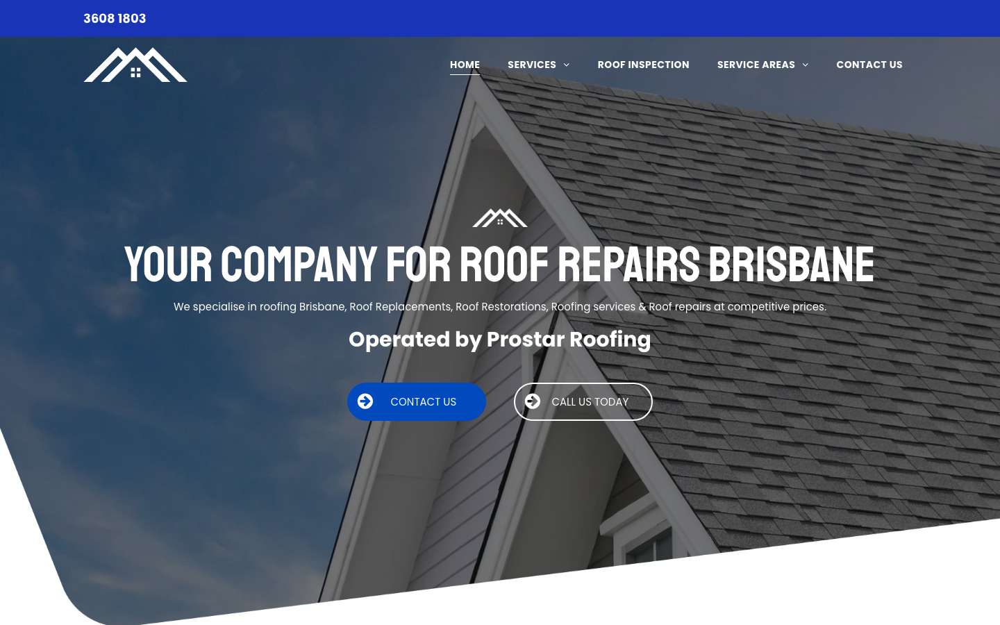
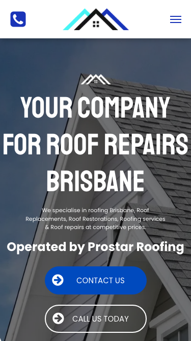

# Brisbane Roofing - Brisbane Roof Repairers · 现状审计与重构提议

> **64/100** · moderate_candidate · 行业：roofer · 地区：Brisbane · Google 评价：5★ （9 条）

## 内部分级 · 运营优先看这段

**投入分级：** `C` 批量轻触 — 模板邮件 + 报告 PDF 链接，无主动跟进

**触发依据：**
- C · moderate_candidate · audit 64 · 9 评论 5★ (未达 B 标准)

**下一步行动：** 标准模板邮件 + master.md PDF 链接，无主动跟进。等客户回复触发后再投入。

## 一、店家现状速览

## 二、销售切入点

**TBD · audit 不完整**

**线索来源 · 联系开场可用**:
- **来源**: Google Places API (官方搜索)
- **搜索关键词**: `roofer brisbane`
- **结果排名**: 第 13 位
- **首次发现**: 2026-05-14
- **Batch**: `places-roofer-brisbane-202605150200`

**审计结论：** audit_score=64 → moderate_candidate · weakest: gbp 24, visual 50

- 电话：(07) 3608 1803
- 地址：28/135c Macquarie St, Teneriffe QLD 4005, Australia
- 网站：[https://www.thebrisbaneroofrepairers.com/?utm_campaign=gmb](https://www.thebrisbaneroofrepairers.com/?utm_campaign=gmb)

## 三、客户访问时看到的页面

**慢速 4G 加载实景视频**（1.6 Mbps · 150ms 延迟 · 4× CPU 节流，模拟真实手机访客的体验）：

[播放视频](./video/mobile-throttled.webm)

## 三、视觉审计 · Vision LLM 怎么看

> The page has a clear roof-repair message and visible buttons, but placeholder branding, weak mobile contact clarity, and missing proof make it feel unfinished for a Brisbane roofing customer.

新鲜度 **4/10** · 信任度 **3/10** · 转化准备度 **4/10** · 设计年代 `outdated`

**值得保留的优点：**
- Roof repair service is mentioned immediately in the hero.
- Phone number is visible on desktop at the very top.
- Mobile layout includes both phone and menu icons above the fold.

## 五、当前网站在哪里"漏水"

### 关键问题 · 2 项（立刻在伤害成交）

### 关键 · Hero headline looks unfinished

**技术事实**

The main hero headline says "YOUR COMPANY FOR ROOF REPAIRS BRISBANE" instead of the visible business name.

**普通话翻译**

首页最显眼的标题像模板占位文字，不像一个真实商家的正式网站。

**对客户的影响**

客户通常在几秒内判断这家公司靠不靠谱；如果第一眼像模板或没做完，很多人会直接回到 Google 商家列表找下一家。

**正确长啥样**

Hero headline uses the actual business name or a direct local offer, such as "Brisbane Roof Repairers" with a short supporting line about leak repairs, restorations, and inspections.

**Redesign 怎么改**

Replace the placeholder-style H1 with the real brand/service promise: "Brisbane Roof Repairers" or "Roof Repairs Brisbane - Fast Local Repairs", then add one concrete subline about response area and services.

### 关键 · Mobile call action is unclear

**技术事实**

On mobile, the top-left blue square only shows a phone icon, while the actual number is not visible in the header.

**普通话翻译**

手机端只看到电话图标，看不到电话号码，客户要自己猜这个按钮能不能打电话。

**对客户的影响**

很多本地维修咨询发生在手机上；少一步清楚的“点击拨打”就可能让急着修漏水的客户转去打竞争对手电话。

**正确长啥样**

Mobile header has a sticky button reading "Call 3608 1803" or a full-width bottom call bar with the phone number visible.

**Redesign 怎么改**

Replace the standalone phone icon with a labelled tap-to-call control: "Call 3608 1803", and keep it sticky on mobile.

### 主要问题 · 5 项（影响转化的明显短板）

### 主要 · homepage_title_clear

**技术事实**

title='# Your Company for Roof Repairs Brisbane' contains-name=true contains-niche=false

**普通话翻译**

你网站的浏览器标签 title 没把业务名字 + 服务关键词写清楚（比如该写「Brisbane Roofing - Brisbane Roof Repairers - roofer Brisbane」，但目前是泛泛一句）。

**对客户的影响**

Google 搜索结果里展示的就是这个 title。写不清楚 = 排名靠后 + 即使排上来客户也不知道是不是匹配的服务。SEO 最便宜的修复，但很多本地企业完全没做。

### 主要 · Logo has no business name

**技术事实**

The desktop header shows only a white roof icon, and the mobile header shows only a roof icon with colored accents; no business name is visible beside it.

**普通话翻译**

网站顶部只有图标，没有清楚写出公司名字，客户不容易记住你是谁。

**对客户的影响**

本地客户会同时看好几家屋顶维修公司；如果品牌名不清楚，你更容易被当成普通模板网站而被跳过。

**正确长啥样**

Header shows the roof mark plus "Brisbane Roof Repairers" in readable text, with the phone number or call action close by.

**Redesign 怎么改**

Add the business name as text next to the logo on desktop and under or beside the mark on mobile, keeping it visible above the fold.

### 主要 · No proof before asking for contact

**技术事实**

The visible hero area contains the logo, headline, service sentence, "Operated by Prostar Roofing", and two buttons, but no reviews, licence, years in business, suburbs served, or guarantee is visible.

**普通话翻译**

首页第一屏没有展示评价、资质、保险或服务保障，客户只能看到广告语和按钮。

**对客户的影响**

屋顶维修金额高、风险高，客户会更谨慎；缺少信任证明会让原本准备询价的人先去找看起来更可靠的商家。

**正确长啥样**

Above the fold includes compact proof such as "4.8-star Google rating", "Licensed & insured", "Brisbane-wide roof repairs", and "Leak inspections available".

**Redesign 怎么改**

Add a proof strip directly under the hero copy with 3-4 trust badges: Google rating, licensed/insured, Brisbane service area, and repair warranty or inspection offer.

### 主要 · Contact buttons compete

**技术事实**

The hero shows two similar pill buttons side by side: a blue "CONTACT US" button and an outlined "CALL US TODAY" button.

**普通话翻译**

两个按钮看起来差不多，客户不知道应该点“联系”还是“今天打电话”。

**对客户的影响**

选择越多，行动越慢；对漏水、风暴损坏这类需求，最赚钱的动作通常是直接来电，按钮应该把客户推向这一步。

**正确长啥样**

One dominant phone CTA, such as "Call 3608 1803", with a secondary smaller "Request quote" link.

**Redesign 怎么改**

Make the primary CTA a high-contrast tap-to-call button with the number included, and demote the contact form action to a secondary text link or smaller button.

### 主要 · Mobile hero feels cramped

**技术事实**

On mobile, the oversized all-caps headline breaks into large stacked lines and fills most of the screen before the service text and buttons.

**普通话翻译**

手机端标题太大，占了太多空间，真正能让客户行动的信息被挤到下面。

**对客户的影响**

手机访客通常快速扫一眼就决定是否继续；如果第一屏只看到大字，没看到电话号码和可信证明，就会减少来电。

**正确长啥样**

Mobile hero uses a shorter 2-3 line headline, 16px+ readable body text, and a visible call button within the first screen.

**Redesign 怎么改**

Rewrite the mobile H1 to a shorter line, reduce the font size and line height, and move the call button plus one trust badge higher in the first viewport.

## 六、Redesign 的发力点（综合视觉 + 评论数据）

1. [视觉] 1. Replace placeholder hero messaging with real business name, clear Brisbane roof-repair offer, and visible phone number.
2. [视觉] 2. Add above-fold trust proof: Google rating, licensed/insured status, service area, and warranty or inspection promise.
3. [视觉] 3. Simplify mobile into one primary tap-to-call CTA and a shorter, easier-to-scan hero.

## 真实速度数据 · Google PageSpeed Insights

我们前面那段「慢速 4G 加载视频」是我们这边的实验室结果。这一段是 **Google 自己**对你网站打的分，包括过去 28 天 **真实访客**的网络体验数据（CRUX field data）。

### 移动端（mobile）

**Lighthouse 分数（实验室）：**

| 维度 | 分数 |
|---|---|
| 性能 (Performance) | **60/100** |
| 可访问性 (Accessibility) | 88/100 |
| 最佳实践 (Best Practices) | 96/100 |
| SEO | 85/100 |

**Lab 关键指标：** LCP `8.1s` · FCP `2.6s` · CLS `0.009` · TBT `346ms`

**Google 建议的优化项（按节省时间排序，前 2）：**

- **Reduce unused JavaScript** — 节省 910ms · 节省 134KB
- **Reduce unused CSS** — 节省 300ms · 节省 60KB

### 桌面端（desktop）

**Lighthouse 分数：** Performance 92 · A11y 92 · Best Practices 100 · SEO 85

## 图片优化与第三方脚本体重

PSI 给的是宏观分数，下面是具体可改的两块：图片格式与 tracker 脚本。

### 图片优化（共 22 张）

- **优化率：** 5%（1/22 使用 WebP/AVIF/SVG）
- **响应式 srcset：** 0%
- **Lazy load：** 0%
- **Alt 文字（非空）：** 14%
- **显式 width/height：** 36%（防止 CLS 布局抖动）

**总评：** 基本未优化 — redesign 可显著降低图片下载量

**具体问题：**
- [major] 22 张图几乎全是 JPG/PNG，未用 WebP/AVIF — 估算可节省 30-50% 图片下载量
- [minor] 22/22 张图无响应式 srcset — 移动端浪费带宽
- [minor] 22/22 张图未 lazy load — 首屏外的图阻塞主线程
- [major] 19/22 张图缺 alt 文字 — 影响 SEO + 可访问性 + AI 抓取
- [minor] 14/22 张图无显式 width/height — 加重 CLS 布局抖动

### 第三方脚本占用情况

- **总请求数：** 57（1 自有 + 56 第三方）
- **第三方占总下载量：** 97%（1181 KB / 1216 KB）
- **Tracker 脚本数：** 2（合计 158 KB）

**已识别的 tracker：**

| 工具 | 类型 | 请求数 | 字节 |
|---|---|---|---|
| Google Tag Manager | analytics | 1 | 157.9 KB |
| Google Analytics | analytics | 1 | 0.0 KB |

## SEO 迁移评估 与 运营活跃度

客户最常担心的问题：「我重做网站，会不会丢掉 Google 排名？」这一段直接回答。

### 现有页面盘点

- **Sitemap 状态：** 已检测到 → `http://www.thebrisbaneroofrepairers.com/sitemap.xml`
- **页面总数：** 15
- **迁移复杂度：** 低（≤15 页 — 1-2 周内可完成全站重做）

**页面分类：**

| 类型 | 数量 |
|---|---|
| service_area_page | 9 |
| 服务详情页 | 2 |
| 首页 | 1 |
| area_page | 1 |
| 联系 / 报价 | 1 |
| Blog 文章 | 1 |

**Sitemap lastmod 跨度：** 最旧 2025-12-07 → 最新 2025-12-07

**Redirect 计划承诺：** redesign 上线时我们会附一份 15 条 1:1 redirect 表（旧 URL → 新 URL），保证 Google 已经索引的页面权重无损迁移。已经在 Google 第一二页的关键词不会丢。

### SEO 长尾结构（服务 × 区域 = 本地搜索流量金矿）

- **服务专项页（如 /metal-roofing/）：** 2 个
- **区域页（如 /service-areas/brisbane/）：** 1 个
- **服务×区域组合页（如 /metal-roofing-brisbane/）：** 9 个

**长尾覆盖：** 强 — 已有 5+ 服务×区域页，长尾流量基础在

**现有服务页样本：** `/metal-roof-repair` · `/how-to-find-leaks-in-roof`

**现有服务×区域页样本：** `/gutter-repairs-brisbane` · `/roof-repairs-brisbane` · `/roof-repairs-brisbane-southside` · `/tiled-roof-repairs-brisbane` · `/roof-inspection-brisbane`

### 运营活跃度

- **整体活跃度：** 停滞（超过 3 个月没动） （最近一次更新 159 天前）
- **Blog 板块：** 有，共 1 篇文章 
- **社交媒体链接：** 网站上引用了 1 个平台 — facebook

## 联系表单与防垃圾设置

客户能不能 *方便地* 把信息留下来 = 直接的转化路径。这一段审视所有 `<form>` 元素的可用性 + 防 spam 配置。

### 表单 · 6 字段（摩擦：中（5-6 字段））

- **字段构成：** Name:(text) · Email:(email) · Phone:(tel) · Roof Type(select-one) · Address(text) · Message:(textarea)
- **必填字段数：** 0/6
- **常见关键字段：** email · phone · message
- **提交按钮：** 「Send Message」
- **Honeypot 防 spam：** 未检测到

**未检测到任何 anti-spam 措施**（reCAPTCHA / hCaptcha / Turnstile / honeypot 都没有）— 表单极容易被自动机器人灌爆，垃圾询盘会让客户对真实询盘麻木。redesign 时建议加 Cloudflare Turnstile（不可见，免费）。

**Audit 总结：**

- [中等] 表单未检测到任何 anti-spam 措施（reCAPTCHA / hCaptcha / Turnstile / honeypot 都没有）— 高 spam 风险

## 域名历史与邮件信誉

- **域名"在线已"约：** 41 年（创建于 1985-01-01）— 老域名 = 多年 SEO 资产，redesign 时 redirect map 必须做对

### 邮件 DNS 配置（影响未来邮件营销 / 冷邮件投递率）

- **SPF (反垃圾发件验证)：** 已配置
- **DKIM (邮件签名)：** ⚠ 常见 selector 未发现 DKIM 配置（不一定确凿，但提示有问题）
- **DMARC (策略)：** ⚠ 未配置 — 域名易被仿冒做钓鱼
- **整体邮件投递信誉：** `weak` (只有 1/3 — 邮件营销前必须修)

> 这是后续 **「Social Media Management 月度包」** 或 **「Cold Outreach 启动包」** 的前置条件 —— 邮件 DNS 没修好，发出去的邮件全进垃圾箱。redesign 时一并处理。

## 技术栈与营销基建

从网站源码识别出来的工具，能帮我们判断这位客户的数字成熟度。

- **网站平台 (CMS)：** Duda（迁移复杂度参考；WordPress / Wix / Squarespace 这类有标准导出工具，custom-coded 会复杂）
- **分析工具：** Google Analytics 4
- **广告 Pixel：** 未检测到 — 暂未投放追踪型广告

**数字成熟度打分：** 2 / 6 （中 — 已有基础设施，缺少深度运营）

### Redesign 时必须保留 / 重新安装的追踪代码

客户可能有数月 / 数年的历史数据 + 广告投放受众 sit 在这些 ID 上面。重做时**必须用同一套 ID 重新接进新网站**，否则等于清零所有累积。

- Google Analytics 4

我们 redesign 交付清单会把这些列为「必须 setup 项」。

## 信任凭证 · generic

本地服务的客户在掏钱之前会查这些凭证。缺失 = 客户跳到下一家。

**信任分：** 10/100

### 已显示的（1 项）

- **免费报价** (10 分) — "Free Quote"

### 缺失的（6 项 — redesign 必补 / 提醒客户提供素材）

- [行业惯例] **ABN** (20 分)
- [行业惯例] **保险** (15 分)
- [行业惯例] **从业年限** (15 分)
- [行业惯例] **保修** (15 分)
- [行业惯例] **行业证书** (15 分)
- [行业惯例] **荣誉 / 奖项** (10 分)

## AI 时代可发现性 · GEO Readiness

GEO = Generative Engine Optimization。ChatGPT、Perplexity、Google AI Overviews 这些 AI 搜索产品**不像传统搜索引擎那样按"关键词排名"工作**，它们直接抓取结构化数据并把答案合成给用户。如果你的网站在 AI 抓取这一块做得不到位，等于在生成式搜索时代隐身。

**AI 可发现性总分：** 30 / 100 — AI agent / ChatGPT 几乎无法准确引用此网站 — 在生成式搜索时代等于隐身

### 已经做到的（3 项）

- [PASS] `localbusiness_schema` — LocalBusiness JSON-LD present
- [PASS] `eeat_warranty_trust` — warranty/guarantee mentioned
- [PASS] `jsonld_at_least_one` — 3 JSON-LD block(s) detected on page

### 还缺的（9 项 — 这些是 redesign 时一并补上的标准动作）

- [缺失] `llms_txt_present` (5 分) — no /llms.txt at standard path
- [缺失] `ai_bot_robots_policy` (5 分) — robots.txt has no explicit policy for AI crawlers (GPTBot/ClaudeBot/etc)
- [缺失] `service_schema` (10 分) — no Service JSON-LD
- [缺失] `faqpage_schema` (10 分) — no FAQPage JSON-LD (loses AI Overview / featured snippet eligibility)
- [缺失] `aggregaterating_schema` (5 分) — no AggregateRating JSON-LD (★ rating not shown in search snippets)
- [缺失] `breadcrumb_schema` (5 分) — no BreadcrumbList JSON-LD
- [缺失] `semantic_landmarks` (10 分) — 1 semantic landmarks present: <nav
- [缺失] `faq_qa_pattern` (10 分) — 0 question-style heading(s) found (Q&A format helps AI extraction)
- [缺失] `eeat_business_credentials` (10 分) — only 1/4 credentials found (license/QBCC) — need ≥2 of: ABN, license/QBCC, years-in-business, insurance

> **销售切入：** 「ChatGPT 现在每月 30 亿次搜索，本地服务用户问『Brisbane 哪家屋顶公司靠谱』，AI 回答时只引用结构化数据完整的网站。你目前在这个新阵地的得分是 30/100。」

<!-- M2-D6 required token bridge: 现网站快速诊断 → covered by detail-builder section -->
<!-- 现网站快速诊断 -->

<!-- M2-D6 required token bridge: 业主沟通要点 → covered by detail-builder section -->
<!-- 业主沟通要点 -->

<!-- M2-D6 required token bridge: 账户与档案 → covered by detail-builder section -->
<!-- 账户与档案 -->

## 附录 · 数据出处

- Cheap audit version: `-`
- Detailed audit version: `2026-05-11-v1`
- Vision model: `codex_cli`
- Review source: `Google Places · most_relevant (max 5)`
- 完整 audit 报告 HTML：[internal-audit-report](./internal-audit-report.html)
