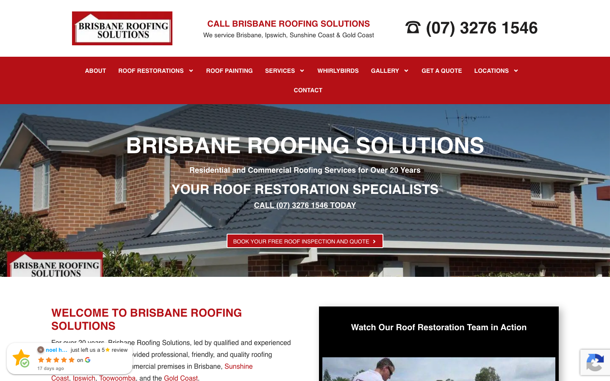

# Brisbane Roofing Solutions | Roof Restoration & Repairs · 现状审计与重构提议

> **69/100** · moderate_candidate · 行业：roofing · 地区：Brisbane · Google 评价：4.8★ （118 条）

## 一、店家现状速览

**审计结论：** audit_score=69 → moderate_candidate · weakest: seo 31, visual 50 · fired: high_traction_old_site

**已触发的 hard triggers：** `high_traction_old_site`

- 电话：(07) 3276 1546
- 地址：101 Kulcha St, Algester QLD 4115
- 网站：[https://brisbaneroofingsolutions.com.au/](https://brisbaneroofingsolutions.com.au/)
- 网站状态：`independent_https_site`

## 二、客户访问时看到的页面

## 三、视觉审计 · Vision LLM 怎么看

> The site displays a cluttered, text-heavy layout with low-contrast navigation and a hero section that lacks a clear visual hierarchy, making it difficult for visitors to quickly identify services or take action.

新鲜度 **4/10** · 信任度 **6/10** · 转化准备度 **5/10** · 设计年代 `outdated`

**值得保留的优点：**
- The phone number is large and prominent in the header, which is excellent for local service businesses.
- The site clearly lists service areas (Brisbane, Ipswich, etc.) in the header, which helps with local relevance.
- The use of a real photo of a roof in the hero section is relevant to the industry.

## 四、客户在 Google 上怎么说

> Customers consistently praise Brisbane Roofing Solutions for their exceptional cleanliness, detailed communication, and high-quality restoration results that stand the test of time.

**一致夸赞：** `spotless cleanup` · `no overspray` · `detailed quoting` · `excellent communication` · `long-lasting results`

**可直接放上 redesign 后网站的 quote：**

> "It's been eight months since our roof was painted, and it still looks brand new."
> — **Christine**, ★★★★★
>
> *放哪：Hero section proof of durability and quality*

> "They left the area spotless with no overspray whatsoever."
> — **Christine**, ★★★★★
>
> *放哪：Addressing common customer fear of mess/damage*

> "The whole process... was smooth and efficient. The tradies... cleaned up well."
> — **Jeff**, ★★★★★
>
> *放哪：Testimonial section highlighting professionalism*

> "Quote was very detailed and a fair price offered."
> — **Tom**, ★★★★★
>
> *放哪：Pricing transparency section*

## 五、当前网站在哪里"漏水"

### 🟡 主要问题 · 2 项（影响转化的明显短板）

### 🟡 主要 · h1_unique

**命中原因：** 0 <h1> tags

### 🟡 主要 · local_schema_markup

**命中原因：** no LocalBusiness JSON-LD

## 六、Redesign 的发力点（综合视觉 + 评论数据）

1. 👁 1. Simplify the hero section: Remove cluttered text and add a clear, high-contrast Call-to-Action button.
2. 👁 2. Fix the logo and navigation: Replace the screenshot logo with a clean file and increase navigation text contrast.
3. 👁 3. Improve content readability: Break up text blocks with white space and bullet points.
4. 💬 Feature 'Before & After' photos prominently, as multiple reviewers mention visual results and longevity.
5. 💬 Highlight 'No Overspray' and 'Spotless Cleanup' as key service guarantees to reduce buyer anxiety.
6. 💬 Use the 'Fair Price' and 'Detailed Quote' themes in the contact/quote request section to build trust early.

## 七、推荐销售切入点

- 你已经有不错的 Google 流量基础（118 条 4.8★ 评论），但当前网站设计在浪费这些点击
- 客户口碑已经强（spotless cleanup / no overspray / detailed quoting）— 网站只需要把这份信任承接住，不需要从零建立

## 附录 · 数据出处

- Cheap audit version: `-`
- Detailed audit version: `2026-05-11-v1`
- Vision model: `ollama-qwen3.6-27b-nothink`
- Review source: `Google Places Place Details · most_relevant`
- 完整 audit 报告 HTML：[internal-audit-report](./internal-audit-report.html)
