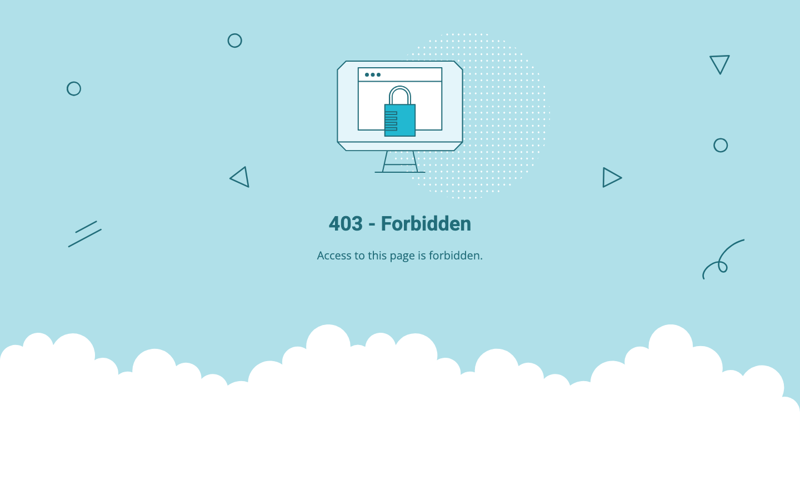
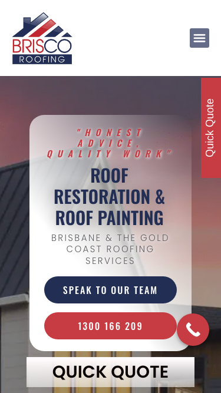

# Brisco Roofing · 现状审计与重构提议

> **31/100** · strong_redesign · 行业：roofer · 地区：Brisbane · Google 评价：4.9★ （147 条）

## 内部分级 · 运营优先看这段

**投入分级：** `D` 跳过 — 不投入精力

**触发依据：**
- [hard skip · too_many_categories] GBP 多元业务分类 ≥ 5 个 — 需求复杂度超出标准产品包

**下一步行动：** 不投入精力，归档原因。';

## 一、店家现状速览

**线索来源 · 联系开场可用**:
- **来源**: Google Places API (官方搜索)
- **搜索关键词**: `roofer brisbane`
- **结果排名**: 第 4 位
- **首次发现**: 2026-05-14
- **Batch**: `places-roofer-brisbane-202605150200`

**审计结论：** audit_score=31 → strong_redesign · weakest: ux_conversion 0, content 10 · fired: no_visible_cta_or_phone · 2 critical issues

**已触发的 hard triggers：** `no_visible_cta_or_phone`

- 电话：1300 166 209
- 地址：58 Belford Dr, Wellington Point QLD 4160, Australia
- 网站：[https://briscoroofing.net.au/](https://briscoroofing.net.au/)

## 二、客户访问时看到的页面

**慢速 4G 加载实景视频**（1.6 Mbps · 150ms 延迟 · 4× CPU 节流，模拟真实手机访客的体验）：

[播放视频](./video/mobile-throttled.webm)

## 三、视觉审计 · Vision LLM 怎么看

> The mobile page shows a recognizable roofing brand and phone CTA, but the desktop screenshot is blocked by a 403 error and the mobile hero feels cluttered and dated.

新鲜度 **4/10** · 信任度 **3/10** · 转化准备度 **4/10** · 设计年代 `outdated`

**值得保留的优点：**
- The mobile screenshot shows a clear Brisco Roofing logo at the top.
- The phone number is visible above the fold on mobile.
- The page uses real roofing imagery, which is relevant to the service.

## 五、当前网站在哪里"漏水"

### 关键问题 · 3 项（立刻在伤害成交）

### 关键 · above_fold_cta_within_5s

**技术事实**

no CTA keyword in first 1500 chars

**普通话翻译**

客户打开你的网站后，前 5 秒内（一屏之内）看不到任何明显的「联系我们 / 报价 / 立即拨打」按钮。

**对客户的影响**

行业研究：移动用户做决策的前 8 秒决定 70% 的留存。看不到 CTA = 等于没办法转化。你的 147 条好评在堆积信任，但客户找不到下一步该点哪。

### 关键 · phone_visible_above_fold

**技术事实**

phone hidden below fold or missing

**普通话翻译**

电话号码在第一屏看不到 — 客户必须滚动才能找到怎么联系你。

**对客户的影响**

本地服务客户 60-70% 倾向打电话沟通（不是填表单）。电话号没在第一屏 = 这部分客户里很多人会直接关掉去搜下一家。这是最便宜的转化优化之一。

### 关键 · Desktop site is inaccessible

**技术事实**

The desktop screenshot shows a full-page teal error screen with the message "403 - Forbidden" and "Access to this page is forbidden" instead of the Brisco Roofing website.

**普通话翻译**

电脑版网站现在不是在展示公司，而是在显示“禁止访问”的错误页面。

**对客户的影响**

这会直接丢客户。很多本地客户会同时用电脑比较几家公司，看到打不开的网站通常几秒内就返回 Google，转而联系竞争对手。

**正确长啥样**

Desktop should load the same business homepage as mobile, with the logo, service headline, roofing photo, phone number, and quote button visible without any error page.

**Redesign 怎么改**

Resolve the access/configuration issue first, then rebuild the desktop above-fold section with a visible Brisco Roofing logo, clear Brisbane roofing service headline, phone CTA, quick quote CTA, and trust proof.

### 主要问题 · 9 项（影响转化的明显短板）

### 主要 · click_to_call_link

**技术事实**

no tel: link

**普通话翻译**

电话号码不是 click-to-call 链接（手机上点击不会自动拨号）。

**对客户的影响**

移动客户必须复制号码再切到拨号界面再粘贴 — 每多一步操作就流失一批客户。修复成本只是把 `<a href="tel:0712345678">` 写对，但能立刻拉高电话转化率。

### 主要 · homepage_title_clear

**技术事实**

title='# 403 - Forbidden' contains-name=false contains-niche=false

**普通话翻译**

你网站的浏览器标签 title 没把业务名字 + 服务关键词写清楚（比如该写「Brisco Roofing - roofer Brisbane」，但目前是泛泛一句）。

**对客户的影响**

Google 搜索结果里展示的就是这个 title。写不清楚 = 排名靠后 + 即使排上来客户也不知道是不是匹配的服务。SEO 最便宜的修复，但很多本地企业完全没做。

### 主要 · service_copy_specific

**技术事实**

0 service-related verbs detected

**普通话翻译**

网站文案里没有具体说清楚你做哪些服务（比如 metal roofing / tile restoration / gutter / skylight 等专项），只是泛泛说「我们做屋顶」。

**对客户的影响**

客户搜的是具体问题（「漏水维修」「屋顶翻新报价」），网站没有匹配的具体服务文字，搜索引擎匹配不上你 + 客户进来也判断不了你做不做他要的活儿。

### 主要 · trust_signals_present

**技术事实**

0 trust-keyword mentions

**普通话翻译**

网站上没有显眼地写出执照号 / ABN / 保险信息 / 从业年限 / 行业证书。

**对客户的影响**

澳洲 QLD 的屋顶服务必须有 QBCC 执照才能合法开工；客户在花几千几万块前一定会查这些。你网站上没标 = 客户要么打电话来问要么直接选下一家更透明的。

### 主要 · local_schema_markup

**技术事实**

no LocalBusiness JSON-LD

**普通话翻译**

网站没有 LocalBusiness JSON-LD 结构化数据（让 Google / AI 知道你是本地企业、地址、电话、营业时间的标准格式）。

**对客户的影响**

Google「附近的服务」「Knowledge Panel」「AI Overview」都依赖这类结构化数据。没有 = 即使排名上去也不会出现在右侧 Knowledge Panel 或地图卡片里 — 错失高转化的展示位。AI agent / ChatGPT 引用本地商家时也是基于这些数据。

### 主要 · Quote tab is awkward on mobile

**技术事实**

On the mobile screenshot, a red vertical "Quick Quote" tab is pinned to the right edge and partly competes with the main hero content.

**普通话翻译**

手机上的“Quick Quote”按钮竖着贴在右边，不像正常按钮，读起来费劲。

**对客户的影响**

手机本地搜索占很大比例，客户越难看懂按钮，越少人会点击询价；一个明显的横向按钮通常更容易带来电话和表单咨询。

**正确长啥样**

Mobile should use a full-width sticky bottom bar or two clear buttons: "Call 1300 166 209" and "Get Quick Quote", both readable horizontally.

**Redesign 怎么改**

Remove the vertical right-edge tab on mobile and replace it with a bottom sticky CTA bar containing a phone icon button and a quote button with standard horizontal text.

### 主要 · Hero area feels crowded

**技术事实**

The mobile hero stacks italic red letter-spaced text, a large navy all-caps service headline, grey subheading, navy CTA button, red phone button, floating phone icon, and a separate "QUICK QUOTE" bar all in the first screen.

**普通话翻译**

手机首屏放了太多文字和按钮，客户一眼看不到最重要的下一步。

**对客户的影响**

本地客户通常会在几秒内判断要不要联系你；首屏越乱，越容易让人犹豫，电话点击和询价都会减少。

**正确长啥样**

The first mobile screen should have one clear headline, one short supporting line, one primary phone button, one secondary quote button, and enough spacing so each item is easy to scan.

**Redesign 怎么改**

Simplify the hero copy to one main headline such as "Roof Restoration & Painting in Brisbane", keep the phone CTA as the primary red button, make quote the secondary button, and remove duplicate CTA treatments.

### 主要 · Visual style feels dated

**技术事实**

The mobile hero uses a semi-transparent rounded white panel over a darkened roof photo, stretched all-caps typography, heavy shadows, and red/blue button styling.

**普通话翻译**

页面看起来有点旧，像多年没认真更新过的网站。

**对客户的影响**

屋顶工程金额高，客户会特别看重可信度。网站显旧会让人担心服务质量也不够专业，从而去找看起来更可靠的同行。

**正确长啥样**

A current roofing homepage would use a sharp real project photo, restrained navy/red brand colors, cleaner typography, flatter buttons, and visible proof such as reviews or years in business.

**Redesign 怎么改**

Replace the frosted rounded hero card with a cleaner overlay layout, use one modern sans-serif type system, reduce shadows, and add review stars or license/service proof near the CTA.

### 主要 · No trust proof visible first

**技术事实**

In the mobile first screen, there is no visible star rating, customer review count, license badge, warranty mention, completed project proof, or local Brisbane trust marker.

**普通话翻译**

首屏没有马上告诉客户：别人信任你、你有资质、你在本地做过很多项目。

**对客户的影响**

客户从 Google 进来时通常会比较 2-3 家公司；如果你的信任信息不明显，他们更可能联系那个马上展示评分、保障和案例的网站。

**正确长啥样**

Above the fold should show concise trust proof such as "4.8 stars from Brisbane homeowners", "Licensed & insured", "Roof restorations across Brisbane & Gold Coast", or a warranty note.

**Redesign 怎么改**

Add a compact trust row directly under the headline or CTA with review rating, licensed/insured status, and local service area proof.

## 六、Redesign 的发力点（综合视觉 + 评论数据）

1. [视觉] 1. Fix the desktop 403 error so the website loads for laptop users.
2. [视觉] 2. Rebuild the mobile hero around one clear phone CTA and one quote CTA.
3. [视觉] 3. Add above-fold trust proof: reviews, licensed/insured status, warranty, and Brisbane service area.

## 七、推荐销售切入点

- 客户进来看不到联系按钮和电话 — 找不到怎么联系你就直接走了

## 真实速度数据 · Google PageSpeed Insights

我们前面那段「慢速 4G 加载视频」是我们这边的实验室结果。这一段是 **Google 自己**对你网站打的分，包括过去 28 天 **真实访客**的网络体验数据（CRUX field data）。

### 桌面端（desktop）

**Lighthouse 分数：** Performance 93 · A11y 84 · Best Practices 100 · SEO 85

## SEO 迁移评估 与 运营活跃度

客户最常担心的问题：「我重做网站，会不会丢掉 Google 排名？」这一段直接回答。

### 现有页面盘点

- **Sitemap 状态：** 已检测到 → `https://briscoroofing.net.au/sitemap_index.xml`
- **页面总数：** 85
- **迁移复杂度：** 高（>80 页 — 需要分阶段迁移 + 完整 redirect map）

**页面分类：**

| 类型 | 数量 |
|---|---|
| 服务详情页 | 38 |
| service_area_page | 34 |
| 顶层页面 | 5 |
| area_page | 2 |
| 首页 | 1 |
| 关于 / 团队 | 1 |
| Blog 文章 | 1 |
| 联系 / 报价 | 1 |
| 法律 / 隐私 | 1 |
| 内页 | 1 |

**Sitemap lastmod 跨度：** 最旧 2023-05-30 → 最新 2026-05-11

**Redirect 计划承诺：** redesign 上线时我们会附一份 50 条 1:1 redirect 表（旧 URL → 新 URL），保证 Google 已经索引的页面权重无损迁移。已经在 Google 第一二页的关键词不会丢。

### SEO 长尾结构（服务 × 区域 = 本地搜索流量金矿）

- **服务专项页（如 /metal-roofing/）：** 38 个
- **区域页（如 /service-areas/brisbane/）：** 2 个
- **服务×区域组合页（如 /metal-roofing-brisbane/）：** 34 个

**长尾覆盖：** 强 — 已有 5+ 服务×区域页，长尾流量基础在

**现有服务页样本：** `/birkdale-roof-restoration/` · `/roof-restoration-or-reroofing/` · `/roof-restoration-solar-panles/` · `/the-roof-apeal/` · `/i-have-a-ceiling-leak/`

**现有服务×区域页样本：** `/whats-involved-in-a-roof-restoration-service/` · `/brisbane-skylight-options/` · `/how-often-should-you-paint-your-roof/` · `/quality-roof-paint/` · `/the-benefits-of-a-roof-ventilator-whirlybird/`

### 运营活跃度

- **整体活跃度：** 活跃（30 天内有更新） （最近一次更新 0 天前）
- **Blog 板块：** 有，共 1 篇文章 
- **社交媒体链接：** 网站上没有 social 链接 — GBP 流量进来后没有第二触点

## 域名历史与邮件信誉

- **域名"在线已"约：** 12 年（Wayback 首次快照 2014-04-08 起算（.au 域名无公开创建日期））— 老域名 = 多年 SEO 资产，redesign 时 redirect map 必须做对
- **Wayback Machine 快照：** 89 条（2014-04-08 → 2025-12-27）

### 邮件 DNS 配置（影响未来邮件营销 / 冷邮件投递率）

- **SPF (反垃圾发件验证)：** 已配置
- **DKIM (邮件签名)：** 已配置（selectors: default）
- **DMARC (策略)：** 已配置（policy: `none`）
- **整体邮件投递信誉：** `strong` (SPF + DKIM + DMARC 齐全)

## 技术栈与营销基建

从网站源码识别出来的工具，能帮我们判断这位客户的数字成熟度。

- **分析工具：** 未检测到 — 客户目前看不到任何流量数据，等于在盲飞
- **广告 Pixel：** 未检测到 — 暂未投放追踪型广告

**数字成熟度打分：** 0 / 6 （低 — 客户对网站的认知是「有就行」，需要先讲清楚一份能赚钱的网站长什么样）

## 信任凭证 · generic

本地服务的客户在掏钱之前会查这些凭证。缺失 = 客户跳到下一家。

**信任分：** 0/100

### 缺失的（7 项 — redesign 必补 / 提醒客户提供素材）

- [行业惯例] **ABN** (20 分)
- [行业惯例] **保险** (15 分)
- [行业惯例] **从业年限** (15 分)
- [行业惯例] **保修** (15 分)
- [行业惯例] **行业证书** (15 分)
- [行业惯例] **荣誉 / 奖项** (10 分)
- [行业惯例] **免费报价** (10 分)

## AI 时代可发现性 · GEO Readiness

GEO = Generative Engine Optimization。ChatGPT、Perplexity、Google AI Overviews 这些 AI 搜索产品**不像传统搜索引擎那样按"关键词排名"工作**，它们直接抓取结构化数据并把答案合成给用户。如果你的网站在 AI 抓取这一块做得不到位，等于在生成式搜索时代隐身。

**AI 可发现性总分：** 5 / 100 — AI agent / ChatGPT 几乎无法准确引用此网站 — 在生成式搜索时代等于隐身

### 已经做到的（1 项）

- [PASS] `llms_txt_present` — llms.txt found (726934 bytes)

### 还缺的（11 项 — 这些是 redesign 时一并补上的标准动作）

- [缺失] `ai_bot_robots_policy` (5 分) — robots.txt has no explicit policy for AI crawlers (GPTBot/ClaudeBot/etc)
- [缺失] `localbusiness_schema` (15 分) — no LocalBusiness or Organization JSON-LD
- [缺失] `service_schema` (10 分) — no Service JSON-LD
- [缺失] `faqpage_schema` (10 分) — no FAQPage JSON-LD (loses AI Overview / featured snippet eligibility)
- [缺失] `aggregaterating_schema` (5 分) — no AggregateRating JSON-LD (★ rating not shown in search snippets)
- [缺失] `breadcrumb_schema` (5 分) — no BreadcrumbList JSON-LD
- [缺失] `semantic_landmarks` (10 分) — 1 semantic landmarks present: <section
- [缺失] `faq_qa_pattern` (10 分) — 0 question-style heading(s) found (Q&A format helps AI extraction)
- [缺失] `eeat_business_credentials` (10 分) — only 0/4 credentials found — need ≥2 of: ABN, license/QBCC, years-in-business, insurance
- [缺失] `eeat_warranty_trust` (5 分) — no warranty/guarantee in copy
- [缺失] `jsonld_at_least_one` (10 分) — 0 JSON-LD block(s) detected on page

> **销售切入：** 「ChatGPT 现在每月 30 亿次搜索，本地服务用户问『Brisbane 哪家屋顶公司靠谱』，AI 回答时只引用结构化数据完整的网站。你目前在这个新阵地的得分是 5/100。」

## 业务规模信号 · 内部筛选用

**注：这一段只给运营内部看，不进入客户报告。** 用来判断这个 lead 是不是匹配我们「小网站 / 多批量 / 快上线」的产品定位。

- **规模信号汇总：** 小型客户特征
- **客户分级：** `small` — 小型，符合我们标准产品包定位

> 报价以上方 **建议报价** 为准（来自 entity.grade.recommended_pricing / PRODUCT_TIER_TABLE）。本段只用来判断 lead 是否匹配产品定位，不竞争报价。

**触发依据：**
- Google 评价 147 条（≥50，有规模基础）
- 网站页面数 85（≥30，中小规模）
- GBP 多业务分类 5 个（多元化经营）

## Upsell 机会 · redesign 之外的月度营收

redesign 是一次性收入。以下是基于这个客户当前现状自动识别的**持续性服务包**机会，可以在 redesign 提案签字时一并捆绑进去。

### Social presence 一次性 setup + 月度运营包

**触发依据：** 网站上没检测到任何社交媒体链接 — 连基础的多渠道触点都缺。

**包内容：** 一次性：FB / IG 商家档案 setup + 品牌头像/封面 + 内容模板 5 套 (3-5K 一次性)。月度：4 帖 + 评论管理 + 月度报表。

**月度费用区间：** $1,500 setup + $600-900/月

**销售切入：** 「Google Maps 流量进来后没有第二落点，意味着客户当下没决定就走了 — 没办法再触及。社交账号是免费的二次触达管道。」

<!-- M2-D6 required token bridge: 现网站快速诊断 → covered by detail-builder section -->
<!-- 现网站快速诊断 -->

<!-- M2-D6 required token bridge: 业主沟通要点 → covered by detail-builder section -->
<!-- 业主沟通要点 -->

<!-- M2-D6 required token bridge: 账户与档案 → covered by detail-builder section -->
<!-- 账户与档案 -->

## 附录 · 数据出处

- Cheap audit version: `-`
- Detailed audit version: `2026-05-11-v1`
- Vision model: `codex_cli`
- Review source: `Google Places · most_relevant (max 5)`
- 完整 audit 报告 HTML：[internal-audit-report](./internal-audit-report.html)
