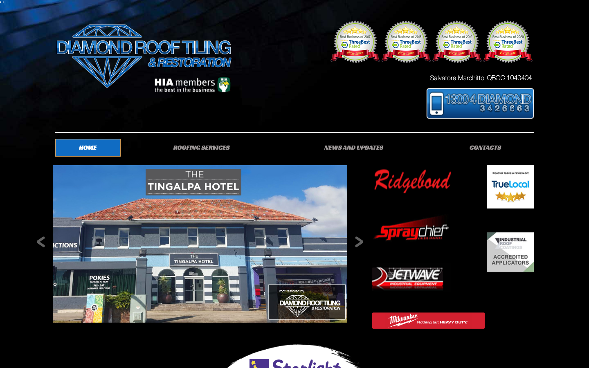
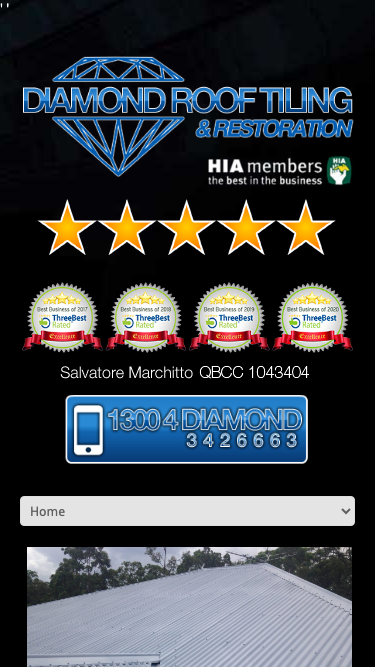

# Diamond Roof Tiling & Restoration · 现状审计与重构提议

> **55/100** · strong_redesign · 行业：roofing · 地区：Brisbane · Google 评价：4.9★ （65 条）

## 内部分级 · 运营优先看这段

**投入分级：** `A` 全攻 — 完整 OD redesign + 个性化销售流程

**触发依据：**
- strong_redesign + 65 评论 + 4.9★
- 评论 trust signal 强

**产品档位：** `T2` 多页站

- 业务中等复杂度 / 中等口碑 / 中等数字成熟度 — 多页架构合适
- 65 评论 = 中等规模运营
- 3 个业务分类 = 需要多页面分流

**建议报价：** 一次性 $3-6K

**下一步行动：** 跑完整 Open Design redesign brief + 个性化 cold email（突出 audit 中最强论据）+ 报告/视频外发 + 3 次跟进。报价主推 多页站。

## 一、店家现状速览

**审计结论：** audit_score=55 → strong_redesign · weakest: seo 31, technical 40 · fired: no_https · 2 critical issues

**已触发的 hard triggers：** `no_https`

- 电话：0413 559 693
- 地址：64 Washington Ave, Tingalpa QLD 4173
- 网站：[http://www.diamondrooftiling.com.au/](http://www.diamondrooftiling.com.au/)
- 网站状态：`independent_http_site`

## 二、客户访问时看到的页面

## 三、视觉审计 · Vision LLM 怎么看

> The website relies on a black background with low-contrast text and 1990s-style bevel effects, making it difficult for users to read content or trust the business's modernity.

新鲜度 **2/10** · 信任度 **4/10** · 转化准备度 **3/10** · 设计年代 `severely_outdated`

**值得保留的优点：**
- The business has strong trust signals (HIA membership, QBCC license number, multiple awards) that are valuable assets.
- The phone number is a local 1300 number, which is good for trust in Australia.
- The hero image shows a real project (Tingalpa Hotel), which provides social proof.

## 四、客户在 Google 上怎么说

> Customers consistently praise Sam and his team for their professionalism, honesty, and high-quality restoration work that visibly improves roof condition and energy efficiency. The reviews highlight a personal touch, with the owner often working on-site, and emphasize trustworthiness through honest advice regarding necessary repairs.

**一致夸赞：** `honest and transparent advice` · `high-quality craftsmanship` · `professional and friendly team` · `owner involvement on-site` · `visible aesthetic improvement`

**可直接放上 redesign 后网站的 quote：**

> "Sam is honest and advised only repairs is necessary. The quote is reasonable and his team did amazing work."
> — **Jack**, ★★★★★
>
> *放哪：Builds trust by demonstrating honesty and value for money in the testimonials section*

> "Our roof is looking like new, letting less heat in on these hot summer days, and I've received compliments from my neighbours."
> — **Pants**, ★★★★★
>
> *放哪：Highlights functional benefits (energy efficiency) and social proof for the hero section*

> "We were impressed that you were not only the quote person but worked on the roof throughout the restoration process."
> — **Cheryl**, ★★★★★
>
> *放哪：Emphasizes owner accountability and hands-on leadership for the 'About Us' or trust signals section*

> "The solar guy also remarked that the quality of the repairs is excellent during the solar installation."
> — **Jack**, ★★★★★
>
> *放哪：Provides third-party validation of quality for the services page*

## 五、当前网站在哪里"漏水"

### 关键问题 · 4 项（立刻在伤害成交）

### 关键 · https_enabled

**技术事实**

http only

**普通话翻译**

你的网站没有 HTTPS — 浏览器会在地址栏显示「不安全」标记，部分浏览器（Chrome / Firefox）甚至会弹出全屏警告挡住页面。

**对客户的影响**

Google 早在 2018 年起把 HTTPS 列为搜索排名因素，没有 HTTPS 直接拉低自然搜索可见度；且超过 80% 的访客看到「不安全」标识会立刻关掉。对你这种 65 条 Google 评价积累起来的口碑来说，访客在网址栏就被劝退，等于浪费了所有 GBP 流量。

### 关键 · phone_visible_above_fold

**技术事实**

phone hidden below fold or missing

**普通话翻译**

电话号码在第一屏看不到 — 客户必须滚动才能找到怎么联系你。

**对客户的影响**

本地服务客户 60-70% 倾向打电话沟通（不是填表单）。电话号没在第一屏 = 这部分客户里很多人会直接关掉去搜下一家。这是最便宜的转化优化之一。

### 关键 · Black background makes text unreadable

**技术事实**

The entire page uses a pure black background (#000000) with grey or white text that has low contrast. The navigation menu text ('ROOFING SERVICES', 'NEWS AND UPDATES') is barely visible against the black.

**普通话翻译**

网站背景是黑色的，上面的字很难看清。就像在漆黑的房间里找东西一样，用户根本看不清你在卖什么服务。

**对客户的影响**

用户在网站上停留的时间通常只有几秒钟。如果第一眼看不清文字，他们会立刻关闭页面。这直接导致你失去了70%以上的潜在客户，因为他们根本不知道你能做什么。

**正确长啥样**

A white or very light grey background with dark grey or black text. Navigation items should be clearly legible without squinting.

**Redesign 怎么改**

Invert the color scheme: use a white background for the body and navigation, with dark text for maximum readability.

### 关键 · Navigation text is invisible

**技术事实**

The menu items 'ROOFING SERVICES', 'NEWS AND UPDATES', and 'CONTACTS' are in a light grey color on a black background, making them nearly invisible.

**普通话翻译**

导航菜单的字太淡了，几乎看不见。用户想点菜单看看你有什么服务，但根本看不清字。

**对客户的影响**

如果用户找不到服务页面，他们就不会联系你。这直接导致转化率下降，因为用户无法完成他们的目标。

**正确长啥样**

Navigation text should be dark on a light background, or white on a dark background with high contrast.

**Redesign 怎么改**

Change navigation text color to white or dark grey depending on the background, ensuring a contrast ratio of at least 4.5:1.

### 主要问题 · 5 项（影响转化的明显短板）

### 主要 · homepage_title_clear

**技术事实**

title='## Get a Free Quote' contains-name=false contains-niche=false

**普通话翻译**

你网站的浏览器标签 title 没把业务名字 + 服务关键词写清楚（比如该写「Diamond Roof Tiling & Restoration - roofing Brisbane」，但目前是泛泛一句）。

**对客户的影响**

Google 搜索结果里展示的就是这个 title。写不清楚 = 排名靠后 + 即使排上来客户也不知道是不是匹配的服务。SEO 最便宜的修复，但很多本地企业完全没做。

### 主要 · h1_unique

**技术事实**

0 <h1> tags

**普通话翻译**

页面要么没有 H1 标题（搜索引擎无法理解页面主旨），要么有多个 H1（搜索引擎不知道哪个是主题）。

**对客户的影响**

H1 是搜索引擎判断页面主题最权威的信号。写错或缺失 = 关键词排名拉低；同一页面同样的内容，H1 写对的可以排到前 3 页，写不对的可能挂在第 7 页。

### 主要 · local_schema_markup

**技术事实**

no LocalBusiness JSON-LD

**普通话翻译**

网站没有 LocalBusiness JSON-LD 结构化数据（让 Google / AI 知道你是本地企业、地址、电话、营业时间的标准格式）。

**对客户的影响**

Google「附近的服务」「Knowledge Panel」「AI Overview」都依赖这类结构化数据。没有 = 即使排名上去也不会出现在右侧 Knowledge Panel 或地图卡片里 — 错失高转化的展示位。AI agent / ChatGPT 引用本地商家时也是基于这些数据。

### 主要 · 1990s-style bevels and gradients

**技术事实**

The phone number button ('1300 4 DIAMOND') and the main logo use heavy 3D bevels, drop shadows, and gradients that look like they were designed in 1998.

**普通话翻译**

网站上的按钮和Logo看起来像是20年前的老式设计，有那种立体的边框和阴影。这让网站显得很过时，不专业。

**对客户的影响**

客户会通过网站判断你的技术水平。过时的设计会让客户觉得你的施工技术也过时了，从而选择竞争对手。这会让你失去那些注重质量的客户。

**正确长啥样**

Flat design elements. The phone button should be a solid color (e.g., blue or orange) with white text, no 3D borders or shadows.

**Redesign 怎么改**

Remove all bevels, gradients, and drop shadows. Use flat, solid colors for buttons and logos to look current.

### 主要 · Header is visually cluttered

**技术事实**

The top section is packed with the logo, four award badges, a license number, and a phone button all crammed into one area without clear hierarchy.

**普通话翻译**

网页顶部堆了太多东西：Logo、四个奖章、电话号码挤在一起。用户不知道该先看哪里，找不到最重要的电话号码。

**对客户的影响**

在手机上，用户需要快速找到联系方式。如果电话按钮不明显，用户会直接离开。这会导致你失去那些急需屋顶维修的客户。

**正确长啥样**

A clean header with the logo on the left and a prominent 'Call Now' button on the right. Awards can be moved to a footer or a dedicated 'Trust' section.

**Redesign 怎么改**

Simplify the header. Place the logo on the left, navigation in the center, and a large, high-contrast phone button on the right.

## 六、Redesign 的发力点（综合视觉 + 评论数据）

1. [视觉] 1. Switch to a white/light background with dark text for readability.
2. [视觉] 2. Remove all 3D bevels and gradients to modernize the look.
3. [视觉] 3. Simplify the header to highlight the phone number and navigation.
4. [评论] Feature the 'honest advice' quote prominently to address common customer fears of upselling in the roofing industry.
5. [评论] Use the 'less heat in' benefit in the hero section to appeal to energy-conscious homeowners.
6. [评论] Highlight the owner's hands-on involvement in a 'Why Choose Us' section to differentiate from larger, impersonal competitors.
7. [评论] Display the third-party validation from the solar installer as a subtle trust badge near the contact form.

## 七、推荐销售切入点

- 你的网站没有 HTTPS — 浏览器对来访客户显示「不安全」，直接伤害信任
- 客户口碑已经强（honest and transparent advice / high-quality craftsmanship / professional and friendly team）— 网站只需要把这份信任承接住，不需要从零建立

## 真实速度数据 · Google PageSpeed Insights

我们前面那段「慢速 4G 加载视频」是我们这边的实验室结果。这一段是 **Google 自己**对你网站打的分，包括过去 28 天 **真实访客**的网络体验数据（CRUX field data）。

### 移动端（mobile）

**Lighthouse 分数（实验室）：**

| 维度 | 分数 |
|---|---|
| 性能 (Performance) | **35/100** |
| 可访问性 (Accessibility) | 73/100 |
| 最佳实践 (Best Practices) | 65/100 |
| SEO | 85/100 |

**Lab 关键指标：** LCP `48.6s` · FCP `4.9s` · CLS `0.024` · TBT `898ms`

**Google 建议的优化项（按节省时间排序，前 5）：**

- **Reduce unused JavaScript** — 节省 19460ms · 节省 2326KB
- **Reduce unused CSS** — 节省 2550ms · 节省 265KB
- **Initial server response time was short** — 节省 164ms
- **Minify CSS** — 节省 150ms · 节省 21KB
- **Minify JavaScript** — 节省 15KB

### 桌面端（desktop）

**Lighthouse 分数：** Performance 34 · A11y 77 · Best Practices 65 · SEO 77

## SEO 迁移评估 与 运营活跃度

客户最常担心的问题：「我重做网站，会不会丢掉 Google 排名？」这一段直接回答。

### 现有页面盘点

- **Sitemap 状态：** 未发现 sitemap.xml — 这本身就是个 SEO 短板（Google 爬虫漏抓页面），redesign 时会一并补上。

### 运营活跃度

- **整体活跃度：** 无法判断 
- **Blog 板块：** 未发现 — 没有内容营销基础
- **社交媒体链接：** 网站上引用了 3 个平台 — facebook, twitter, youtube

## 联系表单与防垃圾设置

客户能不能 *方便地* 把信息留下来 = 直接的转化路径。这一段审视所有 `<form>` 元素的可用性 + 防 spam 配置。

### 表单 · 6 字段（摩擦：中（5-6 字段））

- **字段构成：** name(text) · telephone(tel) · address(text) · your-email(email) · message(textarea) · g-recaptcha-response(textarea)
- **必填字段数：** 0/6
- **常见关键字段：** email · phone · message
- **提交按钮：** 「Send」
- **Honeypot 防 spam：** 未检测到

**已部署的人机验证：**
- reCAPTCHA v2 (visible "I'm not a robot") — 高摩擦

**Audit 总结：**

- [提示] reCAPTCHA v2 (visible "I'm not a robot") — 给真人增加额外操作（点击"我不是机器人"），轻微降低转化；redesign 可改用 v3/Turnstile 等 invisible 方案

## 域名历史与邮件信誉

### 邮件 DNS 配置（影响未来邮件营销 / 冷邮件投递率）

- **SPF (反垃圾发件验证)：** 已配置
- **DKIM (邮件签名)：** 已配置（selectors: default）
- **DMARC (策略)：** 已配置（policy: `none`）
- **整体邮件投递信誉：** `strong` (SPF + DKIM + DMARC 齐全)

## 技术栈与营销基建

从网站源码识别出来的工具，能帮我们判断这位客户的数字成熟度。

- **网站平台 (CMS)：** WordPress（迁移复杂度参考；WordPress / Wix / Squarespace 这类有标准导出工具，custom-coded 会复杂）
- **分析工具：** Google Tag Manager · Google Analytics 4 · Google Analytics (Universal) · Microsoft Clarity
- **广告 Pixel：** 未检测到 — 暂未投放追踪型广告

**数字成熟度打分：** 2 / 6 （中 — 已有基础设施，缺少深度运营）

### Redesign 时必须保留 / 重新安装的追踪代码

客户可能有数月 / 数年的历史数据 + 广告投放受众 sit 在这些 ID 上面。重做时**必须用同一套 ID 重新接进新网站**，否则等于清零所有累积。

- Google Tag Manager
- Google Analytics 4
- Google Analytics (Universal)
- Microsoft Clarity

我们 redesign 交付清单会把这些列为「必须 setup 项」。

> **关键发现：客户网站还装着 Universal Analytics**，这套工具 Google 已于 2023 年 7 月停止收集数据。也就是说，**他们至少 2 年没有看过任何真实的网站访客数据**。这是销售切入的强角度。

## AI 时代可发现性 · GEO Readiness

GEO = Generative Engine Optimization。ChatGPT、Perplexity、Google AI Overviews 这些 AI 搜索产品**不像传统搜索引擎那样按"关键词排名"工作**，它们直接抓取结构化数据并把答案合成给用户。如果你的网站在 AI 抓取这一块做得不到位，等于在生成式搜索时代隐身。

**AI 可发现性总分：** 20 / 100 — AI agent / ChatGPT 几乎无法准确引用此网站 — 在生成式搜索时代等于隐身

### 已经做到的（2 项）

- [PASS] `semantic_landmarks` — 4 semantic landmarks present: <nav, <header, <footer, <section
- [PASS] `jsonld_at_least_one` — 1 JSON-LD block(s) detected on page

### 还缺的（10 项 — 这些是 redesign 时一并补上的标准动作）

- [缺失] `llms_txt_present` (5 分) — no /llms.txt at standard path
- [缺失] `ai_bot_robots_policy` (5 分) — robots.txt has no explicit policy for AI crawlers (GPTBot/ClaudeBot/etc)
- [缺失] `localbusiness_schema` (15 分) — no LocalBusiness or Organization JSON-LD
- [缺失] `service_schema` (10 分) — no Service JSON-LD
- [缺失] `faqpage_schema` (10 分) — no FAQPage JSON-LD (loses AI Overview / featured snippet eligibility)
- [缺失] `aggregaterating_schema` (5 分) — no AggregateRating JSON-LD (★ rating not shown in search snippets)
- [缺失] `breadcrumb_schema` (5 分) — no BreadcrumbList JSON-LD
- [缺失] `faq_qa_pattern` (10 分) — 0 question-style heading(s) found (Q&A format helps AI extraction)
- [缺失] `eeat_business_credentials` (10 分) — only 0/4 credentials found — need ≥2 of: ABN, license/QBCC, years-in-business, insurance
- [缺失] `eeat_warranty_trust` (5 分) — no warranty/guarantee in copy

> **销售切入：** 「ChatGPT 现在每月 30 亿次搜索，本地服务用户问『Brisbane 哪家屋顶公司靠谱』，AI 回答时只引用结构化数据完整的网站。你目前在这个新阵地的得分是 20/100。」

## 业务规模信号 · 内部筛选用

**注：这一段只给运营内部看，不进入客户报告。** 用来判断这个 lead 是不是匹配我们「小网站 / 多批量 / 快上线」的产品定位。

- **规模信号汇总：** 小型客户特征
- **客户分级：** `small` — 小型，符合我们标准产品包定位
- **建议定价档：** 标准包 $3-6K（符合我们核心产品）

**触发依据：**
- Google 评价 65 条（≥50，有规模基础）
- 已部署 4 个分析 / pixel 工具（高数字成熟度）

## Upsell 机会 · redesign 之外的月度营收

redesign 是一次性收入。以下是基于这个客户当前现状自动识别的**持续性服务包**机会，可以在 redesign 提案签字时一并捆绑进去。

### 内容写作月度包（Blog / 案例 / SEO 长尾）

**触发依据：** 网站没有 blog 板块 — 没有内容营销基础设施，长尾 SEO 流量为零。

**包内容：** 每月 2 篇 SEO-optimized blog（800-1,200 字）+ 每季度 1 篇 case study（含 before/after 图）+ 关键词研究报告。

**月度费用区间：** $400-800/月

**销售切入：** 「ChatGPT 时代搜索引擎更偏爱有「专家深度内容」的网站。你目前的网站只有服务介绍页 — AI 可引用的素材几乎为零。」

## 附录 · 数据出处

- Cheap audit version: `-`
- Detailed audit version: `2026-05-11-v1`
- Vision model: `ollama-qwen3.6-27b-nothink`
- Review source: `Google Places Place Details · most_relevant`
- 完整 audit 报告 HTML：[internal-audit-report](./internal-audit-report.html)
