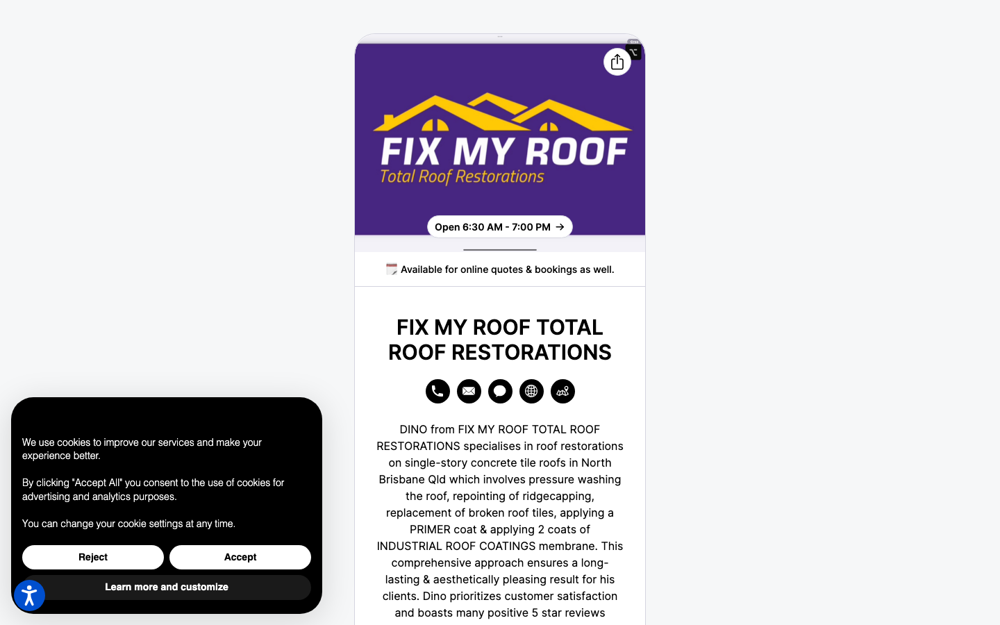
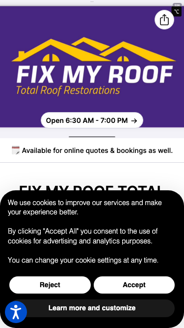

# FIX MY ROOF Total Roof Restorations · 现状审计与重构提议

> **51/100** · strong_redesign · 行业：roofing · 地区：Brisbane · Google 评价：5★ （127 条）

## 一、店家现状速览

**审计结论：** audit_score=51 → strong_redesign · weakest: technical 40, ux_conversion 45 · fired: no_https, high_traction_old_site · 2 critical issues

**已触发的 hard triggers：** `no_https` · `high_traction_old_site`

- 电话：0410 607 076
- 地址：29 Darien St, Bridgeman Downs QLD 4035
- 网站：[http://billdu.me/fixmyrooftotalroofrestorations](http://billdu.me/fixmyrooftotalroofrestorations)
- 网站状态：`independent_http_site`

## 二、客户访问时看到的页面

## 三、视觉审计 · Vision LLM 怎么看

> The design relies heavily on a Google Business Profile layout which feels like a directory listing rather than a professional brand website, lacking immediate visual hierarchy for conversion.

新鲜度 **4/10** · 信任度 **6/10** · 转化准备度 **5/10** · 设计年代 `slightly_outdated`

**值得保留的优点：**
- The brand colors (purple and yellow) provide good contrast and are distinct.
- The text clearly defines the specific service area (North Brisbane) and service type (concrete tile roofs), which is good for relevance.
- The mention of '5 star reviews' in the text is a strong trust signal that should be visualized.

## 四、客户在 Google 上怎么说

> Customers overwhelmingly praise Dino for his exceptional integrity, punctuality, and high-quality workmanship, with one reviewer highlighting his refusal to accept payment as a key trust signal.

**一致夸赞：** `exceptional integrity` · `punctual and reliable` · `high-quality workmanship` · `clean job site` · `clear communication`

**可直接放上 redesign 后网站的 quote：**

> "What really impressed me was that he wouldn't accept any payment for his work."
> — **Neil**, ★★★★★
>
> *放哪：Hero section proof of integrity and character*

> "He quickly identified the problem, explained the solution clearly, and carried out the work to a very high standard."
> — **Glenn**, ★★★★★
>
> *放哪：Testimonial section highlighting expertise and process*

> "Dino's work is of an excellent standard and he goes the extra mile to ensure the job site is clean."
> — **Anthony**, ★★★★★
>
> *放哪：Service details section emphasizing professionalism and tidiness*

## 五、当前网站在哪里"漏水"

### 🔴 关键问题 · 2 项（立刻在伤害成交）

### 🔴 关键 · https_enabled

**命中原因：** http only

### 🔴 关键 · phone_visible_above_fold

**命中原因：** phone hidden below fold or missing

### 🟡 主要问题 · 2 项（影响转化的明显短板）

### 🟡 主要 · homepage_title_clear

**命中原因：** title='# FIX MY ROOF TOTAL ROOF RESTORATIONS' contains-name=true contains-niche=false

### 🟡 主要 · local_schema_markup

**命中原因：** no LocalBusiness JSON-LD

## 六、Redesign 的发力点（综合视觉 + 评论数据）

1. 👁 1. Add a prominent 'Get a Free Quote' button above the fold.
2. 👁 2. Break the dense text paragraph into scannable bullet points or service cards.
3. 👁 3. Replace the generic icon row with clear, clickable phone and email contact details.
4. 💬 Feature the 'no payment accepted' story prominently to build immediate trust and differentiate from competitors.
5. 💬 Highlight 'punctuality' and 'clean job site' in the service guarantees section to address common homeowner anxieties.
6. 💬 Use quotes about 'clear communication' in the 'How It Works' section to reassure potential clients about the process.

## 七、推荐销售切入点

- 你的网站没有 HTTPS — 浏览器对来访客户显示「不安全」，直接伤害信任
- 你已经有不错的 Google 流量基础（127 条 5★ 评论），但当前网站设计在浪费这些点击
- 客户口碑已经强（exceptional integrity / punctual and reliable / high-quality workmanship）— 网站只需要把这份信任承接住，不需要从零建立

## 附录 · 数据出处

- Cheap audit version: `-`
- Detailed audit version: `2026-05-11-v1`
- Vision model: `ollama-qwen3.6-27b-nothink`
- Review source: `Google Places Place Details · most_relevant`
- 完整 audit 报告 HTML：[internal-audit-report](./internal-audit-report.html)
