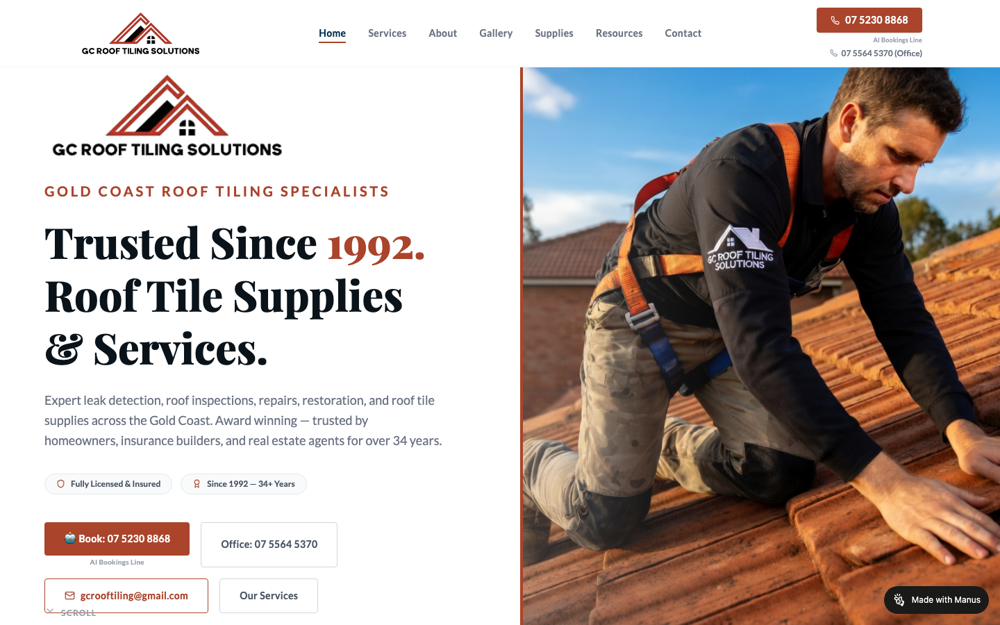
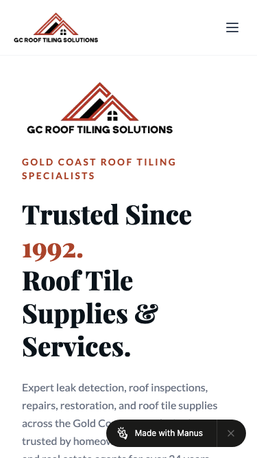

# GC Roof Tiling Solutions · 现状审计与重构提议

> **60/100** · strong_redesign · 行业：roofing · 地区：Gold Coast · Google 评价：4.6★ （0 条）

## 内部分级 · 运营优先看这段

**投入分级：** `C` 批量轻触 — 模板邮件 + 报告 PDF 链接，无主动跟进

**触发依据：**
- C · strong_redesign · audit 60 · 0 评论 4.6★ (未达 B 标准)

**下一步行动：** 标准模板邮件 + master.md PDF 链接，无主动跟进。等客户回复触发后再投入。

## 一、店家现状速览

**线索来源 · 联系开场可用**:
- **来源**: Google Maps (gosom 抓取)
- **搜索关键词**: `roofing in gold-coast`
- **首次发现**: 2026-05-14
- **Batch**: `pipe-roofing-gold-coast-202605150724`

**审计结论：** audit_score=60 → strong_redesign · weakest: gbp 20, technical 43 · fired: no_https · 1 critical issues

**已触发的 hard triggers：** `no_https`

- 电话：(07)55645370
- 地址：4/513 Olsen Ave, Southport QLD 4215
- 网站：[http://gcrooftilingsolutions.com.au/](http://gcrooftilingsolutions.com.au/)
- 网站状态：`independent_http_site`

## 二、客户访问时看到的页面

**慢速 4G 加载实景视频**（1.6 Mbps · 150ms 延迟 · 4× CPU 节流，模拟真实手机访客的体验）：

[播放视频](./video/mobile-throttled.webm)

## 三、视觉审计 · Vision LLM 怎么看

> The site has credible branding and a strong roofing image, but the mobile first screen hides the phone action and includes a visible builder watermark that weakens trust.

新鲜度 **6/10** · 信任度 **6/10** · 转化准备度 **5/10** · 设计年代 `slightly_outdated`

**值得保留的优点：**
- The roof worker image is relevant and immediately shows the trade being offered.
- The 'Trusted Since 1992' message is a strong trust signal worth keeping.
- The desktop header includes visible phone numbers, which helps credibility.

## 五、当前网站在哪里"漏水"

### 关键问题 · 3 项（立刻在伤害成交）

### 关键 · https_enabled

**技术事实**

http only

**普通话翻译**

你的网站没有 HTTPS — 浏览器会在地址栏显示「不安全」标记，部分浏览器（Chrome / Firefox）甚至会弹出全屏警告挡住页面。

**对客户的影响**

Google 早在 2018 年起把 HTTPS 列为搜索排名因素，没有 HTTPS 直接拉低自然搜索可见度；且超过 80% 的访客看到「不安全」标识会立刻关掉。对你这种 0 条 Google 评价积累起来的口碑来说，访客在网址栏就被劝退，等于浪费了所有 GBP 流量。

### 关键 · Mobile phone action is hidden

**技术事实**

On the mobile screenshot, the first screen shows the logo, hamburger icon, headline, and intro text, but no visible phone button or booking button before the fold.

**普通话翻译**

手机打开时，客户第一眼看不到电话号码或拨打按钮。

**对客户的影响**

本地找屋顶维修的人多数会用手机搜索；如果8秒内找不到怎么联系，很可能直接返回Google点下一家公司。

**正确长啥样**

Mobile header with the logo on the left, a tap-to-call button or phone icon on the right, and a primary call button visible within the first screen.

**Redesign 怎么改**

Add a sticky mobile header with a visible phone icon linked to 07 5230 8868, and place a full-width 'Call Now' button directly under the hero headline.

### 关键 · Builder watermark hurts credibility

**技术事实**

A black 'Made with Manus' badge appears in the bottom-right of the desktop screenshot and overlays the bottom of the mobile hero text.

**普通话翻译**

网页右下角还露着建站工具的标志，看起来像还没正式做完。

**对客户的影响**

屋顶维修是高信任服务，客户看到这种标志会怀疑公司是否专业，可能少打一个电话就损失一个报价机会。

**正确长啥样**

No third-party builder badge visible anywhere on the live customer-facing site, especially near calls to action or service copy.

**Redesign 怎么改**

Remove the Manus watermark from the published site and ensure no external builder branding appears on desktop or mobile.

### 主要问题 · 6 项（影响转化的明显短板）

### 主要 · review_volume_vs_peers

**技术事实**

0 reviews

**普通话翻译**

你的 Google 评价数量低于同行平均水平。

**对客户的影响**

本地搜索排名信号之一就是评价数量；不光是分数，连"有多少条"都算。短期可以做的：每个完工的客户群发一条「点评一下吧」的 SMS。

### 主要 · homepage_title_clear

**技术事实**

title='# Trusted Since 1992.Roof Tile Supplies & Services.' contains-name=false contains-niche=false

**普通话翻译**

你网站的浏览器标签 title 没把业务名字 + 服务关键词写清楚（比如该写「GC Roof Tiling Solutions - roofing Gold Coast」，但目前是泛泛一句）。

**对客户的影响**

Google 搜索结果里展示的就是这个 title。写不清楚 = 排名靠后 + 即使排上来客户也不知道是不是匹配的服务。SEO 最便宜的修复，但很多本地企业完全没做。

### 主要 · local_schema_markup

**技术事实**

no LocalBusiness JSON-LD

**普通话翻译**

网站没有 LocalBusiness JSON-LD 结构化数据（让 Google / AI 知道你是本地企业、地址、电话、营业时间的标准格式）。

**对客户的影响**

Google「附近的服务」「Knowledge Panel」「AI Overview」都依赖这类结构化数据。没有 = 即使排名上去也不会出现在右侧 Knowledge Panel 或地图卡片里 — 错失高转化的展示位。AI agent / ChatGPT 引用本地商家时也是基于这些数据。

### 主要 · Mobile headline consumes the screen

**技术事实**

On mobile, the headline 'Trusted Since 1992. Roof Tile Supplies & Services.' takes most of the visible screen before any contact action appears.

**普通话翻译**

手机上的大标题太占地方，重要的联系方式被挤到下面去了。

**对客户的影响**

客户不是来欣赏标题的，他们想快速确认能不能修屋顶并打电话；每多滚动一步都会减少一部分来电。

**正确长啥样**

A mobile hero with a shorter headline in roughly 34-42px type, a one-line trust statement, and a call button visible without scrolling.

**Redesign 怎么改**

Reduce mobile hero typography, tighten the headline to 'Gold Coast Roof Tiling Since 1992', and move the primary phone button above the intro paragraph.

### 主要 · Logo is repeated in hero

**技术事实**

Both desktop and mobile screenshots show the GC Roof Tiling Solutions logo in the header and again as a large logo inside the hero area.

**普通话翻译**

同一个Logo出现了两次，占用了首页最宝贵的位置。

**对客户的影响**

首屏空间有限，重复Logo不能帮客户决定打电话；换成资质、年限和服务范围更能促成咨询。

**正确长啥样**

One logo in the header only, with the hero area reserved for the main offer, service proof, and call-to-action buttons.

**Redesign 怎么改**

Remove the large duplicate hero logo and replace it with a compact trust row such as 'Licensed & insured', '34+ years', and 'Gold Coast roof tile specialists'.

### 主要 · Desktop contact choices feel busy

**技术事实**

On desktop, the main action area has four separate boxes: 'Book: 07 5230 8868', 'Office: 07 5564 5370', email, and 'Our Services'.

**普通话翻译**

桌面版有太多联系按钮，客户会犹豫到底该点哪一个。

**对客户的影响**

选择越多，行动越慢；本地服务客户通常只需要一个最明显的电话按钮，否则可能直接离开。

**正确长啥样**

One dominant filled call button, one secondary quote or services button, and supporting contact details placed below in smaller text.

**Redesign 怎么改**

Make 'Call 07 5230 8868' the single primary CTA, turn 'Our Services' into a secondary outline button, and move office/email details into a compact contact strip.

## 六、Redesign 的发力点（综合视觉 + 评论数据）

1. [视觉] 1. Add a visible mobile tap-to-call button above the fold.
2. [视觉] 2. Remove the Manus watermark from all live pages.
3. [视觉] 3. Simplify the hero so one primary phone CTA is visually dominant.

## 七、推荐销售切入点

- 你的网站没有 HTTPS — 浏览器对来访客户显示「不安全」，直接伤害信任

## 真实速度数据 · Google PageSpeed Insights

我们前面那段「慢速 4G 加载视频」是我们这边的实验室结果。这一段是 **Google 自己**对你网站打的分，包括过去 28 天 **真实访客**的网络体验数据（CRUX field data）。

### 移动端（mobile）

**Lighthouse 分数（实验室）：**

| 维度 | 分数 |
|---|---|
| 性能 (Performance) | **59/100** |
| 可访问性 (Accessibility) | 78/100 |
| 最佳实践 (Best Practices) | 100/100 |
| SEO | 100/100 |

**Lab 关键指标：** LCP `3.3s` · FCP `2.8s` · CLS `0.157` · TBT `517ms`

**Google 建议的优化项（按节省时间排序，前 1）：**

- **Reduce unused JavaScript** — 节省 300ms · 节省 119KB

### 桌面端（desktop）

**Lighthouse 分数：** Performance 77 · A11y 78 · Best Practices 100 · SEO 100

## 图片优化与第三方脚本体重

PSI 给的是宏观分数，下面是具体可改的两块：图片格式与 tracker 脚本。

### 图片优化（共 22 张）

- **优化率：** 5%（1/22 使用 WebP/AVIF/SVG）
- **响应式 srcset：** 0%
- **Lazy load：** 0%
- **Alt 文字（非空）：** 100%
- **显式 width/height：** 0%（防止 CLS 布局抖动）

**总评：** 基本未优化 — redesign 可显著降低图片下载量

**具体问题：**
- [major] 22 张图几乎全是 JPG/PNG，未用 WebP/AVIF — 估算可节省 30-50% 图片下载量
- [minor] 22/22 张图无响应式 srcset — 移动端浪费带宽
- [minor] 22/22 张图未 lazy load — 首屏外的图阻塞主线程
- [minor] 22/22 张图无显式 width/height — 加重 CLS 布局抖动

### 第三方脚本占用情况

- **总请求数：** 31（1 自有 + 30 第三方）
- **第三方占总下载量：** 100%（10030 KB / 10030 KB）
- **Tracker 脚本数：** 1（合计 0 KB）

**已识别的 tracker：**

| 工具 | 类型 | 请求数 | 字节 |
|---|---|---|---|
| Plausible | analytics | 1 | 0.0 KB |

## SEO 迁移评估 与 运营活跃度

客户最常担心的问题：「我重做网站，会不会丢掉 Google 排名？」这一段直接回答。

### 现有页面盘点

- **Sitemap 状态：** 已检测到 → `https://gcrooftiling-hw9svbez.manus.space/sitemap.xml`
- **页面总数：** 7
- **迁移复杂度：** 低（≤15 页 — 1-2 周内可完成全站重做）

**页面分类：**

| 类型 | 数量 |
|---|---|
| 顶层页面 | 2 |
| 首页 | 1 |
| service_area_page | 1 |
| 关于 / 团队 | 1 |
| 作品集 / 案例 | 1 |
| 联系 / 报价 | 1 |

**Sitemap lastmod 跨度：** 最旧 2026-05-14 → 最新 2026-05-14

**Redirect 计划承诺：** redesign 上线时我们会附一份 7 条 1:1 redirect 表（旧 URL → 新 URL），保证 Google 已经索引的页面权重无损迁移。已经在 Google 第一二页的关键词不会丢。

### SEO 长尾结构（服务 × 区域 = 本地搜索流量金矿）

- **服务专项页（如 /metal-roofing/）：** 0 个
- **区域页（如 /service-areas/brisbane/）：** 0 个
- **服务×区域组合页（如 /metal-roofing-brisbane/）：** 1 个

**长尾覆盖：** 无 — 没有服务专项页面，redesign 时是关键补点

**现有服务×区域页样本：** `/services`

### 运营活跃度

- **整体活跃度：** 活跃（30 天内有更新） （最近一次更新 1 天前）
- **Blog 板块：** 未发现 — 没有内容营销基础
- **社交媒体链接：** 网站上没有 social 链接 — GBP 流量进来后没有第二触点

## 联系表单与防垃圾设置

客户能不能 *方便地* 把信息留下来 = 直接的转化路径。这一段审视所有 `<form>` 元素的可用性 + 防 spam 配置。

### 表单 · 5 字段（摩擦：中（5-6 字段））

- **字段构成：** (unnamed)(text,必填) · (unnamed)(tel,必填) · (unnamed)(email) · (unnamed)(select-one) · (unnamed)(textarea)
- **必填字段数：** 2/5
- **常见关键字段：** email · phone · message
- **提交按钮：** 「Send Enquiry」
- **Honeypot 防 spam：** 未检测到

**未检测到任何 anti-spam 措施**（reCAPTCHA / hCaptcha / Turnstile / honeypot 都没有）— 表单极容易被自动机器人灌爆，垃圾询盘会让客户对真实询盘麻木。redesign 时建议加 Cloudflare Turnstile（不可见，免费）。

**Audit 总结：**

- [中等] 表单未检测到任何 anti-spam 措施（reCAPTCHA / hCaptcha / Turnstile / honeypot 都没有）— 高 spam 风险

## 域名历史与邮件信誉

- **域名"在线已"约：** 11 年（创建于 2014-05-22）— 老域名 = 多年 SEO 资产，redesign 时 redirect map 必须做对

### 邮件 DNS 配置（影响未来邮件营销 / 冷邮件投递率）

- **SPF (反垃圾发件验证)：** ⚠ 未配置 — 客户如果用域名邮箱发邮件，进垃圾箱的概率高
- **DKIM (邮件签名)：** ⚠ 常见 selector 未发现 DKIM 配置（不一定确凿，但提示有问题）
- **DMARC (策略)：** ⚠ 未配置 — 域名易被仿冒做钓鱼
- **整体邮件投递信誉：** `none` (全无配置 — 邮件营销 / cold outreach 几乎不可能投递成功)

> 这是后续 **「Social Media Management 月度包」** 或 **「Cold Outreach 启动包」** 的前置条件 —— 邮件 DNS 没修好，发出去的邮件全进垃圾箱。redesign 时一并处理。

## 技术栈与营销基建

从网站源码识别出来的工具，能帮我们判断这位客户的数字成熟度。

- **分析工具：** Plausible
- **广告 Pixel：** 未检测到 — 暂未投放追踪型广告

**数字成熟度打分：** 1 / 6 （低 — 客户对网站的认知是「有就行」，需要先讲清楚一份能赚钱的网站长什么样）

### Redesign 时必须保留 / 重新安装的追踪代码

客户可能有数月 / 数年的历史数据 + 广告投放受众 sit 在这些 ID 上面。重做时**必须用同一套 ID 重新接进新网站**，否则等于清零所有累积。

- Plausible

我们 redesign 交付清单会把这些列为「必须 setup 项」。

## 信任凭证 · AU 屋顶服务

本地服务的客户在掏钱之前会查这些凭证。缺失 = 客户跳到下一家。

**信任分：** 40/100

### 已显示的（3 项）

- **QBCC 执照号** (25 分) — "QBCC Licence
899153"
- **从业年限** (10 分) — "over 34 years"
- **免费报价 / 上门估价** (5 分) — "Free Quote"

### 缺失的（5 项 — redesign 必补 / 提醒客户提供素材）

- [法律要求] **ABN** (15 分)
- [行业惯例] **公共责任险** (15 分)
- [法律要求] **工伤 / WHS 合规** (10 分)
- [行业惯例] **行业协会会员** (10 分)
- [行业惯例] **保修 / 工艺保证** (10 分)

> 客户网站缺少 2 个法律 / 行业要求的信任凭证：ABN、工伤 / WHS 合规。QLD 屋顶服务由 QBCC 监管，客户在花钱前会查这些；缺失等于直接给同行让单。

## AI 时代可发现性 · GEO Readiness

GEO = Generative Engine Optimization。ChatGPT、Perplexity、Google AI Overviews 这些 AI 搜索产品**不像传统搜索引擎那样按"关键词排名"工作**，它们直接抓取结构化数据并把答案合成给用户。如果你的网站在 AI 抓取这一块做得不到位，等于在生成式搜索时代隐身。

**AI 可发现性总分：** 25 / 100 — AI agent / ChatGPT 几乎无法准确引用此网站 — 在生成式搜索时代等于隐身

### 已经做到的（3 项）

- [PASS] `llms_txt_present` — llms.txt found (370182 bytes)
- [PASS] `semantic_landmarks` — 5 semantic landmarks present: <main, <nav, <header, <footer, <section
- [PASS] `eeat_business_credentials` — 2/4 credentials in copy: license/QBCC, insurance

### 还缺的（9 项 — 这些是 redesign 时一并补上的标准动作）

- [缺失] `ai_bot_robots_policy` (5 分) — robots.txt has no explicit policy for AI crawlers (GPTBot/ClaudeBot/etc)
- [缺失] `localbusiness_schema` (15 分) — no LocalBusiness or Organization JSON-LD
- [缺失] `service_schema` (10 分) — no Service JSON-LD
- [缺失] `faqpage_schema` (10 分) — no FAQPage JSON-LD (loses AI Overview / featured snippet eligibility)
- [缺失] `aggregaterating_schema` (5 分) — no AggregateRating JSON-LD (★ rating not shown in search snippets)
- [缺失] `breadcrumb_schema` (5 分) — no BreadcrumbList JSON-LD
- [缺失] `faq_qa_pattern` (10 分) — 1 question-style heading(s) found (Q&A format helps AI extraction)
- [缺失] `eeat_warranty_trust` (5 分) — no warranty/guarantee in copy
- [缺失] `jsonld_at_least_one` (10 分) — 0 JSON-LD block(s) detected on page

> **销售切入：** 「ChatGPT 现在每月 30 亿次搜索，本地服务用户问『Brisbane 哪家屋顶公司靠谱』，AI 回答时只引用结构化数据完整的网站。你目前在这个新阵地的得分是 25/100。」

## Upsell 机会 · redesign 之外的月度营收

redesign 是一次性收入。以下是基于这个客户当前现状自动识别的**持续性服务包**机会，可以在 redesign 提案签字时一并捆绑进去。

### Social presence 一次性 setup + 月度运营包

**触发依据：** 网站上没检测到任何社交媒体链接 — 连基础的多渠道触点都缺。

**包内容：** 一次性：FB / IG 商家档案 setup + 品牌头像/封面 + 内容模板 5 套 (3-5K 一次性)。月度：4 帖 + 评论管理 + 月度报表。

**月度费用区间：** $1,500 setup + $600-900/月

**销售切入：** 「Google Maps 流量进来后没有第二落点，意味着客户当下没决定就走了 — 没办法再触及。社交账号是免费的二次触达管道。」

### 内容写作月度包（Blog / 案例 / SEO 长尾）

**触发依据：** 网站没有 blog 板块 — 没有内容营销基础设施，长尾 SEO 流量为零。

**包内容：** 每月 2 篇 SEO-optimized blog（800-1,200 字）+ 每季度 1 篇 case study（含 before/after 图）+ 关键词研究报告。

**月度费用区间：** $400-800/月

**销售切入：** 「ChatGPT 时代搜索引擎更偏爱有「专家深度内容」的网站。你目前的网站只有服务介绍页 — AI 可引用的素材几乎为零。」

<!-- M2-D6 required token bridge: 现网站快速诊断 → covered by detail-builder section -->
<!-- 现网站快速诊断 -->

<!-- M2-D6 required token bridge: 业主沟通要点 → covered by detail-builder section -->
<!-- 业主沟通要点 -->

<!-- M2-D6 required token bridge: 账户与档案 → covered by detail-builder section -->
<!-- 账户与档案 -->

## 附录 · 数据出处

- Cheap audit version: `-`
- Detailed audit version: `2026-05-11-v1`
- Vision model: `codex_cli`
- Review source: `Google Places · most_relevant (max 5)`
- 完整 audit 报告 HTML：[internal-audit-report](./internal-audit-report.html)
