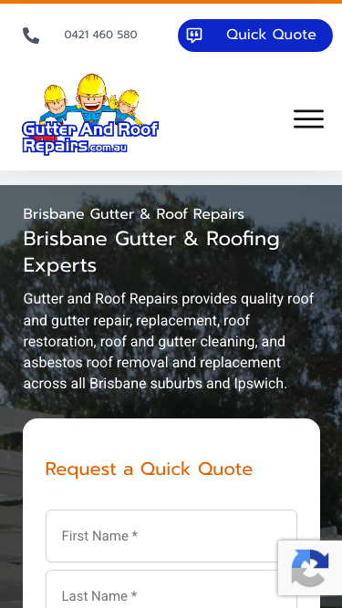

# Gutter and Roof Repairs · 现状审计与重构提议

> **69/100** · moderate_candidate · 行业：roofing · 地区：Brisbane · Google 评价：4.6★ （150 条）

## 内部分级 · 运营优先看这段

**投入分级：** `B` 预览试探 — ChatGPT 生成 mockup hero 图 + 短邮件试反应

**触发依据：**
- moderate_candidate + 150 评论 + audit 69（仍有改进空间）

**产品档位：** `T3` 多页站 + 月度运营包

- 150★4.6 强口碑底子
- 已投放过广告（懂月度预算）
- 数字成熟度 4/6
- 评论 trust strong

**建议报价：** 一次性 $5-8K + 月度 $800-1500/月（社媒 + 内容 + GEO）

**下一步行动：** 用 ChatGPT Image / Gemini Imagen 生成 hero mockup 预览图 + master.md PDF + 1 封 personalized 邮件试探 + 1 次跟进。回应后升级到 A 档处理。

## 一、店家现状速览

**审计结论：** audit_score=69 → moderate_candidate · weakest: seo 31, visual 50 · fired: high_traction_old_site

**已触发的 hard triggers：** `high_traction_old_site`

- 电话：0421 460 580
- 地址：1/41 Steel Pl, Morningside QLD 4170
- 网站：[https://gutterandroofrepairs.com.au/](https://gutterandroofrepairs.com.au/)
- 网站状态：`independent_https_site`

## 二、客户访问时看到的页面

## 三、视觉审计 · Vision LLM 怎么看

> The site uses a cluttered layout with low-contrast text and a busy background image that distracts from the primary goal of getting a quote.

新鲜度 **4/10** · 信任度 **5/10** · 转化准备度 **6/10** · 设计年代 `outdated`

**值得保留的优点：**
- The 'Quick Quote' form is visible above the fold, which is good for capturing leads immediately.
- The phone number is clearly visible in the header, allowing for direct contact.
- The use of orange as an accent color aligns with the construction/roofing industry and draws attention to key elements.

## 四、客户在 Google 上怎么说

> Customers consistently praise the business for its professionalism, clear communication, and high-quality workmanship, with specific appreciation for handling complex or difficult jobs safely and efficiently.

**一致夸赞：** `clear communication` · `professional workmanship` · `punctual and reliable` · `clean job site` · `fair pricing`

**可直接放上 redesign 后网站的 quote：**

> "The whole process was businesslike and professional. I cannot imagine a better experience."
> — **Bernard**, ★★★★★
>
> *放哪：Hero section proof of reliability for complex jobs*

> "They didn’t grumble. They didn’t cut corners. Instead, they explained the problem, got my approval..."
> — **Chris**, ★★★★★
>
> *放哪：Testimonial section highlighting transparency and problem-solving*

> "One of their team members showed a week later for a free, no-obligation quote - none of that “pay us just to take a look” nonsense."
> — **Chris**, ★★★★★
>
> *放哪：Service page to highlight no-obligation quotes*

> "The team kept us updated every step of the way, arrived right on schedule, and did a brilliant job."
> — **Mark**, ★★★★★
>
> *放哪：General trust signal for homepage*

## 五、当前网站在哪里"漏水"

### 关键问题 · 1 项（立刻在伤害成交）

### 关键 · White text on busy background is unreadable

**技术事实**

The main headline 'Brisbane Gutter & Roofing Experts' and the subtext are white with a drop shadow, placed directly over a busy photo of workers on a roof.

**普通话翻译**

网站主图上的白色文字太淡，背景太花，导致客户很难看清我们在说什么。

**对客户的影响**

访客通常在 8 秒内决定是否离开。如果文字看不清，他们会认为网站不专业或加载错误，直接关闭页面，导致潜在客户流失。

**正确长啥样**

A solid dark overlay (e.g., 40% opacity black) behind the text, or a solid color block (like the orange used elsewhere) to make the white text pop. Alternatively, use a cleaner, less busy stock photo.

**Redesign 怎么改**

Apply a dark gradient overlay to the hero image to ensure the white text has a contrast ratio of at least 4.5:1. Ensure the headline is legible within 2 seconds of landing.

### 主要问题 · 5 项（影响转化的明显短板）

### 主要 · homepage_title_clear

**技术事实**

title='# Brisbane Gutter & Roof Repairs' contains-name=true contains-niche=false

**普通话翻译**

你网站的浏览器标签 title 没把业务名字 + 服务关键词写清楚（比如该写「Gutter and Roof Repairs - roofing Brisbane」，但目前是泛泛一句）。

**对客户的影响**

Google 搜索结果里展示的就是这个 title。写不清楚 = 排名靠后 + 即使排上来客户也不知道是不是匹配的服务。SEO 最便宜的修复，但很多本地企业完全没做。

### 主要 · h1_unique

**技术事实**

3 <h1> tags

**普通话翻译**

页面要么没有 H1 标题（搜索引擎无法理解页面主旨），要么有多个 H1（搜索引擎不知道哪个是主题）。

**对客户的影响**

H1 是搜索引擎判断页面主题最权威的信号。写错或缺失 = 关键词排名拉低；同一页面同样的内容，H1 写对的可以排到前 3 页，写不对的可能挂在第 7 页。

### 主要 · local_schema_markup

**技术事实**

no LocalBusiness JSON-LD

**普通话翻译**

网站没有 LocalBusiness JSON-LD 结构化数据（让 Google / AI 知道你是本地企业、地址、电话、营业时间的标准格式）。

**对客户的影响**

Google「附近的服务」「Knowledge Panel」「AI Overview」都依赖这类结构化数据。没有 = 即使排名上去也不会出现在右侧 Knowledge Panel 或地图卡片里 — 错失高转化的展示位。AI agent / ChatGPT 引用本地商家时也是基于这些数据。

### 主要 · Logo looks low-resolution and dated

**技术事实**

The logo in the top left features a cartoonish clip-art style with a heavy drop shadow and a sunburst background that looks pixelated.

**普通话翻译**

左上角的 Logo 看起来像是几十年前的设计，不够清晰，显得不够专业。

**对客户的影响**

客户在寻找屋顶维修这种高客单价服务时，非常看重信任感。过时的 Logo 会让客户怀疑公司的实力，从而转向竞争对手。

**正确长啥样**

A flat, vector-based logo with clean lines and modern typography. The icon should be simplified, and the text should be legible at small sizes.

**Redesign 怎么改**

Redesign the logo to be flat and vector-based. Remove the sunburst background and heavy shadows. Use a clean sans-serif font for the text.

### 主要 · Quote form is visually overwhelming

**技术事实**

The 'Request a Quick Quote' form on the right has too many fields (First Name, Last Name, Email, Phone, Address, Suburb, Post Code, Service, Roof Type) stacked tightly with thin borders.

**普通话翻译**

右侧的报价表格字段太多，填起来很麻烦，像填表格一样繁琐。

**对客户的影响**

每增加一个表单字段，转化率就会下降。对于急需维修的客户，他们更倾向于直接打电话，而不是填写十几个框。这直接导致线索获取率降低。

**正确长啥样**

A simplified form with only 3-4 fields: Name, Phone, and 'Service Needed' (dropdown). The rest can be collected later or via a secondary step.

**Redesign 怎么改**

Reduce the form to 3 fields max for the initial capture. Use a 'Call Now' button as the primary alternative for mobile users. Group address fields into a single 'Location' field.

## 六、Redesign 的发力点（综合视觉 + 评论数据）

1. [视觉] 1. Improve readability of the hero section by adding a dark overlay to the background image.
2. [视觉] 2. Simplify the quote form to reduce friction and increase submissions.
3. [视觉] 3. Modernize the logo and navigation to build trust and improve usability.
4. [评论] Highlight the 'free, no-obligation quote' aspect prominently to reduce friction for new leads.
5. [评论] Use Bernard's review to showcase capability in handling difficult, high-risk jobs (e.g., near electrical lines).
6. [评论] Feature Chris's review to demonstrate transparency when unforeseen issues arise, building trust in pricing integrity.

## 七、推荐销售切入点

- 你已经有不错的 Google 流量基础（150 条 4.6★ 评论），但当前网站设计在浪费这些点击
- 客户口碑已经强（clear communication / professional workmanship / punctual and reliable）— 网站只需要把这份信任承接住，不需要从零建立

## 真实速度数据 · Google PageSpeed Insights

我们前面那段「慢速 4G 加载视频」是我们这边的实验室结果。这一段是 **Google 自己**对你网站打的分，包括过去 28 天 **真实访客**的网络体验数据（CRUX field data）。

### 移动端（mobile）

**Lighthouse 分数（实验室）：**

| 维度 | 分数 |
|---|---|
| 性能 (Performance) | **45/100** |
| 可访问性 (Accessibility) | 90/100 |
| 最佳实践 (Best Practices) | 100/100 |
| SEO | 85/100 |

**Lab 关键指标：** LCP `7.2s` · FCP `3.0s` · CLS `0.018` · TBT `888ms`

**真实用户体验（过去 28 天 CRUX field data）总评：** `SLOW`

| 指标 | 75% 用户值 | Google 评级 |
|---|---|---|
| LCP（最大内容绘制 p75） | 2.63s | AVERAGE |
| FCP（首次内容绘制 p75） | 2.46s | AVERAGE |
| TTFB（服务器响应 p75） | 1.85s | SLOW |
| CLS（布局抖动 p75） | 0.000 | FAST |

**这意味着：** 过去 28 天访问你网站的实际用户里，75% 的人遇到的体验就是上面这些数字 — 不是我们测的、是 Google 用真实 Chrome 用户数据统计出来的。

**Google 建议的优化项（按节省时间排序，前 3）：**

- **Reduce unused JavaScript** — 节省 600ms · 节省 1392KB
- **Initial server response time was short** — 节省 331ms
- **Reduce unused CSS** — 节省 150ms · 节省 69KB

### 桌面端（desktop）

**Lighthouse 分数：** Performance 65 · A11y 90 · Best Practices 100 · SEO 85

## SEO 迁移评估 与 运营活跃度

客户最常担心的问题：「我重做网站，会不会丢掉 Google 排名？」这一段直接回答。

### 现有页面盘点

- **Sitemap 状态：** 已检测到 → `https://gutterandroofrepairs.com.au/sitemap_index.xml`
- **页面总数：** 114
- **迁移复杂度：** 高（>80 页 — 需要分阶段迁移 + 完整 redirect map）

**页面分类：**

| 类型 | 数量 |
|---|---|
| 顶层页面 | 65 |
| 内页 | 37 |
| 首页 | 3 |
| 联系 / 报价 | 3 |
| 法律 / 隐私 | 2 |
| Blog 文章 | 1 |
| 服务详情页 | 1 |
| FAQ | 1 |
| 关于 / 团队 | 1 |

**Sitemap lastmod 跨度：** 最旧 2023-06-26 → 最新 2026-04-15

**Redirect 计划承诺：** redesign 上线时我们会附一份 50 条 1:1 redirect 表（旧 URL → 新 URL），保证 Google 已经索引的页面权重无损迁移。已经在 Google 第一二页的关键词不会丢。

### 运营活跃度

- **整体活跃度：** 活跃（30 天内有更新） （最近一次更新 26 天前）
- **Blog 板块：** 有，共 1 篇文章 
- **社交媒体链接：** 网站上没有 social 链接 — GBP 流量进来后没有第二触点

## 联系表单与防垃圾设置

客户能不能 *方便地* 把信息留下来 = 直接的转化路径。这一段审视所有 `<form>` 元素的可用性 + 防 spam 配置。

### 表单 · 12 字段（摩擦：高（≥7 字段，会显著降低转化））

- **字段构成：** Name(text) · First(text) · Last(text) · Email*(email) · Phone*(tel) · Street Address(text) · Suburb(text) · Post Code(text) · Service Required*(select-one) · Type of roof*(select-one) · Additional Information(text) · g-recaptcha-response(textarea)
- **必填字段数：** 0/12
- **常见关键字段：** email · phone · message
- **提交按钮：** 「Submit」
- **Honeypot 防 spam：** 未检测到

### 表单 · 12 字段（摩擦：高（≥7 字段，会显著降低转化））

- **字段构成：** URL(text) · First(text) · Last(text) · Email*(email) · Phone*(tel) · Street Address(text) · Suburb(text) · Post Code(text) · Service Required*(select-one) · Type of roof*(select-one) · Additional Information(text) · g-recaptcha-response(textarea)
- **必填字段数：** 0/12
- **常见关键字段：** email · phone · message
- **提交按钮：** 「Submit」
- **Honeypot 防 spam：** 未检测到

### 表单 · 12 字段（摩擦：高（≥7 字段，会显著降低转化））

- **字段构成：** Facebook(text) · First(text) · Last(text) · Email*(email) · Phone*(tel) · Address(text) · Suburb(text) · Post Code(text) · Service Required*(select-one) · Type of roof*(select-one) · Additional Information(text) · g-recaptcha-response(textarea)
- **必填字段数：** 0/12
- **常见关键字段：** email · phone · message
- **提交按钮：** 「Submit」
- **Honeypot 防 spam：** 未检测到

**已部署的人机验证：**
- reCAPTCHA v2 (visible "I'm not a robot") — 高摩擦

**Audit 总结：**

- [关键] 表单字段数 12 — 远超行业标准 3-4 字段，会显著降低转化率
- [关键] 表单字段数 12 — 远超行业标准 3-4 字段，会显著降低转化率
- [关键] 表单字段数 12 — 远超行业标准 3-4 字段，会显著降低转化率
- [提示] reCAPTCHA v2 (visible "I'm not a robot") — 给真人增加额外操作（点击"我不是机器人"），轻微降低转化；redesign 可改用 v3/Turnstile 等 invisible 方案

## 域名历史与邮件信誉

### 邮件 DNS 配置（影响未来邮件营销 / 冷邮件投递率）

- **SPF (反垃圾发件验证)：** 已配置
- **DKIM (邮件签名)：** 已配置（selectors: s1, s2）
- **DMARC (策略)：** ⚠ 未配置 — 域名易被仿冒做钓鱼
- **整体邮件投递信誉：** `partial` (只有 2/3 — 建议补全)

> 这是后续 **「Social Media Management 月度包」** 或 **「Cold Outreach 启动包」** 的前置条件 —— 邮件 DNS 没修好，发出去的邮件全进垃圾箱。redesign 时一并处理。

## 技术栈与营销基建

从网站源码识别出来的工具，能帮我们判断这位客户的数字成熟度。

- **网站平台 (CMS)：** WordPress（迁移复杂度参考；WordPress / Wix / Squarespace 这类有标准导出工具，custom-coded 会复杂）
- **分析工具：** Google Tag Manager · Google Analytics 4 · Google Analytics (Universal)
- **广告 Pixel：** Google Ads Conversion — 客户已经在投放（或投放过）付费广告，对营销预算不陌生

**数字成熟度打分：** 4 / 6 （高 — 客户懂数字营销，redesign 谈预算时不必从零教育）

### Redesign 时必须保留 / 重新安装的追踪代码

客户可能有数月 / 数年的历史数据 + 广告投放受众 sit 在这些 ID 上面。重做时**必须用同一套 ID 重新接进新网站**，否则等于清零所有累积。

- Google Tag Manager
- Google Analytics 4
- Google Analytics (Universal)
- Google Ads Conversion

我们 redesign 交付清单会把这些列为「必须 setup 项」。

> **关键发现：客户网站还装着 Universal Analytics**，这套工具 Google 已于 2023 年 7 月停止收集数据。也就是说，**他们至少 2 年没有看过任何真实的网站访客数据**。这是销售切入的强角度。

## AI 时代可发现性 · GEO Readiness

GEO = Generative Engine Optimization。ChatGPT、Perplexity、Google AI Overviews 这些 AI 搜索产品**不像传统搜索引擎那样按"关键词排名"工作**，它们直接抓取结构化数据并把答案合成给用户。如果你的网站在 AI 抓取这一块做得不到位，等于在生成式搜索时代隐身。

**AI 可发现性总分：** 55 / 100 — AI agent 抓取部分支持，但关键 schema / 凭证 / FAQ 缺失

### 已经做到的（6 项）

- [PASS] `localbusiness_schema` — Organization JSON-LD present (LocalBusiness preferred for local services)
- [PASS] `breadcrumb_schema` — BreadcrumbList JSON-LD present
- [PASS] `semantic_landmarks` — 4 semantic landmarks present: <header, <footer, <article, <section
- [PASS] `eeat_business_credentials` — 3/4 credentials in copy: license/QBCC, years-in-business, insurance
- [PASS] `eeat_warranty_trust` — warranty/guarantee mentioned
- [PASS] `jsonld_at_least_one` — 7 JSON-LD block(s) detected on page

### 还缺的（6 项 — 这些是 redesign 时一并补上的标准动作）

- [缺失] `llms_txt_present` (5 分) — no /llms.txt at standard path
- [缺失] `ai_bot_robots_policy` (5 分) — robots.txt has no explicit policy for AI crawlers (GPTBot/ClaudeBot/etc)
- [缺失] `service_schema` (10 分) — no Service JSON-LD
- [缺失] `faqpage_schema` (10 分) — no FAQPage JSON-LD (loses AI Overview / featured snippet eligibility)
- [缺失] `aggregaterating_schema` (5 分) — no AggregateRating JSON-LD (★ rating not shown in search snippets)
- [缺失] `faq_qa_pattern` (10 分) — 1 question-style heading(s) found (Q&A format helps AI extraction)

> **销售切入：** 「ChatGPT 现在每月 30 亿次搜索，本地服务用户问『Brisbane 哪家屋顶公司靠谱』，AI 回答时只引用结构化数据完整的网站。你目前在这个新阵地的得分是 55/100。」

## 业务规模信号 · 内部筛选用

**注：这一段只给运营内部看，不进入客户报告。** 用来判断这个 lead 是不是匹配我们「小网站 / 多批量 / 快上线」的产品定位。

- **规模信号汇总：** 中型客户特征
- **客户分级：** `mid` — 中型客户，可接但价格要往上提（基础包 + 配置项）
- **建议定价档：** 基础包 $6-10K + 月度运营 $1-2K

**触发依据：**
- Google 评价 150 条（≥50，有规模基础）
- 网站页面数 114（≥100，中等复杂度）
- 已部署 4 个分析 / pixel 工具（高数字成熟度）

## Upsell 机会 · redesign 之外的月度营收

redesign 是一次性收入。以下是基于这个客户当前现状自动识别的**持续性服务包**机会，可以在 redesign 提案签字时一并捆绑进去。

### Social presence 一次性 setup + 月度运营包

**触发依据：** 网站上没检测到任何社交媒体链接 — 连基础的多渠道触点都缺。

**包内容：** 一次性：FB / IG 商家档案 setup + 品牌头像/封面 + 内容模板 5 套 (3-5K 一次性)。月度：4 帖 + 评论管理 + 月度报表。

**月度费用区间：** $1,500 setup + $600-900/月

**销售切入：** 「Google Maps 流量进来后没有第二落点，意味着客户当下没决定就走了 — 没办法再触及。社交账号是免费的二次触达管道。」

## 附录 · 数据出处

- Cheap audit version: `-`
- Detailed audit version: `2026-05-11-v1`
- Vision model: `ollama-qwen3.6-27b-nothink`
- Review source: `Google Places Place Details · most_relevant`
- 完整 audit 报告 HTML：[internal-audit-report](./internal-audit-report.html)
