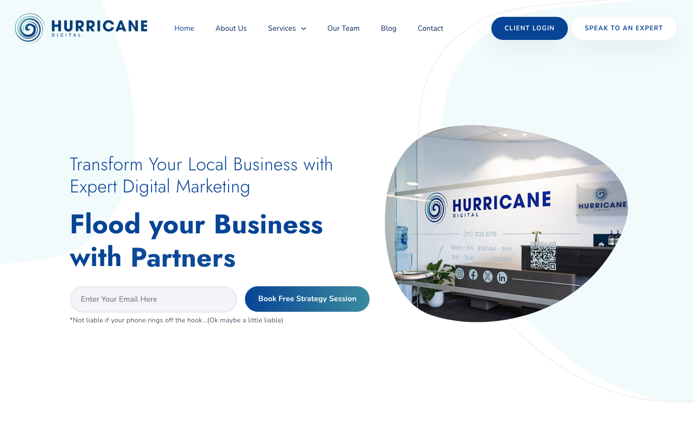
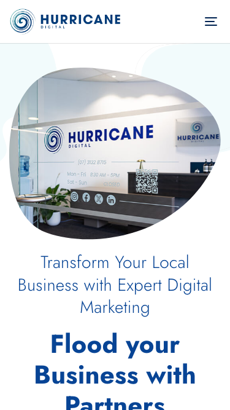

# Hurricane Digital - SEO Brisbane · 现状审计与重构提议

> **64/100** · moderate_candidate · 行业：roofing · 地区：Brisbane · Google 评价：4.7★ （183 条）

## 内部分级 · 运营优先看这段

**投入分级：** `D` 跳过 — 不投入精力

**触发依据：**
- [hard skip · enterprise_size] 业务规模过大（enterprise tier）— 不符合我们 small / batch / 快上的产品定位
- [hard skip · too_many_pages] 现有网站超过 200 页 — 迁移成本失控
- [hard skip · too_many_categories] GBP 多元业务分类 ≥ 5 个 — 需求复杂度超出标准产品包

**下一步行动：** 不投入精力，归档原因。';

## 一、店家现状速览

**审计结论：** audit_score=64 → moderate_candidate · weakest: visual 50, gbp 58 · fired: high_traction_old_site · 1 critical issues

**已触发的 hard triggers：** `high_traction_old_site`

- 电话：(07) 3132 8715
- 地址：3/52 McDougall St, Milton QLD 4064
- 网站：[https://hurricanedigital.com.au/](https://hurricanedigital.com.au/)
- 网站状态：`independent_https_site`

## 二、客户访问时看到的页面

## 三、视觉审计 · Vision LLM 怎么看

> The website features a clean, modern aesthetic with good typography, but the lack of clear industry-specific imagery and a confusing primary call-to-action creates a disconnect for local customers seeking immediate roofing services.

新鲜度 **8/10** · 信任度 **6/10** · 转化准备度 **5/10** · 设计年代 `modern`

**值得保留的优点：**
- Clean, modern typography and color scheme that feels professional.
- Clear navigation menu with logical categories.
- Good use of white space, making the content easy to read.

## 四、客户在 Google 上怎么说

> Customers overwhelmingly praise specific staff members for tangible improvements in visibility, lead generation, and website performance, though one significant complaint highlights a disconnect between sales promises and actual ROI.

**一致夸赞：** `rapid improvement in google rankings` · `responsive and proactive communication` · `measurable increase in leads` · `personalized account management` · `effective website optimization`

**抱怨 / 短板：** `lack of measurable roi` · `difficult cancellation process` · `billing issues after cancellation` · `unmet sales expectations`

**可直接放上 redesign 后网站的 quote：**

> "getting us back on Google where we can actually be seen/found. I am back to getting calls & email inquiries"
> — **Tracey**, ★★★★★
>
> *放哪：Hero section proof of lead generation and visibility recovery*

> "He understands performance marketing properly and focuses on what actually drives leads and growth."
> — **Brady**, ★★★★★
>
> *放哪：Services page to highlight strategic expertise over generic SEO*

> "the difference has been clear the value Hurricane Digital and Nash provide more than justifies the investment."
> — **Steven**, ★★★★★
>
> *放哪：Pricing or About page to justify cost and demonstrate value*

> "He goes above and beyond, putting in extra work to ensure everything is properly setup."
> — **Ben**, ★★★★★
>
> *放哪：Testimonials section to emphasize customer care and attention to detail*

## 五、当前网站在哪里"漏水"

### 关键问题 · 2 项（立刻在伤害成交）

### 关键 · phone_visible_above_fold

**技术事实**

phone hidden below fold or missing

**普通话翻译**

电话号码在第一屏看不到 — 客户必须滚动才能找到怎么联系你。

**对客户的影响**

本地服务客户 60-70% 倾向打电话沟通（不是填表单）。电话号没在第一屏 = 这部分客户里很多人会直接关掉去搜下一家。这是最便宜的转化优化之一。

### 关键 · Hero image fails to show roofing services

**技术事实**

The main hero image on the right shows a generic office reception desk with a 'Hurricane Digital' logo on the wall, rather than a roof, a construction site, or a technician.

**普通话翻译**

网站的主图展示的是办公室前台，而不是屋顶或施工场景。对于寻找屋顶维修服务的客户来说，这让他们无法一眼确认你们就是做屋顶生意的。

**对客户的影响**

访客在 8 秒内就会判断网站是否相关。如果第一眼没看到屋顶，他们可能会认为你们不专业或找错了地方，导致跳出率增加，直接损失潜在客户。

**正确长啥样**

A high-quality photo of a completed roof project, a team member in safety gear on a roof, or a split screen showing a 'before and after' of a roof repair.

**Redesign 怎么改**

Replace the office reception image with a high-resolution, authentic photo of a roofing project or the team at work to instantly validate the service offering.

### 主要问题 · 4 项（影响转化的明显短板）

### 主要 · homepage_title_clear

**技术事实**

title='# Transform Your Local Business with Expert Digital Marketin' contains-name=false contains-niche=false

**普通话翻译**

你网站的浏览器标签 title 没把业务名字 + 服务关键词写清楚（比如该写「Hurricane Digital - SEO Brisbane - roofing Brisbane」，但目前是泛泛一句）。

**对客户的影响**

Google 搜索结果里展示的就是这个 title。写不清楚 = 排名靠后 + 即使排上来客户也不知道是不是匹配的服务。SEO 最便宜的修复，但很多本地企业完全没做。

### 主要 · h1_unique

**技术事实**

3 <h1> tags

**普通话翻译**

页面要么没有 H1 标题（搜索引擎无法理解页面主旨），要么有多个 H1（搜索引擎不知道哪个是主题）。

**对客户的影响**

H1 是搜索引擎判断页面主题最权威的信号。写错或缺失 = 关键词排名拉低；同一页面同样的内容，H1 写对的可以排到前 3 页，写不对的可能挂在第 7 页。

### 主要 · Primary CTA is a form, not a phone number

**技术事实**

The primary call-to-action (CTA) in the hero section is a text input field ('Enter Your Email Here') and a button for a 'Free Strategy Session'. There is no visible phone number in the main hero area.

**普通话翻译**

主要按钮要求用户输入邮箱预约“策略会议”，而不是直接提供电话号码。对于急需修屋顶的客户来说，这增加了沟通的障碍，让他们觉得你们更想推销服务而不是解决问题。

**对客户的影响**

本地搜索用户中，超过 50% 会在 30 分钟内拨打电话。如果找不到显眼的电话按钮，这些高意向客户可能会直接转向竞争对手，导致大量商机流失。

**正确长啥样**

A prominent 'Call Now' button with a clickable phone number, or a 'Get a Free Quote' button that leads to a simple contact form, placed above the fold.

**Redesign 怎么改**

Replace the email input field with a large, high-contrast 'Call Now' button or a 'Get Instant Quote' button. Move the phone number to the top right of the hero section.

### 主要 · Headline focuses on marketing, not the service

**技术事实**

The headline reads 'Transform Your Local Business with Expert Digital Marketing' and 'Flood your Business with Partners'.

**普通话翻译**

标题强调的是“数字营销”和“合作伙伴”，而不是屋顶服务。这让普通客户感到困惑，因为他们只想找修屋顶的人，而不是学习营销知识。

**对客户的影响**

如果标题不能立刻说明你们提供什么服务，访客会感到迷茫并离开。清晰的标题能提高访客的停留时间和转化率，减少因误解而流失的客户。

**正确长啥样**

A headline that speaks directly to the customer's problem, e.g., 'Brisbane's Trusted Roofing Experts' or 'Fast, Reliable Roof Repairs in Brisbane'.

**Redesign 怎么改**

Rewrite the headline to focus on the roofing service and the location (Brisbane). Use clear, benefit-driven language like 'Protect Your Home with Brisbane's Top Roofing Team'.

## 六、Redesign 的发力点（综合视觉 + 评论数据）

1. [视觉] 1. Replace the office hero image with a high-quality photo of a roofing project or team.
2. [视觉] 2. Change the primary CTA to a 'Call Now' or 'Get a Quote' button with a visible phone number.
3. [视觉] 3. Rewrite the headline to focus on roofing services in Brisbane, not digital marketing.
4. [评论] Feature Tracey's quote prominently on the homepage to address the primary pain point of being 'invisible' online.
5. [评论] Use Brady's and Steven's reviews in a 'Results' or 'Case Studies' section to validate the ROI of the investment.
6. [评论] Highlight the specific staff names (Aiden, Nash) in team bios to leverage the personal connection customers feel.
7. [评论] Address the negative review's concern about transparency by adding a 'What to Expect' or 'Deliverables' section to the sales page.

## 七、推荐销售切入点

- 你已经有不错的 Google 流量基础（183 条 4.7★ 评论），但当前网站设计在浪费这些点击
- 客户口碑已经强（rapid improvement in google rankings / responsive and proactive communication / measurable increase in leads）— 网站只需要把这份信任承接住，不需要从零建立

## 真实速度数据 · Google PageSpeed Insights

我们前面那段「慢速 4G 加载视频」是我们这边的实验室结果。这一段是 **Google 自己**对你网站打的分，包括过去 28 天 **真实访客**的网络体验数据（CRUX field data）。

### 移动端（mobile）

**Lighthouse 分数（实验室）：**

| 维度 | 分数 |
|---|---|
| 性能 (Performance) | **32/100** |
| 可访问性 (Accessibility) | 86/100 |
| 最佳实践 (Best Practices) | 96/100 |
| SEO | 100/100 |

**Lab 关键指标：** LCP `18.5s` · FCP `3.3s` · CLS `0.001` · TBT `1884ms`

**Google 建议的优化项（按节省时间排序，前 3）：**

- **Reduce unused JavaScript** — 节省 1200ms · 节省 1196KB
- **Reduce unused CSS** — 节省 450ms · 节省 98KB
- **Initial server response time was short** — 节省 250ms

### 桌面端（desktop）

**Lighthouse 分数：** Performance 43 · A11y 86 · Best Practices 96 · SEO 100

## SEO 迁移评估 与 运营活跃度

客户最常担心的问题：「我重做网站，会不会丢掉 Google 排名？」这一段直接回答。

### 现有页面盘点

- **Sitemap 状态：** 已检测到 → `https://hurricanedigital.com.au/sitemap_index.xml`
- **页面总数：** 343
- **迁移复杂度：** 高（>80 页 — 需要分阶段迁移 + 完整 redirect map）

**页面分类：**

| 类型 | 数量 |
|---|---|
| 顶层页面 | 309 |
| 内页 | 20 |
| 首页 | 4 |
| Blog 文章 | 2 |
| 联系 / 报价 | 2 |
| 法律 / 隐私 | 2 |
| 作品集 / 案例 | 1 |
| 客户评价 | 1 |
| 服务详情页 | 1 |
| 关于 / 团队 | 1 |

**Sitemap lastmod 跨度：** 最旧 2022-06-21 → 最新 2026-03-19

**Redirect 计划承诺：** redesign 上线时我们会附一份 50 条 1:1 redirect 表（旧 URL → 新 URL），保证 Google 已经索引的页面权重无损迁移。已经在 Google 第一二页的关键词不会丢。

### 运营活跃度

- **整体活跃度：** 近期（90 天内有更新） （最近一次更新 53 天前）
- **Blog 板块：** 有，共 2 篇文章 
- **社交媒体链接：** 网站上引用了 4 个平台 — facebook, instagram, linkedin, twitter

## 联系表单与防垃圾设置

客户能不能 *方便地* 把信息留下来 = 直接的转化路径。这一段审视所有 `<form>` 元素的可用性 + 防 spam 配置。

### 表单 · 6 字段（摩擦：中（5-6 字段））

- **字段构成：** First Name(text) · Last Name(text) · Company(text) · Phone(Required)(tel) · Email(Required)(email) · g-recaptcha-response(textarea)
- **必填字段数：** 0/6
- **常见关键字段：** email · phone · message
- **提交按钮：** 「Submit」
- **Honeypot 防 spam：** 未检测到

### 表单 · 7 字段（摩擦：高（≥7 字段，会显著降低转化））

- **字段构成：** First Name(text) · Last Name(text) · Company(text) · Phone(Required)(tel) · Email(Required)(email) · How can we help(textarea) · g-recaptcha-response(textarea)
- **必填字段数：** 0/7
- **常见关键字段：** email · phone · message
- **提交按钮：** 「Submit」
- **Honeypot 防 spam：** 未检测到

**已部署的人机验证：**
- reCAPTCHA v2 (visible "I'm not a robot") — 高摩擦

**Audit 总结：**

- [关键] 表单字段数 7 — 远超行业标准 3-4 字段，会显著降低转化率
- [提示] reCAPTCHA v2 (visible "I'm not a robot") — 给真人增加额外操作（点击"我不是机器人"），轻微降低转化；redesign 可改用 v3/Turnstile 等 invisible 方案

## 域名历史与邮件信誉

- **域名"在线已"约：** 3 年（Wayback 首次快照 2022-08-11 起算（.au 域名无公开创建日期））— 中等年龄
- **Wayback Machine 快照：** 30 条（2022-08-11 → 2026-03-15）

### 邮件 DNS 配置（影响未来邮件营销 / 冷邮件投递率）

- **SPF (反垃圾发件验证)：** 已配置
- **DKIM (邮件签名)：** ⚠ 常见 selector 未发现 DKIM 配置（不一定确凿，但提示有问题）
- **DMARC (策略)：** ⚠ 未配置 — 域名易被仿冒做钓鱼
- **整体邮件投递信誉：** `weak` (只有 1/3 — 邮件营销前必须修)

> 这是后续 **「Social Media Management 月度包」** 或 **「Cold Outreach 启动包」** 的前置条件 —— 邮件 DNS 没修好，发出去的邮件全进垃圾箱。redesign 时一并处理。

## 技术栈与营销基建

从网站源码识别出来的工具，能帮我们判断这位客户的数字成熟度。

- **网站平台 (CMS)：** WordPress（迁移复杂度参考；WordPress / Wix / Squarespace 这类有标准导出工具，custom-coded 会复杂）
- **分析工具：** Google Tag Manager
- **广告 Pixel：** Meta (Facebook) Pixel — 客户已经在投放（或投放过）付费广告，对营销预算不陌生

**数字成熟度打分：** 4 / 6 （高 — 客户懂数字营销，redesign 谈预算时不必从零教育）

### Redesign 时必须保留 / 重新安装的追踪代码

客户可能有数月 / 数年的历史数据 + 广告投放受众 sit 在这些 ID 上面。重做时**必须用同一套 ID 重新接进新网站**，否则等于清零所有累积。

- Google Tag Manager
- Meta (Facebook) Pixel

我们 redesign 交付清单会把这些列为「必须 setup 项」。

## AI 时代可发现性 · GEO Readiness

GEO = Generative Engine Optimization。ChatGPT、Perplexity、Google AI Overviews 这些 AI 搜索产品**不像传统搜索引擎那样按"关键词排名"工作**，它们直接抓取结构化数据并把答案合成给用户。如果你的网站在 AI 抓取这一块做得不到位，等于在生成式搜索时代隐身。

**AI 可发现性总分：** 40 / 100 — AI agent 抓取部分支持，但关键 schema / 凭证 / FAQ 缺失

### 已经做到的（4 项）

- [PASS] `localbusiness_schema` — LocalBusiness JSON-LD present
- [PASS] `semantic_landmarks` — 5 semantic landmarks present: <main, <nav, <header, <footer, <section
- [PASS] `eeat_warranty_trust` — warranty/guarantee mentioned
- [PASS] `jsonld_at_least_one` — 9 JSON-LD block(s) detected on page

### 还缺的（8 项 — 这些是 redesign 时一并补上的标准动作）

- [缺失] `llms_txt_present` (5 分) — no /llms.txt at standard path
- [缺失] `ai_bot_robots_policy` (5 分) — robots.txt has no explicit policy for AI crawlers (GPTBot/ClaudeBot/etc)
- [缺失] `service_schema` (10 分) — no Service JSON-LD
- [缺失] `faqpage_schema` (10 分) — no FAQPage JSON-LD (loses AI Overview / featured snippet eligibility)
- [缺失] `aggregaterating_schema` (5 分) — no AggregateRating JSON-LD (★ rating not shown in search snippets)
- [缺失] `breadcrumb_schema` (5 分) — no BreadcrumbList JSON-LD
- [缺失] `faq_qa_pattern` (10 分) — 0 question-style heading(s) found (Q&A format helps AI extraction)
- [缺失] `eeat_business_credentials` (10 分) — only 0/4 credentials found — need ≥2 of: ABN, license/QBCC, years-in-business, insurance

> **销售切入：** 「ChatGPT 现在每月 30 亿次搜索，本地服务用户问『Brisbane 哪家屋顶公司靠谱』，AI 回答时只引用结构化数据完整的网站。你目前在这个新阵地的得分是 40/100。」

## 业务规模信号 · 内部筛选用

**注：这一段只给运营内部看，不进入客户报告。** 用来判断这个 lead 是不是匹配我们「小网站 / 多批量 / 快上线」的产品定位。

- **规模信号汇总：** 大型客户特征
- **客户分级：** `enterprise` — 大客户，要求多、决策慢，**与我们小批量模式不匹配**，建议跳过或转介给定制开发服务商
- **建议定价档：** 不建议接（与我们小批量模式不匹配）；如果接，最低 $20K + 月度运营 $3K+

**触发依据：**
- Google 评价 183 条（≥50，有规模基础）
- 网站页面数 343（≥300，复杂多服务体系）
- GBP 多业务分类 5 个（多元化经营）
- 已部署 2 个追踪工具
- 引用 4 个社交平台（多渠道运营）

## 附录 · 数据出处

- Cheap audit version: `-`
- Detailed audit version: `2026-05-11-v1`
- Vision model: `ollama-qwen3.6-27b-nothink`
- Review source: `Google Places Place Details · most_relevant`
- 完整 audit 报告 HTML：[internal-audit-report](./internal-audit-report.html)
