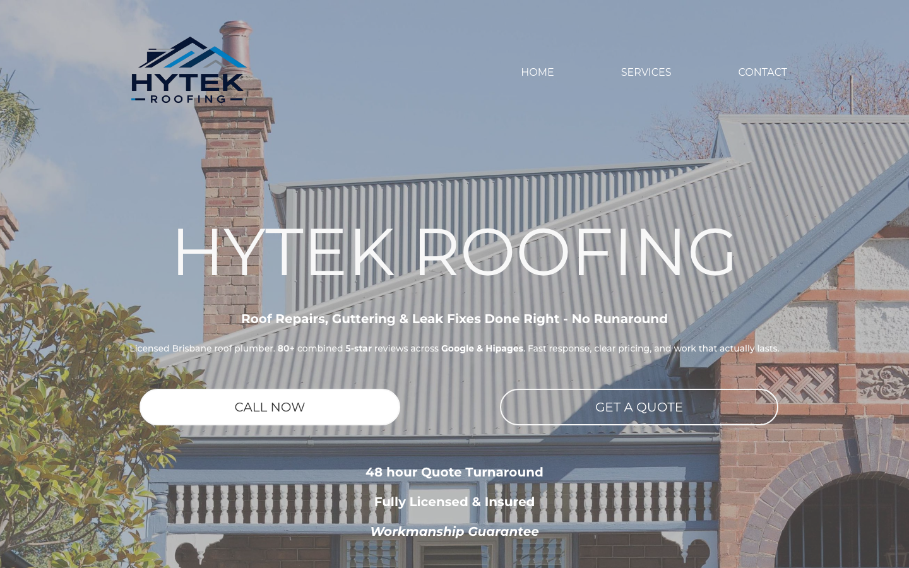
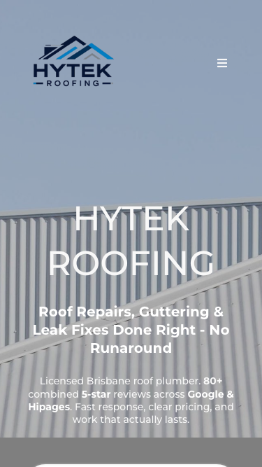

# Hytek Roofing · 现状审计与重构提议

> **46/100** · strong_redesign · 行业：roofer · 地区：Brisbane · Google 评价：4.8★ （0 条）

## 内部分级 · 运营优先看这段

**投入分级：** `C` 批量轻触 — 模板邮件 + 报告 PDF 链接，无主动跟进

**触发依据：**
- C · strong_redesign · audit 46 · 0 评论 4.8★ (未达 B 标准)

**下一步行动：** 标准模板邮件 + master.md PDF 链接，无主动跟进。等客户回复触发后再投入。

## 一、店家现状速览

**线索来源 · 联系开场可用**:
- **来源**: Google Maps (gosom 抓取)
- **搜索关键词**: `roofer in brisbane`
- **首次发现**: 2026-05-14
- **Batch**: `pipe-roofer-brisbane-202605141830`

**审计结论：** audit_score=46 → strong_redesign · weakest: gbp 20, seo 25 · fired: no_https · 2 critical issues

**已触发的 hard triggers：** `no_https`

- 电话：0434136338
- 地址：5 Barellan St, Stafford QLD 4053
- 网站：[http://hytekroofing.com.au/](http://hytekroofing.com.au/)
- 网站状态：`independent_http_site`

## 二、客户访问时看到的页面

**慢速 4G 加载实景视频**（1.6 Mbps · 150ms 延迟 · 4× CPU 节流，模拟真实手机访客的体验）：

[播放视频](./video/mobile-throttled.webm)

## 三、视觉审计 · Vision LLM 怎么看

> The site has a real roofing image and clear service promise, but the first screen makes it harder than necessary for a Brisbane customer to call, verify trust, or request help quickly.

新鲜度 **6/10** · 信任度 **6/10** · 转化准备度 **5/10** · 设计年代 `slightly_outdated`

**值得保留的优点：**
- The hero uses a real roofing-related photo instead of a generic stock graphic.
- The headline clearly names the business, and the service line mentions roof repairs, guttering, and leak fixes.
- The page already includes useful trust messages such as reviews, licensing, insurance, quote turnaround, and workmanship guarantee.

## 五、当前网站在哪里"漏水"

### 关键问题 · 3 项（立刻在伤害成交）

### 关键 · https_enabled

**技术事实**

http only

**普通话翻译**

你的网站没有 HTTPS — 浏览器会在地址栏显示「不安全」标记，部分浏览器（Chrome / Firefox）甚至会弹出全屏警告挡住页面。

**对客户的影响**

Google 早在 2018 年起把 HTTPS 列为搜索排名因素，没有 HTTPS 直接拉低自然搜索可见度；且超过 80% 的访客看到「不安全」标识会立刻关掉。对你这种 0 条 Google 评价积累起来的口碑来说，访客在网址栏就被劝退，等于浪费了所有 GBP 流量。

### 关键 · phone_visible_above_fold

**技术事实**

phone hidden below fold or missing

**普通话翻译**

电话号码在第一屏看不到 — 客户必须滚动才能找到怎么联系你。

**对客户的影响**

本地服务客户 60-70% 倾向打电话沟通（不是填表单）。电话号没在第一屏 = 这部分客户里很多人会直接关掉去搜下一家。这是最便宜的转化优化之一。

### 关键 · Mobile call action is not visible

**技术事实**

On the mobile screenshot, the visible first screen ends with only the top edge of a white rounded element at the bottom; there is no readable phone number, 'Call Now' button, or quote button visible above the fold.

**普通话翻译**

手机首屏看不到可以直接打电话的按钮，客户还要往下滑或点菜单才知道怎么联系你。

**对客户的影响**

本地找屋顶维修的人多数是在手机上快速比较商家，常见行为是在几秒内决定要不要打电话；如果首屏不能马上联系，很多客户会直接回到 Google 地图选下一家。

**正确长啥样**

Mobile first screen should show a sticky bottom phone button or a clear 'Call Now' button directly under the headline, with the phone number readable and tappable without scrolling.

**Redesign 怎么改**

Move a high-contrast 'Call Now' CTA and phone number into the mobile hero, and add a sticky bottom bar with 'Call' and 'Get Quote' actions.

### 主要问题 · 9 项（影响转化的明显短板）

### 主要 · review_volume_vs_peers

**技术事实**

0 reviews

**普通话翻译**

你的 Google 评价数量低于同行平均水平。

**对客户的影响**

本地搜索排名信号之一就是评价数量；不光是分数，连"有多少条"都算。短期可以做的：每个完工的客户群发一条「点评一下吧」的 SMS。

### 主要 · homepage_title_clear

**技术事实**

title='## HYTEK ROOFING' contains-name=true contains-niche=false

**普通话翻译**

你网站的浏览器标签 title 没把业务名字 + 服务关键词写清楚（比如该写「Hytek Roofing - roofer Brisbane」，但目前是泛泛一句）。

**对客户的影响**

Google 搜索结果里展示的就是这个 title。写不清楚 = 排名靠后 + 即使排上来客户也不知道是不是匹配的服务。SEO 最便宜的修复，但很多本地企业完全没做。

### 主要 · h1_unique

**技术事实**

9 <h1> tags

**普通话翻译**

页面要么没有 H1 标题（搜索引擎无法理解页面主旨），要么有多个 H1（搜索引擎不知道哪个是主题）。

**对客户的影响**

H1 是搜索引擎判断页面主题最权威的信号。写错或缺失 = 关键词排名拉低；同一页面同样的内容，H1 写对的可以排到前 3 页，写不对的可能挂在第 7 页。

### 主要 · local_schema_markup

**技术事实**

no LocalBusiness JSON-LD

**普通话翻译**

网站没有 LocalBusiness JSON-LD 结构化数据（让 Google / AI 知道你是本地企业、地址、电话、营业时间的标准格式）。

**对客户的影响**

Google「附近的服务」「Knowledge Panel」「AI Overview」都依赖这类结构化数据。没有 = 即使排名上去也不会出现在右侧 Knowledge Panel 或地图卡片里 — 错失高转化的展示位。AI agent / ChatGPT 引用本地商家时也是基于这些数据。

### 主要 · Header hides the phone number

**技术事实**

On desktop, the top navigation only shows HOME, SERVICES, and CONTACT; there is no phone number or emergency call action in the header.

**普通话翻译**

电脑端顶部只有菜单，没有电话号码；客户想联系时需要自己去找。

**对客户的影响**

客户越接近打电话，页面越不能增加步骤。少一个明显电话号码，就可能少一次询价，尤其是从 Google 商家资料点进来的高意向客户。

**正确长啥样**

Desktop header should include a visible phone number on the right, such as 'Call 07 xxxx xxxx', plus a distinct quote button beside it.

**Redesign 怎么改**

Replace the plain 'CONTACT' nav item area with a visible phone number button and a secondary 'Request Quote' button, keeping navigation links smaller.

### 主要 · White text blends into roof photo

**技术事实**

The large white 'HYTEK ROOFING' headline, white service line, and small white paragraph sit over a pale grey metal roof and washed-out sky.

**普通话翻译**

白色文字放在浅色屋顶和天空上，有些内容不够醒目，看起来费眼。

**对客户的影响**

访客通常只扫一眼首屏，如果看不清你做什么、服务哪里、有没有保障，就更容易离开；首屏信息不清会直接减少电话和报价请求。

**正确长啥样**

Hero text should sit on a darker overlay area or a solid color panel, with 16px+ readable body text and strong contrast between text and background.

**Redesign 怎么改**

Add a controlled dark overlay behind the hero copy, or place the copy in a left-aligned section over the darker part of the image while preserving the roof photo.

### 主要 · Two CTAs compete without priority

**技术事实**

On desktop, 'CALL NOW' is a large white pill button on the left, while 'GET A QUOTE' is a white outlined pill button on the right; neither includes a phone number.

**普通话翻译**

两个按钮看起来差不多，而且没有电话号码，客户不清楚应该先点哪个。

**对客户的影响**

选择越多、越不清楚，客户越容易犹豫。屋顶维修这种急事，按钮应该让客户一秒知道怎么联系，否则询价机会会流失。

**正确长啥样**

One primary CTA should dominate, such as a filled high-contrast 'Call 07 xxxx xxxx' button, with 'Get a Quote' as a quieter secondary action.

**Redesign 怎么改**

Make 'Call Now' the primary colored button with the phone number included, and restyle 'Get a Quote' as a secondary text or outline button nearby.

### 主要 · Trust claims lack proof

**技术事实**

The hero paragraph says '80+ combined 5-star reviews across Google & Hipages', and the lower hero lists '48 hour Quote Turnaround', 'Fully Licensed & Insured', and 'Workmanship Guarantee', but there are no visible review stars, licence number, badges, or customer proof in the screenshot.

**普通话翻译**

页面写了很多可信承诺，但没有把星级评价、执照信息或真实客户证明展示出来。

**对客户的影响**

客户在 Google 上会同时比较好几家 roofer，看到可验证的评价和资质更容易放心打电话；只写一句话，信任感会弱很多。

**正确长啥样**

Trust area should show visible star rating, review count, Google/Hipages labels, licence/insurance detail, and a short real testimonial or project proof near the CTA.

**Redesign 怎么改**

Add a compact trust strip under the hero CTA with Google stars, '80+ reviews', licence/insurance note, and a link or visual cue to verified reviews.

### 主要 · Mobile header prioritises menu over calling

**技术事实**

The mobile header shows the Hytek logo on the left and a small hamburger icon on the right, with no visible phone icon or quote action.

**普通话翻译**

手机顶部最显眼的是菜单，不是电话；对找维修的人来说顺序反了。

**对客户的影响**

本地服务客户通常是带着问题来的，不是慢慢逛网站。把电话藏起来会让急单客户更快跳去能马上拨打的竞争对手。

**正确长啥样**

Mobile header should show logo, phone icon/button, and optionally a smaller menu icon, with the call action visually stronger than navigation.

**Redesign 怎么改**

Replace the right-side hamburger-only header with a phone icon button and keep the menu accessible as a secondary icon or inside a sticky action bar.

## 六、Redesign 的发力点（综合视觉 + 评论数据）

1. [视觉] 1. Put a tappable phone number and primary call button above the fold on mobile and desktop.
2. [视觉] 2. Rebuild the hero with stronger text contrast, tighter mobile spacing, and one clear primary action.
3. [视觉] 3. Turn the written trust claims into visible proof with stars, review count, licence/insurance detail, and guarantee badge.

## 七、推荐销售切入点

- 你的网站没有 HTTPS — 浏览器对来访客户显示「不安全」，直接伤害信任

## 图片优化与第三方脚本体重

PSI 给的是宏观分数，下面是具体可改的两块：图片格式与 tracker 脚本。

### 图片优化（共 42 张）

- **优化率：** 0%（0/42 使用 WebP/AVIF/SVG）
- **响应式 srcset：** 0%
- **Lazy load：** 40%
- **Alt 文字（非空）：** 5%
- **显式 width/height：** 0%（防止 CLS 布局抖动）

**总评：** 基本未优化 — redesign 可显著降低图片下载量

**具体问题：**
- [major] 42 张图几乎全是 JPG/PNG，未用 WebP/AVIF — 估算可节省 30-50% 图片下载量
- [minor] 42/42 张图无响应式 srcset — 移动端浪费带宽
- [minor] 25/42 张图未 lazy load — 首屏外的图阻塞主线程
- [major] 40/42 张图缺 alt 文字 — 影响 SEO + 可访问性 + AI 抓取
- [minor] 42/42 张图无显式 width/height — 加重 CLS 布局抖动

## SEO 迁移评估 与 运营活跃度

客户最常担心的问题：「我重做网站，会不会丢掉 Google 排名？」这一段直接回答。

### 现有页面盘点

- **Sitemap 状态：** 未发现 sitemap.xml — 这本身就是个 SEO 短板（Google 爬虫漏抓页面），redesign 时会一并补上。

### 运营活跃度

- **整体活跃度：** 无法判断 
- **Blog 板块：** 未发现 — 没有内容营销基础
- **社交媒体链接：** 网站上没有 social 链接 — GBP 流量进来后没有第二触点

## 域名历史与邮件信誉

### 邮件 DNS 配置（影响未来邮件营销 / 冷邮件投递率）

- **SPF (反垃圾发件验证)：** ⚠ 未配置 — 客户如果用域名邮箱发邮件，进垃圾箱的概率高
- **DKIM (邮件签名)：** ⚠ 常见 selector 未发现 DKIM 配置（不一定确凿，但提示有问题）
- **DMARC (策略)：** 已配置（policy: `reject`）
- **整体邮件投递信誉：** `weak` (只有 1/3 — 邮件营销前必须修)

> 这是后续 **「Social Media Management 月度包」** 或 **「Cold Outreach 启动包」** 的前置条件 —— 邮件 DNS 没修好，发出去的邮件全进垃圾箱。redesign 时一并处理。

## 技术栈与营销基建

从网站源码识别出来的工具，能帮我们判断这位客户的数字成熟度。

- **分析工具：** 未检测到 — 客户目前看不到任何流量数据，等于在盲飞
- **广告 Pixel：** 未检测到 — 暂未投放追踪型广告
- **托管 / CDN 线索：** Cloudflare-fronted

**数字成熟度打分：** 0 / 6 （低 — 客户对网站的认知是「有就行」，需要先讲清楚一份能赚钱的网站长什么样）

## 信任凭证 · generic

本地服务的客户在掏钱之前会查这些凭证。缺失 = 客户跳到下一家。

**信任分：** 40/100

### 已显示的（3 项）

- **保修** (15 分) — "Workmanship Guarantee"
- **行业证书** (15 分) — "licensed"
- **免费报价** (10 分) — "FREE QUOTE"

### 缺失的（4 项 — redesign 必补 / 提醒客户提供素材）

- [行业惯例] **ABN** (20 分)
- [行业惯例] **保险** (15 分)
- [行业惯例] **从业年限** (15 分)
- [行业惯例] **荣誉 / 奖项** (10 分)

## AI 时代可发现性 · GEO Readiness

GEO = Generative Engine Optimization。ChatGPT、Perplexity、Google AI Overviews 这些 AI 搜索产品**不像传统搜索引擎那样按"关键词排名"工作**，它们直接抓取结构化数据并把答案合成给用户。如果你的网站在 AI 抓取这一块做得不到位，等于在生成式搜索时代隐身。

**AI 可发现性总分：** 10 / 100 — AI agent / ChatGPT 几乎无法准确引用此网站 — 在生成式搜索时代等于隐身

### 已经做到的（2 项）

- [PASS] `llms_txt_present` — llms.txt found (639622 bytes)
- [PASS] `eeat_warranty_trust` — warranty/guarantee mentioned

### 还缺的（10 项 — 这些是 redesign 时一并补上的标准动作）

- [缺失] `ai_bot_robots_policy` (5 分) — robots.txt has no explicit policy for AI crawlers (GPTBot/ClaudeBot/etc)
- [缺失] `localbusiness_schema` (15 分) — no LocalBusiness or Organization JSON-LD
- [缺失] `service_schema` (10 分) — no Service JSON-LD
- [缺失] `faqpage_schema` (10 分) — no FAQPage JSON-LD (loses AI Overview / featured snippet eligibility)
- [缺失] `aggregaterating_schema` (5 分) — no AggregateRating JSON-LD (★ rating not shown in search snippets)
- [缺失] `breadcrumb_schema` (5 分) — no BreadcrumbList JSON-LD
- [缺失] `semantic_landmarks` (10 分) — 1 semantic landmarks present: <section
- [缺失] `faq_qa_pattern` (10 分) — 2 question-style heading(s) found (Q&A format helps AI extraction)
- [缺失] `eeat_business_credentials` (10 分) — only 1/4 credentials found (license/QBCC) — need ≥2 of: ABN, license/QBCC, years-in-business, insurance
- [缺失] `jsonld_at_least_one` (10 分) — 0 JSON-LD block(s) detected on page

> **销售切入：** 「ChatGPT 现在每月 30 亿次搜索，本地服务用户问『Brisbane 哪家屋顶公司靠谱』，AI 回答时只引用结构化数据完整的网站。你目前在这个新阵地的得分是 10/100。」

## Upsell 机会 · redesign 之外的月度营收

redesign 是一次性收入。以下是基于这个客户当前现状自动识别的**持续性服务包**机会，可以在 redesign 提案签字时一并捆绑进去。

### Social presence 一次性 setup + 月度运营包

**触发依据：** 网站上没检测到任何社交媒体链接 — 连基础的多渠道触点都缺。

**包内容：** 一次性：FB / IG 商家档案 setup + 品牌头像/封面 + 内容模板 5 套 (3-5K 一次性)。月度：4 帖 + 评论管理 + 月度报表。

**月度费用区间：** $1,500 setup + $600-900/月

**销售切入：** 「Google Maps 流量进来后没有第二落点，意味着客户当下没决定就走了 — 没办法再触及。社交账号是免费的二次触达管道。」

### 内容写作月度包（Blog / 案例 / SEO 长尾）

**触发依据：** 网站没有 blog 板块 — 没有内容营销基础设施，长尾 SEO 流量为零。

**包内容：** 每月 2 篇 SEO-optimized blog（800-1,200 字）+ 每季度 1 篇 case study（含 before/after 图）+ 关键词研究报告。

**月度费用区间：** $400-800/月

**销售切入：** 「ChatGPT 时代搜索引擎更偏爱有「专家深度内容」的网站。你目前的网站只有服务介绍页 — AI 可引用的素材几乎为零。」

<!-- M2-D6 required token bridge: 现网站快速诊断 → covered by detail-builder section -->
<!-- 现网站快速诊断 -->

<!-- M2-D6 required token bridge: 业主沟通要点 → covered by detail-builder section -->
<!-- 业主沟通要点 -->

<!-- M2-D6 required token bridge: 账户与档案 → covered by detail-builder section -->
<!-- 账户与档案 -->

## 附录 · 数据出处

- Cheap audit version: `-`
- Detailed audit version: `2026-05-11-v1`
- Vision model: `codex_cli`
- Review source: `Google Places · most_relevant (max 5)`
- 完整 audit 报告 HTML：[internal-audit-report](./internal-audit-report.html)
