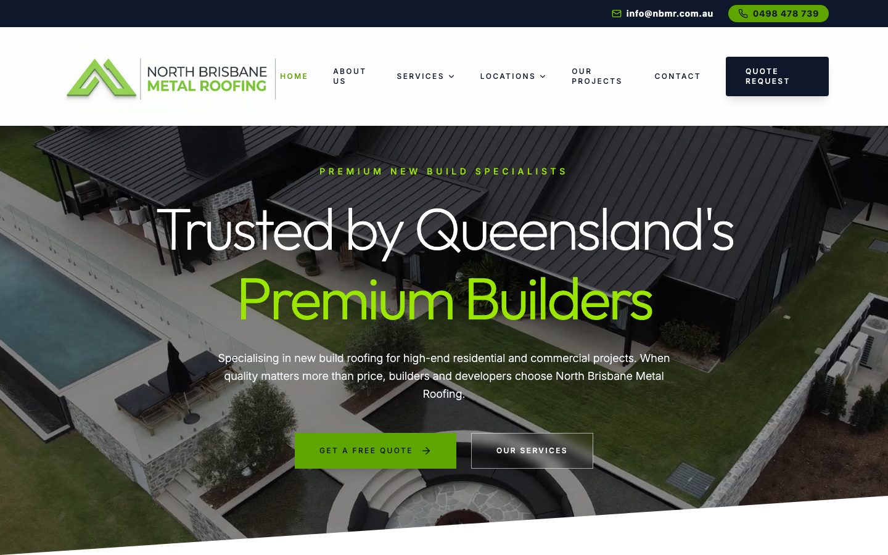
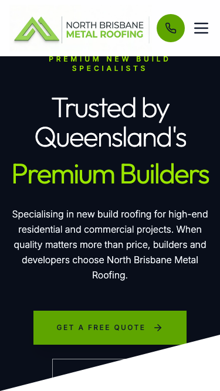

# North Brisbane Metal Roofing Pty Ltd · 现状审计与重构提议

> **null/100** · - · 行业：roofer · 地区：Brisbane · Google 评价：4.8★ （61 条）

## 内部分级 · 运营优先看这段

**投入分级：** `C` 批量轻触 — 模板邮件 + 报告 PDF 链接，无主动跟进

**触发依据：**
- audit 未运行 · 默认 C 等待 audit 后重新分级

**下一步行动：** 标准模板邮件 + master.md PDF 链接，无主动跟进。等客户回复触发后再投入。

## 一、店家现状速览

## 二、销售切入点

**TBD · audit 不完整**

**线索来源 · 联系开场可用**:
- **来源**: Google Places API (官方搜索)
- **搜索关键词**: `roofer brisbane`
- **结果排名**: 第 13 位
- **首次发现**: 2026-05-13
- **Batch**: `places-roofer-brisbane-202605132243`

- 电话：0498 478 739
- 地址：3/359 Gympie Rd P.O.B, Unit 50, Kedron QLD 4031, Australia
- 网站：[http://www.nbmr.com.au/](http://www.nbmr.com.au/)

## 三、客户访问时看到的页面

## 业务规模信号 · 内部筛选用

**注：这一段只给运营内部看，不进入客户报告。** 用来判断这个 lead 是不是匹配我们「小网站 / 多批量 / 快上线」的产品定位。

- **规模信号汇总：** 小型客户特征
- **客户分级：** `small` — 小型，符合我们标准产品包定位

> 报价以上方 **建议报价** 为准（来自 entity.grade.recommended_pricing / PRODUCT_TIER_TABLE）。本段只用来判断 lead 是否匹配产品定位，不竞争报价。

**触发依据：**
- Google 评价 61 条（≥50，有规模基础）

## 现网站快速诊断

**TBD · audit 不完整**

## 业主沟通要点

**TBD · audit 不完整**

<!-- M2-D6 required token bridge: 账户与档案 → covered by detail-builder section -->
<!-- 账户与档案 -->

## 附录 · 数据出处

- Cheap audit version: `-`
- Detailed audit version: `-`
- Vision model: `n/a`
- Review source: `Google Places · most_relevant (max 5)`
- 完整 audit 报告 HTML：_(待 audit 完成后自动生成)_
