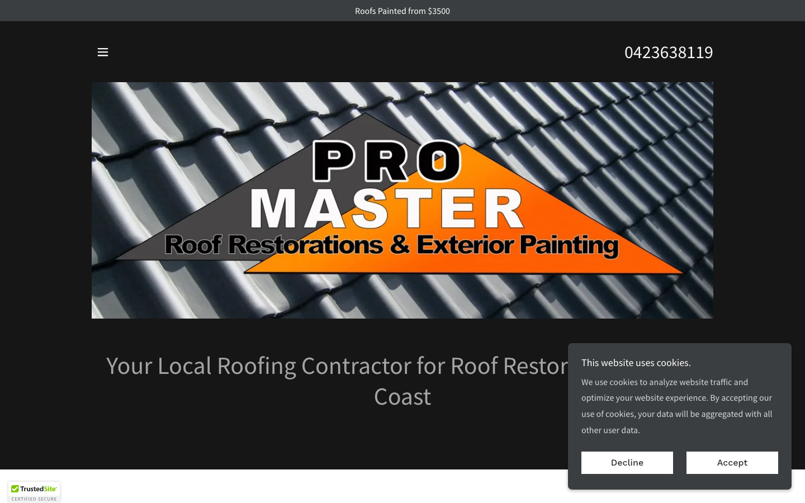
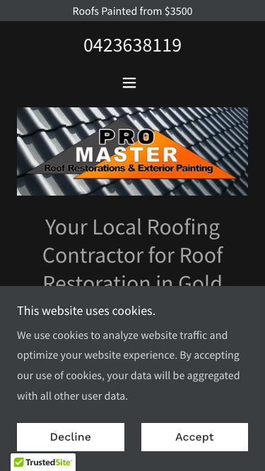

# Pro Master · 现状审计与重构提议

> **55/100** · moderate_candidate · 行业：roofing · 地区：Gold Coast · Google 评价：4.8★ （0 条）

## 内部分级 · 运营优先看这段

**投入分级：** `D` 跳过 — 不投入精力

**触发依据：**
- [hard skip · recent_redesign] 近 12 个月内 Wayback 显示客户刚 redesign 过 — 短期不会再投资重做

**下一步行动：** 不投入精力，归档原因。';

## 一、店家现状速览

## 二、销售切入点

**TBD · audit 不完整**

**线索来源 · 联系开场可用**:
- **来源**: Google Maps (gosom 抓取)
- **搜索关键词**: `roofing in gold-coast`
- **首次发现**: 2026-05-14
- **Batch**: `pipe-roofing-gold-coast-202605150724`

**审计结论：** audit_score=55 → moderate_candidate · weakest: gbp 20, visual 50 · 1 critical issues

- 电话：0423638119
- 地址：72 Hinde St, Ashmore QLD 4214
- 网站：[https://promasterau.com/](https://promasterau.com/)
- 网站状态：`independent_https_site`

## 三、客户访问时看到的页面

**慢速 4G 加载实景视频**（1.6 Mbps · 150ms 延迟 · 4× CPU 节流，模拟真实手机访客的体验）：

[播放视频](./video/mobile-throttled.webm)

## 三、视觉审计 · Vision LLM 怎么看

> Pro Master's site has a visible phone number and price anchor but a blocking cookie modal hides all persuasive content above the fold, there is no CTA button, and the composite photo-logo design reads as mid-2010s trade-site template.

新鲜度 **3/10** · 信任度 **4/10** · 转化准备度 **3/10** · 设计年代 `outdated`

**值得保留的优点：**
- Phone number '0423638119' is displayed prominently at the top of both desktop and mobile — this is the right instinct and should be preserved in the redesign as a sticky header element.
- 'Roofs Painted from $3500' price anchor is present — price transparency in roofing is rare and a genuine differentiator worth amplifying in the redesign.
- TrustedSite badge indicates the site has SSL and some baseline security verification — the underlying credential is worth keeping and displaying more prominently.

## 五、当前网站在哪里"漏水"

### 关键问题 · 4 项（立刻在伤害成交）

### 关键 · above_fold_cta_within_5s

**技术事实**

no CTA keyword in first 1500 chars

**普通话翻译**

客户打开你的网站后，前 5 秒内（一屏之内）看不到任何明显的「联系我们 / 报价 / 立即拨打」按钮。

**对客户的影响**

行业研究：移动用户做决策的前 8 秒决定 70% 的留存。看不到 CTA = 等于没办法转化。你的 0 条好评在堆积信任，但客户找不到下一步该点哪。

### 关键 · Cookie consent modal covers hero and body copy

**技术事实**

On both desktop and mobile, a large white cookie consent dialog ('This website uses cookies. We use cookies to analyze website traffic…') with Decline/Accept buttons sits directly over the page content, obscuring the hero headline 'Your Local Roofing Contractor for Roof Restor…' and everything below it.

**普通话翻译**

网站一打开就弹出一个大弹窗（关于Cookie隐私协议），把整个页面的内容都挡住了，访客什么都看不到。

**对客户的影响**

研究表明，网站访客平均在8秒内决定留还是走。弹窗让人看不到你提供什么服务，大多数人会直接关掉页面、换下一家，你的电话就少了一个机会。

**正确长啥样**

A slim 60px-tall bar pinned to the bottom of the screen with a single line of small text ('We use cookies') and an Accept button — it never covers any page content and visitors barely notice it.

**Redesign 怎么改**

Replace the full-blocking modal with a bottom-pinned GDPR notice bar (max-height: 60px, z-index below sticky header). Ensure zero overlap with the hero section on all viewport sizes.

### 关键 · No quote or call CTA button visible anywhere above fold

**技术事实**

The phone number '0423638119' appears as plain text at the top of both screenshots, but there is no button — no 'Get a Free Quote', no 'Call Now', no clickable affordance — visible above the fold on either device.

**普通话翻译**

页面上虽然有电话号码，但它只是一串普通文字，没有可以直接点击拨打的按钮，手机用户需要手动复制号码才能打电话，很多人嫌麻烦就不打了。

**对客户的影响**

移动端用户中，有可点击拨号按钮的页面比纯文字号码的页面电话转化率高出约40%。每10个看到页面的潜在客户，有4个可能因为没有按钮而直接离开。

**正确长啥样**

A high-contrast CTA button (e.g. orange fill, white bold text, 48px+ height on mobile) reading 'Call Now: 0423638119' or 'Get a Free Quote' placed inside or directly below the hero, visible without any scrolling.

**Redesign 怎么改**

Add a primary CTA button inside the hero section using a tel: href link. On mobile, make it full-width and at least 48px tall. On desktop, place it beside or below the hero headline. Use the brand orange for fill with white text.

### 关键 · No reviews, stars, or testimonials visible anywhere above fold

**技术事实**

Neither the desktop nor mobile screenshot shows any star rating, Google review count, testimonial quote, or trust badge (beyond TrustedSite) in the above-fold area. The TrustedSite badge is visible in the bottom corner of the desktop view but is small and unfamiliar to most Australian consumers.

**普通话翻译**

网站首屏完全看不到任何客户好评或星级评分。访客不知道有没有人用过你的服务，对你是否可信心存疑虑。

**对客户的影响**

本地服务行业中，超过88%的消费者在决定联系商家前会先查看评价。如果网站上完全看不到评价，即使你在Google上有很高的评分，这些信任感也等于白白浪费了，访客会直接选显示评价的竞争对手。

**正确长啥样**

A social proof strip directly below the hero: '⭐⭐⭐⭐⭐ 4.9 stars · 63 Google Reviews' with two short 1-sentence customer quotes and first names. On mobile, this appears as a horizontal scrollable row of review cards.

**Redesign 怎么改**

Add a review strip component immediately below the hero section. Pull the star rating and count from Google Business Profile. Include 2–3 hardcoded recent quotes. Link the strip to the full Google Reviews page. Use gold star icons (#F5A623 or similar).

### 主要问题 · 6 项（影响转化的明显短板）

### 主要 · review_volume_vs_peers

**技术事实**

0 reviews

**普通话翻译**

你的 Google 评价数量低于同行平均水平。

**对客户的影响**

本地搜索排名信号之一就是评价数量；不光是分数，连"有多少条"都算。短期可以做的：每个完工的客户群发一条「点评一下吧」的 SMS。

### 主要 · homepage_title_clear

**技术事实**

title='# Your Local Roofing Contractor for Roof Restoration in Gold' contains-name=false contains-niche=true

**普通话翻译**

你网站的浏览器标签 title 没把业务名字 + 服务关键词写清楚（比如该写「Pro Master - roofing Gold Coast」，但目前是泛泛一句）。

**对客户的影响**

Google 搜索结果里展示的就是这个 title。写不清楚 = 排名靠后 + 即使排上来客户也不知道是不是匹配的服务。SEO 最便宜的修复，但很多本地企业完全没做。

### 主要 · local_schema_markup

**技术事实**

no LocalBusiness JSON-LD

**普通话翻译**

网站没有 LocalBusiness JSON-LD 结构化数据（让 Google / AI 知道你是本地企业、地址、电话、营业时间的标准格式）。

**对客户的影响**

Google「附近的服务」「Knowledge Panel」「AI Overview」都依赖这类结构化数据。没有 = 即使排名上去也不会出现在右侧 Knowledge Panel 或地图卡片里 — 错失高转化的展示位。AI agent / ChatGPT 引用本地商家时也是基于这些数据。

### 主要 · Logo is a composite photo-text graphic, not a real logo

**技术事实**

The 'PRO MASTER' branding is rendered as text overlaid on a photo of roof tiles, with an orange triangle/chevron badge and a dark banner strip reading 'Roof Restorations & Exterior Painting' — the whole thing is one flat image file used as the hero.

**普通话翻译**

现在的'Logo'其实是一张把文字和屋顶照片拼在一起的图片，看起来像是自己在电脑上随便做的，不像一家专业公司的形象。

**对客户的影响**

消费者在选择本地服务商时，第一眼的专业感直接影响决策。如果网站看起来业余，约70%的访客会觉得这家公司可能服务质量也一般，转而选择看起来更专业的竞争对手。

**正确长啥样**

A clean vector logo (wordmark or icon + wordmark) displayed in the header on a solid background, completely separate from hero photography. Maximum two colors. Scales crisply at any size.

**Redesign 怎么改**

Commission a vector logo (SVG) and place it in the header nav bar. Use the hero slot for a full-bleed before/after roof photo with a text headline overlaid — not the logo. Remove the composite image entirely.

### 主要 · Hero section carries zero value proposition — just the logo

**技术事实**

The entire hero area is occupied by the composite logo graphic (PRO MASTER on roof tiles). There is no headline, no supporting sentence, no reason for a visitor to choose this company over the four other roofers they have open in tabs.

**普通话翻译**

整个网站首屏最重要的位置，只放了一个Logo图片，没有告诉访客'我们提供什么服务''为什么选我们''我们的优势是什么'。

**对客户的影响**

访客平均只花3–5秒看首屏。如果这几秒钟里只看到一个Logo，他们就不知道这家公司能解决什么问题，会立刻跳到下一个搜索结果。这意味着你的广告费和流量白白浪费。

**正确长啥样**

A full-width hero with a background roof photo, a bold white headline ('Gold Coast's Trusted Roof Restoration Specialists Since 2010'), a one-line supporting statement, and a primary CTA button — all visible without scrolling on any device.

**Redesign 怎么改**

Replace the composite logo hero with: (1) a full-bleed before/after or finished-roof photo as background, (2) an H1 headline with the primary keyword and differentiation, (3) a 1-sentence trust statement, (4) CTA button. Move the logo to the header navbar.

### 主要 · Hamburger menu used on desktop — navigation is hidden

**技术事实**

On the desktop screenshot, only a small '≡' hamburger icon is visible in the top-left of the content area. No navigation links (Services, Gallery, Contact, About) are expanded or visible.

**普通话翻译**

在电脑上打开网站，看不到任何导航菜单，只有一个小小的'三条横线'图标，访客根本不知道网站里有哪些内容、怎么找到报价或联系页面。

**对客户的影响**

导航不清晰的网站，访客的跳出率比有清晰菜单的网站高出20–30%。访客找不到'联系我们'或'服务介绍'页面，就直接离开了，你就少了一个询价机会。

**正确长啥样**

A horizontal sticky navbar on viewports wider than 768px with 4–6 plainly labeled links: Services, Roof Restoration, Roof Painting, Gallery, Reviews, Contact — all visible without any click.

**Redesign 怎么改**

Apply a CSS breakpoint so the hamburger only appears below 768px. On desktop, render a full horizontal nav with text links. Make the nav sticky so it remains visible as visitors scroll.

## 六、Redesign 的发力点（综合视觉 + 评论数据）

1. [视觉] 1. Kill the blocking cookie modal — replace with a bottom-pinned slim bar so visitors can see the page on arrival.
2. [视觉] 2. Build a real hero section — full-bleed roof photo, bold headline with value proposition, and a tappable 'Call Now' CTA button visible without any scrolling on mobile.
3. [视觉] 3. Add a social proof strip below the hero — Google star rating, review count, and 2–3 short customer quotes to convert fence-sitters before they open a competitor's tab.

## 图片优化与第三方脚本体重

PSI 给的是宏观分数，下面是具体可改的两块：图片格式与 tracker 脚本。

### 图片优化（共 57 张）

- **优化率：** 0%（0/57 使用 WebP/AVIF/SVG）
- **响应式 srcset：** 21%
- **Lazy load：** 0%
- **Alt 文字（非空）：** 79%
- **显式 width/height：** 0%（防止 CLS 布局抖动）

**总评：** 基本未优化 — redesign 可显著降低图片下载量

**具体问题：**
- [major] 57 张图几乎全是 JPG/PNG，未用 WebP/AVIF — 估算可节省 30-50% 图片下载量
- [minor] 45/57 张图无响应式 srcset — 移动端浪费带宽
- [minor] 57/57 张图未 lazy load — 首屏外的图阻塞主线程
- [minor] 57/57 张图无显式 width/height — 加重 CLS 布局抖动

### 第三方脚本占用情况

- **总请求数：** 125（2 自有 + 123 第三方）
- **第三方占总下载量：** 100%（4353 KB / 4353 KB）
- **Tracker 脚本数：** 3（合计 0 KB）

**已识别的 tracker：**

| 工具 | 类型 | 请求数 | 字节 |
|---|---|---|---|
| DoubleClick | ad_serving | 3 | 0.1 KB |

## SEO 迁移评估 与 运营活跃度

客户最常担心的问题：「我重做网站，会不会丢掉 Google 排名？」这一段直接回答。

### 现有页面盘点

- **Sitemap 状态：** 已检测到 → `https://promasterau.com/sitemap.xml`
- **页面总数：** 7
- **迁移复杂度：** 低（≤15 页 — 1-2 周内可完成全站重做）

**页面分类：**

| 类型 | 数量 |
|---|---|
| service_area_page | 2 |
| 首页 | 1 |
| 服务详情页 | 1 |
| 客户评价 | 1 |
| 作品集 / 案例 | 1 |
| 顶层页面 | 1 |

**Sitemap lastmod 跨度：** 最旧 2026-03-31 → 最新 2026-03-31

**Redirect 计划承诺：** redesign 上线时我们会附一份 7 条 1:1 redirect 表（旧 URL → 新 URL），保证 Google 已经索引的页面权重无损迁移。已经在 Google 第一二页的关键词不会丢。

### SEO 长尾结构（服务 × 区域 = 本地搜索流量金矿）

- **服务专项页（如 /metal-roofing/）：** 1 个
- **区域页（如 /service-areas/brisbane/）：** 0 个
- **服务×区域组合页（如 /metal-roofing-brisbane/）：** 2 个

**长尾覆盖：** 中等 — 有 2-4 个组合页，可扩充

**现有服务页样本：** `/roof-restoration`

**现有服务×区域页样本：** `/services-1` · `/roof-maintenance`

### 运营活跃度

- **整体活跃度：** 近期（90 天内有更新） （最近一次更新 45 天前）
- **Blog 板块：** 未发现 — 没有内容营销基础
- **社交媒体链接：** 网站上引用了 2 个平台 — facebook, tiktok

## 联系表单与防垃圾设置

客户能不能 *方便地* 把信息留下来 = 直接的转化路径。这一段审视所有 `<form>` 元素的可用性 + 防 spam 配置。

### 表单 · 4 字段（摩擦：低（≤4 字段，转化友好））

- **字段构成：** _app_id(text) · Name(text) · Email*(text) · (unnamed)(textarea)
- **必填字段数：** 0/4
- **常见关键字段：** email · message
- **提交按钮：** 「Send」
- **Honeypot 防 spam：** 未检测到

### 表单 · 6 字段（摩擦：中（5-6 字段））

- **字段构成：** _app_id(text) · Name(text) · Email*(text) · Phone(text) · (unnamed)(textarea) · (unnamed)(file)
- **必填字段数：** 0/6
- **常见关键字段：** email · phone · message
- **提交按钮：** 「Send」
- **Honeypot 防 spam：** 未检测到

**未检测到任何 anti-spam 措施**（reCAPTCHA / hCaptcha / Turnstile / honeypot 都没有）— 表单极容易被自动机器人灌爆，垃圾询盘会让客户对真实询盘麻木。redesign 时建议加 Cloudflare Turnstile（不可见，免费）。

**Audit 总结：**

- [中等] 联系表单没有电话字段 — 跟进客户时缺关键信息
- [中等] 表单未检测到任何 anti-spam 措施（reCAPTCHA / hCaptcha / Turnstile / honeypot 都没有）— 高 spam 风险

## 域名历史与邮件信誉

- **域名"在线已"约：** 41 年（创建于 1985-01-01）— 老域名 = 多年 SEO 资产，redesign 时 redirect map 必须做对
- **Wayback Machine 快照：** 7 条（2024-09-20 → 2025-08-13）
  - ⚠ possibly redesigned in the last 12 months — many fresh snapshots — **建议把这个 lead 降低优先级**（刚 redesign 过的客户短期不会再投资重做）

### 邮件 DNS 配置（影响未来邮件营销 / 冷邮件投递率）

- **SPF (反垃圾发件验证)：** 已配置
- **DKIM (邮件签名)：** ⚠ 常见 selector 未发现 DKIM 配置（不一定确凿，但提示有问题）
- **DMARC (策略)：** ⚠ 未配置 — 域名易被仿冒做钓鱼
- **整体邮件投递信誉：** `weak` (只有 1/3 — 邮件营销前必须修)

> 这是后续 **「Social Media Management 月度包」** 或 **「Cold Outreach 启动包」** 的前置条件 —— 邮件 DNS 没修好，发出去的邮件全进垃圾箱。redesign 时一并处理。

## 技术栈与营销基建

从网站源码识别出来的工具，能帮我们判断这位客户的数字成熟度。

- **网站平台 (CMS)：** GoDaddy Website Builder（迁移复杂度参考；WordPress / Wix / Squarespace 这类有标准导出工具，custom-coded 会复杂）
- **分析工具：** 未检测到 — 客户目前看不到任何流量数据，等于在盲飞
- **广告 Pixel：** 未检测到 — 暂未投放追踪型广告

**数字成熟度打分：** 1 / 6 （低 — 客户对网站的认知是「有就行」，需要先讲清楚一份能赚钱的网站长什么样）

## 信任凭证 · AU 屋顶服务

本地服务的客户在掏钱之前会查这些凭证。缺失 = 客户跳到下一家。

**信任分：** 45/100

### 已显示的（3 项）

- **QBCC 执照号** (25 分) — "QBCC 15303469"
- **ABN** (15 分) — "ABN
28044617396"
- **免费报价 / 上门估价** (5 分) — "free quote"

### 缺失的（5 项 — redesign 必补 / 提醒客户提供素材）

- [行业惯例] **公共责任险** (15 分)
- [行业惯例] **从业年限** (10 分)
- [法律要求] **工伤 / WHS 合规** (10 分)
- [行业惯例] **行业协会会员** (10 分)
- [行业惯例] **保修 / 工艺保证** (10 分)

> 客户网站缺少 1 个法律 / 行业要求的信任凭证：工伤 / WHS 合规。QLD 屋顶服务由 QBCC 监管，客户在花钱前会查这些；缺失等于直接给同行让单。

## AI 时代可发现性 · GEO Readiness

GEO = Generative Engine Optimization。ChatGPT、Perplexity、Google AI Overviews 这些 AI 搜索产品**不像传统搜索引擎那样按"关键词排名"工作**，它们直接抓取结构化数据并把答案合成给用户。如果你的网站在 AI 抓取这一块做得不到位，等于在生成式搜索时代隐身。

**AI 可发现性总分：** 15 / 100 — AI agent / ChatGPT 几乎无法准确引用此网站 — 在生成式搜索时代等于隐身

### 已经做到的（2 项）

- [PASS] `llms_txt_present` — llms.txt found (675 bytes)
- [PASS] `eeat_business_credentials` — 2/4 credentials in copy: ABN, license/QBCC

### 还缺的（10 项 — 这些是 redesign 时一并补上的标准动作）

- [缺失] `ai_bot_robots_policy` (5 分) — robots.txt has no explicit policy for AI crawlers (GPTBot/ClaudeBot/etc)
- [缺失] `localbusiness_schema` (15 分) — no LocalBusiness or Organization JSON-LD
- [缺失] `service_schema` (10 分) — no Service JSON-LD
- [缺失] `faqpage_schema` (10 分) — no FAQPage JSON-LD (loses AI Overview / featured snippet eligibility)
- [缺失] `aggregaterating_schema` (5 分) — no AggregateRating JSON-LD (★ rating not shown in search snippets)
- [缺失] `breadcrumb_schema` (5 分) — no BreadcrumbList JSON-LD
- [缺失] `semantic_landmarks` (10 分) — 2 semantic landmarks present: <nav, <section
- [缺失] `faq_qa_pattern` (10 分) — 0 question-style heading(s) found (Q&A format helps AI extraction)
- [缺失] `eeat_warranty_trust` (5 分) — no warranty/guarantee in copy
- [缺失] `jsonld_at_least_one` (10 分) — 0 JSON-LD block(s) detected on page

> **销售切入：** 「ChatGPT 现在每月 30 亿次搜索，本地服务用户问『Brisbane 哪家屋顶公司靠谱』，AI 回答时只引用结构化数据完整的网站。你目前在这个新阵地的得分是 15/100。」

## Upsell 机会 · redesign 之外的月度营收

redesign 是一次性收入。以下是基于这个客户当前现状自动识别的**持续性服务包**机会，可以在 redesign 提案签字时一并捆绑进去。

### 内容写作月度包（Blog / 案例 / SEO 长尾）

**触发依据：** 网站没有 blog 板块 — 没有内容营销基础设施，长尾 SEO 流量为零。

**包内容：** 每月 2 篇 SEO-optimized blog（800-1,200 字）+ 每季度 1 篇 case study（含 before/after 图）+ 关键词研究报告。

**月度费用区间：** $400-800/月

**销售切入：** 「ChatGPT 时代搜索引擎更偏爱有「专家深度内容」的网站。你目前的网站只有服务介绍页 — AI 可引用的素材几乎为零。」

<!-- M2-D6 required token bridge: 现网站快速诊断 → covered by detail-builder section -->
<!-- 现网站快速诊断 -->

<!-- M2-D6 required token bridge: 业主沟通要点 → covered by detail-builder section -->
<!-- 业主沟通要点 -->

<!-- M2-D6 required token bridge: 账户与档案 → covered by detail-builder section -->
<!-- 账户与档案 -->

## 附录 · 数据出处

- Cheap audit version: `-`
- Detailed audit version: `2026-05-11-v1`
- Vision model: `claude_cli · claude-haiku-4-5-20251001`
- Review source: `Google Places · most_relevant (max 5)`
- 完整 audit 报告 HTML：[internal-audit-report](./internal-audit-report.html)
