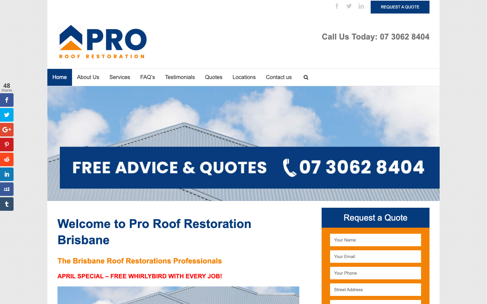

# Pro Roof Restoration Brisbane · 现状审计与重构提议

> **65/100** · low_priority · 行业：roofer · 地区：Brisbane · Google 评价：5★ （17 条）

## 内部分级 · 运营优先看这段

**投入分级：** `C` 批量轻触 — 模板邮件 + 报告 PDF 链接，无主动跟进

**触发依据：**
- C · low_priority · audit 65 · 17 评论 5★ (未达 B 标准)

**下一步行动：** 标准模板邮件 + master.md PDF 链接，无主动跟进。等客户回复触发后再投入。

## 一、店家现状速览

**线索来源 · 联系开场可用**:
- **来源**: Google Places API (官方搜索)
- **搜索关键词**: `roofer brisbane`
- **结果排名**: 第 16 位
- **首次发现**: 2026-05-14
- **Batch**: `places-roofer-brisbane-202605150200`

**审计结论：** audit_score=65 → low_priority · weakest: gbp 28, visual 50

- 电话：(07) 3062 8404
- 地址：Riparian Plaza, 36/71 Eagle St, Brisbane City QLD 4000, Australia
- 网站：[https://www.proroofrestorationbrisbane.com.au/](https://www.proroofrestorationbrisbane.com.au/)

## 二、客户访问时看到的页面

**慢速 4G 加载实景视频**（1.6 Mbps · 150ms 延迟 · 4× CPU 节流，模拟真实手机访客的体验）：

[播放视频](./video/mobile-throttled.webm)

## 三、视觉审计 · Vision LLM 怎么看

> The site clearly shows the business name and phone number, but the dated layout, weak mobile first screen, and distracting visual elements make it feel less current than a professional Brisbane roofing company should.

新鲜度 **3/10** · 信任度 **5/10** · 转化准备度 **5/10** · 设计年代 `outdated`

**值得保留的优点：**
- The business name and phone number are visible near the top on both desktop and mobile.
- The brand colors are consistent enough to reuse in a more restrained redesign.
- There is already a quote action and quote form, so the redesign can improve placement rather than inventing a new contact path.

## 五、当前网站在哪里"漏水"

### 关键问题 · 1 项（立刻在伤害成交）

### 关键 · Mobile first screen lacks roofing proof

**技术事实**

On the mobile screenshot, the first visible area is mostly social icons, a blue 'REQUEST A QUOTE' button, the large PRO logo, phone number, and a grey 'Go to...' navigation bar; no roof photo, completed work, reviews, or service proof is visible before the welcome heading.

**普通话翻译**

手机版打开后，客户先看到的是标志和菜单，但看不到屋顶案例、评价或为什么该找你。

**对客户的影响**

本地找屋顶维修的人很多是在手机上临时比较商家，通常会在前 5-8 秒决定要不要继续看。第一屏没有信任证据，会让一部分来自 Google 商家资料的访客直接返回去点竞争对手。

**正确长啥样**

Mobile should open with a compact header showing logo, tap-to-call button, and a hero area with a real roof restoration photo, a short Brisbane-specific promise, star rating or review count, and one clear quote button visible without scrolling.

**Redesign 怎么改**

Replace the mobile top stack with a 56px sticky header containing logo and phone CTA, then add a first-screen hero with a real completed roof image, headline 'Roof Restoration Brisbane', review/trust line, and two actions: 'Call Now' and 'Get Free Quote'.

### 主要问题 · 7 项（影响转化的明显短板）

### 主要 · homepage_title_clear

**技术事实**

title='### Call Us Today: 07 3062 8404' contains-name=false contains-niche=false

**普通话翻译**

你网站的浏览器标签 title 没把业务名字 + 服务关键词写清楚（比如该写「Pro Roof Restoration Brisbane - roofer Brisbane」，但目前是泛泛一句）。

**对客户的影响**

Google 搜索结果里展示的就是这个 title。写不清楚 = 排名靠后 + 即使排上来客户也不知道是不是匹配的服务。SEO 最便宜的修复，但很多本地企业完全没做。

### 主要 · Floating share bar distracts

**技术事实**

On the desktop screenshot, a vertical social sharing strip sits on the far left edge with '48 Shares' and stacked Facebook, Twitter, Google+, Pinterest, Reddit, LinkedIn, and other icons.

**普通话翻译**

左边那排分享按钮看起来像旧博客插件，和找屋顶工人的需求无关。

**对客户的影响**

客户是来打电话或要报价的，不是来分享页面的。无关按钮越多，注意力越分散，尤其会削弱主要电话和报价按钮的点击。

**正确长啥样**

The page should have no floating share toolbar; trust elements should be focused on reviews, licences, service areas, workmanship guarantees, and contact options.

**Redesign 怎么改**

Remove the floating social share plugin entirely and replace that trust space with visible Google rating, years in business, warranty badge, and Brisbane service-area proof near the hero and quote form.

### 主要 · Hero banner feels dated

**技术事实**

The desktop hero uses a pale roof-and-sky image with a large dark blue rectangle containing all-caps text 'FREE ADVICE & QUOTES' and the phone number in white.

**普通话翻译**

首页大图像一张旧广告横幅，不像现在专业公司的网站。

**对客户的影响**

屋顶工程客单价高，客户会用网站外观判断公司是否靠谱。页面显旧会让客户担心服务也不够专业，从而降低来电和询价。

**正确长啥样**

A current roofer site should use a sharp real project photo, readable live text over a controlled overlay, and a clear hierarchy: service headline, trust proof, phone CTA, and quote CTA.

**Redesign 怎么改**

Replace the image-with-text banner with a high-resolution Brisbane roof restoration project photo and HTML text overlay: 'Roof Restoration Brisbane', 'Free roof inspection and quote', review/trust badge, phone button, and quote button.

### 主要 · Quote form starts too low

**技术事实**

On desktop, the 'Request a Quote' form is visible on the right, but the form fields begin low on the page and are partly cut off at the bottom of the screenshot.

**普通话翻译**

电脑端的报价表单位置偏低，客户第一眼不能完整看到怎么提交。

**对客户的影响**

需要滚动或找入口会减少询价。对于从 Google 点进来的客户，竞争对手只差一个返回按钮，表单越明显越容易拿到线索。

**正确长啥样**

The desktop first screen should show the full quote module or a shorter version with name, phone, suburb, and roof issue visible above the fold, beside clear trust proof.

**Redesign 怎么改**

Move a compact quote form into the hero area or immediately beside it, reduce fields to the essentials, and keep a sticky phone CTA in the header for users who prefer calling.

### 主要 · Mobile menu looks unfinished

**技术事实**

The mobile navigation appears as a thin grey bar with placeholder text 'Go to...' and a separate pale hamburger icon inside a bordered box.

**普通话翻译**

手机菜单像旧模板里的默认控件，显示“Go to...”，不像精心设计过的导航。

**对客户的影响**

手机用户占本地搜索的大部分。菜单看起来不可靠，会让客户减少继续浏览服务、案例和联系方式的意愿。

**正确长啥样**

Mobile navigation should be a clean header with a recognizable menu icon, clear tap targets, and priority actions like Call and Quote always easy to reach.

**Redesign 怎么改**

Replace the 'Go to...' select-style menu with a modern sticky mobile header: logo left, phone icon button, quote button, and a hamburger opening a full-screen menu with Services, Reviews, Areas, and Contact.

### 主要 · Trust proof is missing early

**技术事实**

In both screenshots, the visible top sections show logo, phone number, navigation, welcome text, and promotional copy, but no star rating, customer review snippet, licence, warranty, insurance, or completed project proof is visible.

**普通话翻译**

页面前面没有马上展示评价、保障、保险、资质或真实案例。

**对客户的影响**

屋顶服务不是小消费，客户通常会先看别人是否信任你。缺少评价和保障，会让来自 Google 商家资料的流量更容易流失到证据更充分的同行。

**正确长啥样**

Above the fold should include a Google rating badge, review count or testimonial snippet, warranty/insurance/licence indicators, and at least one real before-and-after roof image.

**Redesign 怎么改**

Add a trust strip directly under the hero headline with Google rating, number of local jobs or years in business if available, warranty badge, insured/licensed badge, and a small review quote.

### 主要 · Too many competing calls to action

**技术事实**

Desktop shows a top-right 'REQUEST A QUOTE' button, a large phone number in the header, a hero banner phone number, navigation links, search icon, and a separate quote form all competing in the same first page area.

**普通话翻译**

页面同时出现很多电话和报价入口，视觉上有点乱。

**对客户的影响**

客户选择越多，反而越容易犹豫。把主要动作固定成“打电话”和“获取免费报价”，可以减少流失，让访客更快行动。

**正确长啥样**

The page should have one dominant phone action and one quote action, repeated consistently with the same labels, colors, and placement.

**Redesign 怎么改**

Create a simpler action system: sticky header with 'Call 07 3062 8404' and 'Get Free Quote', hero repeats the same two actions, and remove duplicate phone graphics inside static images.

## 六、Redesign 的发力点（综合视觉 + 评论数据）

1. [视觉] 1. Rebuild the mobile first screen around tap-to-call, quote CTA, real roof imagery, and immediate trust proof.
2. [视觉] 2. Replace the dated desktop hero and floating share bar with a high-quality project photo, concise service headline, review proof, and clear actions.
3. [视觉] 3. Simplify the quote journey with fewer fields, consistent CTA styling, and visible Google reviews, warranty, and local Brisbane credibility.

## 真实速度数据 · Google PageSpeed Insights

我们前面那段「慢速 4G 加载视频」是我们这边的实验室结果。这一段是 **Google 自己**对你网站打的分，包括过去 28 天 **真实访客**的网络体验数据（CRUX field data）。

### 移动端（mobile）

**Lighthouse 分数（实验室）：**

| 维度 | 分数 |
|---|---|
| 性能 (Performance) | **58/100** |
| 可访问性 (Accessibility) | 71/100 |
| 最佳实践 (Best Practices) | 92/100 |
| SEO | 92/100 |

**Lab 关键指标：** LCP `8.7s` · FCP `1.7s` · CLS `0.073` · TBT `416ms`

**Google 建议的优化项（按节省时间排序，前 2）：**

- **Reduce unused JavaScript** — 节省 2430ms · 节省 445KB
- **Reduce unused CSS** — 节省 510ms · 节省 78KB

## 图片优化与第三方脚本体重

PSI 给的是宏观分数，下面是具体可改的两块：图片格式与 tracker 脚本。

### 图片优化（共 29 张）

- **优化率：** 0%（0/29 使用 WebP/AVIF/SVG）
- **响应式 srcset：** 0%
- **Lazy load：** 0%
- **Alt 文字（非空）：** 100%
- **显式 width/height：** 59%（防止 CLS 布局抖动）

**总评：** 基本未优化 — redesign 可显著降低图片下载量

**具体问题：**
- [major] 29 张图几乎全是 JPG/PNG，未用 WebP/AVIF — 估算可节省 30-50% 图片下载量
- [minor] 29/29 张图无响应式 srcset — 移动端浪费带宽
- [minor] 29/29 张图未 lazy load — 首屏外的图阻塞主线程

### 第三方脚本占用情况

- **总请求数：** 49（29 自有 + 20 第三方）
- **第三方占总下载量：** 74%（742 KB / 1000 KB）
- **Tracker 脚本数：** 3（合计 313 KB）

**已识别的 tracker：**

| 工具 | 类型 | 请求数 | 字节 |
|---|---|---|---|
| Google Tag Manager | analytics | 2 | 312.6 KB |
| Google Analytics | analytics | 1 | 0.0 KB |

> **观察：** 3 个 tracker 合计加载了 313 KB —— 这些都是阻塞主线程的脚本，是性能 + 隐私双角度的销售切入点。redesign 时可以建议清理不再使用的 tracker。

## SEO 迁移评估 与 运营活跃度

客户最常担心的问题：「我重做网站，会不会丢掉 Google 排名？」这一段直接回答。

### 现有页面盘点

- **Sitemap 状态：** 已检测到 → `https://www.proroofrestorationbrisbane.com.au/sitemap.xml`
- **页面总数：** 29
- **迁移复杂度：** 中（≤80 页 — 服务页 + 部分 blog）

**页面分类：**

| 类型 | 数量 |
|---|---|
| 服务详情页 | 11 |
| service_area_page | 7 |
| 顶层页面 | 3 |
| 联系 / 报价 | 2 |
| 法律 / 隐私 | 2 |
| 首页 | 1 |
| FAQ | 1 |
| 客户评价 | 1 |
| 关于 / 团队 | 1 |

**Sitemap lastmod 跨度：** 最旧 2022-07-18 → 最新 2026-04-13

**Redirect 计划承诺：** redesign 上线时我们会附一份 29 条 1:1 redirect 表（旧 URL → 新 URL），保证 Google 已经索引的页面权重无损迁移。已经在 Google 第一二页的关键词不会丢。

### SEO 长尾结构（服务 × 区域 = 本地搜索流量金矿）

- **服务专项页（如 /metal-roofing/）：** 11 个
- **区域页（如 /service-areas/brisbane/）：** 0 个
- **服务×区域组合页（如 /metal-roofing-brisbane/）：** 7 个

**长尾覆盖：** 强 — 已有 5+ 服务×区域页，长尾流量基础在

**现有服务页样本：** `/diy-roof-restoration-tips/` · `/is-roof-restoration-worth-it/` · `/signs-you-need-a-roof-restoration-or-repair/` · `/how-long-does-a-roof-last/` · `/roof-restoration-vs-roof-repairs/`

**现有服务×区域页样本：** `/pro-roof-restoration-brisbane-winter-specials/` · `/welcome-to-pro-roof-restoration-brisbane/` · `/roof-restoration-brisbane-guide/` · `/services-locations/` · `/roof-restoration-brisbane-northside/`

### 运营活跃度

- **整体活跃度：** 活跃（30 天内有更新） （最近一次更新 0 天前）
- **Blog 板块：** 未发现 — 没有内容营销基础
- **社交媒体链接：** 网站上引用了 6 个平台 — facebook, instagram, linkedin, twitter, youtube, pinterest

## 联系表单与防垃圾设置

客户能不能 *方便地* 把信息留下来 = 直接的转化路径。这一段审视所有 `<form>` 元素的可用性 + 防 spam 配置。

### 表单 · 8 字段（摩擦：高（≥7 字段，会显著降低转化））

- **字段构成：** yourname(text) · email(email) · phone(text) · street(text) · suburb(text) · services(select-one) · project(textarea) · captcha-170(text)
- **必填字段数：** 0/8
- **常见关键字段：** email · phone · message
- **提交按钮：** 「SUBMIT」
- **Honeypot 防 spam：** 未检测到

**未检测到任何 anti-spam 措施**（reCAPTCHA / hCaptcha / Turnstile / honeypot 都没有）— 表单极容易被自动机器人灌爆，垃圾询盘会让客户对真实询盘麻木。redesign 时建议加 Cloudflare Turnstile（不可见，免费）。

**Audit 总结：**

- [关键] 表单字段数 8 — 远超行业标准 3-4 字段，会显著降低转化率
- [中等] 表单未检测到任何 anti-spam 措施（reCAPTCHA / hCaptcha / Turnstile / honeypot 都没有）— 高 spam 风险

## 域名历史与邮件信誉

### 邮件 DNS 配置（影响未来邮件营销 / 冷邮件投递率）

- **SPF (反垃圾发件验证)：** 已配置
- **DKIM (邮件签名)：** 已配置（selectors: default）
- **DMARC (策略)：** ⚠ 未配置 — 域名易被仿冒做钓鱼
- **整体邮件投递信誉：** `partial` (只有 2/3 — 建议补全)

> 这是后续 **「Social Media Management 月度包」** 或 **「Cold Outreach 启动包」** 的前置条件 —— 邮件 DNS 没修好，发出去的邮件全进垃圾箱。redesign 时一并处理。

## 技术栈与营销基建

从网站源码识别出来的工具，能帮我们判断这位客户的数字成熟度。

- **网站平台 (CMS)：** WordPress（迁移复杂度参考；WordPress / Wix / Squarespace 这类有标准导出工具，custom-coded 会复杂）
- **分析工具：** Google Analytics 4 · Google Analytics (Universal)
- **广告 Pixel：** 未检测到 — 暂未投放追踪型广告

**数字成熟度打分：** 2 / 6 （中 — 已有基础设施，缺少深度运营）

### Redesign 时必须保留 / 重新安装的追踪代码

客户可能有数月 / 数年的历史数据 + 广告投放受众 sit 在这些 ID 上面。重做时**必须用同一套 ID 重新接进新网站**，否则等于清零所有累积。

- Google Analytics 4
- Google Analytics (Universal)

我们 redesign 交付清单会把这些列为「必须 setup 项」。

> **关键发现：客户网站还装着 Universal Analytics**，这套工具 Google 已于 2023 年 7 月停止收集数据。也就是说，**他们至少 2 年没有看过任何真实的网站访客数据**。这是销售切入的强角度。

## 信任凭证 · generic

本地服务的客户在掏钱之前会查这些凭证。缺失 = 客户跳到下一家。

**信任分：** 40/100

### 已显示的（3 项）

- **保险** (15 分) — "Public Liability"
- **行业证书** (15 分) — "licensed"
- **免费报价** (10 分) — "Free Quote"

### 缺失的（4 项 — redesign 必补 / 提醒客户提供素材）

- [行业惯例] **ABN** (20 分)
- [行业惯例] **从业年限** (15 分)
- [行业惯例] **保修** (15 分)
- [行业惯例] **荣誉 / 奖项** (10 分)

## AI 时代可发现性 · GEO Readiness

GEO = Generative Engine Optimization。ChatGPT、Perplexity、Google AI Overviews 这些 AI 搜索产品**不像传统搜索引擎那样按"关键词排名"工作**，它们直接抓取结构化数据并把答案合成给用户。如果你的网站在 AI 抓取这一块做得不到位，等于在生成式搜索时代隐身。

**AI 可发现性总分：** 40 / 100 — AI agent 抓取部分支持，但关键 schema / 凭证 / FAQ 缺失

### 已经做到的（4 项）

- [PASS] `localbusiness_schema` — LocalBusiness JSON-LD present
- [PASS] `eeat_business_credentials` — 3/4 credentials in copy: license/QBCC, years-in-business, insurance
- [PASS] `eeat_warranty_trust` — warranty/guarantee mentioned
- [PASS] `jsonld_at_least_one` — 3 JSON-LD block(s) detected on page

### 还缺的（8 项 — 这些是 redesign 时一并补上的标准动作）

- [缺失] `llms_txt_present` (5 分) — no /llms.txt at standard path
- [缺失] `ai_bot_robots_policy` (5 分) — robots.txt has no explicit policy for AI crawlers (GPTBot/ClaudeBot/etc)
- [缺失] `service_schema` (10 分) — no Service JSON-LD
- [缺失] `faqpage_schema` (10 分) — no FAQPage JSON-LD (loses AI Overview / featured snippet eligibility)
- [缺失] `aggregaterating_schema` (5 分) — no AggregateRating JSON-LD (★ rating not shown in search snippets)
- [缺失] `breadcrumb_schema` (5 分) — no BreadcrumbList JSON-LD
- [缺失] `semantic_landmarks` (10 分) — 3 semantic landmarks present: <nav, <header, <footer
- [缺失] `faq_qa_pattern` (10 分) — 1 question-style heading(s) found (Q&A format helps AI extraction)

> **销售切入：** 「ChatGPT 现在每月 30 亿次搜索，本地服务用户问『Brisbane 哪家屋顶公司靠谱』，AI 回答时只引用结构化数据完整的网站。你目前在这个新阵地的得分是 40/100。」

## 业务规模信号 · 内部筛选用

**注：这一段只给运营内部看，不进入客户报告。** 用来判断这个 lead 是不是匹配我们「小网站 / 多批量 / 快上线」的产品定位。

- **规模信号汇总：** 小型客户特征
- **客户分级：** `small` — 小型，符合我们标准产品包定位

> 报价以上方 **建议报价** 为准（来自 entity.grade.recommended_pricing / PRODUCT_TIER_TABLE）。本段只用来判断 lead 是否匹配产品定位，不竞争报价。

**触发依据：**
- 已部署 2 个追踪工具
- 引用 6 个社交平台（多渠道运营）

## Upsell 机会 · redesign 之外的月度营收

redesign 是一次性收入。以下是基于这个客户当前现状自动识别的**持续性服务包**机会，可以在 redesign 提案签字时一并捆绑进去。

### 内容写作月度包（Blog / 案例 / SEO 长尾）

**触发依据：** 网站没有 blog 板块 — 没有内容营销基础设施，长尾 SEO 流量为零。

**包内容：** 每月 2 篇 SEO-optimized blog（800-1,200 字）+ 每季度 1 篇 case study（含 before/after 图）+ 关键词研究报告。

**月度费用区间：** $400-800/月

**销售切入：** 「ChatGPT 时代搜索引擎更偏爱有「专家深度内容」的网站。你目前的网站只有服务介绍页 — AI 可引用的素材几乎为零。」

<!-- M2-D6 required token bridge: 现网站快速诊断 → covered by detail-builder section -->
<!-- 现网站快速诊断 -->

<!-- M2-D6 required token bridge: 业主沟通要点 → covered by detail-builder section -->
<!-- 业主沟通要点 -->

<!-- M2-D6 required token bridge: 账户与档案 → covered by detail-builder section -->
<!-- 账户与档案 -->

## 附录 · 数据出处

- Cheap audit version: `-`
- Detailed audit version: `2026-05-11-v1`
- Vision model: `codex_cli`
- Review source: `Google Places · most_relevant (max 5)`
- 完整 audit 报告 HTML：[internal-audit-report](./internal-audit-report.html)
