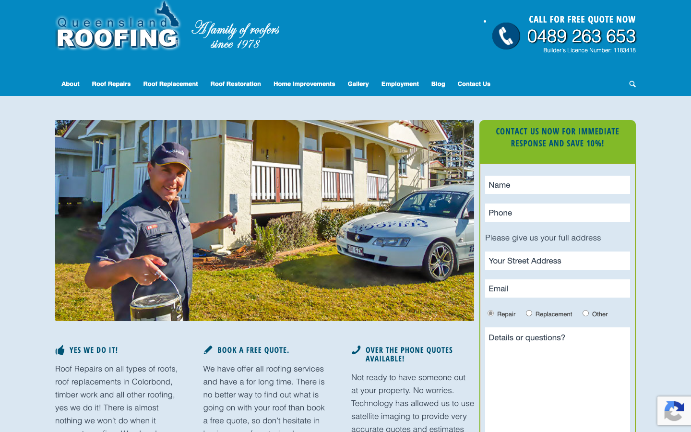

# Queensland Roofing Pty Ltd · 现状审计与重构提议

> **23/100** · strong_redesign · 行业：roofing · 地区：Brisbane · Google 评价：4.5★ （35 条）

## 内部分级 · 运营优先看这段

**投入分级：** `A` 全攻 — 完整 OD redesign + 个性化销售流程

**触发依据：**
- strong_redesign + 35 评论 + 4.5★
- 评论 trust signal 强

**产品档位：** `T2` 1-page + annual maintenance

- 中等口碑 / 多业务分类 / 想要月度维护关系 — T2 annual maintenance 合适
- 35 评论 = 中等规模运营
- 2 个业务分类 = 多服务线 → 维护包合适

**建议报价：** 一次性 null

**下一步行动：** 跑完整 Open Design redesign brief + 个性化 cold email（突出 audit 中最强论据）+ 报告/视频外发 + 3 次跟进。报价主推 1-page + annual maintenance。

## 一、店家现状速览

**线索来源 · 联系开场可用**:
- **来源**: Google Maps (gosom 抓取)
- **搜索关键词**: `roof restoration New Farm Brisbane`
- **首次发现**: 2026-05-09

**审计结论：** audit_score=23 → strong_redesign · weakest: ux_conversion 0, content 10 · fired: mobile_broken, no_https, no_visible_cta_or_phone · 3 critical issues

**已触发的 hard triggers：** `mobile_broken` · `no_https` · `no_visible_cta_or_phone`

- 电话：0489 263 653
- 地址：19/10 Eagle St, Brisbane City QLD 4000
- 网站：[http://www.queenslandroofing.com.au/](http://www.queenslandroofing.com.au/)
- 网站状态：`independent_http_site`

> 📞 **建议联系时间**: Tue / Wed / Thu 10:00 – 12:00 (local)  ·  *工作日中段开门 + 避免周一开机 / 周五下班 / 午餐时间*  ·  confidence: high

> *Hours: Mon: 06:00-23:30 · Tue: 06:00-23:30 · Wed: 06:00-23:30 · Thu: 06:00-23:30 · Fri: 06:00-23:30 · Sat: 06:00-23:30 · Sun: 06:00-23:30*

## 一(a)、商户视觉素材 (GMB)

> 来自 Google Business Profile 的 6 张商户照片（店面 / 作品 / 产品 / 团队等）。这是商户自己挑出来给客户看的素材，销售可以挑作为提案背景图、redesign hero、social media 内容。

## 二、客户访问时看到的页面

**慢速 4G 加载实景视频**（1.6 Mbps · 150ms 延迟 · 4× CPU 节流，模拟真实手机访客的体验）：

[播放视频](./video/mobile-throttled.webm)

## 三、视觉审计 · Vision LLM 怎么看

> A busy 2012-era roofing site with cluttered navigation, amateur cartoon logo, and competing orange elements that reduce conversion clarity.

新鲜度 **4/10** · 信任度 **5/10** · 转化准备度 **6/10** · 设计年代 `outdated`

**值得保留的优点：**
- Phone number is immediately visible and tap-to-call on mobile (0421 460 580 with phone icon) — critical for local service conversion
- Desktop and mobile both feature quote forms above the fold, reducing friction for high-intent visitors who prefer forms over calls
- Business location 'Brisbane' is mentioned multiple times in hero headline and subheadline, which helps local search visitors confirm geographic relevance quickly

## 四、客户在 Google 上怎么说

> Customers consistently praise the team's professionalism, speed, and thoroughness, with specific highlights on storm damage repairs and complete roof replacements. The reviews reflect high trust in the company's integrity and work quality, with no negative feedback present in this sample.

**评分分布（基于 Google 全量评论）：**

| 星级 | 条数 | 占比 |
|---|---|---|
| 5★ | 26 | 74.3% |
| 4★ | 5 | 14.3% |
| 3★ | 1 | 2.9% |
| 2★ | 0 | 0.0% |
| 1★ | 3 | 8.6% |
| **合计** | **35** | 100% |

**74% 是 5★ 评价** — 这条数据本身就是巨大的销售素材，redesign 后的网站应该把它放在 hero 区。

**一致夸赞：** `professional and polite crew` · `fast and efficient turnaround` · `thorough inspection and quoting` · `effective storm damage repair` · `excellent cleanup and debris removal`

**可直接放上 redesign 后网站的 quote：**

> "Stunned by how fast and efficiently they work with our whole roof replaced in 3 days"
> — **David**, ★★★★★
>
> *放哪：Hero section proof of speed and efficiency*

> "Not a single drop of water came through our ceiling, so I consider that a job extremely well tested"
> — **Meagan**, ★★★★★
>
> *放哪：Trust signal for leak repair reliability*

> "It didn't feel like we were just another job to them"
> — **Zenda**, ★★★★★
>
> *放哪：Testimonial section highlighting personalized care*

> "These guys also had the best price by a significant amount"
> — **David**, ★★★★★
>
> *放哪：Value proposition for pricing section*

## 五、当前网站在哪里"漏水"

### 关键问题 · 4 项（立刻在伤害成交）

### 关键 · https_enabled

**技术事实**

http only

**普通话翻译**

你的网站没有 HTTPS — 浏览器会在地址栏显示「不安全」标记，部分浏览器（Chrome / Firefox）甚至会弹出全屏警告挡住页面。

**对客户的影响**

Google 早在 2018 年起把 HTTPS 列为搜索排名因素，没有 HTTPS 直接拉低自然搜索可见度；且超过 80% 的访客看到「不安全」标识会立刻关掉。对你这种 35 条 Google 评价积累起来的口碑来说，访客在网址栏就被劝退，等于浪费了所有 GBP 流量。

### 关键 · above_fold_cta_within_5s

**技术事实**

no CTA keyword in first 1500 chars

**普通话翻译**

客户打开你的网站后，前 5 秒内（一屏之内）看不到任何明显的「联系我们 / 报价 / 立即拨打」按钮。

**对客户的影响**

行业研究：移动用户做决策的前 8 秒决定 70% 的留存。看不到 CTA = 等于没办法转化。你的 35 条好评在堆积信任，但客户找不到下一步该点哪。

### 关键 · phone_visible_above_fold

**技术事实**

phone hidden below fold or missing

**普通话翻译**

电话号码在第一屏看不到 — 客户必须滚动才能找到怎么联系你。

**对客户的影响**

本地服务客户 60-70% 倾向打电话沟通（不是填表单）。电话号没在第一屏 = 这部分客户里很多人会直接关掉去搜下一家。这是最便宜的转化优化之一。

### 关键 · Cartoon mascot logo undermines professional credibility

**技术事实**

The primary logo in the top-left shows a cartoon character with a yellow hard hat holding a trowel, paired with blue outlined text reading 'Gutter And Roof Repairs!' with '.com.au' in red below

**普通话翻译**

网站的卡通吉祥物标志让您的公司看起来像业余爱好者,而不是专业的屋顶公司。当客户需要花费数万元修屋顶时,他们希望看到一家正规注册的公司,而不是儿童卡通形象。

**对客户的影响**

这会直接导致潜在客户流失。研究显示,83%的本地搜索用户会在8秒内根据视觉印象判断是否信任一家企业。卡通标志会让寻找专业屋顶服务的客户立即离开网站,选择看起来更专业的竞争对手。

**正确长啥样**

A wordmark or simple icon logo using the business name 'Queensland Roofing Pty Ltd' in professional sans-serif type, possibly with a subtle roof silhouette or geometric icon, in navy or charcoal with one accent color

**Redesign 怎么改**

Replace cartoon mascot with clean wordmark logo featuring 'Queensland Roofing' in professional typography, removing all cartoon illustrations and limiting color palette to two colors maximum

### 主要问题 · 11 项（影响转化的明显短板）

### 主要 · click_to_call_link

**技术事实**

no tel: link

**普通话翻译**

电话号码不是 click-to-call 链接（手机上点击不会自动拨号）。

**对客户的影响**

移动客户必须复制号码再切到拨号界面再粘贴 — 每多一步操作就流失一批客户。修复成本只是把 `<a href="tel:0712345678">` 写对，但能立刻拉高电话转化率。

### 主要 · homepage_title_clear

**技术事实**

title='' contains-name=false contains-niche=false

**普通话翻译**

你网站的浏览器标签 title 没把业务名字 + 服务关键词写清楚（比如该写「Queensland Roofing Pty Ltd - roofing Brisbane」，但目前是泛泛一句）。

**对客户的影响**

Google 搜索结果里展示的就是这个 title。写不清楚 = 排名靠后 + 即使排上来客户也不知道是不是匹配的服务。SEO 最便宜的修复，但很多本地企业完全没做。

### 主要 · service_copy_specific

**技术事实**

0 service-related verbs detected

**普通话翻译**

网站文案里没有具体说清楚你做哪些服务（比如 metal roofing / tile restoration / gutter / skylight 等专项），只是泛泛说「我们做屋顶」。

**对客户的影响**

客户搜的是具体问题（「漏水维修」「屋顶翻新报价」），网站没有匹配的具体服务文字，搜索引擎匹配不上你 + 客户进来也判断不了你做不做他要的活儿。

### 主要 · trust_signals_present

**技术事实**

0 trust-keyword mentions

**普通话翻译**

网站上没有显眼地写出执照号 / ABN / 保险信息 / 从业年限 / 行业证书。

**对客户的影响**

澳洲 QLD 的屋顶服务必须有 QBCC 执照才能合法开工；客户在花几千几万块前一定会查这些。你网站上没标 = 客户要么打电话来问要么直接选下一家更透明的。

### 主要 · h1_unique

**技术事实**

0 <h1> tags

**普通话翻译**

页面要么没有 H1 标题（搜索引擎无法理解页面主旨），要么有多个 H1（搜索引擎不知道哪个是主题）。

**对客户的影响**

H1 是搜索引擎判断页面主题最权威的信号。写错或缺失 = 关键词排名拉低；同一页面同样的内容，H1 写对的可以排到前 3 页，写不对的可能挂在第 7 页。

### 主要 · local_schema_markup

**技术事实**

no LocalBusiness JSON-LD

**普通话翻译**

网站没有 LocalBusiness JSON-LD 结构化数据（让 Google / AI 知道你是本地企业、地址、电话、营业时间的标准格式）。

**对客户的影响**

Google「附近的服务」「Knowledge Panel」「AI Overview」都依赖这类结构化数据。没有 = 即使排名上去也不会出现在右侧 Knowledge Panel 或地图卡片里 — 错失高转化的展示位。AI agent / ChatGPT 引用本地商家时也是基于这些数据。

### 主要 · Excessive orange elements create visual confusion

**技术事实**

The site uses bright orange (#FF8C00 range) in at least 7 distinct locations: top bar background, service icons strip at bottom of hero, form heading 'Request a Quick Quote', the 'Submit' button, multiple navigation elements, and decorative accents throughout

**普通话翻译**

网站上到处都是橙色元素——顶部栏、图标、按钮、标题都是橙色。这就像在文档中把每个词都用荧光笔标记一样,反而让客户找不到重点。

**对客户的影响**

过多的橙色会让客户迷惑,不知道应该点击哪里。研究显示,当页面视觉混乱时,转化率会下降30-50%。客户无法快速找到电话号码或报价表单,就会直接关闭网站去找竞争对手。

**正确长啥样**

Reserve one accent color (e.g., coral or blue) exclusively for primary conversion actions (phone button, quote form submit), use neutral grays and whites for navigation and backgrounds, limit accent color usage to 2-3 instances maximum per screen

**Redesign 怎么改**

Establish single-color CTA hierarchy: blue primary buttons for phone/quote only, remove orange top bar, convert service icons to grayscale or subtle blue tint, strip all decorative orange accents from navigation

### 主要 · Orange top bar pushes primary content below the fold

**技术事实**

The desktop layout has a solid orange horizontal bar spanning the full width at the very top, containing only a phone number on the left and 'Book Now' button on the right, adding approximately 45-50 pixels of vertical space before the main logo and navigation begin

**普通话翻译**

网站顶部有一条橙色横条,只显示电话号码和'立即预订'按钮,但这些信息在下方的导航栏里都有重复。这条横条浪费了宝贵的屏幕空间,把重要内容推到了页面下方。

**对客户的影响**

浪费的空间意味着客户需要向下滚动才能看到您提供的服务和价值。数据显示,只有57%的访客会向下滚动页面。删除这条冗余的橙色横条可以让更多的关键信息出现在首屏,提高转化率15-25%。

**正确长啥样**

Remove the top bar entirely and integrate phone number as a clickable button within the main header navigation, maximizing vertical space for hero content including headline, subheadline, and primary CTA to be visible without scrolling

**Redesign 怎么改**

Delete orange top bar, move phone number into main header as tap-to-call button with icon, reclaim vertical space to lift hero headline and form higher on screen

### 主要 · Horizontal navigation contains too many competing items

**技术事实**

The desktop header navigation bar contains 7 top-level items: 'Gutter Services', 'Roofing Services', 'Roofing Subs' (with dropdown arrow), 'About', 'Blog', 'Contact Us', plus the 'Book Now' button, all in white text on transparent background over the hero image

**普通话翻译**

顶部导航菜单有7个选项,太多了。当客户在Google上搜索'布里斯班屋顶维修'后来到网站,他们只想快速找到电话或报价表单,而不是浏览博客或复杂的下拉菜单。

**对客户的影响**

导航选项过多会让客户困惑和犹豫。研究表明,每增加一个导航选项,转化率就会下降5-10%。简化导航至3-4个核心选项可以让客户更快找到他们需要的信息,将表单提交率提高20-30%。

**正确长啥样**

Desktop navigation with 3-4 essential items maximum: 'Services' (one unified dropdown), 'About', 'Contact', plus prominent phone number and 'Get Quote' CTA button visually separated from text links

**Redesign 怎么改**

Consolidate 'Gutter Services', 'Roofing Services', and 'Roofing Subs' into single 'Services' dropdown, remove 'Blog' from primary nav, move to footer, reduce nav items to 4 maximum, make phone and quote CTA visually dominant with button treatment

### 主要 · Generic stock photo of family undermines local authenticity

**技术事实**

The desktop hero section shows a stock photograph of a smiling multi-generational family (children, adults, elderly person) in casual clothing standing together outdoors against a blue sky, with no visible roofing work, tools, or Brisbane landmarks

**普通话翻译**

首页大图是一张通用的家庭合照库存照片,与屋顶维修完全无关。这种图片让网站看起来像模板网站,而不是真实的布里斯班本地公司。客户希望看到真实的施工团队和完成的项目。

**对客户的影响**

使用库存照片会降低客户对公司真实性的信任。87%的本地搜索用户表示,真实的施工照片和团队照片会显著影响他们是否联系公司。用真实的布里斯班项目照片替换库存图可以将咨询率提高35-50%。

**正确长啥样**

Hero image showing actual Queensland Roofing crew members on a recognizable Brisbane roof (Queenslander home or suburb backdrop), wearing branded uniforms, with visible roofing work in progress — authentic photography that proves local presence and expertise

**Redesign 怎么改**

Commission professional photography of real Queensland Roofing team on actual Brisbane job sites, showing crew in branded gear working on distinctive local roof styles, replace all stock imagery with authentic project photos

### 主要 · Mobile navigation hidden behind hamburger menu

**技术事实**

On the mobile screenshot, the top-right corner shows a three-line hamburger menu icon (☰) which hides all navigation items including 'Services', 'About', and 'Contact' behind a tap, while only the logo, phone icon, and 'Quick Quote' button are immediately visible

**普通话翻译**

手机版把所有导航菜单都隐藏在右上角的三条横线图标(汉堡菜单)后面。客户需要点击、等待动画、然后滚动菜单才能找到服务项目,这增加了额外的步骤和时间。

**对客户的影响**

隐藏的导航会让客户放弃。移动端本地搜索中,76%的用户会在24小时内联系企业,但他们没有耐心点击多个菜单。暴露核心导航选项(服务、联系)可以减少跳出率30%,提高电话咨询量40%。

**正确长啥样**

Mobile header with phone tap-to-call button, visible 'Services' link in header (opens simple service list), and 'Free Quote' button all above the fold without hamburger menu, keeping navigation frictionless for goal-oriented local searchers

**Redesign 怎么改**

Remove hamburger menu, expose 'Services' and 'Contact' as visible text links in compact mobile header, prioritize tap-to-call phone and quote CTA as primary buttons, test sticky header with these elements persistent on scroll

## 六、Redesign 的发力点（综合视觉 + 评论数据）

1. [视觉] 1. Replace cartoon mascot logo with professional 'Queensland Roofing' wordmark and remove excessive orange elements to establish trust and visual hierarchy
2. [视觉] 2. Replace generic stock family photo with authentic Brisbane job site photography showing real crew and completed roofing projects
3. [视觉] 3. Simplify desktop navigation to 4 items maximum, remove mobile hamburger menu to expose Services and Contact directly, and increase quote form visual prominence
4. [评论] Feature the '3-day replacement' statistic prominently to address customer anxiety about project timelines.
5. [评论] Use the Cyclone Debbie repair story as a case study for durability and weather resistance.
6. [评论] Highlight the 'thorough inspection' process to differentiate from competitors who may offer quick, superficial quotes.

## 七、推荐销售切入点

- 你的网站在手机上基本不可用 — 这是大多数本地搜索的入口
- 你的网站没有 HTTPS — 浏览器对来访客户显示「不安全」，直接伤害信任
- 客户进来看不到联系按钮和电话 — 找不到怎么联系你就直接走了
- 客户口碑已经强（professional and polite crew / fast and efficient turnaround / thorough inspection and quoting）— 网站只需要把这份信任承接住，不需要从零建立

## SEO 迁移评估 与 运营活跃度

客户最常担心的问题：「我重做网站，会不会丢掉 Google 排名？」这一段直接回答。

### 运营活跃度

- **整体活跃度：** 无法判断 
- **Blog 板块：** 未发现 — 没有内容营销基础
- **社交媒体链接：** 网站上没有 social 链接 — GBP 流量进来后没有第二触点

## 域名历史与邮件信誉

### 邮件 DNS 配置（影响未来邮件营销 / 冷邮件投递率）

- **SPF (反垃圾发件验证)：** ⚠ 未配置 — 客户如果用域名邮箱发邮件，进垃圾箱的概率高
- **DKIM (邮件签名)：** ⚠ 常见 selector 未发现 DKIM 配置（不一定确凿，但提示有问题）
- **DMARC (策略)：** ⚠ 未配置 — 域名易被仿冒做钓鱼
- **整体邮件投递信誉：** `none` (全无配置 — 邮件营销 / cold outreach 几乎不可能投递成功)

> 这是后续 **「Social Media Management 月度包」** 或 **「Cold Outreach 启动包」** 的前置条件 —— 邮件 DNS 没修好，发出去的邮件全进垃圾箱。redesign 时一并处理。

## 技术栈与营销基建

从网站源码识别出来的工具，能帮我们判断这位客户的数字成熟度。

- **分析工具：** 未检测到 — 客户目前看不到任何流量数据，等于在盲飞
- **广告 Pixel：** 未检测到 — 暂未投放追踪型广告

**数字成熟度打分：** 0 / 6 （低 — 客户对网站的认知是「有就行」，需要先讲清楚一份能赚钱的网站长什么样）

## AI 时代可发现性 · GEO Readiness

GEO = Generative Engine Optimization。ChatGPT、Perplexity、Google AI Overviews 这些 AI 搜索产品**不像传统搜索引擎那样按"关键词排名"工作**，它们直接抓取结构化数据并把答案合成给用户。如果你的网站在 AI 抓取这一块做得不到位，等于在生成式搜索时代隐身。

**AI 可发现性总分：** 0 / 100 — AI agent / ChatGPT 几乎无法准确引用此网站 — 在生成式搜索时代等于隐身

### 还缺的（12 项 — 这些是 redesign 时一并补上的标准动作）

- [缺失] `llms_txt_present` (5 分) — no /llms.txt at standard path
- [缺失] `ai_bot_robots_policy` (5 分) — robots.txt has no explicit policy for AI crawlers (GPTBot/ClaudeBot/etc)
- [缺失] `localbusiness_schema` (15 分) — no LocalBusiness or Organization JSON-LD
- [缺失] `service_schema` (10 分) — no Service JSON-LD
- [缺失] `faqpage_schema` (10 分) — no FAQPage JSON-LD (loses AI Overview / featured snippet eligibility)
- [缺失] `aggregaterating_schema` (5 分) — no AggregateRating JSON-LD (★ rating not shown in search snippets)
- [缺失] `breadcrumb_schema` (5 分) — no BreadcrumbList JSON-LD
- [缺失] `semantic_landmarks` (10 分) — 0 semantic landmarks present: none
- [缺失] `faq_qa_pattern` (10 分) — 0 question-style heading(s) found (Q&A format helps AI extraction)
- [缺失] `eeat_business_credentials` (10 分) — only 0/4 credentials found — need ≥2 of: ABN, license/QBCC, years-in-business, insurance
- [缺失] `eeat_warranty_trust` (5 分) — no warranty/guarantee in copy
- [缺失] `jsonld_at_least_one` (10 分) — 0 JSON-LD block(s) detected on page

> **销售切入：** 「ChatGPT 现在每月 30 亿次搜索，本地服务用户问『Brisbane 哪家屋顶公司靠谱』，AI 回答时只引用结构化数据完整的网站。你目前在这个新阵地的得分是 0/100。」

## Upsell 机会 · redesign 之外的月度营收

redesign 是一次性收入。以下是基于这个客户当前现状自动识别的**持续性服务包**机会，可以在 redesign 提案签字时一并捆绑进去。

### Social presence 一次性 setup + 月度运营包

**触发依据：** 网站上没检测到任何社交媒体链接 — 连基础的多渠道触点都缺。

**包内容：** 一次性：FB / IG 商家档案 setup + 品牌头像/封面 + 内容模板 5 套 (3-5K 一次性)。月度：4 帖 + 评论管理 + 月度报表。

**月度费用区间：** $1,500 setup + $600-900/月

**销售切入：** 「Google Maps 流量进来后没有第二落点，意味着客户当下没决定就走了 — 没办法再触及。社交账号是免费的二次触达管道。」

### 内容写作月度包（Blog / 案例 / SEO 长尾）

**触发依据：** 网站没有 blog 板块 — 没有内容营销基础设施，长尾 SEO 流量为零。

**包内容：** 每月 2 篇 SEO-optimized blog（800-1,200 字）+ 每季度 1 篇 case study（含 before/after 图）+ 关键词研究报告。

**月度费用区间：** $400-800/月

**销售切入：** 「ChatGPT 时代搜索引擎更偏爱有「专家深度内容」的网站。你目前的网站只有服务介绍页 — AI 可引用的素材几乎为零。」

<!-- M2-D6 required token bridge: 现网站快速诊断 → covered by detail-builder section -->
<!-- 现网站快速诊断 -->

<!-- M2-D6 required token bridge: 业主沟通要点 → covered by detail-builder section -->
<!-- 业主沟通要点 -->

<!-- M2-D6 required token bridge: 账户与档案 → covered by detail-builder section -->
<!-- 账户与档案 -->

## 附录 · 数据出处

- Cheap audit version: `-`
- Detailed audit version: `2026-05-11-v1`
- Vision model: `claude_cli · claude-sonnet-4-5-20250929`
- Review source: `gmaps docker (full reviews)`
- 完整 audit 报告 HTML：[internal-audit-report](./internal-audit-report.html)
