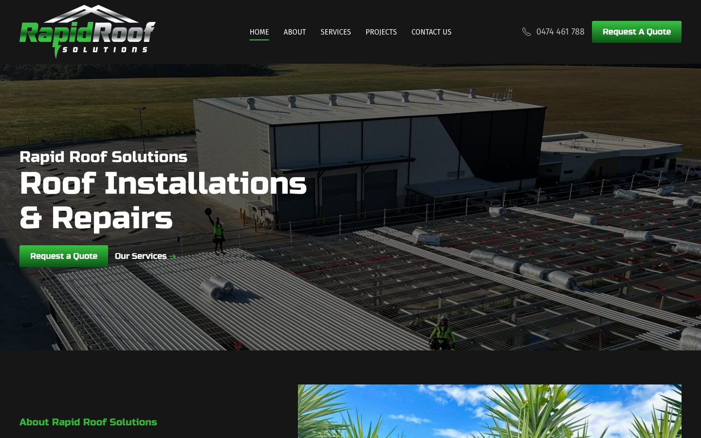

# Rapid Roof Solutions · 现状审计与重构提议

> **57/100** · moderate_candidate · 行业：roofer · 地区：Brisbane · Google 评价：5★ （0 条）

## 内部分级 · 运营优先看这段

**投入分级：** `C` 批量轻触 — 模板邮件 + 报告 PDF 链接，无主动跟进

**触发依据：**
- C · moderate_candidate · audit 57 · 0 评论 5★ (未达 B 标准)

**下一步行动：** 标准模板邮件 + master.md PDF 链接，无主动跟进。等客户回复触发后再投入。

## 一、店家现状速览

**线索来源 · 联系开场可用**:
- **来源**: Google Maps (gosom 抓取)
- **搜索关键词**: `roofer in brisbane`
- **首次发现**: 2026-05-14
- **Batch**: `pipe-roofer-brisbane-202605141830`

**审计结论：** audit_score=57 → moderate_candidate · weakest: gbp 20, seo 34

- 电话：0474461788
- 地址：28 Gallway St, Windsor QLD 4030
- 网站：[https://rapidroofsolutions.com.au/](https://rapidroofsolutions.com.au/)
- 网站状态：`independent_https_site`

## 二、客户访问时看到的页面

**慢速 4G 加载实景视频**（1.6 Mbps · 150ms 延迟 · 4× CPU 节流，模拟真实手机访客的体验）：

[播放视频](./video/mobile-throttled.webm)

## 三、视觉审计 · Vision LLM 怎么看

> The site has a clear roofing message and visible quote buttons, but the first screen feels generic and lacks immediate proof that this is a trusted Brisbane roofer.

新鲜度 **6/10** · 信任度 **6/10** · 转化准备度 **7/10** · 设计年代 `slightly_outdated`

**值得保留的优点：**
- The main headline clearly says 'Roof Installations & Repairs', so the core service is immediately understandable.
- Green quote buttons are visible on both desktop and mobile above the fold.
- The mobile layout keeps the primary call-to-action sticky at the bottom, which is useful for phone-based local searches.

## 五、当前网站在哪里"漏水"

### 关键问题 · 1 项（立刻在伤害成交）

### 关键 · Mobile phone number is hidden

**技术事实**

On the mobile screenshot, the bottom sticky bar shows two green buttons, 'Contact Us' and 'Call Now', but the actual phone number is not visible anywhere in the first screen.

**普通话翻译**

手机页面第一屏看不到真实电话号码，只看到“Call Now”按钮。

**对客户的影响**

本地客户通常是在手机上找屋顶维修，很多人会直接打电话。若号码不马上出现，访客可能几秒内回到Google，点竞争对手的电话。

**正确长啥样**

Mobile header or sticky bar shows a tap-to-call button with the phone number, such as 'Call 0474 461 788', visible without scrolling.

**Redesign 怎么改**

Replace the generic mobile 'Call Now' label with 'Call 0474 461 788' and keep it fixed at the bottom; also add a small phone icon and number in the mobile header if space allows.

### 主要问题 · 6 项（影响转化的明显短板）

### 主要 · review_volume_vs_peers

**技术事实**

0 reviews

**普通话翻译**

你的 Google 评价数量低于同行平均水平。

**对客户的影响**

本地搜索排名信号之一就是评价数量；不光是分数，连"有多少条"都算。短期可以做的：每个完工的客户群发一条「点评一下吧」的 SMS。

### 主要 · homepage_title_clear

**技术事实**

title='## Rapid Roof Solutions' contains-name=true contains-niche=false

**普通话翻译**

你网站的浏览器标签 title 没把业务名字 + 服务关键词写清楚（比如该写「Rapid Roof Solutions - roofer Brisbane」，但目前是泛泛一句）。

**对客户的影响**

Google 搜索结果里展示的就是这个 title。写不清楚 = 排名靠后 + 即使排上来客户也不知道是不是匹配的服务。SEO 最便宜的修复，但很多本地企业完全没做。

### 主要 · local_schema_markup

**技术事实**

no LocalBusiness JSON-LD

**普通话翻译**

网站没有 LocalBusiness JSON-LD 结构化数据（让 Google / AI 知道你是本地企业、地址、电话、营业时间的标准格式）。

**对客户的影响**

Google「附近的服务」「Knowledge Panel」「AI Overview」都依赖这类结构化数据。没有 = 即使排名上去也不会出现在右侧 Knowledge Panel 或地图卡片里 — 错失高转化的展示位。AI agent / ChatGPT 引用本地商家时也是基于这些数据。

### 主要 · No proof points above the fold

**技术事实**

The desktop and mobile hero areas show the logo, headline, roof image, and quote buttons, but no Google rating, review count, licence, insurance, years in business, or Brisbane service-area proof is visible.

**普通话翻译**

首页第一眼没有看到评分、评价数量、执照、保险或布里斯班本地服务证明。

**对客户的影响**

修屋顶金额高、风险高，客户会先找“看起来靠谱”的公司。访客通常在8秒内形成第一印象，缺少信任信息会让报价咨询减少。

**正确长啥样**

The first screen includes a compact trust row under the headline: Google stars, review count, licensed and insured, Brisbane service area, and emergency repair availability if true.

**Redesign 怎么改**

Add a trust strip directly below the hero headline and above the CTA buttons with 3-4 verified proof points, using small icons and plain labels.

### 主要 · Hero image feels too impersonal

**技术事实**

The desktop hero image is a dark aerial view of a large commercial roof with tiny workers and no clear close-up of finished roofing quality or a local home.

**普通话翻译**

桌面首图像大型工地航拍，距离太远，看不出屋顶施工质量，也不像客户自己的房子。

**对客户的影响**

客户会下意识找“这家公司能解决我的问题”的证据。图片太泛，会让住宅客户觉得不匹配，从而少点报价。

**正确长啥样**

Hero image shows a bright Brisbane residential or commercial roof project with visible finished roof detail, workers, or before-and-after context.

**Redesign 怎么改**

Replace or rotate the desktop hero with a sharper project photo that shows completed roof work; add a small caption such as 'Roof repairs and replacements across Brisbane'.

### 主要 · Logo dominates the header

**技术事实**

On desktop, the Rapid Roof Solutions logo takes up a large amount of vertical space in the black header, while the phone number and quote button sit smaller on the right.

**普通话翻译**

页头Logo太抢眼，反而让电话和报价按钮没那么突出。

**对客户的影响**

本地服务网站最重要的是让客户快速联系。联系入口不够突出，会降低来电和询价。

**正确长啥样**

Header uses a smaller logo, clear navigation, prominent phone number, and one high-contrast quote button with balanced spacing.

**Redesign 怎么改**

Reduce the desktop logo height, tighten the header, and give the phone number equal visual weight to the quote button.

## 六、Redesign 的发力点（综合视觉 + 评论数据）

1. [视觉] 1. Put the real phone number and quote action visibly in the mobile first screen and sticky bar.
2. [视觉] 2. Add above-fold trust proof: Google rating, reviews, licence/insurance, and Brisbane service-area messaging.
3. [视觉] 3. Replace the generic dark hero treatment with brighter project imagery and a proof-led section immediately below.

## 图片优化与第三方脚本体重

PSI 给的是宏观分数，下面是具体可改的两块：图片格式与 tracker 脚本。

### 图片优化（共 21 张）

- **优化率：** 100%（21/21 使用 WebP/AVIF/SVG）
- **响应式 srcset：** 0%
- **Lazy load：** 81%
- **Alt 文字（非空）：** 0%
- **显式 width/height：** 100%（防止 CLS 布局抖动）

**总评：** 部分优化 — 还有空间

**具体问题：**
- [minor] 21 张图仍是 JPG/PNG，建议转 WebP
- [minor] 21/21 张图无响应式 srcset — 移动端浪费带宽
- [major] 21/21 张图缺 alt 文字 — 影响 SEO + 可访问性 + AI 抓取

### 第三方脚本占用情况

- **总请求数：** 66（35 自有 + 31 第三方）
- **第三方占总下载量：** 43%（1405 KB / 3258 KB）
- **Tracker 脚本数：** 6（合计 628 KB）

**已识别的 tracker：**

| 工具 | 类型 | 请求数 | 字节 |
|---|---|---|---|
| Google Tag Manager | analytics | 4 | 627.5 KB |
| Google Analytics | analytics | 2 | 0.0 KB |

> **观察：** 6 个 tracker 合计加载了 628 KB —— 这些都是阻塞主线程的脚本，是性能 + 隐私双角度的销售切入点。redesign 时可以建议清理不再使用的 tracker。

## SEO 迁移评估 与 运营活跃度

客户最常担心的问题：「我重做网站，会不会丢掉 Google 排名？」这一段直接回答。

### 现有页面盘点

- **Sitemap 状态：** 已检测到 → `https://rapidroofsolutions.com.au/sitemap_index.xml`
- **页面总数：** 5
- **迁移复杂度：** 低（≤15 页 — 1-2 周内可完成全站重做）

**页面分类：**

| 类型 | 数量 |
|---|---|
| 首页 | 1 |
| 联系 / 报价 | 1 |
| service_area_page | 1 |
| 作品集 / 案例 | 1 |
| 关于 / 团队 | 1 |

**Sitemap lastmod 跨度：** 最旧 2023-02-27 → 最新 2023-08-15

**Redirect 计划承诺：** redesign 上线时我们会附一份 5 条 1:1 redirect 表（旧 URL → 新 URL），保证 Google 已经索引的页面权重无损迁移。已经在 Google 第一二页的关键词不会丢。

### SEO 长尾结构（服务 × 区域 = 本地搜索流量金矿）

- **服务专项页（如 /metal-roofing/）：** 0 个
- **区域页（如 /service-areas/brisbane/）：** 0 个
- **服务×区域组合页（如 /metal-roofing-brisbane/）：** 1 个

**长尾覆盖：** 无 — 没有服务专项页面，redesign 时是关键补点

**现有服务×区域页样本：** `/services/`

### 运营活跃度

- **整体活跃度：** 休眠（超过 1 年没更新过） （最近一次更新 1004 天前）
- **Blog 板块：** 未发现 — 没有内容营销基础
- **社交媒体链接：** 网站上引用了 2 个平台 — facebook, instagram

> **关键发现：** 客户的网站超过一年没动过。redesign 之后我们也建议帮忙建立最低限度的内容更新节奏（每月 1 篇 case study 即可），否则 AI / Google 都会判定网站「死站」。

## 域名历史与邮件信誉

### 邮件 DNS 配置（影响未来邮件营销 / 冷邮件投递率）

- **SPF (反垃圾发件验证)：** ⚠ 未配置 — 客户如果用域名邮箱发邮件，进垃圾箱的概率高
- **DKIM (邮件签名)：** ⚠ 常见 selector 未发现 DKIM 配置（不一定确凿，但提示有问题）
- **DMARC (策略)：** ⚠ 未配置 — 域名易被仿冒做钓鱼
- **整体邮件投递信誉：** `none` (全无配置 — 邮件营销 / cold outreach 几乎不可能投递成功)

> 这是后续 **「Social Media Management 月度包」** 或 **「Cold Outreach 启动包」** 的前置条件 —— 邮件 DNS 没修好，发出去的邮件全进垃圾箱。redesign 时一并处理。

## 技术栈与营销基建

从网站源码识别出来的工具，能帮我们判断这位客户的数字成熟度。

- **网站平台 (CMS)：** WordPress（迁移复杂度参考；WordPress / Wix / Squarespace 这类有标准导出工具，custom-coded 会复杂）
- **分析工具：** Google Tag Manager · Google Analytics 4
- **广告 Pixel：** 未检测到 — 暂未投放追踪型广告

**数字成熟度打分：** 2 / 6 （中 — 已有基础设施，缺少深度运营）

### Redesign 时必须保留 / 重新安装的追踪代码

客户可能有数月 / 数年的历史数据 + 广告投放受众 sit 在这些 ID 上面。重做时**必须用同一套 ID 重新接进新网站**，否则等于清零所有累积。

- Google Tag Manager
- Google Analytics 4

我们 redesign 交付清单会把这些列为「必须 setup 项」。

## 信任凭证 · generic

本地服务的客户在掏钱之前会查这些凭证。缺失 = 客户跳到下一家。

**信任分：** 45/100

### 已显示的（3 项）

- **ABN** (20 分) — "ABN: 72 634 338 640"
- **行业证书** (15 分) — "Licensed"
- **免费报价** (10 分) — "Free Quote"

### 缺失的（4 项 — redesign 必补 / 提醒客户提供素材）

- [行业惯例] **保险** (15 分)
- [行业惯例] **从业年限** (15 分)
- [行业惯例] **保修** (15 分)
- [行业惯例] **荣誉 / 奖项** (10 分)

## AI 时代可发现性 · GEO Readiness

GEO = Generative Engine Optimization。ChatGPT、Perplexity、Google AI Overviews 这些 AI 搜索产品**不像传统搜索引擎那样按"关键词排名"工作**，它们直接抓取结构化数据并把答案合成给用户。如果你的网站在 AI 抓取这一块做得不到位，等于在生成式搜索时代隐身。

**AI 可发现性总分：** 40 / 100 — AI agent 抓取部分支持，但关键 schema / 凭证 / FAQ 缺失

### 已经做到的（4 项）

- [PASS] `localbusiness_schema` — Organization JSON-LD present (LocalBusiness preferred for local services)
- [PASS] `breadcrumb_schema` — BreadcrumbList JSON-LD present
- [PASS] `eeat_business_credentials` — 2/4 credentials in copy: ABN, license/QBCC
- [PASS] `jsonld_at_least_one` — 5 JSON-LD block(s) detected on page

### 还缺的（8 项 — 这些是 redesign 时一并补上的标准动作）

- [缺失] `llms_txt_present` (5 分) — no /llms.txt at standard path
- [缺失] `ai_bot_robots_policy` (5 分) — robots.txt has no explicit policy for AI crawlers (GPTBot/ClaudeBot/etc)
- [缺失] `service_schema` (10 分) — no Service JSON-LD
- [缺失] `faqpage_schema` (10 分) — no FAQPage JSON-LD (loses AI Overview / featured snippet eligibility)
- [缺失] `aggregaterating_schema` (5 分) — no AggregateRating JSON-LD (★ rating not shown in search snippets)
- [缺失] `semantic_landmarks` (10 分) — 1 semantic landmarks present: <nav
- [缺失] `faq_qa_pattern` (10 分) — 0 question-style heading(s) found (Q&A format helps AI extraction)
- [缺失] `eeat_warranty_trust` (5 分) — no warranty/guarantee in copy

> **销售切入：** 「ChatGPT 现在每月 30 亿次搜索，本地服务用户问『Brisbane 哪家屋顶公司靠谱』，AI 回答时只引用结构化数据完整的网站。你目前在这个新阵地的得分是 40/100。」

## 业务规模信号 · 内部筛选用

**注：这一段只给运营内部看，不进入客户报告。** 用来判断这个 lead 是不是匹配我们「小网站 / 多批量 / 快上线」的产品定位。

- **规模信号汇总：** 小型客户特征
- **客户分级：** `small` — 小型，符合我们标准产品包定位

> 报价以上方 **建议报价** 为准（来自 entity.grade.recommended_pricing / PRODUCT_TIER_TABLE）。本段只用来判断 lead 是否匹配产品定位，不竞争报价。

**触发依据：**
- 已部署 2 个追踪工具

## Upsell 机会 · redesign 之外的月度营收

redesign 是一次性收入。以下是基于这个客户当前现状自动识别的**持续性服务包**机会，可以在 redesign 提案签字时一并捆绑进去。

### 内容写作月度包（Blog / 案例 / SEO 长尾）

**触发依据：** 网站没有 blog 板块 — 没有内容营销基础设施，长尾 SEO 流量为零。

**包内容：** 每月 2 篇 SEO-optimized blog（800-1,200 字）+ 每季度 1 篇 case study（含 before/after 图）+ 关键词研究报告。

**月度费用区间：** $400-800/月

**销售切入：** 「ChatGPT 时代搜索引擎更偏爱有「专家深度内容」的网站。你目前的网站只有服务介绍页 — AI 可引用的素材几乎为零。」

<!-- M2-D6 required token bridge: 现网站快速诊断 → covered by detail-builder section -->
<!-- 现网站快速诊断 -->

<!-- M2-D6 required token bridge: 业主沟通要点 → covered by detail-builder section -->
<!-- 业主沟通要点 -->

<!-- M2-D6 required token bridge: 账户与档案 → covered by detail-builder section -->
<!-- 账户与档案 -->

## 附录 · 数据出处

- Cheap audit version: `-`
- Detailed audit version: `2026-05-11-v1`
- Vision model: `codex_cli`
- Review source: `Google Places · most_relevant (max 5)`
- 完整 audit 报告 HTML：[internal-audit-report](./internal-audit-report.html)
