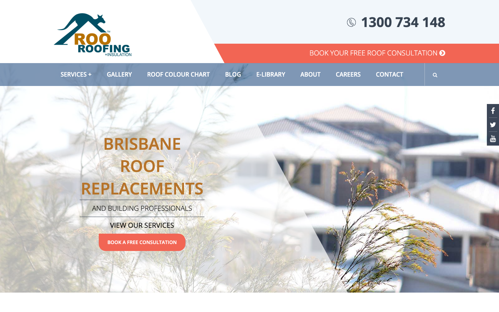
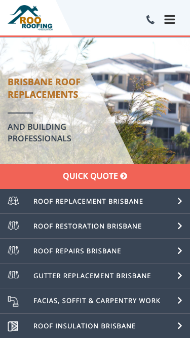

# Roo Roofing · 现状审计与重构提议

> **60/100** · strong_redesign · 行业：roofer · 地区：Brisbane · Google 评价：4.6★ （0 条）

## 内部分级 · 运营优先看这段

**投入分级：** `C` 批量轻触 — 模板邮件 + 报告 PDF 链接，无主动跟进

**触发依据：**
- C · strong_redesign · audit 60 · 0 评论 4.6★ (未达 B 标准)

**下一步行动：** 标准模板邮件 + master.md PDF 链接，无主动跟进。等客户回复触发后再投入。

## 一、店家现状速览

**线索来源 · 联系开场可用**:
- **来源**: Google Maps (gosom 抓取)
- **搜索关键词**: `roofer in brisbane`
- **首次发现**: 2026-05-14

**审计结论：** audit_score=60 → strong_redesign · weakest: gbp 20, technical 40 · fired: no_https · 1 critical issues

**已触发的 hard triggers：** `no_https`

- 电话：1300734148
- 地址：79 Cambridge St, Coorparoo QLD 4151
- 网站：[http://www.rooroofing.com.au/](http://www.rooroofing.com.au/)
- 网站状态：`independent_http_site`

## 二、客户访问时看到的页面

**慢速 4G 加载实景视频**（1.6 Mbps · 150ms 延迟 · 4× CPU 节流，模拟真实手机访客的体验）：

[播放视频](./video/mobile-throttled.webm)

## 三、视觉审计 · Vision LLM 怎么看

> The site shows the service and phone number clearly, but the dated visual style and weak trust proof make it feel less current than a Brisbane roofing customer would expect.

新鲜度 **4/10** · 信任度 **5/10** · 转化准备度 **6/10** · 设计年代 `outdated`

**值得保留的优点：**
- The business name and phone number are prominent on desktop.
- The coral quote button stands out clearly against the muted page colors.
- The mobile service rows make the main roofing services easy to scan.

## 五、当前网站在哪里"漏水"

### 关键问题 · 2 项（立刻在伤害成交）

### 关键 · https_enabled

**技术事实**

http only

**普通话翻译**

你的网站没有 HTTPS — 浏览器会在地址栏显示「不安全」标记，部分浏览器（Chrome / Firefox）甚至会弹出全屏警告挡住页面。

**对客户的影响**

Google 早在 2018 年起把 HTTPS 列为搜索排名因素，没有 HTTPS 直接拉低自然搜索可见度；且超过 80% 的访客看到「不安全」标识会立刻关掉。对你这种 0 条 Google 评价积累起来的口碑来说，访客在网址栏就被劝退，等于浪费了所有 GBP 流量。

### 关键 · Mobile hides the phone number

**技术事实**

On mobile, the top bar shows only a phone icon and hamburger icon; the actual number “1300 734 148” is not visible.

**普通话翻译**

手机顶部只有电话图标，没有直接显示电话号码。

**对客户的影响**

本地搜索很多发生在手机上。客户想马上打电话时，如果看不到号码，可能会返回 Google 选择另一个更容易联系的屋顶公司。

**正确长啥样**

Mobile header should show a tappable phone button with either the full number or a clear “Call 1300 734 148” label visible without scrolling.

**Redesign 怎么改**

Replace the standalone phone icon with a visible click-to-call control reading “Call 1300 734 148” or add a sticky bottom call bar.

### 主要问题 · 7 项（影响转化的明显短板）

### 主要 · review_volume_vs_peers

**技术事实**

0 reviews

**普通话翻译**

你的 Google 评价数量低于同行平均水平。

**对客户的影响**

本地搜索排名信号之一就是评价数量；不光是分数，连"有多少条"都算。短期可以做的：每个完工的客户群发一条「点评一下吧」的 SMS。

### 主要 · homepage_title_clear

**技术事实**

title='# BRISBANE ROOF REPLACEMENTS' contains-name=true contains-niche=false

**普通话翻译**

你网站的浏览器标签 title 没把业务名字 + 服务关键词写清楚（比如该写「Roo Roofing - roofer Brisbane」，但目前是泛泛一句）。

**对客户的影响**

Google 搜索结果里展示的就是这个 title。写不清楚 = 排名靠后 + 即使排上来客户也不知道是不是匹配的服务。SEO 最便宜的修复，但很多本地企业完全没做。

### 主要 · local_schema_markup

**技术事实**

no LocalBusiness JSON-LD

**普通话翻译**

网站没有 LocalBusiness JSON-LD 结构化数据（让 Google / AI 知道你是本地企业、地址、电话、营业时间的标准格式）。

**对客户的影响**

Google「附近的服务」「Knowledge Panel」「AI Overview」都依赖这类结构化数据。没有 = 即使排名上去也不会出现在右侧 Knowledge Panel 或地图卡片里 — 错失高转化的展示位。AI agent / ChatGPT 引用本地商家时也是基于这些数据。

### 主要 · Hero design feels dated

**技术事实**

The desktop hero uses a pale washed-out roof photo with a large angled translucent white overlay cutting through the middle of the image.

**普通话翻译**

首页大图看起来有点旧，透明斜块和发白的照片让网站不像最近更新过。

**对客户的影响**

客户通常会在几秒内判断这家公司靠不靠谱。如果第一眼显旧，从 Google 商家资料点进来的客户可能会直接回去看下一家。

**正确长啥样**

A sharp real roofing project photo with a simple dark or light overlay, clear headline, visible service area, and one strong phone or quote button above the fold.

**Redesign 怎么改**

Replace the faded angled hero treatment with a high-resolution Brisbane roof project image, flat overlay for text contrast, and a single primary CTA block.

### 主要 · Trust proof is missing above fold

**技术事实**

The first desktop screen shows the logo, phone number, menu, hero headline, and buttons, but no review rating, licence detail, years in business, or completed-job proof.

**普通话翻译**

首屏没有马上告诉客户“我们值得信任”，比如评价、资质、保险或本地案例。

**对客户的影响**

屋顶工程金额高，客户会更谨慎。缺少信任信息会让本来准备打电话的人先去比较别家公司，尤其是从 GBP 进来的冷流量。

**正确长啥样**

Above the fold should include 3-4 compact trust markers such as star rating, insured/licensed wording, Brisbane service area, and number of roofs completed.

**Redesign 怎么改**

Add a trust strip directly under the header or inside the hero with Google rating, licensed and insured claim, local Brisbane coverage, and a proof metric.

### 主要 · Mobile hero text is cramped

**技术事实**

The mobile hero stacks “BRISBANE ROOF REPLACEMENTS” and “AND BUILDING PROFESSIONALS” over a busy roof image, with divider lines and a large angled overlay taking much of the space.

**普通话翻译**

手机首屏文字和图片挤在一起，重点不够直接。

**对客户的影响**

手机访客通常滑动很快。如果前 8 秒看不懂你做什么、能不能服务 Brisbane，他们很容易离开。

**正确长啥样**

Mobile should use a single-column hero with a short headline, one supporting line, readable 16px+ text, and a primary call button visible immediately.

**Redesign 怎么改**

Simplify the mobile hero to “Brisbane Roof Replacement & Repairs” with one support line, stronger contrast, and remove decorative divider lines.

### 主要 · Service list dominates mobile

**技术事实**

Immediately under the mobile “QUICK QUOTE” bar, six dark service rows fill the screen with icons, uppercase labels, and chevrons.

**普通话翻译**

手机上很快就进入一长串服务菜单，但还没先建立信任。

**对客户的影响**

客户不是只想看菜单，他们要先确认这家公司靠谱。信任信息太晚出现，会降低从 GBP 进入后的来电意愿。

**正确长啥样**

Mobile should show the main CTA, then a compact trust row, then 3-4 top services with a “View all services” option.

**Redesign 怎么改**

Keep only the highest-intent services near the top, add review/licence proof above the list, and move the full service menu lower on the page.

## 六、Redesign 的发力点（综合视觉 + 评论数据）

1. [视觉] 1. Make mobile contact immediate with a visible click-to-call number and sticky quote/call action.
2. [视觉] 2. Rebuild the hero with sharper roofing imagery, clearer Brisbane service wording, and stronger text contrast.
3. [视觉] 3. Add trust proof above the fold: reviews, licence/insurance wording, local proof, and project credibility.

## 七、推荐销售切入点

- 你的网站没有 HTTPS — 浏览器对来访客户显示「不安全」，直接伤害信任

## 真实速度数据 · Google PageSpeed Insights

我们前面那段「慢速 4G 加载视频」是我们这边的实验室结果。这一段是 **Google 自己**对你网站打的分，包括过去 28 天 **真实访客**的网络体验数据（CRUX field data）。

### 移动端（mobile）

**Lighthouse 分数（实验室）：**

| 维度 | 分数 |
|---|---|
| 性能 (Performance) | **41/100** |
| 可访问性 (Accessibility) | 77/100 |
| 最佳实践 (Best Practices) | 73/100 |
| SEO | 77/100 |

**Lab 关键指标：** LCP `11.6s` · FCP `4.1s` · CLS `0.022` · TBT `715ms`

**Google 建议的优化项（按节省时间排序，前 2）：**

- **Reduce unused JavaScript** — 节省 1650ms · 节省 422KB
- **Reduce unused CSS** — 节省 450ms · 节省 74KB

### 桌面端（desktop）

**Lighthouse 分数：** Performance 67 · A11y 78 · Best Practices 77 · SEO 85

## 图片优化与第三方脚本体重

PSI 给的是宏观分数，下面是具体可改的两块：图片格式与 tracker 脚本。

### 图片优化（共 45 张）

- **优化率：** 0%（0/45 使用 WebP/AVIF/SVG）
- **响应式 srcset：** 0%
- **Lazy load：** 7%
- **Alt 文字（非空）：** 29%
- **显式 width/height：** 18%（防止 CLS 布局抖动）

**总评：** 基本未优化 — redesign 可显著降低图片下载量

**具体问题：**
- [major] 45 张图几乎全是 JPG/PNG，未用 WebP/AVIF — 估算可节省 30-50% 图片下载量
- [minor] 45/45 张图无响应式 srcset — 移动端浪费带宽
- [minor] 42/45 张图未 lazy load — 首屏外的图阻塞主线程
- [major] 32/45 张图缺 alt 文字 — 影响 SEO + 可访问性 + AI 抓取
- [minor] 37/45 张图无显式 width/height — 加重 CLS 布局抖动

### 第三方脚本占用情况

- **总请求数：** 119（50 自有 + 69 第三方）
- **第三方占总下载量：** 15%（498 KB / 3326 KB）
- **Tracker 脚本数：** 12（合计 469 KB）

**已识别的 tracker：**

| 工具 | 类型 | 请求数 | 字节 |
|---|---|---|---|
| Google Tag Manager | analytics | 2 | 308.8 KB |
| Meta Pixel | ad_pixel | 2 | 101.3 KB |
| Hotjar | analytics | 3 | 57.9 KB |
| HubSpot | email_capture | 2 | 0.6 KB |
| DoubleClick | ad_serving | 2 | 0.4 KB |
| Google Analytics | analytics | 1 | 0.0 KB |

> **观察：** 12 个 tracker 合计加载了 469 KB —— 这些都是阻塞主线程的脚本，是性能 + 隐私双角度的销售切入点。redesign 时可以建议清理不再使用的 tracker。

## SEO 迁移评估 与 运营活跃度

客户最常担心的问题：「我重做网站，会不会丢掉 Google 排名？」这一段直接回答。

### 现有页面盘点

- **Sitemap 状态：** 已检测到 → `https://www.rooroofing.com.au/sitemap_index.xml`
- **页面总数：** 200
- **迁移复杂度：** 高（>80 页 — 需要分阶段迁移 + 完整 redirect map）

**页面分类：**

| 类型 | 数量 |
|---|---|
| 内页 | 72 |
| service_area_page | 59 |
| 服务详情页 | 37 |
| area_page | 18 |
| 顶层页面 | 9 |
| 首页 | 2 |
| 法律 / 隐私 | 1 |
| 联系 / 报价 | 1 |
| 关于 / 团队 | 1 |

**Sitemap lastmod 跨度：** 最旧 2016-06-20 → 最新 2026-03-17

**Redirect 计划承诺：** redesign 上线时我们会附一份 50 条 1:1 redirect 表（旧 URL → 新 URL），保证 Google 已经索引的页面权重无损迁移。已经在 Google 第一二页的关键词不会丢。

### SEO 长尾结构（服务 × 区域 = 本地搜索流量金矿）

- **服务专项页（如 /metal-roofing/）：** 37 个
- **区域页（如 /service-areas/brisbane/）：** 18 个
- **服务×区域组合页（如 /metal-roofing-brisbane/）：** 59 个

**长尾覆盖：** 强 — 已有 5+ 服务×区域页，长尾流量基础在

**现有服务页样本：** `/understanding-roof-built/` · `/possum-proof-roof/` · `/5-signs-need-re-roof/` · `/tile-vs-metal-roofs/` · `/ultimate-guide-australian-roof-types-ebook/`

**现有服务×区域页样本：** `/collection-australias-interesting-roofs/` · `/need-fire-resistant-gutter-guards/` · `/5-roofing-materials-warmer-climates/` · `/roof-restoration-beenleigh/` · `/roof-restoration-gold-coast/`

### 运营活跃度

- **整体活跃度：** 近期（90 天内有更新） （最近一次更新 59 天前）
- **Blog 板块：** 未发现 — 没有内容营销基础
- **社交媒体链接：** 网站上引用了 3 个平台 — facebook, twitter, youtube

## 联系表单与防垃圾设置

客户能不能 *方便地* 把信息留下来 = 直接的转化路径。这一段审视所有 `<form>` 元素的可用性 + 防 spam 配置。

### 表单 · 8 字段（摩擦：高（≥7 字段，会显著降低转化））

- **字段构成：** First Name*(text,必填) · Last Name*(text,必填) · Email*(email,必填) · Service Enquiry Type*(select-one,必填) · Site Address*(text,必填) · Postcode*(text,必填) · Phone Number*(tel,必填) · Your Message(textarea)
- **必填字段数：** 7/8
- **常见关键字段：** email · phone · message
- **提交按钮：** 「Submit」
- **Honeypot 防 spam：** 未检测到

**未检测到任何 anti-spam 措施**（reCAPTCHA / hCaptcha / Turnstile / honeypot 都没有）— 表单极容易被自动机器人灌爆，垃圾询盘会让客户对真实询盘麻木。redesign 时建议加 Cloudflare Turnstile（不可见，免费）。

**Audit 总结：**

- [关键] 表单字段数 8 — 远超行业标准 3-4 字段，会显著降低转化率
- [中等] 表单未检测到任何 anti-spam 措施（reCAPTCHA / hCaptcha / Turnstile / honeypot 都没有）— 高 spam 风险

## 域名历史与邮件信誉

### 邮件 DNS 配置（影响未来邮件营销 / 冷邮件投递率）

- **SPF (反垃圾发件验证)：** 已配置
- **DKIM (邮件签名)：** ⚠ 常见 selector 未发现 DKIM 配置（不一定确凿，但提示有问题）
- **DMARC (策略)：** 已配置（policy: `none`）
- **整体邮件投递信誉：** `partial` (只有 2/3 — 建议补全)

> 这是后续 **「Social Media Management 月度包」** 或 **「Cold Outreach 启动包」** 的前置条件 —— 邮件 DNS 没修好，发出去的邮件全进垃圾箱。redesign 时一并处理。

## 技术栈与营销基建

从网站源码识别出来的工具，能帮我们判断这位客户的数字成熟度。

- **网站平台 (CMS)：** WordPress（迁移复杂度参考；WordPress / Wix / Squarespace 这类有标准导出工具，custom-coded 会复杂）
- **分析工具：** Google Tag Manager · Google Analytics 4 · Hotjar
- **广告 Pixel：** Meta (Facebook) Pixel — 客户已经在投放（或投放过）付费广告，对营销预算不陌生
- **邮件捕获：** HubSpot
- **托管 / CDN 线索：** Cloudflare-fronted

**数字成熟度打分：** 5 / 6 （高 — 客户懂数字营销，redesign 谈预算时不必从零教育）

### Redesign 时必须保留 / 重新安装的追踪代码

客户可能有数月 / 数年的历史数据 + 广告投放受众 sit 在这些 ID 上面。重做时**必须用同一套 ID 重新接进新网站**，否则等于清零所有累积。

- Google Tag Manager
- Google Analytics 4
- Hotjar
- Meta (Facebook) Pixel

我们 redesign 交付清单会把这些列为「必须 setup 项」。

## 信任凭证 · generic

本地服务的客户在掏钱之前会查这些凭证。缺失 = 客户跳到下一家。

**信任分：** 25/100

### 已显示的（2 项）

- **行业证书** (15 分) — "licensed"
- **免费报价** (10 分) — "Free Consultation"

### 缺失的（5 项 — redesign 必补 / 提醒客户提供素材）

- [行业惯例] **ABN** (20 分)
- [行业惯例] **保险** (15 分)
- [行业惯例] **从业年限** (15 分)
- [行业惯例] **保修** (15 分)
- [行业惯例] **荣誉 / 奖项** (10 分)

## AI 时代可发现性 · GEO Readiness

GEO = Generative Engine Optimization。ChatGPT、Perplexity、Google AI Overviews 这些 AI 搜索产品**不像传统搜索引擎那样按"关键词排名"工作**，它们直接抓取结构化数据并把答案合成给用户。如果你的网站在 AI 抓取这一块做得不到位，等于在生成式搜索时代隐身。

**AI 可发现性总分：** 40 / 100 — AI agent 抓取部分支持，但关键 schema / 凭证 / FAQ 缺失

### 已经做到的（4 项）

- [PASS] `localbusiness_schema` — Organization JSON-LD present (LocalBusiness preferred for local services)
- [PASS] `semantic_landmarks` — 4 semantic landmarks present: <nav, <header, <footer, <section
- [PASS] `eeat_warranty_trust` — warranty/guarantee mentioned
- [PASS] `jsonld_at_least_one` — 3 JSON-LD block(s) detected on page

### 还缺的（8 项 — 这些是 redesign 时一并补上的标准动作）

- [缺失] `llms_txt_present` (5 分) — no /llms.txt at standard path
- [缺失] `ai_bot_robots_policy` (5 分) — robots.txt has no explicit policy for AI crawlers (GPTBot/ClaudeBot/etc)
- [缺失] `service_schema` (10 分) — no Service JSON-LD
- [缺失] `faqpage_schema` (10 分) — no FAQPage JSON-LD (loses AI Overview / featured snippet eligibility)
- [缺失] `aggregaterating_schema` (5 分) — no AggregateRating JSON-LD (★ rating not shown in search snippets)
- [缺失] `breadcrumb_schema` (5 分) — no BreadcrumbList JSON-LD
- [缺失] `faq_qa_pattern` (10 分) — 2 question-style heading(s) found (Q&A format helps AI extraction)
- [缺失] `eeat_business_credentials` (10 分) — only 1/4 credentials found (license/QBCC) — need ≥2 of: ABN, license/QBCC, years-in-business, insurance

> **销售切入：** 「ChatGPT 现在每月 30 亿次搜索，本地服务用户问『Brisbane 哪家屋顶公司靠谱』，AI 回答时只引用结构化数据完整的网站。你目前在这个新阵地的得分是 40/100。」

## 业务规模信号 · 内部筛选用

**注：这一段只给运营内部看，不进入客户报告。** 用来判断这个 lead 是不是匹配我们「小网站 / 多批量 / 快上线」的产品定位。

- **规模信号汇总：** 中型客户特征
- **客户分级：** `mid` — 中型客户，可接但价格要往上提（基础包 + 配置项）

> 报价以上方 **建议报价** 为准（来自 entity.grade.recommended_pricing / PRODUCT_TIER_TABLE）。本段只用来判断 lead 是否匹配产品定位，不竞争报价。

**触发依据：**
- 网站页面数 200（≥100，中等复杂度）
- 已部署 4 个分析 / pixel 工具（高数字成熟度）

## Upsell 机会 · redesign 之外的月度营收

redesign 是一次性收入。以下是基于这个客户当前现状自动识别的**持续性服务包**机会，可以在 redesign 提案签字时一并捆绑进去。

### 内容写作月度包（Blog / 案例 / SEO 长尾）

**触发依据：** 网站没有 blog 板块 — 没有内容营销基础设施，长尾 SEO 流量为零。

**包内容：** 每月 2 篇 SEO-optimized blog（800-1,200 字）+ 每季度 1 篇 case study（含 before/after 图）+ 关键词研究报告。

**月度费用区间：** $400-800/月

**销售切入：** 「ChatGPT 时代搜索引擎更偏爱有「专家深度内容」的网站。你目前的网站只有服务介绍页 — AI 可引用的素材几乎为零。」

<!-- M2-D6 required token bridge: 现网站快速诊断 → covered by detail-builder section -->
<!-- 现网站快速诊断 -->

<!-- M2-D6 required token bridge: 业主沟通要点 → covered by detail-builder section -->
<!-- 业主沟通要点 -->

<!-- M2-D6 required token bridge: 账户与档案 → covered by detail-builder section -->
<!-- 账户与档案 -->

## 附录 · 数据出处

- Cheap audit version: `-`
- Detailed audit version: `2026-05-11-v1`
- Vision model: `codex_cli`
- Review source: `Google Places · most_relevant (max 5)`
- 完整 audit 报告 HTML：[internal-audit-report](./internal-audit-report.html)
