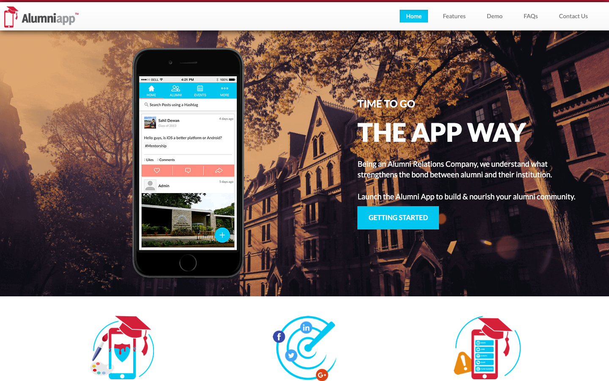
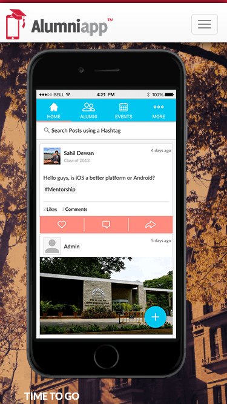

# Roof Repair Gold Coast · 现状审计与重构提议

> **35/100** · strong_redesign · 行业：roofing · 地区：Gold Coast · Google 评价：4.7★ （0 条）

## 内部分级 · 运营优先看这段

**投入分级：** `C` 批量轻触 — 模板邮件 + 报告 PDF 链接，无主动跟进

**触发依据：**
- C · strong_redesign · audit 35 · 0 评论 4.7★ (未达 B 标准)

**下一步行动：** 标准模板邮件 + master.md PDF 链接，无主动跟进。等客户回复触发后再投入。

## 一、店家现状速览

**线索来源 · 联系开场可用**:
- **来源**: Google Maps (gosom 抓取)
- **搜索关键词**: `roofing in gold-coast`
- **首次发现**: 2026-05-14
- **Batch**: `pipe-roofing-gold-coast-202605150724`

**审计结论：** audit_score=35 → strong_redesign · weakest: content 10, gbp 20 · fired: no_https · 2 critical issues

**已触发的 hard triggers：** `no_https`

- 电话：(07)38726730
- 地址：2810 Gold Coast Hwy, Surfers Paradise QLD 4217
- 网站：[http://roofrepairgoldcoast.com/](http://roofrepairgoldcoast.com/)
- 网站状态：`independent_http_site`

## 二、客户访问时看到的页面

**慢速 4G 加载实景视频**（1.6 Mbps · 150ms 延迟 · 4× CPU 节流，模拟真实手机访客的体验）：

[播放视频](./video/mobile-throttled.webm)

## 三、视觉审计 · Vision LLM 怎么看

> The screenshots show an unrelated alumni app landing page, so a roofing customer would not understand or trust that this is a Gold Coast roof repair business.

新鲜度 **2/10** · 信任度 **1/10** · 转化准备度 **1/10** · 设计年代 `severely_outdated`

**值得保留的优点：**
- The desktop header is uncluttered and easy to scan.
- The CTA button colour stands out clearly against the dark hero background.
- The mobile layout has a simple top bar with space for a stronger phone action.

## 五、当前网站在哪里"漏水"

### 关键问题 · 5 项（立刻在伤害成交）

### 关键 · https_enabled

**技术事实**

http only

**普通话翻译**

你的网站没有 HTTPS — 浏览器会在地址栏显示「不安全」标记，部分浏览器（Chrome / Firefox）甚至会弹出全屏警告挡住页面。

**对客户的影响**

Google 早在 2018 年起把 HTTPS 列为搜索排名因素，没有 HTTPS 直接拉低自然搜索可见度；且超过 80% 的访客看到「不安全」标识会立刻关掉。对你这种 0 条 Google 评价积累起来的口碑来说，访客在网址栏就被劝退，等于浪费了所有 GBP 流量。

### 关键 · phone_visible_above_fold

**技术事实**

phone hidden below fold or missing

**普通话翻译**

电话号码在第一屏看不到 — 客户必须滚动才能找到怎么联系你。

**对客户的影响**

本地服务客户 60-70% 倾向打电话沟通（不是填表单）。电话号没在第一屏 = 这部分客户里很多人会直接关掉去搜下一家。这是最便宜的转化优化之一。

### 关键 · Page appears to be for the wrong business

**技术事实**

The top-left logo says "Alumniapp" with a graduation cap icon, and the hero headline says "THE APP WAY" instead of anything about roof repairs.

**普通话翻译**

这个页面看起来像校友手机 App 的网站，不像修屋顶公司的官网。

**对客户的影响**

客户从 Google 商家资料点进来后，通常几秒内判断是不是找对了地方；如果第一眼不像修屋顶公司，很可能直接返回搜索结果，电话咨询会被白白流失。

**正确长啥样**

A roofing site should show the business name, roof repair wording, and Gold Coast location in the first screen, with a visible phone number and service-focused headline.

**Redesign 怎么改**

Replace the Alumniapp branding and app headline with "Roof Repair Gold Coast", a roof repair headline, Gold Coast service-area text, and a prominent click-to-call button.

### 关键 · Hero image has no roofing relevance

**技术事实**

The main desktop hero uses a campus-style building background and a large smartphone mockup showing an alumni social feed.

**普通话翻译**

首页大图展示的是手机 App 和校园建筑，跟修屋顶完全没有关系。

**对客户的影响**

本地客户会用图片快速判断这家公司是否专业；图片不相关会让人怀疑网站是否真实，尤其是急着找人修漏水屋顶时更容易放弃。

**正确长啥样**

The hero should show a real roof, tradesperson on a roof, storm-damaged tiles, or a before-and-after repair image from the Gold Coast area.

**Redesign 怎么改**

Use a full-width roofing photo in the hero, remove the phone mockup, and overlay a short service promise such as emergency roof leak repairs with a phone CTA.

### 关键 · No phone number visible above the fold

**技术事实**

The desktop header only shows navigation links like Home, Features, Demo, FAQs, and Contact Us; the mobile header only shows a hamburger menu with no phone button.

**普通话翻译**

客户一打开页面看不到电话号码，手机端还要点菜单才可能找到联系方式。

**对客户的影响**

很多本地搜索发生在手机上，约 70% 的本地搜索用户会直接拨打或访问商家；电话按钮不明显会把准备联系的人推给竞争对手。

**正确长啥样**

Desktop should show a top-right phone number button; mobile should show a sticky click-to-call button or phone icon visible without opening the menu.

**Redesign 怎么改**

Add a high-contrast "Call Now" button with the local phone number in the header and a sticky mobile call bar at the bottom of the screen.

### 主要问题 · 11 项（影响转化的明显短板）

### 主要 · review_volume_vs_peers

**技术事实**

0 reviews

**普通话翻译**

你的 Google 评价数量低于同行平均水平。

**对客户的影响**

本地搜索排名信号之一就是评价数量；不光是分数，连"有多少条"都算。短期可以做的：每个完工的客户群发一条「点评一下吧」的 SMS。

### 主要 · click_to_call_link

**技术事实**

no tel: link

**普通话翻译**

电话号码不是 click-to-call 链接（手机上点击不会自动拨号）。

**对客户的影响**

移动客户必须复制号码再切到拨号界面再粘贴 — 每多一步操作就流失一批客户。修复成本只是把 `<a href="tel:0712345678">` 写对，但能立刻拉高电话转化率。

### 主要 · homepage_title_clear

**技术事实**

title='## Still stuck on an Alumni Website?It's time to go the APP ' contains-name=false contains-niche=false

**普通话翻译**

你网站的浏览器标签 title 没把业务名字 + 服务关键词写清楚（比如该写「Roof Repair Gold Coast - roofing Gold Coast」，但目前是泛泛一句）。

**对客户的影响**

Google 搜索结果里展示的就是这个 title。写不清楚 = 排名靠后 + 即使排上来客户也不知道是不是匹配的服务。SEO 最便宜的修复，但很多本地企业完全没做。

### 主要 · service_copy_specific

**技术事实**

0 service-related verbs detected

**普通话翻译**

网站文案里没有具体说清楚你做哪些服务（比如 metal roofing / tile restoration / gutter / skylight 等专项），只是泛泛说「我们做屋顶」。

**对客户的影响**

客户搜的是具体问题（「漏水维修」「屋顶翻新报价」），网站没有匹配的具体服务文字，搜索引擎匹配不上你 + 客户进来也判断不了你做不做他要的活儿。

### 主要 · trust_signals_present

**技术事实**

0 trust-keyword mentions

**普通话翻译**

网站上没有显眼地写出执照号 / ABN / 保险信息 / 从业年限 / 行业证书。

**对客户的影响**

澳洲 QLD 的屋顶服务必须有 QBCC 执照才能合法开工；客户在花几千几万块前一定会查这些。你网站上没标 = 客户要么打电话来问要么直接选下一家更透明的。

### 主要 · h1_unique

**技术事实**

4 <h1> tags

**普通话翻译**

页面要么没有 H1 标题（搜索引擎无法理解页面主旨），要么有多个 H1（搜索引擎不知道哪个是主题）。

**对客户的影响**

H1 是搜索引擎判断页面主题最权威的信号。写错或缺失 = 关键词排名拉低；同一页面同样的内容，H1 写对的可以排到前 3 页，写不对的可能挂在第 7 页。

### 主要 · local_schema_markup

**技术事实**

no LocalBusiness JSON-LD

**普通话翻译**

网站没有 LocalBusiness JSON-LD 结构化数据（让 Google / AI 知道你是本地企业、地址、电话、营业时间的标准格式）。

**对客户的影响**

Google「附近的服务」「Knowledge Panel」「AI Overview」都依赖这类结构化数据。没有 = 即使排名上去也不会出现在右侧 Knowledge Panel 或地图卡片里 — 错失高转化的展示位。AI agent / ChatGPT 引用本地商家时也是基于这些数据。

### 主要 · Navigation is for an app, not a roofer

**技术事实**

The navigation labels are "Features", "Demo", "FAQs", and "Contact Us", which match a software product layout rather than roofing services.

**普通话翻译**

菜单内容像软件产品网站，不像屋顶维修公司的服务菜单。

**对客户的影响**

客户找不到自己需要的服务，会以为这家公司不做相关工作；通常用户不会耐心研究，而是回到 Google 选择下一个商家。

**正确长啥样**

Navigation should include practical service paths such as Roof Leak Repairs, Tile Roof Repairs, Storm Damage, About, Reviews, and Contact.

**Redesign 怎么改**

Rewrite the navigation around roofing services and local intent, keeping the menu short and prioritising emergency repair and contact actions.

### 主要 · Mobile hero hides the actual message

**技术事实**

On mobile, the large smartphone mockup fills almost the entire first screen, and only the small text "TIME TO GO" appears at the bottom edge.

**普通话翻译**

手机端首屏几乎全被手机模型占满，客户看不到修屋顶信息和联系按钮。

**对客户的影响**

手机用户通常在 8 秒左右决定是否继续看；首屏没有说明业务和电话，会直接减少来自 Google 商家资料的来电。

**正确长啥样**

Mobile should lead with a compact roof repair headline, one supporting line, and two large tap targets: Call Now and Request Quote.

**Redesign 怎么改**

Remove the oversized mockup on mobile and rebuild the first screen as a single-column roofing hero with headline, trust line, service area, and sticky call CTA.

### 主要 · No local trust signals are visible

**技术事实**

The visible area contains no reviews, licence details, years in business, local suburb coverage, warranty message, or emergency availability.

**普通话翻译**

页面上看不到评价、资质、保修、本地服务范围等让客户放心的信息。

**对客户的影响**

修屋顶客单价高，客户更怕被骗或做坏；缺少信任证明会让本来愿意询价的人转去选择看起来更可靠的同行。

**正确长啥样**

The first screen should include concise proof such as star rating, licensed and insured wording, Gold Coast suburbs served, workmanship warranty, and emergency response availability.

**Redesign 怎么改**

Add a trust strip directly under the hero CTA with review rating, licence or insurance claim, warranty, and Gold Coast coverage badges.

### 主要 · Design feels old and templated

**技术事实**

The hero uses a dark orange photo overlay, large all-caps white headline, bright cyan buttons, and stock-style illustrated icons below the fold.

**普通话翻译**

整体视觉像旧模板网站，颜色和图标都不像专业的本地服务公司。

**对客户的影响**

网站看起来过时会让客户怀疑公司是否还在认真经营；这种不信任会降低询价和来电，尤其影响第一次接触的新客户。

**正确长啥样**

A current local service design should use real job photos, restrained colours, clear spacing, readable service cards, and one strong action colour for calls and quote requests.

**Redesign 怎么改**

Replace the app-template styling with a roofing-specific visual system: real roof imagery, dark charcoal text, white sections, one accent colour for CTAs, and practical service blocks.

## 六、Redesign 的发力点（综合视觉 + 评论数据）

1. [视觉] 1. Replace all Alumniapp/app content with roofing-specific branding, headline, imagery, and Gold Coast service messaging.
2. [视觉] 2. Add a visible phone number and click-to-call CTA on desktop and mobile above the fold.
3. [视觉] 3. Add local trust proof: reviews, licence/insurance, warranty, emergency availability, and service-area coverage.

## 七、推荐销售切入点

- 你的网站没有 HTTPS — 浏览器对来访客户显示「不安全」，直接伤害信任

## 真实速度数据 · Google PageSpeed Insights

我们前面那段「慢速 4G 加载视频」是我们这边的实验室结果。这一段是 **Google 自己**对你网站打的分，包括过去 28 天 **真实访客**的网络体验数据（CRUX field data）。

### 移动端（mobile）

**Lighthouse 分数（实验室）：**

| 维度 | 分数 |
|---|---|
| 性能 (Performance) | **47/100** |
| 可访问性 (Accessibility) | 73/100 |
| 最佳实践 (Best Practices) | 70/100 |
| SEO | 83/100 |

**Lab 关键指标：** LCP `10.0s` · FCP `2.3s` · CLS `0.506` · TBT `138ms`

**Google 建议的优化项（按节省时间排序，前 2）：**

- **Reduce unused JavaScript** — 节省 460ms · 节省 64KB
- **Reduce unused CSS** — 节省 310ms · 节省 19KB

### 桌面端（desktop）

**Lighthouse 分数：** Performance 83 · A11y 80 · Best Practices 74 · SEO 83

## 图片优化与第三方脚本体重

PSI 给的是宏观分数，下面是具体可改的两块：图片格式与 tracker 脚本。

### 图片优化（共 46 张）

- **优化率：** 0%（0/46 使用 WebP/AVIF/SVG）
- **响应式 srcset：** 0%
- **Lazy load：** 0%
- **Alt 文字（非空）：** 41%
- **显式 width/height：** 7%（防止 CLS 布局抖动）

**总评：** 基本未优化 — redesign 可显著降低图片下载量

**具体问题：**
- [major] 46 张图几乎全是 JPG/PNG，未用 WebP/AVIF — 估算可节省 30-50% 图片下载量
- [minor] 46/46 张图无响应式 srcset — 移动端浪费带宽
- [minor] 46/46 张图未 lazy load — 首屏外的图阻塞主线程
- [major] 27/46 张图缺 alt 文字 — 影响 SEO + 可访问性 + AI 抓取
- [minor] 43/46 张图无显式 width/height — 加重 CLS 布局抖动

### 第三方脚本占用情况

- **总请求数：** 66（55 自有 + 11 第三方）
- **第三方占总下载量：** 14%（200 KB / 1465 KB）
- **Tracker 脚本数：** 5（合计 167 KB）

**已识别的 tracker：**

| 工具 | 类型 | 请求数 | 字节 |
|---|---|---|---|
| Google Tag Manager | analytics | 1 | 146.7 KB |
| Google Analytics | analytics | 4 | 20.3 KB |

> **观察：** 5 个 tracker 合计加载了 167 KB —— 这些都是阻塞主线程的脚本，是性能 + 隐私双角度的销售切入点。redesign 时可以建议清理不再使用的 tracker。

## SEO 迁移评估 与 运营活跃度

客户最常担心的问题：「我重做网站，会不会丢掉 Google 排名？」这一段直接回答。

### 现有页面盘点

- **Sitemap 状态：** 已检测到 → `http://roofrepairgoldcoast.com/sitemap.xml`
- **页面总数：** 6
- **迁移复杂度：** 低（≤15 页 — 1-2 周内可完成全站重做）

**页面分类：**

| 类型 | 数量 |
|---|---|
| 顶层页面 | 2 |
| FAQ | 2 |
| 首页 | 1 |
| 联系 / 报价 | 1 |

**Redirect 计划承诺：** redesign 上线时我们会附一份 6 条 1:1 redirect 表（旧 URL → 新 URL），保证 Google 已经索引的页面权重无损迁移。已经在 Google 第一二页的关键词不会丢。

### SEO 长尾结构（服务 × 区域 = 本地搜索流量金矿）

- **服务专项页（如 /metal-roofing/）：** 0 个
- **区域页（如 /service-areas/brisbane/）：** 0 个
- **服务×区域组合页（如 /metal-roofing-brisbane/）：** 0 个

**长尾覆盖：** 无 — 没有服务专项页面，redesign 时是关键补点

### 运营活跃度

- **整体活跃度：** 无法判断 
- **Blog 板块：** 未发现 — 没有内容营销基础
- **社交媒体链接：** 网站上没有 social 链接 — GBP 流量进来后没有第二触点

## 联系表单与防垃圾设置

客户能不能 *方便地* 把信息留下来 = 直接的转化路径。这一段审视所有 `<form>` 元素的可用性 + 防 spam 配置。

### 表单 · 3 字段（摩擦：低（≤4 字段，转化友好））

- **字段构成：** name(text) · institute(text) · email(email)
- **必填字段数：** 0/3
- **常见关键字段：** email
- **提交按钮：** 「Send」
- **Honeypot 防 spam：** 未检测到

**未检测到任何 anti-spam 措施**（reCAPTCHA / hCaptcha / Turnstile / honeypot 都没有）— 表单极容易被自动机器人灌爆，垃圾询盘会让客户对真实询盘麻木。redesign 时建议加 Cloudflare Turnstile（不可见，免费）。

**Audit 总结：**

- [中等] 联系表单没有电话字段 — 跟进客户时缺关键信息
- [提示] 表单缺少 message/enquiry 文本框 — 客户没法描述具体需求，回复时增加来回沟通
- [中等] 表单未检测到任何 anti-spam 措施（reCAPTCHA / hCaptcha / Turnstile / honeypot 都没有）— 高 spam 风险

## 域名历史与邮件信誉

- **域名"在线已"约：** 41 年（创建于 1985-01-01）— 老域名 = 多年 SEO 资产，redesign 时 redirect map 必须做对

### 邮件 DNS 配置（影响未来邮件营销 / 冷邮件投递率）

- **SPF (反垃圾发件验证)：** ⚠ 未配置 — 客户如果用域名邮箱发邮件，进垃圾箱的概率高
- **DKIM (邮件签名)：** ⚠ 常见 selector 未发现 DKIM 配置（不一定确凿，但提示有问题）
- **DMARC (策略)：** ⚠ 未配置 — 域名易被仿冒做钓鱼
- **整体邮件投递信誉：** `none` (全无配置 — 邮件营销 / cold outreach 几乎不可能投递成功)

> 这是后续 **「Social Media Management 月度包」** 或 **「Cold Outreach 启动包」** 的前置条件 —— 邮件 DNS 没修好，发出去的邮件全进垃圾箱。redesign 时一并处理。

## 技术栈与营销基建

从网站源码识别出来的工具，能帮我们判断这位客户的数字成熟度。

- **分析工具：** Google Analytics 4 · Google Analytics (Universal)
- **广告 Pixel：** 未检测到 — 暂未投放追踪型广告
- **托管 / CDN 线索：** Cloudflare-fronted

**数字成熟度打分：** 1 / 6 （低 — 客户对网站的认知是「有就行」，需要先讲清楚一份能赚钱的网站长什么样）

### Redesign 时必须保留 / 重新安装的追踪代码

客户可能有数月 / 数年的历史数据 + 广告投放受众 sit 在这些 ID 上面。重做时**必须用同一套 ID 重新接进新网站**，否则等于清零所有累积。

- Google Analytics 4
- Google Analytics (Universal)

我们 redesign 交付清单会把这些列为「必须 setup 项」。

> **关键发现：客户网站还装着 Universal Analytics**，这套工具 Google 已于 2023 年 7 月停止收集数据。也就是说，**他们至少 2 年没有看过任何真实的网站访客数据**。这是销售切入的强角度。

## 信任凭证 · AU 屋顶服务

本地服务的客户在掏钱之前会查这些凭证。缺失 = 客户跳到下一家。

**信任分：** 0/100

### 缺失的（8 项 — redesign 必补 / 提醒客户提供素材）

- [法律要求] **QBCC 执照号** (25 分)
- [法律要求] **ABN** (15 分)
- [行业惯例] **公共责任险** (15 分)
- [行业惯例] **从业年限** (10 分)
- [法律要求] **工伤 / WHS 合规** (10 分)
- [行业惯例] **行业协会会员** (10 分)
- [行业惯例] **保修 / 工艺保证** (10 分)
- [行业惯例] **免费报价 / 上门估价** (5 分)

> 客户网站缺少 3 个法律 / 行业要求的信任凭证：QBCC 执照号、ABN、工伤 / WHS 合规。QLD 屋顶服务由 QBCC 监管，客户在花钱前会查这些；缺失等于直接给同行让单。

## AI 时代可发现性 · GEO Readiness

GEO = Generative Engine Optimization。ChatGPT、Perplexity、Google AI Overviews 这些 AI 搜索产品**不像传统搜索引擎那样按"关键词排名"工作**，它们直接抓取结构化数据并把答案合成给用户。如果你的网站在 AI 抓取这一块做得不到位，等于在生成式搜索时代隐身。

**AI 可发现性总分：** 0 / 100 — AI agent / ChatGPT 几乎无法准确引用此网站 — 在生成式搜索时代等于隐身

### 还缺的（12 项 — 这些是 redesign 时一并补上的标准动作）

- [缺失] `llms_txt_present` (5 分) — no /llms.txt at standard path
- [缺失] `ai_bot_robots_policy` (5 分) — robots.txt has no explicit policy for AI crawlers (GPTBot/ClaudeBot/etc)
- [缺失] `localbusiness_schema` (15 分) — no LocalBusiness or Organization JSON-LD
- [缺失] `service_schema` (10 分) — no Service JSON-LD
- [缺失] `faqpage_schema` (10 分) — no FAQPage JSON-LD (loses AI Overview / featured snippet eligibility)
- [缺失] `aggregaterating_schema` (5 分) — no AggregateRating JSON-LD (★ rating not shown in search snippets)
- [缺失] `breadcrumb_schema` (5 分) — no BreadcrumbList JSON-LD
- [缺失] `semantic_landmarks` (10 分) — 2 semantic landmarks present: <nav, <footer
- [缺失] `faq_qa_pattern` (10 分) — 0 question-style heading(s) found (Q&A format helps AI extraction)
- [缺失] `eeat_business_credentials` (10 分) — only 0/4 credentials found — need ≥2 of: ABN, license/QBCC, years-in-business, insurance
- [缺失] `eeat_warranty_trust` (5 分) — no warranty/guarantee in copy
- [缺失] `jsonld_at_least_one` (10 分) — 0 JSON-LD block(s) detected on page

> **销售切入：** 「ChatGPT 现在每月 30 亿次搜索，本地服务用户问『Brisbane 哪家屋顶公司靠谱』，AI 回答时只引用结构化数据完整的网站。你目前在这个新阵地的得分是 0/100。」

## 业务规模信号 · 内部筛选用

**注：这一段只给运营内部看，不进入客户报告。** 用来判断这个 lead 是不是匹配我们「小网站 / 多批量 / 快上线」的产品定位。

- **规模信号汇总：** 小型客户特征
- **客户分级：** `small` — 小型，符合我们标准产品包定位

> 报价以上方 **建议报价** 为准（来自 entity.grade.recommended_pricing / PRODUCT_TIER_TABLE）。本段只用来判断 lead 是否匹配产品定位，不竞争报价。

**触发依据：**
- 已部署 2 个追踪工具

## Upsell 机会 · redesign 之外的月度营收

redesign 是一次性收入。以下是基于这个客户当前现状自动识别的**持续性服务包**机会，可以在 redesign 提案签字时一并捆绑进去。

### Social presence 一次性 setup + 月度运营包

**触发依据：** 网站上没检测到任何社交媒体链接 — 连基础的多渠道触点都缺。

**包内容：** 一次性：FB / IG 商家档案 setup + 品牌头像/封面 + 内容模板 5 套 (3-5K 一次性)。月度：4 帖 + 评论管理 + 月度报表。

**月度费用区间：** $1,500 setup + $600-900/月

**销售切入：** 「Google Maps 流量进来后没有第二落点，意味着客户当下没决定就走了 — 没办法再触及。社交账号是免费的二次触达管道。」

### 内容写作月度包（Blog / 案例 / SEO 长尾）

**触发依据：** 网站没有 blog 板块 — 没有内容营销基础设施，长尾 SEO 流量为零。

**包内容：** 每月 2 篇 SEO-optimized blog（800-1,200 字）+ 每季度 1 篇 case study（含 before/after 图）+ 关键词研究报告。

**月度费用区间：** $400-800/月

**销售切入：** 「ChatGPT 时代搜索引擎更偏爱有「专家深度内容」的网站。你目前的网站只有服务介绍页 — AI 可引用的素材几乎为零。」

<!-- M2-D6 required token bridge: 现网站快速诊断 → covered by detail-builder section -->
<!-- 现网站快速诊断 -->

<!-- M2-D6 required token bridge: 业主沟通要点 → covered by detail-builder section -->
<!-- 业主沟通要点 -->

<!-- M2-D6 required token bridge: 账户与档案 → covered by detail-builder section -->
<!-- 账户与档案 -->

## 附录 · 数据出处

- Cheap audit version: `-`
- Detailed audit version: `2026-05-11-v1`
- Vision model: `codex_cli`
- Review source: `Google Places · most_relevant (max 5)`
- 完整 audit 报告 HTML：[internal-audit-report](./internal-audit-report.html)
