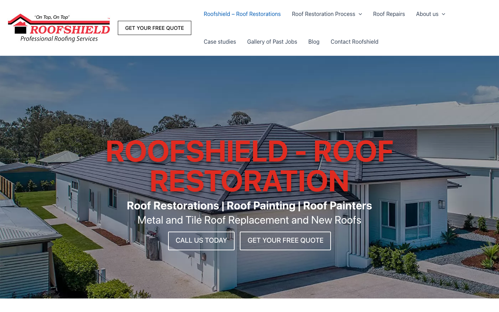

# Roofshield Roof Restorations · 现状审计与重构提议

> **53/100** · strong_redesign · 行业：roofing · 地区：Brisbane · Google 评价：4.4★ （51 条）

## 内部分级 · 运营优先看这段

**投入分级：** `A` 全攻 — 完整 OD redesign + 个性化销售流程

**触发依据：**
- strong_redesign + 51 评论 + 4.4★

**产品档位：** `T2` 1-page + annual maintenance

- 中等口碑 / 多业务分类 / 想要月度维护关系 — T2 annual maintenance 合适
- 51 评论 = 中等规模运营
- 现有 153 页内容 → 客户预期 ongoing 内容更新
- 2 个业务分类 = 多服务线 → 维护包合适

**建议报价：** 一次性 null

**下一步行动：** 跑完整 Open Design redesign brief + 个性化 cold email（突出 audit 中最强论据）+ 报告/视频外发 + 3 次跟进。报价主推 1-page + annual maintenance。

## 一、店家现状速览

**线索来源 · 联系开场可用**:
- **来源**: Google Maps (gosom 抓取)
- **搜索关键词**: `roof restoration New Farm Brisbane`
- **首次发现**: 2026-05-09

**审计结论：** audit_score=53 → strong_redesign · weakest: gbp 37, technical 40 · fired: no_https · 2 critical issues

**已触发的 hard triggers：** `no_https`

- 电话：1800 173 885
- 地址：Unit 9/52 Aquarium Ave, Hemmant QLD 4174
- 网站：[http://www.roofshield.com.au/](http://www.roofshield.com.au/)
- 网站状态：`independent_http_site`

## 二、客户访问时看到的页面

## 三、视觉审计 · Vision LLM 怎么看

> Mid-2010s template design with cluttered navigation, generic stock hero image, and text overlay legibility issues that undermine professional credibility.

新鲜度 **4/10** · 信任度 **5/10** · 转化准备度 **4/10** · 设计年代 `outdated`

**值得保留的优点：**
- Business name and primary service (Roof Restoration) are mentioned in the headline, providing immediate service clarity
- Contact phone number is visible in the top-right header area (though small), maintaining accessibility
- Dual CTA approach (call + quote) shows awareness of different visitor intents, just needs better hierarchy

## 四、客户在 Google 上怎么说

> Customers are polarized, with many praising the professionalism, communication, and quality of work, while others report severe issues with warranty enforcement, poor project management, and unfinished jobs.

**一致夸赞：** `excellent communication` · `friendly and respectful staff` · `detailed process explanation` · `high-quality workmanship` · `prompt assistance`

**抱怨 / 短板：** `warranty enforcement difficulties` · `poor project management` · `messy work site cleanup` · `substandard paint application`

**可直接放上 redesign 后网站的 quote：**

> "Rich was informative and helpful and worked to get us good value. He explained the entire process in detail."
> — **Deidre**, ★★★★★
>
> *放哪：Testimonials section highlighting transparency and value*

> "Great contact throughout and photos sent to me at each visit to help me understand the issues and resolutions."
> — **Paul**, ★★★★★
>
> *放哪：Trust section emphasizing communication and customer care*

> "We could not be happier with the workmanship, attention to detail and politeness of all staff and tradespeople."
> — **Christine**, ★★★★★
>
> *放哪：Hero section proof of quality and professionalism*

## 五、当前网站在哪里"漏水"

### 关键问题 · 2 项（立刻在伤害成交）

### 关键 · https_enabled

**技术事实**

http only

**普通话翻译**

你的网站没有 HTTPS — 浏览器会在地址栏显示「不安全」标记，部分浏览器（Chrome / Firefox）甚至会弹出全屏警告挡住页面。

**对客户的影响**

Google 早在 2018 年起把 HTTPS 列为搜索排名因素，没有 HTTPS 直接拉低自然搜索可见度；且超过 80% 的访客看到「不安全」标识会立刻关掉。对你这种 51 条 Google 评价积累起来的口碑来说，访客在网址栏就被劝退，等于浪费了所有 GBP 流量。

### 关键 · phone_visible_above_fold

**技术事实**

phone hidden below fold or missing

**普通话翻译**

电话号码在第一屏看不到 — 客户必须滚动才能找到怎么联系你。

**对客户的影响**

本地服务客户 60-70% 倾向打电话沟通（不是填表单）。电话号没在第一屏 = 这部分客户里很多人会直接关掉去搜下一家。这是最便宜的转化优化之一。

### 主要问题 · 5 项（影响转化的明显短板）

### 主要 · homepage_title_clear

**技术事实**

title='# ROOFSHIELD - ROOF RESTORATION' contains-name=true contains-niche=false

**普通话翻译**

你网站的浏览器标签 title 没把业务名字 + 服务关键词写清楚（比如该写「Roofshield Roof Restorations - roofing Brisbane」，但目前是泛泛一句）。

**对客户的影响**

Google 搜索结果里展示的就是这个 title。写不清楚 = 排名靠后 + 即使排上来客户也不知道是不是匹配的服务。SEO 最便宜的修复，但很多本地企业完全没做。

### 主要 · local_schema_markup

**技术事实**

no LocalBusiness JSON-LD

**普通话翻译**

网站没有 LocalBusiness JSON-LD 结构化数据（让 Google / AI 知道你是本地企业、地址、电话、营业时间的标准格式）。

**对客户的影响**

Google「附近的服务」「Knowledge Panel」「AI Overview」都依赖这类结构化数据。没有 = 即使排名上去也不会出现在右侧 Knowledge Panel 或地图卡片里 — 错失高转化的展示位。AI agent / ChatGPT 引用本地商家时也是基于这些数据。

### 主要 · Overcrowded header navigation with 9+ items

**技术事实**

The top navigation bar contains 9 menu items (Roof Restorations, Roof Restoration Process, Roof Repairs, About us, plus secondary items like Roof Damage, Gutter Leaf Guards, Jobs, Contact Roofshield) crammed into a single horizontal row beneath the logo, with additional submenu dropdowns indicated by arrows.

**普通话翻译**

网站顶部导航栏塞了9个以上的菜单项,看起来非常拥挤混乱,访客很难快速找到他们需要的信息。

**对客户的影响**

当潜在客户在手机或电脑上搜索'布里斯班屋顶维修'并点进您的网站时,他们会在2-3秒内被过多的选项压垮,通常会直接返回Google去找导航更清晰的竞争对手。研究显示,导航混乱的网站会损失高达40%的潜在询盘。

**正确长啥样**

Maximum 4-5 top-level navigation items (Services, About, Gallery, Contact) with dropdowns hidden until needed, or a prominent phone number in the header that replaces some menu items entirely, making the primary action (call) visible without hunting.

**Redesign 怎么改**

Consolidate to 4 menu items maximum: Services (dropdown), Projects, About, Contact. Move phone number into prominent header position (right side, large, clickable). Remove secondary nav entirely.

### 主要 · Generic residential stock photo fails to show actual work

**技术事实**

The hero section displays a wide-angle photo of a generic suburban house with a tiled roof under a blue sky. The image appears to be a stock photo or staged shot with no workers, equipment, branding, or evidence of actual restoration work in progress.

**普通话翻译**

首页大图使用的是通用的房屋照片,看不出是您公司的实际施工案例,也看不出是在布里斯班拍摄的,这让访客怀疑公司的真实性。

**对客户的影响**

搜索'布里斯班屋顶维修'的本地客户想看到真实的本地案例和施工照片作为信任证明。使用通用库存图片会让68%的访客质疑公司是否真实存在或是否有本地经验,他们会立即离开去寻找展示真实作品的竞争对手。

**正确长啥样**

Hero image showing Roofshield crew on a recognizable Brisbane property (ideally with landmarks or local architectural style visible), mid-restoration, with branded van/equipment visible, or a before/after split of a real local project with visible transformation.

**Redesign 怎么改**

Replace with authentic photo from actual Roofshield job in Brisbane suburbs — crew on roof, branded equipment visible, real customer project. If no suitable photo exists, commission a professional shoot of next 2-3 jobs.

### 主要 · Red text on blue sky lacks sufficient contrast

**技术事实**

The main headline 'ROOFSHIELD - ROOF RESTORATION' is rendered in bright red text overlaid directly on a blue sky portion of the hero image. The red letters (particularly the thin strokes) blend into the sky gradient, and the subtitle text below in white also competes with clouds and light areas of the photo.

**普通话翻译**

首页标题使用红色文字直接叠加在蓝天照片上,颜色对比度不足,很难快速阅读清楚,特别是在手机上或阳光下。

**对客户的影响**

如果访客在登陆您网站后的2秒内无法清晰读懂公司名称和服务内容,他们会认为网站设计不专业或已过时,超过60%的人会立即返回Google搜索结果页。文字可读性差直接导致询盘转化率下降30-40%。

**正确长啥样**

White or light-colored headline text on a darkened photo overlay (40-60% black gradient or solid overlay), or text placed on a solid-color panel to the left/right of the image entirely, ensuring WCAG AA contrast ratio minimum of 4.5:1.

**Redesign 怎么改**

Add 50% dark gradient overlay to hero image (top to middle), change headline to white with subtle drop shadow, or place headline on solid coral/navy panel beside image instead of overlay.

## 六、Redesign 的发力点（综合视觉 + 评论数据）

1. [视觉] 1. Replace generic stock hero image with authentic Roofshield crew photo from real Brisbane job showing branded equipment and local work
2. [视觉] 2. Simplify navigation to 4 items maximum and make phone number the dominant header element with large, tappable styling
3. [视觉] 3. Fix hero text legibility by adding dark overlay to image and using white headline text with single primary CTA button (call) in high-contrast color
4. [评论] Highlight the 'photos at each visit' feature in the service process section to address communication concerns.
5. [评论] Use the 'good value' and 'detailed explanation' quotes to counter price sensitivity and build trust.
6. [评论] Address warranty concerns proactively in an FAQ section, given the negative review about hoops to jump through.

## 七、推荐销售切入点

- 你的网站没有 HTTPS — 浏览器对来访客户显示「不安全」，直接伤害信任

## 真实速度数据 · Google PageSpeed Insights

我们前面那段「慢速 4G 加载视频」是我们这边的实验室结果。这一段是 **Google 自己**对你网站打的分，包括过去 28 天 **真实访客**的网络体验数据（CRUX field data）。

### 桌面端（desktop）

**Lighthouse 分数：** Performance 39 · A11y 88 · Best Practices 58 · SEO 85

## SEO 迁移评估 与 运营活跃度

客户最常担心的问题：「我重做网站，会不会丢掉 Google 排名？」这一段直接回答。

### 现有页面盘点

- **Sitemap 状态：** 已检测到 → `https://roofshield.com.au/sitemap_index.xml`
- **页面总数：** 153
- **迁移复杂度：** 高（>80 页 — 需要分阶段迁移 + 完整 redirect map）

**页面分类：**

| 类型 | 数量 |
|---|---|
| 顶层页面 | 99 |
| 内页 | 38 |
| 作品集 / 案例 | 9 |
| 关于 / 团队 | 3 |
| Blog 文章 | 1 |
| 首页 | 1 |
| FAQ | 1 |
| 联系 / 报价 | 1 |

**Sitemap lastmod 跨度：** 最旧 2023-07-05 → 最新 2026-05-11

**Redirect 计划承诺：** redesign 上线时我们会附一份 50 条 1:1 redirect 表（旧 URL → 新 URL），保证 Google 已经索引的页面权重无损迁移。已经在 Google 第一二页的关键词不会丢。

### 运营活跃度

- **整体活跃度：** 活跃（30 天内有更新） （最近一次更新 0 天前）
- **Blog 板块：** 有，共 1 篇文章 
- **社交媒体链接：** 网站上引用了 2 个平台 — facebook, linkedin

## 域名历史与邮件信誉

### 邮件 DNS 配置（影响未来邮件营销 / 冷邮件投递率）

- **SPF (反垃圾发件验证)：** 已配置
- **DKIM (邮件签名)：** 已配置（selectors: default, selector1, s1, s2）
- **DMARC (策略)：** 已配置（policy: `none`）
- **整体邮件投递信誉：** `strong` (SPF + DKIM + DMARC 齐全)

## 技术栈与营销基建

从网站源码识别出来的工具，能帮我们判断这位客户的数字成熟度。

- **网站平台 (CMS)：** WordPress（迁移复杂度参考；WordPress / Wix / Squarespace 这类有标准导出工具，custom-coded 会复杂）
- **分析工具：** 未检测到 — 客户目前看不到任何流量数据，等于在盲飞
- **广告 Pixel：** 未检测到 — 暂未投放追踪型广告

**数字成熟度打分：** 1 / 6 （低 — 客户对网站的认知是「有就行」，需要先讲清楚一份能赚钱的网站长什么样）

## AI 时代可发现性 · GEO Readiness

GEO = Generative Engine Optimization。ChatGPT、Perplexity、Google AI Overviews 这些 AI 搜索产品**不像传统搜索引擎那样按"关键词排名"工作**，它们直接抓取结构化数据并把答案合成给用户。如果你的网站在 AI 抓取这一块做得不到位，等于在生成式搜索时代隐身。

**AI 可发现性总分：** 55 / 100 — AI agent 抓取部分支持，但关键 schema / 凭证 / FAQ 缺失

### 已经做到的（6 项）

- [PASS] `localbusiness_schema` — Organization JSON-LD present (LocalBusiness preferred for local services)
- [PASS] `breadcrumb_schema` — BreadcrumbList JSON-LD present
- [PASS] `semantic_landmarks` — 6 semantic landmarks present: <main, <nav, <header, <footer, <article, <section
- [PASS] `eeat_business_credentials` — 4/4 credentials in copy: ABN, license/QBCC, years-in-business, insurance
- [PASS] `eeat_warranty_trust` — warranty/guarantee mentioned
- [PASS] `jsonld_at_least_one` — 6 JSON-LD block(s) detected on page

### 还缺的（6 项 — 这些是 redesign 时一并补上的标准动作）

- [缺失] `llms_txt_present` (5 分) — no /llms.txt at standard path
- [缺失] `ai_bot_robots_policy` (5 分) — robots.txt has no explicit policy for AI crawlers (GPTBot/ClaudeBot/etc)
- [缺失] `service_schema` (10 分) — no Service JSON-LD
- [缺失] `faqpage_schema` (10 分) — no FAQPage JSON-LD (loses AI Overview / featured snippet eligibility)
- [缺失] `aggregaterating_schema` (5 分) — no AggregateRating JSON-LD (★ rating not shown in search snippets)
- [缺失] `faq_qa_pattern` (10 分) — 0 question-style heading(s) found (Q&A format helps AI extraction)

> **销售切入：** 「ChatGPT 现在每月 30 亿次搜索，本地服务用户问『Brisbane 哪家屋顶公司靠谱』，AI 回答时只引用结构化数据完整的网站。你目前在这个新阵地的得分是 55/100。」

## 业务规模信号 · 内部筛选用

**注：这一段只给运营内部看，不进入客户报告。** 用来判断这个 lead 是不是匹配我们「小网站 / 多批量 / 快上线」的产品定位。

- **规模信号汇总：** 小型客户特征
- **客户分级：** `small` — 小型，符合我们标准产品包定位

> 报价以上方 **建议报价** 为准（来自 entity.grade.recommended_pricing / PRODUCT_TIER_TABLE）。本段只用来判断 lead 是否匹配产品定位，不竞争报价。

**触发依据：**
- Google 评价 51 条（≥50，有规模基础）
- 网站页面数 153（≥100，中等复杂度）

<!-- M2-D6 required token bridge: 现网站快速诊断 → covered by detail-builder section -->
<!-- 现网站快速诊断 -->

<!-- M2-D6 required token bridge: 业主沟通要点 → covered by detail-builder section -->
<!-- 业主沟通要点 -->

<!-- M2-D6 required token bridge: 账户与档案 → covered by detail-builder section -->
<!-- 账户与档案 -->

## 附录 · 数据出处

- Cheap audit version: `-`
- Detailed audit version: `2026-05-11-v1`
- Vision model: `ollama-qwen3.6-27b-nothink`
- Review source: `Google Places Place Details · most_relevant`
- 完整 audit 报告 HTML：[internal-audit-report](./internal-audit-report.html)
