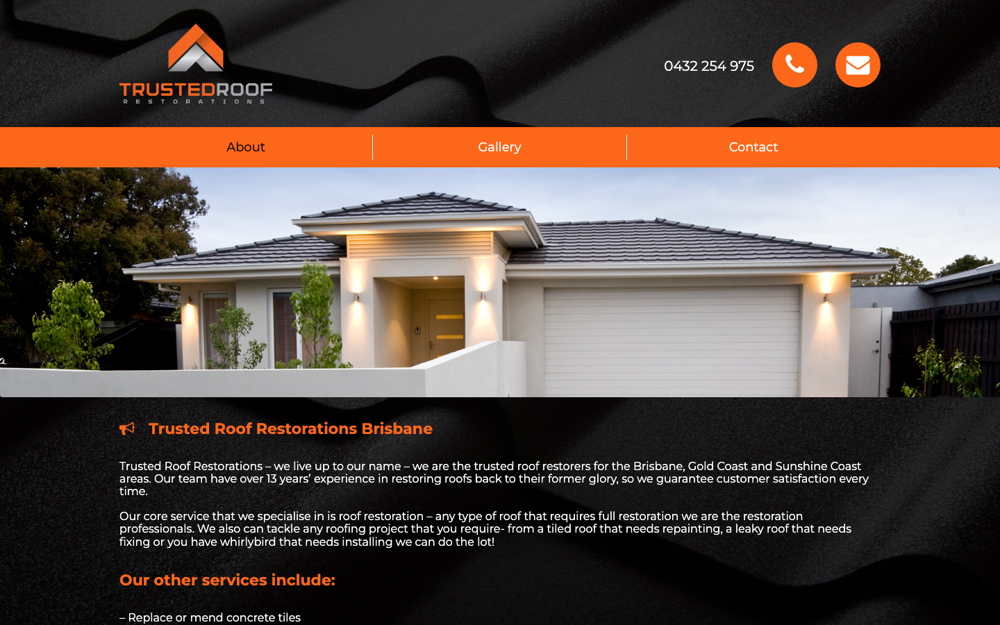
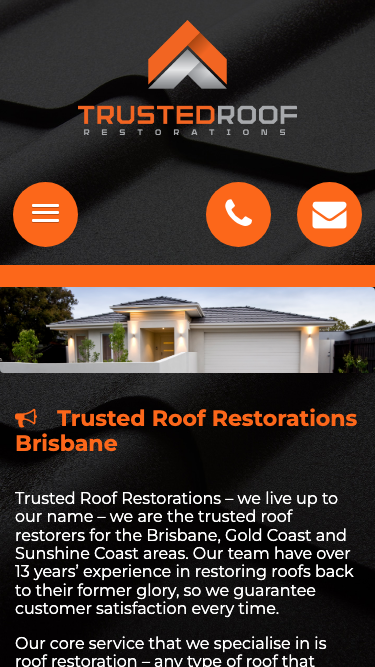

# Trusted Roof Restorations · 现状审计与重构提议

> **53/100** · strong_redesign · 行业：roofer · 地区：Brisbane · Google 评价：5★ （128 条）

## 内部分级 · 运营优先看这段

**投入分级：** `D` 跳过 — 不投入精力

**触发依据：**
- [hard skip · too_many_categories] GBP 多元业务分类 ≥ 5 个 — 需求复杂度超出标准产品包

**下一步行动：** 不投入精力，归档原因。';

## 一、店家现状速览

**线索来源 · 联系开场可用**:
- **来源**: Google Places API (官方搜索)
- **搜索关键词**: `roofer brisbane`
- **结果排名**: 第 5 位
- **首次发现**: 2026-05-14
- **Batch**: `places-roofer-brisbane-202605150200`

**审计结论：** audit_score=53 → strong_redesign · weakest: seo 34, technical 38 · fired: no_https, high_traction_old_site · 1 critical issues

**已触发的 hard triggers：** `no_https` · `high_traction_old_site`

- 电话：0432 254 975
- 地址：Mount Cotton Rd, Mount Cotton QLD 4165, Australia
- 网站：[http://trustedroofing.com.au/](http://trustedroofing.com.au/)

## 二、客户访问时看到的页面

**慢速 4G 加载实景视频**（1.6 Mbps · 150ms 延迟 · 4× CPU 节流，模拟真实手机访客的体验）：

[播放视频](./video/mobile-throttled.webm)

## 三、视觉审计 · Vision LLM 怎么看

> The site shows the business name and contact icons clearly, but the heavy dark styling, weak trust proof, and unclear mobile actions make it feel older than a current Brisbane roofing business.

新鲜度 **3/10** · 信任度 **5/10** · 转化准备度 **5/10** · 设计年代 `outdated`

**值得保留的优点：**
- The business name and logo are clearly visible in both desktop and mobile screenshots.
- The orange accent color is memorable and can be reused for calls to action.
- The visible phone number on desktop is easy to find in the header.

## 五、当前网站在哪里"漏水"

### 关键问题 · 2 项（立刻在伤害成交）

### 关键 · https_enabled

**技术事实**

http only

**普通话翻译**

你的网站没有 HTTPS — 浏览器会在地址栏显示「不安全」标记，部分浏览器（Chrome / Firefox）甚至会弹出全屏警告挡住页面。

**对客户的影响**

Google 早在 2018 年起把 HTTPS 列为搜索排名因素，没有 HTTPS 直接拉低自然搜索可见度；且超过 80% 的访客看到「不安全」标识会立刻关掉。对你这种 128 条 Google 评价积累起来的口碑来说，访客在网址栏就被劝退，等于浪费了所有 GBP 流量。

### 关键 · Mobile phone number is hidden

**技术事实**

On mobile, the top area shows a round orange phone icon but no visible phone number next to it.

**普通话翻译**

手机页面只有电话图标，没有直接显示电话号码，客户要先猜这个按钮能不能打电话。

**对客户的影响**

本地服务客户很多是在手机上找人，约70%的本地搜索会发生在移动端。电话不够明显，会减少马上来电的机会，尤其是漏水这类急单。

**正确长啥样**

A sticky mobile header with a visible phone number or a full-width 'Call 0432 254 975' button that stays easy to tap.

**Redesign 怎么改**

Add a persistent mobile call bar showing 'Call 0432 254 975' with the phone icon, and keep it visible at the top or bottom of the screen.

### 主要问题 · 6 项（影响转化的明显短板）

### 主要 · homepage_title_clear

**技术事实**

title='### MAKE A BOOKING' contains-name=false contains-niche=false

**普通话翻译**

你网站的浏览器标签 title 没把业务名字 + 服务关键词写清楚（比如该写「Trusted Roof Restorations - roofer Brisbane」，但目前是泛泛一句）。

**对客户的影响**

Google 搜索结果里展示的就是这个 title。写不清楚 = 排名靠后 + 即使排上来客户也不知道是不是匹配的服务。SEO 最便宜的修复，但很多本地企业完全没做。

### 主要 · local_schema_markup

**技术事实**

no LocalBusiness JSON-LD

**普通话翻译**

网站没有 LocalBusiness JSON-LD 结构化数据（让 Google / AI 知道你是本地企业、地址、电话、营业时间的标准格式）。

**对客户的影响**

Google「附近的服务」「Knowledge Panel」「AI Overview」都依赖这类结构化数据。没有 = 即使排名上去也不会出现在右侧 Knowledge Panel 或地图卡片里 — 错失高转化的展示位。AI agent / ChatGPT 引用本地商家时也是基于这些数据。

### 主要 · Heavy dark background feels dated

**技术事实**

Both screenshots use a black roof-tile texture behind the header and content, with white text sitting directly on the dark image.

**普通话翻译**

现在页面大面积黑色屋顶纹理，看起来像很多年前的网站模板，不像一家正在活跃接单的本地公司。

**对客户的影响**

客户从 Google 点进来后通常几秒内判断靠不靠谱。视觉显旧会让一部分人直接返回搜索结果，去点看起来更新、更专业的竞争对手。

**正确长啥样**

A light, clean page background with dark readable text, one strong orange accent color, and real project photography used in framed sections rather than as a repeated texture.

**Redesign 怎么改**

Replace the black texture background with a white or very light grey layout, keep orange for primary actions, and use roof photos only as hero or gallery images.

### 主要 · No clear quote action above fold

**技术事实**

The desktop header shows a phone number and two round icons, but there is no visible 'Get a Quote' or 'Request Inspection' button in the first screen.

**普通话翻译**

页面顶部没有清楚的“获取报价”按钮，只能打电话或点图标。

**对客户的影响**

有些客户上班或晚上看网站，不方便马上打电话。没有报价入口，会让这些潜在客户流失到提供表单报价的同行那里。

**正确长啥样**

A prominent orange button reading 'Get a Free Roof Quote' beside the phone number on desktop and below the hero headline on mobile.

**Redesign 怎么改**

Add a primary CTA button above the fold: 'Get a Free Roof Quote', linking to a short contact form, with phone as the secondary action.

### 主要 · Trust proof is not visible

**技术事实**

The visible first screen shows the logo, phone, menu, hero image, and text, but no Google rating, review count, licence, insurance, warranty, or local suburb proof.

**普通话翻译**

首屏没有看到评分、评价数量、执照、保险、质保这些能让客户放心的信息。

**对客户的影响**

修屋顶金额高、风险高，客户会更谨慎。缺少信任证明会让他们不敢提交信息或打电话，特别是从 Google 商家资料第一次进来的陌生客户。

**正确长啥样**

Above-fold trust row with Google star rating, '13+ years experience', licence/insured badge, service area, and a workmanship warranty statement.

**Redesign 怎么改**

Place a compact trust strip under the hero or header with review rating, years in business, Brisbane service area, warranty, and licence/insurance details.

### 主要 · Hero image lacks a selling message

**技术事实**

The main house photo appears as a wide image with no overlaid headline, service promise, suburb relevance, or call button.

**普通话翻译**

首图只是展示房子，没有告诉客户你具体做什么、为什么值得信任、下一步该点哪里。

**对客户的影响**

访客进入页面后需要马上确认“这家公司能解决我的问题”。信息不够直接，会增加离开的概率，减少来自 Google 流量的询盘。

**正确长啥样**

Hero section with a real roof restoration image, headline like 'Brisbane Roof Restoration & Repairs', a short trust line, and call/quote buttons visible on top or directly below.

**Redesign 怎么改**

Rebuild the hero with a service-specific headline, Brisbane location cue, Google rating or warranty proof, and two actions: call and request quote.

## 六、Redesign 的发力点（综合视觉 + 评论数据）

1. [视觉] 1. Add a visible mobile call bar and desktop/mobile quote CTA above the fold.
2. [视觉] 2. Replace the dark textured layout with a lighter, more professional service-business design.
3. [视觉] 3. Add above-fold trust proof: Google rating, warranty, licence/insurance, and Brisbane service area.

## 七、推荐销售切入点

- 你的网站没有 HTTPS — 浏览器对来访客户显示「不安全」，直接伤害信任
- 你已经有不错的 Google 流量基础（128 条 5★ 评论），但当前网站设计在浪费这些点击

## 真实速度数据 · Google PageSpeed Insights

我们前面那段「慢速 4G 加载视频」是我们这边的实验室结果。这一段是 **Google 自己**对你网站打的分，包括过去 28 天 **真实访客**的网络体验数据（CRUX field data）。

### 移动端（mobile）

**Lighthouse 分数（实验室）：**

| 维度 | 分数 |
|---|---|
| 性能 (Performance) | **53/100** |
| 可访问性 (Accessibility) | 90/100 |
| 最佳实践 (Best Practices) | 100/100 |
| SEO | 85/100 |

**Lab 关键指标：** LCP `8.6s` · FCP `4.1s` · CLS `0.075` · TBT `249ms`

**Google 建议的优化项（按节省时间排序，前 4）：**

- **Reduce unused CSS** — 节省 750ms · 节省 130KB
- **Reduce unused JavaScript** — 节省 150ms · 节省 406KB
- **Minify CSS** — 节省 150ms · 节省 5KB
- **Initial server response time was short** — 节省 146ms

### 桌面端（desktop）

**Lighthouse 分数：** Performance 57 · A11y 86 · Best Practices 100 · SEO 85

## 图片优化与第三方脚本体重

PSI 给的是宏观分数，下面是具体可改的两块：图片格式与 tracker 脚本。

### 图片优化（共 34 张）

- **优化率：** 0%（0/34 使用 WebP/AVIF/SVG）
- **响应式 srcset：** 0%
- **Lazy load：** 0%
- **Alt 文字（非空）：** 3%
- **显式 width/height：** 6%（防止 CLS 布局抖动）

**总评：** 基本未优化 — redesign 可显著降低图片下载量

**具体问题：**
- [major] 34 张图几乎全是 JPG/PNG，未用 WebP/AVIF — 估算可节省 30-50% 图片下载量
- [minor] 34/34 张图无响应式 srcset — 移动端浪费带宽
- [minor] 34/34 张图未 lazy load — 首屏外的图阻塞主线程
- [major] 33/34 张图缺 alt 文字 — 影响 SEO + 可访问性 + AI 抓取
- [minor] 32/34 张图无显式 width/height — 加重 CLS 布局抖动

## SEO 迁移评估 与 运营活跃度

客户最常担心的问题：「我重做网站，会不会丢掉 Google 排名？」这一段直接回答。

### 现有页面盘点

- **Sitemap 状态：** 已检测到 → `https://www.trustedroofing.com.au/wp-sitemap.xml`
- **页面总数：** 26
- **迁移复杂度：** 中（≤80 页 — 服务页 + 部分 blog）

**页面分类：**

| 类型 | 数量 |
|---|---|
| 作品集 / 案例 | 23 |
| 顶层页面 | 1 |
| 首页 | 1 |
| 联系 / 报价 | 1 |

**Sitemap lastmod 跨度：** 最旧 2018-01-09 → 最新 2023-04-13

**Redirect 计划承诺：** redesign 上线时我们会附一份 26 条 1:1 redirect 表（旧 URL → 新 URL），保证 Google 已经索引的页面权重无损迁移。已经在 Google 第一二页的关键词不会丢。

### SEO 长尾结构（服务 × 区域 = 本地搜索流量金矿）

- **服务专项页（如 /metal-roofing/）：** 0 个
- **区域页（如 /service-areas/brisbane/）：** 0 个
- **服务×区域组合页（如 /metal-roofing-brisbane/）：** 0 个

**长尾覆盖：** 无 — 没有服务专项页面，redesign 时是关键补点

### 运营活跃度

- **整体活跃度：** 休眠（超过 1 年没更新过） （最近一次更新 1128 天前）
- **Blog 板块：** 未发现 — 没有内容营销基础
- **社交媒体链接：** 网站上引用了 3 个平台 — facebook, instagram, linkedin

> **关键发现：** 客户的网站超过一年没动过。redesign 之后我们也建议帮忙建立最低限度的内容更新节奏（每月 1 篇 case study 即可），否则 AI / Google 都会判定网站「死站」。

## 域名历史与邮件信誉

### 邮件 DNS 配置（影响未来邮件营销 / 冷邮件投递率）

- **SPF (反垃圾发件验证)：** 已配置
- **DKIM (邮件签名)：** 已配置（selectors: default）
- **DMARC (策略)：** ⚠ 未配置 — 域名易被仿冒做钓鱼
- **整体邮件投递信誉：** `partial` (只有 2/3 — 建议补全)

> 这是后续 **「Social Media Management 月度包」** 或 **「Cold Outreach 启动包」** 的前置条件 —— 邮件 DNS 没修好，发出去的邮件全进垃圾箱。redesign 时一并处理。

## 技术栈与营销基建

从网站源码识别出来的工具，能帮我们判断这位客户的数字成熟度。

- **网站平台 (CMS)：** WordPress（迁移复杂度参考；WordPress / Wix / Squarespace 这类有标准导出工具，custom-coded 会复杂）
- **分析工具：** 未检测到 — 客户目前看不到任何流量数据，等于在盲飞
- **广告 Pixel：** 未检测到 — 暂未投放追踪型广告
- **托管 / CDN 线索：** Cloudflare-fronted

**数字成熟度打分：** 1 / 6 （低 — 客户对网站的认知是「有就行」，需要先讲清楚一份能赚钱的网站长什么样）

## 信任凭证 · generic

本地服务的客户在掏钱之前会查这些凭证。缺失 = 客户跳到下一家。

**信任分：** 65/100

### 已显示的（4 项）

- **ABN** (20 分) — "ABN: 83 256 783 697"
- **保险** (15 分) — "fully insured"
- **保修** (15 分) — "workmanship guarantee"
- **行业证书** (15 分) — "licensed"

### 缺失的（3 项 — redesign 必补 / 提醒客户提供素材）

- [行业惯例] **从业年限** (15 分)
- [行业惯例] **荣誉 / 奖项** (10 分)
- [行业惯例] **免费报价** (10 分)

## AI 时代可发现性 · GEO Readiness

GEO = Generative Engine Optimization。ChatGPT、Perplexity、Google AI Overviews 这些 AI 搜索产品**不像传统搜索引擎那样按"关键词排名"工作**，它们直接抓取结构化数据并把答案合成给用户。如果你的网站在 AI 抓取这一块做得不到位，等于在生成式搜索时代隐身。

**AI 可发现性总分：** 25 / 100 — AI agent / ChatGPT 几乎无法准确引用此网站 — 在生成式搜索时代等于隐身

### 已经做到的（3 项）

- [PASS] `semantic_landmarks` — 4 semantic landmarks present: <main, <nav, <header, <footer
- [PASS] `eeat_business_credentials` — 3/4 credentials in copy: ABN, license/QBCC, insurance
- [PASS] `eeat_warranty_trust` — warranty/guarantee mentioned

### 还缺的（9 项 — 这些是 redesign 时一并补上的标准动作）

- [缺失] `llms_txt_present` (5 分) — no /llms.txt at standard path
- [缺失] `ai_bot_robots_policy` (5 分) — robots.txt has no explicit policy for AI crawlers (GPTBot/ClaudeBot/etc)
- [缺失] `localbusiness_schema` (15 分) — no LocalBusiness or Organization JSON-LD
- [缺失] `service_schema` (10 分) — no Service JSON-LD
- [缺失] `faqpage_schema` (10 分) — no FAQPage JSON-LD (loses AI Overview / featured snippet eligibility)
- [缺失] `aggregaterating_schema` (5 分) — no AggregateRating JSON-LD (★ rating not shown in search snippets)
- [缺失] `breadcrumb_schema` (5 分) — no BreadcrumbList JSON-LD
- [缺失] `faq_qa_pattern` (10 分) — 0 question-style heading(s) found (Q&A format helps AI extraction)
- [缺失] `jsonld_at_least_one` (10 分) — 0 JSON-LD block(s) detected on page

> **销售切入：** 「ChatGPT 现在每月 30 亿次搜索，本地服务用户问『Brisbane 哪家屋顶公司靠谱』，AI 回答时只引用结构化数据完整的网站。你目前在这个新阵地的得分是 25/100。」

## 业务规模信号 · 内部筛选用

**注：这一段只给运营内部看，不进入客户报告。** 用来判断这个 lead 是不是匹配我们「小网站 / 多批量 / 快上线」的产品定位。

- **规模信号汇总：** 小型客户特征
- **客户分级：** `small` — 小型，符合我们标准产品包定位

> 报价以上方 **建议报价** 为准（来自 entity.grade.recommended_pricing / PRODUCT_TIER_TABLE）。本段只用来判断 lead 是否匹配产品定位，不竞争报价。

**触发依据：**
- Google 评价 128 条（≥50，有规模基础）
- GBP 多业务分类 5 个（多元化经营）

## Upsell 机会 · redesign 之外的月度营收

redesign 是一次性收入。以下是基于这个客户当前现状自动识别的**持续性服务包**机会，可以在 redesign 提案签字时一并捆绑进去。

### Social Media Management 月度包

**触发依据：** 客户活跃度为「休眠（>1 年没动）」，但 Google 上有 128 条 5★ 评价的口碑底子 — 有内容素材却没在用。

**包内容：** 每月 8-12 帖（FB / IG / LinkedIn 至少 2 平台）+ 4 条工程现场 reels/short videos + 月度 GBP 帖子 2 条 + 评论回复代运营。

**月度费用区间：** $800-1,500/月（视平台数量与内容深度）

**销售切入：** 「你 Google 上的 128 条好评是金矿，但你的 Facebook 已经 1128 天没动过 — 这等于你把口碑资产堆在仓库里没拿去卖。我们月度包就是把这部分自动化跑起来。」

### 内容写作月度包（Blog / 案例 / SEO 长尾）

**触发依据：** 网站没有 blog 板块 — 没有内容营销基础设施，长尾 SEO 流量为零。

**包内容：** 每月 2 篇 SEO-optimized blog（800-1,200 字）+ 每季度 1 篇 case study（含 before/after 图）+ 关键词研究报告。

**月度费用区间：** $400-800/月

**销售切入：** 「ChatGPT 时代搜索引擎更偏爱有「专家深度内容」的网站。你目前的网站只有服务介绍页 — AI 可引用的素材几乎为零。」

<!-- M2-D6 required token bridge: 现网站快速诊断 → covered by detail-builder section -->
<!-- 现网站快速诊断 -->

<!-- M2-D6 required token bridge: 业主沟通要点 → covered by detail-builder section -->
<!-- 业主沟通要点 -->

<!-- M2-D6 required token bridge: 账户与档案 → covered by detail-builder section -->
<!-- 账户与档案 -->

## 附录 · 数据出处

- Cheap audit version: `-`
- Detailed audit version: `2026-05-11-v1`
- Vision model: `codex_cli`
- Review source: `Google Places · most_relevant (max 5)`
- 完整 audit 报告 HTML：[internal-audit-report](./internal-audit-report.html)
