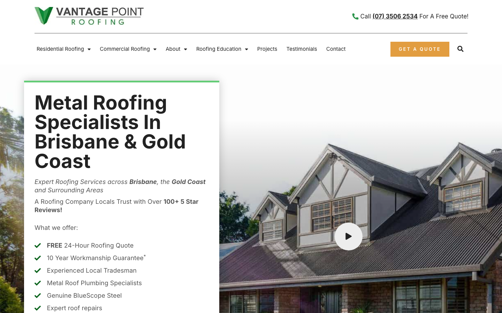

# Vantage Point Roofing · 现状审计与重构提议

> **70/100** · moderate_candidate · 行业：roofer · 地区：Brisbane · Google 评价：4.6★ （138 条）

## 内部分级 · 运营优先看这段

**投入分级：** `C` 批量轻触 — 模板邮件 + 报告 PDF 链接，无主动跟进

**触发依据：**
- C · moderate_candidate · audit 70 · 138 评论 4.6★ (未达 B 标准)

**下一步行动：** 标准模板邮件 + master.md PDF 链接，无主动跟进。等客户回复触发后再投入。

## 一、店家现状速览

**线索来源 · 联系开场可用**:
- **来源**: Google Places API (官方搜索)
- **搜索关键词**: `roofer brisbane`
- **结果排名**: 第 10 位
- **首次发现**: 2026-05-14
- **Batch**: `places-roofer-brisbane-202605150200`

**审计结论：** audit_score=70 → moderate_candidate · weakest: gbp 45, visual 50 · fired: high_traction_old_site

**已触发的 hard triggers：** `high_traction_old_site`

- 电话：(07) 3506 2534
- 地址：4/288-292 Newmarket Rd, Wilston QLD 4051, Australia
- 网站：[https://vantagepointroofing.com.au/?utm_campaign=gmb](https://vantagepointroofing.com.au/?utm_campaign=gmb)

## 二、客户访问时看到的页面

**慢速 4G 加载实景视频**（1.6 Mbps · 150ms 延迟 · 4× CPU 节流，模拟真实手机访客的体验）：

[播放视频](./video/mobile-throttled.webm)

## 三、视觉审计 · Vision LLM 怎么看

> The site looks legitimate and established, but the above-the-fold experience makes it harder than necessary for a Brisbane roofing customer to call or request a quote quickly.

新鲜度 **6/10** · 信任度 **7/10** · 转化准备度 **5/10** · 设计年代 `slightly_outdated`

**值得保留的优点：**
- The logo is clear and professional in both desktop and mobile headers.
- The phone number is visible on desktop and paired with a free quote message.
- The hero copy includes useful trust proof, including '100+ 5 Star Reviews' and a 10-year workmanship guarantee.

## 五、当前网站在哪里"漏水"

### 关键问题 · 1 项（立刻在伤害成交）

### 关键 · Mobile phone number is hidden

**技术事实**

On the mobile header, there is only a black phone icon beside the logo, with no visible phone number or call text.

**普通话翻译**

手机页面顶部只看到一个电话图标，看不到电话号码，客户不一定知道能不能点。

**对客户的影响**

本地找屋顶维修的人很多是在手机上直接比较商家；如果电话不够明显，客户可能在几秒内返回 Google，点下一家公司。

**正确长啥样**

A mobile sticky header with a clearly labeled tap-to-call button such as 'Call 07 3506 2534' or a prominent green phone button with supporting text visible without scrolling.

**Redesign 怎么改**

Replace the lone phone icon with a high-contrast sticky call button showing the number or 'Call Now', and keep it visible at the top of the mobile viewport.

### 主要问题 · 4 项（影响转化的明显短板）

### 主要 · homepage_title_clear

**技术事实**

title='# Metal Roofing Specialists in Brisbane & Gold Coast' contains-name=false contains-niche=false

**普通话翻译**

你网站的浏览器标签 title 没把业务名字 + 服务关键词写清楚（比如该写「Vantage Point Roofing - roofer Brisbane」，但目前是泛泛一句）。

**对客户的影响**

Google 搜索结果里展示的就是这个 title。写不清楚 = 排名靠后 + 即使排上来客户也不知道是不是匹配的服务。SEO 最便宜的修复，但很多本地企业完全没做。

### 主要 · No quote button above fold on mobile

**技术事实**

The mobile screenshot shows the headline, intro copy, review claim, and offer list, but no visible 'Get a Quote' or call-to-action button in the first screen.

**普通话翻译**

手机首屏有很多介绍文字，但没有马上让客户联系你的按钮。

**对客户的影响**

访客通常在前 8 秒决定要不要继续看；没有明显按钮，会让已经有需求的人少一步行动，询盘和电话都会流失。

**正确长啥样**

Below the mobile headline, show two large buttons: 'Call Now' and 'Get a Free Quote', followed by the review proof and service bullets.

**Redesign 怎么改**

Move a primary quote button and secondary call button directly under the hero headline on mobile, before the 'What we offer' list.

### 主要 · Hero lacks direct action

**技术事实**

On desktop, the main hero card contains the large 'Metal Roofing Specialists' headline, review text, and bullet list, but no quote or call button inside the hero card.

**普通话翻译**

电脑页面主视觉区域讲得很清楚，但客户看到重点后没有立刻可以点的报价按钮。

**对客户的影响**

客户越需要找按钮，越容易分心或离开；对从 Google 进来的流量来说，每多一步都会减少来电和报价表单。

**正确长啥样**

The hero card should include a large primary 'Get a Free Quote' button and a secondary 'Call (07) 3506 2534' link directly below the trust text.

**Redesign 怎么改**

Add two clear hero actions inside the white card: an orange or green quote button and a phone action, placed before the service bullet list.

### 主要 · Navigation feels crowded

**技术事实**

The desktop navigation contains multiple dropdown items, Projects, Testimonials, Contact, a large orange 'Get a Quote' button, and a search icon all in one row.

**普通话翻译**

电脑顶部菜单东西太多，客户不知道应该先点哪里。

**对客户的影响**

选择太多会让人犹豫；本地服务客户通常只想确认你靠谱、看案例、然后打电话，菜单复杂会降低行动速度。

**正确长啥样**

A simpler header with Services, Projects, Reviews, Contact, plus one dominant 'Get a Quote' button and the phone number.

**Redesign 怎么改**

Condense the header navigation into 4 core links, remove or de-emphasize the search icon, and keep quote plus phone as the visual priority.

## 六、Redesign 的发力点（综合视觉 + 评论数据）

1. [视觉] 1. Add a visible sticky mobile call/quote action above the fold.
2. [视觉] 2. Place primary quote and phone buttons directly inside the hero area.
3. [视觉] 3. Simplify the desktop navigation so phone, reviews, projects, and quote are the main path.

## 七、推荐销售切入点

- 你已经有不错的 Google 流量基础（138 条 4.6★ 评论），但当前网站设计在浪费这些点击

## 真实速度数据 · Google PageSpeed Insights

我们前面那段「慢速 4G 加载视频」是我们这边的实验室结果。这一段是 **Google 自己**对你网站打的分，包括过去 28 天 **真实访客**的网络体验数据（CRUX field data）。

### 桌面端（desktop）

**Lighthouse 分数：** Performance 72 · A11y 90 · Best Practices 100 · SEO 92

## 图片优化与第三方脚本体重

PSI 给的是宏观分数，下面是具体可改的两块：图片格式与 tracker 脚本。

### 图片优化（共 46 张）

- **优化率：** 174%（80/46 使用 WebP/AVIF/SVG）
- **响应式 srcset：** 28%
- **Lazy load：** 22%
- **Alt 文字（非空）：** 89%
- **显式 width/height：** 100%（防止 CLS 布局抖动）

**总评：** 部分优化 — 还有空间

**具体问题：**
- [minor] 4 张图仍是 JPG/PNG，建议转 WebP
- [minor] 33/46 张图无响应式 srcset — 移动端浪费带宽
- [minor] 36/46 张图未 lazy load — 首屏外的图阻塞主线程

### 第三方脚本占用情况

- **总请求数：** 151（129 自有 + 22 第三方）
- **第三方占总下载量：** 25%（639 KB / 2537 KB）
- **Tracker 脚本数：** 10（合计 426 KB）

**已识别的 tracker：**

| 工具 | 类型 | 请求数 | 字节 |
|---|---|---|---|
| Google Tag Manager | analytics | 2 | 293.2 KB |
| Meta Pixel | ad_pixel | 2 | 97.3 KB |
| Google Analytics | analytics | 3 | 20.3 KB |
| Microsoft Bing UET | ad_pixel | 3 | 15.0 KB |

> **观察：** 10 个 tracker 合计加载了 426 KB —— 这些都是阻塞主线程的脚本，是性能 + 隐私双角度的销售切入点。redesign 时可以建议清理不再使用的 tracker。

## SEO 迁移评估 与 运营活跃度

客户最常担心的问题：「我重做网站，会不会丢掉 Google 排名？」这一段直接回答。

### 现有页面盘点

- **Sitemap 状态：** 已检测到 → `https://vantagepointroofing.com.au/sitemap_index.xml`
- **页面总数：** 161
- **迁移复杂度：** 高（>80 页 — 需要分阶段迁移 + 完整 redirect map）

**页面分类：**

| 类型 | 数量 |
|---|---|
| 服务详情页 | 77 |
| service_area_page | 45 |
| 顶层页面 | 21 |
| area_page | 11 |
| 关于 / 团队 | 2 |
| Blog 文章 | 1 |
| 首页 | 1 |
| 联系 / 报价 | 1 |
| 客户评价 | 1 |
| 法律 / 隐私 | 1 |

**Sitemap lastmod 跨度：** 最旧 2016-04-07 → 最新 2026-05-11

**Redirect 计划承诺：** redesign 上线时我们会附一份 50 条 1:1 redirect 表（旧 URL → 新 URL），保证 Google 已经索引的页面权重无损迁移。已经在 Google 第一二页的关键词不会丢。

### SEO 长尾结构（服务 × 区域 = 本地搜索流量金矿）

- **服务专项页（如 /metal-roofing/）：** 77 个
- **区域页（如 /service-areas/brisbane/）：** 11 个
- **服务×区域组合页（如 /metal-roofing-brisbane/）：** 45 个

**长尾覆盖：** 强 — 已有 5+ 服务×区域页，长尾流量基础在

**现有服务页样本：** `/signs-its-time-to-replace-your-roof/` · `/limited-offer-50-off-gutter-guard/` · `/why-metal-roofs-leak-less-than-tile-roofs/` · `/metal-roof-leaks-causes-quick-fixes/` · `/what-to-look-for-in-the-roof-when-buying-a-home/`

**现有服务×区域页样本：** `/what-are-the-benefits-of-metal-roof-replacement/` · `/lifespan-of-different-roof-types/` · `/whats-in-a-roof-replacement-quote/` · `/benefits-of-skylights-a-round-up-of-the-facts-bonus-case-study/` · `/8-points-of-metal-roofing-maintenance/`

### 运营活跃度

- **整体活跃度：** 活跃（30 天内有更新） （最近一次更新 0 天前）
- **Blog 板块：** 有，共 1 篇文章 
- **社交媒体链接：** 网站上引用了 5 个平台 — facebook, instagram, linkedin, twitter, youtube

## 联系表单与防垃圾设置

客户能不能 *方便地* 把信息留下来 = 直接的转化路径。这一段审视所有 `<form>` 元素的可用性 + 防 spam 配置。

### 表单 · 10 字段（摩擦：高（≥7 字段，会显著降低转化））

- **字段构成：** Name(text,必填) · Suburb(text,必填) · Email(email,必填) · Phone(tel,必填) · Property Type(select-one,必填) · Job Type(select-one,必填) · Roof Material(select-one,必填) · Message(textarea) · Unfortunately, due to changes in building legislation we’re (select-one) · Unfortunately we’re not currently undertaking Asbestos roof (select-one)
- **必填字段数：** 7/10
- **常见关键字段：** email · phone · message
- **提交按钮：** 「Get my quote」
- **Honeypot 防 spam：** 未检测到

**未检测到任何 anti-spam 措施**（reCAPTCHA / hCaptcha / Turnstile / honeypot 都没有）— 表单极容易被自动机器人灌爆，垃圾询盘会让客户对真实询盘麻木。redesign 时建议加 Cloudflare Turnstile（不可见，免费）。

**Audit 总结：**

- [关键] 表单字段数 10 — 远超行业标准 3-4 字段，会显著降低转化率
- [中等] 表单未检测到任何 anti-spam 措施（reCAPTCHA / hCaptcha / Turnstile / honeypot 都没有）— 高 spam 风险

## 域名历史与邮件信誉

### 邮件 DNS 配置（影响未来邮件营销 / 冷邮件投递率）

- **SPF (反垃圾发件验证)：** 已配置
- **DKIM (邮件签名)：** 已配置（selectors: selector1）
- **DMARC (策略)：** 已配置（policy: `reject`）
- **整体邮件投递信誉：** `strong` (SPF + DKIM + DMARC 齐全)

## 技术栈与营销基建

从网站源码识别出来的工具，能帮我们判断这位客户的数字成熟度。

- **网站平台 (CMS)：** WordPress（迁移复杂度参考；WordPress / Wix / Squarespace 这类有标准导出工具，custom-coded 会复杂）
- **分析工具：** Google Tag Manager · Google Analytics 4 · Google Analytics (Universal)
- **广告 Pixel：** Meta (Facebook) Pixel · Microsoft (Bing) UET — 客户已经在投放（或投放过）付费广告，对营销预算不陌生

**数字成熟度打分：** 4 / 6 （高 — 客户懂数字营销，redesign 谈预算时不必从零教育）

### Redesign 时必须保留 / 重新安装的追踪代码

客户可能有数月 / 数年的历史数据 + 广告投放受众 sit 在这些 ID 上面。重做时**必须用同一套 ID 重新接进新网站**，否则等于清零所有累积。

- Google Tag Manager
- Google Analytics 4
- Google Analytics (Universal)
- Meta (Facebook) Pixel
- Microsoft (Bing) UET

我们 redesign 交付清单会把这些列为「必须 setup 项」。

> **关键发现：客户网站还装着 Universal Analytics**，这套工具 Google 已于 2023 年 7 月停止收集数据。也就是说，**他们至少 2 年没有看过任何真实的网站访客数据**。这是销售切入的强角度。

## 信任凭证 · generic

本地服务的客户在掏钱之前会查这些凭证。缺失 = 客户跳到下一家。

**信任分：** 25/100

### 已显示的（2 项）

- **保修** (15 分) — "Workmanship Guarantee"
- **免费报价** (10 分) — "free quote"

### 缺失的（5 项 — redesign 必补 / 提醒客户提供素材）

- [行业惯例] **ABN** (20 分)
- [行业惯例] **保险** (15 分)
- [行业惯例] **从业年限** (15 分)
- [行业惯例] **行业证书** (15 分)
- [行业惯例] **荣誉 / 奖项** (10 分)

## AI 时代可发现性 · GEO Readiness

GEO = Generative Engine Optimization。ChatGPT、Perplexity、Google AI Overviews 这些 AI 搜索产品**不像传统搜索引擎那样按"关键词排名"工作**，它们直接抓取结构化数据并把答案合成给用户。如果你的网站在 AI 抓取这一块做得不到位，等于在生成式搜索时代隐身。

**AI 可发现性总分：** 65 / 100 — AI agent 抓取部分支持，但关键 schema / 凭证 / FAQ 缺失

### 已经做到的（7 项）

- [PASS] `llms_txt_present` — llms.txt found (162970 bytes)
- [PASS] `localbusiness_schema` — LocalBusiness JSON-LD present
- [PASS] `service_schema` — Service JSON-LD present
- [PASS] `semantic_landmarks` — 5 semantic landmarks present: <nav, <header, <footer, <article, <section
- [PASS] `eeat_business_credentials` — 2/4 credentials in copy: license/QBCC, insurance
- [PASS] `eeat_warranty_trust` — warranty/guarantee mentioned
- [PASS] `jsonld_at_least_one` — 9 JSON-LD block(s) detected on page

### 还缺的（5 项 — 这些是 redesign 时一并补上的标准动作）

- [缺失] `ai_bot_robots_policy` (5 分) — robots.txt has no explicit policy for AI crawlers (GPTBot/ClaudeBot/etc)
- [缺失] `faqpage_schema` (10 分) — no FAQPage JSON-LD (loses AI Overview / featured snippet eligibility)
- [缺失] `aggregaterating_schema` (5 分) — no AggregateRating JSON-LD (★ rating not shown in search snippets)
- [缺失] `breadcrumb_schema` (5 分) — no BreadcrumbList JSON-LD
- [缺失] `faq_qa_pattern` (10 分) — 1 question-style heading(s) found (Q&A format helps AI extraction)

> **销售切入：** 「ChatGPT 现在每月 30 亿次搜索，本地服务用户问『Brisbane 哪家屋顶公司靠谱』，AI 回答时只引用结构化数据完整的网站。你目前在这个新阵地的得分是 65/100。」

## 业务规模信号 · 内部筛选用

**注：这一段只给运营内部看，不进入客户报告。** 用来判断这个 lead 是不是匹配我们「小网站 / 多批量 / 快上线」的产品定位。

- **规模信号汇总：** 中型客户特征
- **客户分级：** `mid` — 中型客户，可接但价格要往上提（基础包 + 配置项）

> 报价以上方 **建议报价** 为准（来自 entity.grade.recommended_pricing / PRODUCT_TIER_TABLE）。本段只用来判断 lead 是否匹配产品定位，不竞争报价。

**触发依据：**
- Google 评价 138 条（≥50，有规模基础）
- 网站页面数 161（≥100，中等复杂度）
- 已部署 5 个分析 / pixel 工具（高数字成熟度）
- 引用 5 个社交平台（多渠道运营）

<!-- M2-D6 required token bridge: 现网站快速诊断 → covered by detail-builder section -->
<!-- 现网站快速诊断 -->

<!-- M2-D6 required token bridge: 业主沟通要点 → covered by detail-builder section -->
<!-- 业主沟通要点 -->

<!-- M2-D6 required token bridge: 账户与档案 → covered by detail-builder section -->
<!-- 账户与档案 -->

## 附录 · 数据出处

- Cheap audit version: `-`
- Detailed audit version: `2026-05-11-v1`
- Vision model: `codex_cli`
- Review source: `Google Places · most_relevant (max 5)`
- 完整 audit 报告 HTML：[internal-audit-report](./internal-audit-report.html)
