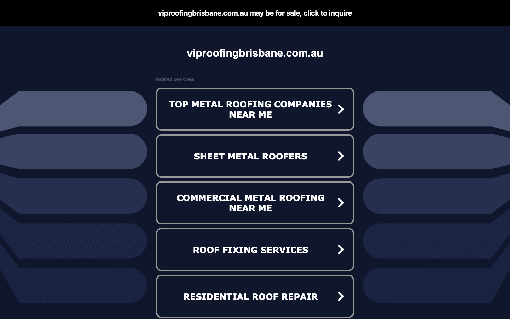
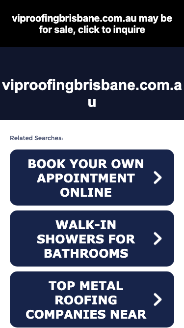

# VIP Roofing Brisbane · 现状审计与重构提议

> **27/100** · strong_redesign · 行业：roofer · 地区：Brisbane · Google 评价：5★ （25 条）

## 内部分级 · 运营优先看这段

**投入分级：** `C` 批量轻触 — 模板邮件 + 报告 PDF 链接，无主动跟进

**触发依据：**
- C · strong_redesign · audit 27 · 25 评论 5★ (未达 B 标准)

**下一步行动：** 标准模板邮件 + master.md PDF 链接，无主动跟进。等客户回复触发后再投入。

## 一、店家现状速览

**线索来源 · 联系开场可用**:
- **来源**: Google Places API (官方搜索)
- **搜索关键词**: `roofer brisbane`
- **结果排名**: 第 15 位
- **首次发现**: 2026-05-14
- **Batch**: `places-roofer-brisbane-202605150200`

**审计结论：** audit_score=27 → strong_redesign · weakest: ux_conversion 0, seo 0 · fired: no_visible_cta_or_phone · 2 critical issues

**已触发的 hard triggers：** `no_visible_cta_or_phone`

- 电话：(07) 3062 7779
- 地址：39/71 Eagle St, Brisbane City QLD 4000, Australia
- 网站：[https://www.viproofingbrisbane.com.au/](https://www.viproofingbrisbane.com.au/)

## 二、客户访问时看到的页面

**慢速 4G 加载实景视频**（1.6 Mbps · 150ms 延迟 · 4× CPU 节流，模拟真实手机访客的体验）：

[播放视频](./video/mobile-throttled.webm)

## 三、视觉审计 · Vision LLM 怎么看

> The domain viproofingbrisbane.com.au is a parked/for-sale page with zero business content — any visitor from Google Maps or search is immediately sent to a competitor-referral page with no way to contact VIP Roofing Brisbane.

新鲜度 **1/10** · 信任度 **1/10** · 转化准备度 **1/10** · 设计年代 `severely_outdated`

**值得保留的优点：**
- The domain name 'viproofingbrisbane.com.au' is keyword-rich and location-specific — it is a strong commercial asset worth reclaiming or renewing rather than abandoning.
- The dark navy color palette used by the parking page could be adapted as a professional brand base color if the business builds a real site.
- The business appears to have an established Google Maps presence that is actively sending traffic — the infrastructure for local discovery exists, it just has nowhere to land.

## 五、当前网站在哪里"漏水"

### 关键问题 · 6 项（立刻在伤害成交）

### 关键 · above_fold_cta_within_5s

**技术事实**

no CTA keyword in first 1500 chars

**普通话翻译**

客户打开你的网站后，前 5 秒内（一屏之内）看不到任何明显的「联系我们 / 报价 / 立即拨打」按钮。

**对客户的影响**

行业研究：移动用户做决策的前 8 秒决定 70% 的留存。看不到 CTA = 等于没办法转化。你的 25 条好评在堆积信任，但客户找不到下一步该点哪。

### 关键 · phone_visible_above_fold

**技术事实**

phone hidden below fold or missing

**普通话翻译**

电话号码在第一屏看不到 — 客户必须滚动才能找到怎么联系你。

**对客户的影响**

本地服务客户 60-70% 倾向打电话沟通（不是填表单）。电话号没在第一屏 = 这部分客户里很多人会直接关掉去搜下一家。这是最便宜的转化优化之一。

### 关键 · No real website — domain is parked for sale

**技术事实**

The full viewport on both desktop and mobile shows a black banner reading 'viproofingbrisbane.com.au may be for sale, click to inquire', followed by the domain name in large white text and a list of 'Related Searches' buttons. There is no business content anywhere on the page.

**普通话翻译**

这个网址现在显示的是一个'域名待售'的停放页面，根本不是真正的公司网站。客户点进来只会看到一个待售广告页面，完全找不到您公司的任何信息。

**对客户的影响**

研究显示，88%的本地搜索用户在24小时内会打电话给找到的商家。但如果网站显示'域名待售'，访客会立刻认为这家公司已经倒闭或者是诈骗，100%会离开并联系竞争对手。这意味着所有通过谷歌地图或搜索点击进来的客户全部流失。

**正确长啥样**

A single-page site (even a simple one) with: business name + tagline above the fold, a large tap-to-call phone button, suburb coverage, one or two real photos of completed roofing jobs, and a Google review count/rating badge.

**Redesign 怎么改**

Register or reclaim an active domain and deploy a live landing page immediately. Even a one-page site built in an afternoon with a hero photo, phone CTA, and suburb list eliminates this failure mode entirely. If the domain is truly lost, redirect all GBP links to a working URL before any redesign work begins.

### 关键 · Parking page actively sends visitors to competitors

**技术事实**

Both screenshots show large clickable buttons labeled 'TOP METAL ROOFING COMPANIES NEAR ME', 'SHEET METAL ROOFERS', 'COMMERCIAL METAL ROOFING NEAR ME', 'ROOF FIXING SERVICES', 'RESIDENTIAL ROOF REPAIR'. These are paid domain-parking ad links that route traffic to competitor search results.

**普通话翻译**

页面上这些大按钮（比如'附近最好的金属屋顶公司'）不是您公司的服务链接，而是把客户引导到您竞争对手那里去的广告链接。

**对客户的影响**

每一个点击这些按钮的访客，都是被您自己的网站送到竞争对手手中的潜在客户。一个月下来，可能有数十个询价电话因此流失给了其他屋顶公司。

**正确长啥样**

A landing page where every clickable element (phone button, contact form, service pages) keeps the visitor inside the VIP Roofing brand experience and drives toward a quote or call.

**Redesign 怎么改**

Remove all third-party parking links. Every interactive element on the redesigned site must be a first-party action: call now, request a quote, view services, read reviews.

### 关键 · No phone number, address, or contact method anywhere

**技术事实**

Scrolling the entire visible page on both desktop and mobile reveals no phone number, no email address, no physical address, no contact form, and no social media links. The only actionable elements are the competitor-referral buttons.

**普通话翻译**

整个页面上没有任何联系方式——没有电话号码、没有邮箱、没有地址。客户就算想联系您，也完全找不到方法。

**对客户的影响**

超过70%的本地搜索发生在手机上，而手机用户最常见的行为就是直接点击电话号码拨打。没有电话号码意味着这些客户的联系意愿全部被浪费，直接流失。

**正确长啥样**

Phone number in the top-right on desktop, sticky at the bottom of the screen on mobile, formatted as a tap-to-call link (tel:). Ideally duplicated in a hero CTA button: 'Call now — free quote'.

**Redesign 怎么改**

Place a tap-to-call button in the first 100px of the mobile layout and in the navigation bar on desktop. Make it the highest-contrast element on the page using a bold accent color (e.g. bright orange or red on dark background).

### 关键 · No reviews, photos, credentials, or proof of work

**技术事实**

The page contains no business photography, no customer review quotes or star ratings, no licence numbers, no years-in-business claim, no insurance mention, and no team or company description of any kind.

**普通话翻译**

页面上没有任何证明您是一家真实可靠公司的内容——没有客户评价、没有施工照片、没有从业资质，什么都没有。

**对客户的影响**

研究表明，93%的消费者在选择本地服务商时会先查看在线评价。没有任何信任信号，访客会立刻转向其他有评价展示的竞争对手，您将损失几乎所有来自搜索的潜在客户。

**正确长啥样**

Hero section includes: a real before/after job photo, a Google review count badge (e.g. '127 reviews — 4.9 stars'), and one specific trust line ('Licensed Queensland roofer — 15 years in Brisbane'). These can fit in a single above-the-fold section.

**Redesign 怎么改**

Source 3–5 completed-job photos (even from the owner's phone). Pull the Google review count and star rating and display it prominently near the headline. Add licence number and suburb coverage list in a single trust bar below the hero.

### 主要问题 · 7 项（影响转化的明显短板）

### 主要 · click_to_call_link

**技术事实**

no tel: link

**普通话翻译**

电话号码不是 click-to-call 链接（手机上点击不会自动拨号）。

**对客户的影响**

移动客户必须复制号码再切到拨号界面再粘贴 — 每多一步操作就流失一批客户。修复成本只是把 `<a href="tel:0712345678">` 写对，但能立刻拉高电话转化率。

### 主要 · homepage_title_clear

**技术事实**

title='' contains-name=false contains-niche=false

**普通话翻译**

你网站的浏览器标签 title 没把业务名字 + 服务关键词写清楚（比如该写「VIP Roofing Brisbane - roofer Brisbane」，但目前是泛泛一句）。

**对客户的影响**

Google 搜索结果里展示的就是这个 title。写不清楚 = 排名靠后 + 即使排上来客户也不知道是不是匹配的服务。SEO 最便宜的修复，但很多本地企业完全没做。

### 主要 · service_copy_specific

**技术事实**

0 service-related verbs detected

**普通话翻译**

网站文案里没有具体说清楚你做哪些服务（比如 metal roofing / tile restoration / gutter / skylight 等专项），只是泛泛说「我们做屋顶」。

**对客户的影响**

客户搜的是具体问题（「漏水维修」「屋顶翻新报价」），网站没有匹配的具体服务文字，搜索引擎匹配不上你 + 客户进来也判断不了你做不做他要的活儿。

### 主要 · trust_signals_present

**技术事实**

0 trust-keyword mentions

**普通话翻译**

网站上没有显眼地写出执照号 / ABN / 保险信息 / 从业年限 / 行业证书。

**对客户的影响**

澳洲 QLD 的屋顶服务必须有 QBCC 执照才能合法开工；客户在花几千几万块前一定会查这些。你网站上没标 = 客户要么打电话来问要么直接选下一家更透明的。

### 主要 · h1_unique

**技术事实**

0 <h1> tags

**普通话翻译**

页面要么没有 H1 标题（搜索引擎无法理解页面主旨），要么有多个 H1（搜索引擎不知道哪个是主题）。

**对客户的影响**

H1 是搜索引擎判断页面主题最权威的信号。写错或缺失 = 关键词排名拉低；同一页面同样的内容，H1 写对的可以排到前 3 页，写不对的可能挂在第 7 页。

### 主要 · local_schema_markup

**技术事实**

no LocalBusiness JSON-LD

**普通话翻译**

网站没有 LocalBusiness JSON-LD 结构化数据（让 Google / AI 知道你是本地企业、地址、电话、营业时间的标准格式）。

**对客户的影响**

Google「附近的服务」「Knowledge Panel」「AI Overview」都依赖这类结构化数据。没有 = 即使排名上去也不会出现在右侧 Knowledge Panel 或地图卡片里 — 错失高转化的展示位。AI agent / ChatGPT 引用本地商家时也是基于这些数据。

### 主要 · Mobile parking page shows completely off-topic ads

**技术事实**

The mobile screenshot shows 'Related Searches' buttons including 'BOOK YOUR OWN APPOINTMENT ONLINE' and 'WALK-IN SHOWERS FOR BATHROOMS' — completely unrelated to roofing. These are generic domain-parking ad rotations.

**普通话翻译**

手机版页面上甚至出现了'淋浴间改造'这样完全无关的广告链接，让客户以为自己点错了地方，或者认为这是个假冒网站。

**对客户的影响**

手机用户的注意力极短，平均只给一个页面3到5秒时间判断是否相关。看到'浴室淋浴间'这样无关内容，用户会立刻关闭页面，您彻底失去这个客户。

**正确长啥样**

All above-fold mobile content is specific to the business: business name, roofing service keywords, Brisbane location, and a phone button.

**Redesign 怎么改**

Resolved entirely by replacing the parked domain with a real site. No other fix applies.

## 六、Redesign 的发力点（综合视觉 + 评论数据）

1. [视觉] 1. Immediately restore or replace the domain with a live page — this is not a design problem, it is an existential business problem that makes every other improvement irrelevant.
2. [视觉] 2. Place a tap-to-call phone button and Google review badge above the fold on mobile as the single most important conversion element.
3. [视觉] 3. Add 3–5 real job photos and a one-line trust statement (licence, years in business, Brisbane suburbs served) to give warm traffic a reason to choose VIP Roofing over a competitor.

## 七、推荐销售切入点

- 客户进来看不到联系按钮和电话 — 找不到怎么联系你就直接走了

## 真实速度数据 · Google PageSpeed Insights

我们前面那段「慢速 4G 加载视频」是我们这边的实验室结果。这一段是 **Google 自己**对你网站打的分，包括过去 28 天 **真实访客**的网络体验数据（CRUX field data）。

### 桌面端（desktop）

**Lighthouse 分数：** Performance 98 · A11y 48 · Best Practices 74 · SEO 82

## 图片优化与第三方脚本体重

PSI 给的是宏观分数，下面是具体可改的两块：图片格式与 tracker 脚本。

### 图片优化（共 1 张）

- **优化率：** 0%（0/1 使用 WebP/AVIF/SVG）
- **响应式 srcset：** 0%
- **Lazy load：** 0%
- **Alt 文字（非空）：** 0%
- **显式 width/height：** 100%（防止 CLS 布局抖动）

**总评：** 基本未优化 — redesign 可显著降低图片下载量

**具体问题：**
- [major] 1 张图几乎全是 JPG/PNG，未用 WebP/AVIF — 估算可节省 30-50% 图片下载量
- [minor] 1/1 张图无响应式 srcset — 移动端浪费带宽
- [major] 1/1 张图缺 alt 文字 — 影响 SEO + 可访问性 + AI 抓取

## SEO 迁移评估 与 运营活跃度

客户最常担心的问题：「我重做网站，会不会丢掉 Google 排名？」这一段直接回答。

### 现有页面盘点

- **Sitemap 状态：** 未发现 sitemap.xml — 这本身就是个 SEO 短板（Google 爬虫漏抓页面），redesign 时会一并补上。

### 运营活跃度

- **整体活跃度：** 无法判断 
- **Blog 板块：** 未发现 — 没有内容营销基础
- **社交媒体链接：** 网站上没有 social 链接 — GBP 流量进来后没有第二触点

## 域名历史与邮件信誉

### 邮件 DNS 配置（影响未来邮件营销 / 冷邮件投递率）

- **SPF (反垃圾发件验证)：** 已配置
- **DKIM (邮件签名)：** 已配置（selectors: default, google, k1, mail, selector1, selector2, s1, s2）
- **DMARC (策略)：** ⚠ 未配置 — 域名易被仿冒做钓鱼
- **整体邮件投递信誉：** `partial` (只有 2/3 — 建议补全)

> 这是后续 **「Social Media Management 月度包」** 或 **「Cold Outreach 启动包」** 的前置条件 —— 邮件 DNS 没修好，发出去的邮件全进垃圾箱。redesign 时一并处理。

## 技术栈与营销基建

从网站源码识别出来的工具，能帮我们判断这位客户的数字成熟度。

- **分析工具：** 未检测到 — 客户目前看不到任何流量数据，等于在盲飞
- **广告 Pixel：** 未检测到 — 暂未投放追踪型广告

**数字成熟度打分：** 0 / 6 （低 — 客户对网站的认知是「有就行」，需要先讲清楚一份能赚钱的网站长什么样）

## 信任凭证 · generic

本地服务的客户在掏钱之前会查这些凭证。缺失 = 客户跳到下一家。

**信任分：** 0/100

### 缺失的（7 项 — redesign 必补 / 提醒客户提供素材）

- [行业惯例] **ABN** (20 分)
- [行业惯例] **保险** (15 分)
- [行业惯例] **从业年限** (15 分)
- [行业惯例] **保修** (15 分)
- [行业惯例] **行业证书** (15 分)
- [行业惯例] **荣誉 / 奖项** (10 分)
- [行业惯例] **免费报价** (10 分)

## AI 时代可发现性 · GEO Readiness

GEO = Generative Engine Optimization。ChatGPT、Perplexity、Google AI Overviews 这些 AI 搜索产品**不像传统搜索引擎那样按"关键词排名"工作**，它们直接抓取结构化数据并把答案合成给用户。如果你的网站在 AI 抓取这一块做得不到位，等于在生成式搜索时代隐身。

**AI 可发现性总分：** 5 / 100 — AI agent / ChatGPT 几乎无法准确引用此网站 — 在生成式搜索时代等于隐身

### 已经做到的（1 项）

- [PASS] `llms_txt_present` — llms.txt found (1140 bytes)

### 还缺的（11 项 — 这些是 redesign 时一并补上的标准动作）

- [缺失] `ai_bot_robots_policy` (5 分) — robots.txt has no explicit policy for AI crawlers (GPTBot/ClaudeBot/etc)
- [缺失] `localbusiness_schema` (15 分) — no LocalBusiness or Organization JSON-LD
- [缺失] `service_schema` (10 分) — no Service JSON-LD
- [缺失] `faqpage_schema` (10 分) — no FAQPage JSON-LD (loses AI Overview / featured snippet eligibility)
- [缺失] `aggregaterating_schema` (5 分) — no AggregateRating JSON-LD (★ rating not shown in search snippets)
- [缺失] `breadcrumb_schema` (5 分) — no BreadcrumbList JSON-LD
- [缺失] `semantic_landmarks` (10 分) — 0 semantic landmarks present: none
- [缺失] `faq_qa_pattern` (10 分) — 0 question-style heading(s) found (Q&A format helps AI extraction)
- [缺失] `eeat_business_credentials` (10 分) — only 0/4 credentials found — need ≥2 of: ABN, license/QBCC, years-in-business, insurance
- [缺失] `eeat_warranty_trust` (5 分) — no warranty/guarantee in copy
- [缺失] `jsonld_at_least_one` (10 分) — 0 JSON-LD block(s) detected on page

> **销售切入：** 「ChatGPT 现在每月 30 亿次搜索，本地服务用户问『Brisbane 哪家屋顶公司靠谱』，AI 回答时只引用结构化数据完整的网站。你目前在这个新阵地的得分是 5/100。」

## Upsell 机会 · redesign 之外的月度营收

redesign 是一次性收入。以下是基于这个客户当前现状自动识别的**持续性服务包**机会，可以在 redesign 提案签字时一并捆绑进去。

### Social presence 一次性 setup + 月度运营包

**触发依据：** 网站上没检测到任何社交媒体链接 — 连基础的多渠道触点都缺。

**包内容：** 一次性：FB / IG 商家档案 setup + 品牌头像/封面 + 内容模板 5 套 (3-5K 一次性)。月度：4 帖 + 评论管理 + 月度报表。

**月度费用区间：** $1,500 setup + $600-900/月

**销售切入：** 「Google Maps 流量进来后没有第二落点，意味着客户当下没决定就走了 — 没办法再触及。社交账号是免费的二次触达管道。」

### 内容写作月度包（Blog / 案例 / SEO 长尾）

**触发依据：** 网站没有 blog 板块 — 没有内容营销基础设施，长尾 SEO 流量为零。

**包内容：** 每月 2 篇 SEO-optimized blog（800-1,200 字）+ 每季度 1 篇 case study（含 before/after 图）+ 关键词研究报告。

**月度费用区间：** $400-800/月

**销售切入：** 「ChatGPT 时代搜索引擎更偏爱有「专家深度内容」的网站。你目前的网站只有服务介绍页 — AI 可引用的素材几乎为零。」

<!-- M2-D6 required token bridge: 现网站快速诊断 → covered by detail-builder section -->
<!-- 现网站快速诊断 -->

<!-- M2-D6 required token bridge: 业主沟通要点 → covered by detail-builder section -->
<!-- 业主沟通要点 -->

<!-- M2-D6 required token bridge: 账户与档案 → covered by detail-builder section -->
<!-- 账户与档案 -->

## 附录 · 数据出处

- Cheap audit version: `-`
- Detailed audit version: `2026-05-11-v1`
- Vision model: `claude_cli · claude-haiku-4-5-20251001`
- Review source: `Google Places · most_relevant (max 5)`
- 完整 audit 报告 HTML：[internal-audit-report](./internal-audit-report.html)
