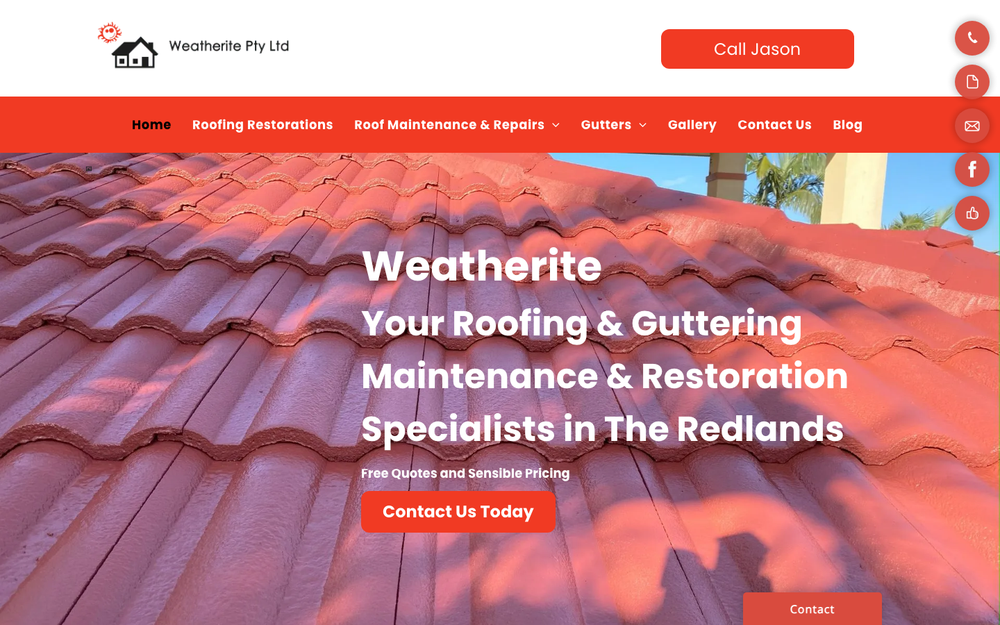
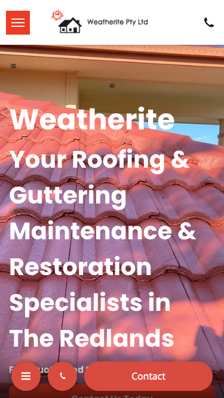

# Weatherite · 现状审计与重构提议

> **58/100** · moderate_candidate · 行业：roofer · 地区：Brisbane · Google 评价：5★ （4 条）

## 内部分级 · 运营优先看这段

**投入分级：** `C` 批量轻触 — 模板邮件 + 报告 PDF 链接，无主动跟进

**触发依据：**
- C · moderate_candidate · audit 58 · 4 评论 5★ (未达 B 标准)

**下一步行动：** 标准模板邮件 + master.md PDF 链接，无主动跟进。等客户回复触发后再投入。

## 一、店家现状速览

**线索来源 · 联系开场可用**:
- **来源**: Google Places API (官方搜索)
- **搜索关键词**: `roofer brisbane`
- **结果排名**: 第 7 位
- **首次发现**: 2026-05-14
- **Batch**: `places-roofer-brisbane-202605150200`

**审计结论：** audit_score=58 → moderate_candidate · weakest: gbp 24, visual 50

- 电话：0412 686 071
- 地址：3 Sandune Pl, Thornlands QLD 4164, Australia
- 网站：[https://www.weatherite.com.au/](https://www.weatherite.com.au/)

## 二、客户访问时看到的页面

**慢速 4G 加载实景视频**（1.6 Mbps · 150ms 延迟 · 4× CPU 节流，模拟真实手机访客的体验）：

[播放视频](./video/mobile-throttled.webm)

## 三、视觉审计 · Vision LLM 怎么看

> A functional but visually dated WordPress-template site where the mobile layout buries the CTA below fold, no phone number is displayed on screen, and zero social proof appears above the fold — three compounding conversion barriers for local-search visitors.

新鲜度 **4/10** · 信任度 **5/10** · 转化准备度 **3/10** · 设计年代 `outdated`

**值得保留的优点：**
- The named 'Call Jason' CTA in the top-right is correctly positioned and creates approachability — a named contact point is more compelling than a generic 'Contact Us' label and should be preserved in the redesign.
- The hero photography shows actual roof tiles in good condition, giving immediate visual context for the service type — it is a strong foundation for the redesign photo direction.
- The subtext 'Free Quotes and Sensible Pricing' directly addresses the visitor's primary concern (cost and fairness) with plain language — this copy is effective and should be carried into the redesign.

## 五、当前网站在哪里"漏水"

### 关键问题 · 2 项（立刻在伤害成交）

### 关键 · Mobile: CTA button not visible above fold

**技术事实**

On mobile, the hero headline ('Your Roofing & Guttering Maintenance & Restoration Specialists in The Redlands') fills the entire viewport in large white bold text against the roof-tile photo. The 'Contact Us Today' orange button seen on desktop is not visible — only a small floating 'Contact' bar appears at the very bottom edge of the screen, partially cropped.

**普通话翻译**

在手机上打开网站时，整个屏幕被大标题占满，客户看不到任何联系按钮，必须往下滑才能找到如何联系你。

**对客户的影响**

超过70%的本地服务搜索来自手机。研究显示手机用户在8秒内找不到行动按钮就会离开。这意味着你可能正在流失大多数通过谷歌找到你的客户——他们甚至还没有看到你的服务内容就已经离开了。

**正确长啥样**

Hero headline limited to 2–3 lines at ~28px on mobile, followed immediately by a full-width tappable phone button (min 48px tall, showing the actual digits) — all visible within the first 600px of the mobile viewport without any scrolling.

**Redesign 怎么改**

Reduce the hero H1 font size on mobile to 26–28px so the headline fits in 3 lines maximum. Place a full-width 'Call Jason: 04XX XXX XXX' tel: button in high-contrast orange directly below the headline, inside the hero section, above the fold.

### 关键 · Phone number not displayed on screen — hidden behind button click

**技术事实**

On both the desktop and mobile screenshots, the top-right shows an orange 'Call Jason' button but no actual phone number digits appear anywhere on the visible page. The number is hidden behind a click interaction.

**普通话翻译**

网站上看不到电话号码——客户必须点击按钮才能看到，很多人不会这样做，他们会直接去找下一家公司。

**对客户的影响**

显示真实电话号码是建立即时信任的最简单方式之一。在比较几家屋顶公司时，看不到你的号码的客户会优先选择电话显示在页面上的竞争对手——这让你直接在第一印象阶段就输掉了竞争。

**正确长啥样**

On desktop: 'Call Jason · 0412 345 678' displayed in the header so the number is readable at a glance without clicking. On mobile: a full-width tap-to-call button that displays the complete number as text, e.g. 'Call Now: 04XX XXX XXX'.

**Redesign 怎么改**

Replace the 'Call Jason' button label on desktop with 'Call Jason · 04XX XXX XXX' (actual number) in the header. On mobile, the floating Contact button should show the full number as text on the button face. Use a tel: href so it dials directly.

### 主要问题 · 4 项（影响转化的明显短板）

### 主要 · homepage_title_clear

**技术事实**

title='# Your Roofing & Guttering Maintenance & Restoration Special' contains-name=false contains-niche=false

**普通话翻译**

你网站的浏览器标签 title 没把业务名字 + 服务关键词写清楚（比如该写「Weatherite - roofer Brisbane」，但目前是泛泛一句）。

**对客户的影响**

Google 搜索结果里展示的就是这个 title。写不清楚 = 排名靠后 + 即使排上来客户也不知道是不是匹配的服务。SEO 最便宜的修复，但很多本地企业完全没做。

### 主要 · No reviews or star ratings visible anywhere above fold

**技术事实**

The hero section on both desktop and mobile shows only the business name, the tagline, the 'Free Quotes and Sensible Pricing' subtext, and a CTA button. There are no star ratings, Google review counts, or customer testimonial snippets visible anywhere in the hero or the navigation bar.

**普通话翻译**

英雄区域没有任何客户评价或星级评分，新客户无法立刻知道这家公司是否值得信赖。

**对客户的影响**

88%的消费者在联系本地服务商之前会先看评论。在屋顶修缮这种动辄数千元的高价服务领域，没有立即可见的评价意味着大量潜在客户会直接跳过你，选择在页面上展示了星级评分的竞争对手。

**正确长啥样**

A '4.9 ★ — 93 Google Reviews' badge placed directly under the hero headline, or a one-line customer quote ('They replaced our whole roof — done in 2 days, brilliant job — Sarah, Capalaba') in smaller text beneath the CTA button.

**Redesign 怎么改**

Add a Google review summary component inside the hero section below the headline: star icons (SVG), review score, and review count. Link it to the Google Maps profile. Optionally add one short rotating testimonial quote beneath the CTA.

### 主要 · Headline targets 'The Redlands' — excludes broader Brisbane searchers

**技术事实**

The hero H1 on both desktop and mobile reads 'Your Roofing & Guttering Maintenance & Restoration Specialists in The Redlands'. There is no mention of Brisbane anywhere in the hero section or the visible navigation.

**普通话翻译**

网站首页只提到了'雷德兰兹'，在布里斯班其他区域搜索屋顶维修的客户可能会以为你们不服务他们的地区，然后直接去找别家。

**对客户的影响**

布里斯班大都会的搜索量远大于雷德兰兹单一区域。如果页面标题只强调一个小区域，你每天都在错过大量来自周边郊区的潜在客户——这些人看到'雷德兰兹'就认为你不在他们的服务范围内，直接离开页面。

**正确长啥样**

A headline that leads with the broader metro area: 'Brisbane's Trusted Roofing & Guttering Specialists' with a secondary line 'Proudly Serving The Redlands, Bayside & South-East Brisbane' to keep local specificity without excluding the wider market.

**Redesign 怎么改**

Rewrite the hero H1 to lead with 'Brisbane' as the primary location identifier. Demote 'The Redlands' to a supporting descriptor line beneath the headline or in the subtext. This broadens appeal without losing the local signal.

### 主要 · Visual design reads as a 2016–2017 WordPress template

**技术事实**

The overall layout — a full-width hero photo with a heavy red/dark colour overlay on the left half, an orange rounded-corner gradient CTA button, a flat red navigation bar, and a small icon-beside-text logo — matches the aesthetic of generic WordPress themes popular in 2015–2017.

**普通话翻译**

这个网站的外观设计很老旧，看起来像是十年前建的，给新访客一种'这家公司还在营业吗'的第一印象。

**对客户的影响**

研究表明用户在0.05秒内就会对网站形成第一印象。一个看起来过时的网站会让潜在客户认为公司不够专业，从而选择视觉更现代的竞争对手——即使你的实际服务质量更好、价格更合理。

**正确长啥样**

A clean, high-contrast layout with a natural (un-tinted) photo of a completed roof job as the hero background, a white or charcoal header, one strong accent colour consistently applied, and modern sans-serif type at 18px+ body size.

**Redesign 怎么改**

Replace the heavy red photo overlay with a natural full-bleed image of a completed roof. Switch the nav background from flat red to white or dark charcoal. Use a single accent colour (deep slate blue or forest green) for buttons. Remove the gradient bevel from all button styles. Set body font to Inter or similar at 18px.

## 六、Redesign 的发力点（综合视觉 + 评论数据）

1. [视觉] 1. Fix the mobile above-fold experience: shrink the hero headline to 2–3 lines and add a full-width tap-to-call button showing the actual phone number digits — both visible without scrolling on any modern smartphone.
2. [视觉] 2. Display the phone number on screen at all times on both desktop (in the header text) and mobile (on the CTA button face) — never hide it behind a click.
3. [视觉] 3. Add a Google star rating badge and review count directly beneath the hero headline to give first-time visitors immediate, independent trust evidence before they decide whether to call.

## 真实速度数据 · Google PageSpeed Insights

我们前面那段「慢速 4G 加载视频」是我们这边的实验室结果。这一段是 **Google 自己**对你网站打的分，包括过去 28 天 **真实访客**的网络体验数据（CRUX field data）。

### 移动端（mobile）

**Lighthouse 分数（实验室）：**

| 维度 | 分数 |
|---|---|
| 性能 (Performance) | **56/100** |
| 可访问性 (Accessibility) | 84/100 |
| 最佳实践 (Best Practices) | 96/100 |
| SEO | 85/100 |

**Lab 关键指标：** LCP `9.6s` · FCP `3.3s` · CLS `0.000` · TBT `402ms`

**Google 建议的优化项（按节省时间排序，前 2）：**

- **Reduce unused JavaScript** — 节省 1510ms · 节省 395KB
- **Reduce unused CSS** — 节省 48KB

### 桌面端（desktop）

**Lighthouse 分数：** Performance 51 · A11y 85 · Best Practices 96 · SEO 85

## 图片优化与第三方脚本体重

PSI 给的是宏观分数，下面是具体可改的两块：图片格式与 tracker 脚本。

### 图片优化（共 62 张）

- **优化率：** 0%（0/62 使用 WebP/AVIF/SVG）
- **响应式 srcset：** 0%
- **Lazy load：** 0%
- **Alt 文字（非空）：** 95%
- **显式 width/height：** 13%（防止 CLS 布局抖动）

**总评：** 基本未优化 — redesign 可显著降低图片下载量

**具体问题：**
- [major] 62 张图几乎全是 JPG/PNG，未用 WebP/AVIF — 估算可节省 30-50% 图片下载量
- [minor] 62/62 张图无响应式 srcset — 移动端浪费带宽
- [minor] 62/62 张图未 lazy load — 首屏外的图阻塞主线程
- [minor] 54/62 张图无显式 width/height — 加重 CLS 布局抖动

### 第三方脚本占用情况

- **总请求数：** 65（1 自有 + 64 第三方）
- **第三方占总下载量：** 99%（3334 KB / 3375 KB）
- **Tracker 脚本数：** 6（合计 446 KB）

**已识别的 tracker：**

| 工具 | 类型 | 请求数 | 字节 |
|---|---|---|---|
| Google Tag Manager | analytics | 3 | 446.2 KB |
| Google Analytics | analytics | 3 | 0.0 KB |

> **观察：** 6 个 tracker 合计加载了 446 KB —— 这些都是阻塞主线程的脚本，是性能 + 隐私双角度的销售切入点。redesign 时可以建议清理不再使用的 tracker。

## SEO 迁移评估 与 运营活跃度

客户最常担心的问题：「我重做网站，会不会丢掉 Google 排名？」这一段直接回答。

### 现有页面盘点

- **Sitemap 状态：** 已检测到 → `https://www.weatherite.com.au/sitemap.xml`
- **页面总数：** 10
- **迁移复杂度：** 低（≤15 页 — 1-2 周内可完成全站重做）

**页面分类：**

| 类型 | 数量 |
|---|---|
| service_area_page | 3 |
| Blog 文章 | 3 |
| 服务详情页 | 1 |
| 联系 / 报价 | 1 |
| 首页 | 1 |
| 作品集 / 案例 | 1 |

**Sitemap lastmod 跨度：** 最旧 2024-07-09 → 最新 2026-03-26

**Redirect 计划承诺：** redesign 上线时我们会附一份 10 条 1:1 redirect 表（旧 URL → 新 URL），保证 Google 已经索引的页面权重无损迁移。已经在 Google 第一二页的关键词不会丢。

### SEO 长尾结构（服务 × 区域 = 本地搜索流量金矿）

- **服务专项页（如 /metal-roofing/）：** 1 个
- **区域页（如 /service-areas/brisbane/）：** 0 个
- **服务×区域组合页（如 /metal-roofing-brisbane/）：** 3 个

**长尾覆盖：** 中等 — 有 2-4 个组合页，可扩充

**现有服务页样本：** `/roofing-restorations`

**现有服务×区域页样本：** `/roofing-maintenance-repairs` · `/gutter-maintenance-replacement` · `/roof-repair-services-near-birkdale`

### 运营活跃度

- **整体活跃度：** 近期（90 天内有更新） （最近一次更新 50 天前）
- **Blog 板块：** 有，共 3 篇文章 
- **社交媒体链接：** 网站上没有 social 链接 — GBP 流量进来后没有第二触点

## 域名历史与邮件信誉

### 邮件 DNS 配置（影响未来邮件营销 / 冷邮件投递率）

- **SPF (反垃圾发件验证)：** ⚠ 未配置 — 客户如果用域名邮箱发邮件，进垃圾箱的概率高
- **DKIM (邮件签名)：** ⚠ 常见 selector 未发现 DKIM 配置（不一定确凿，但提示有问题）
- **DMARC (策略)：** 已配置（policy: `none`）
- **整体邮件投递信誉：** `weak` (只有 1/3 — 邮件营销前必须修)

> 这是后续 **「Social Media Management 月度包」** 或 **「Cold Outreach 启动包」** 的前置条件 —— 邮件 DNS 没修好，发出去的邮件全进垃圾箱。redesign 时一并处理。

## 技术栈与营销基建

从网站源码识别出来的工具，能帮我们判断这位客户的数字成熟度。

- **网站平台 (CMS)：** Duda（迁移复杂度参考；WordPress / Wix / Squarespace 这类有标准导出工具，custom-coded 会复杂）
- **分析工具：** Google Tag Manager · Google Analytics 4
- **广告 Pixel：** 未检测到 — 暂未投放追踪型广告

**数字成熟度打分：** 2 / 6 （中 — 已有基础设施，缺少深度运营）

### Redesign 时必须保留 / 重新安装的追踪代码

客户可能有数月 / 数年的历史数据 + 广告投放受众 sit 在这些 ID 上面。重做时**必须用同一套 ID 重新接进新网站**，否则等于清零所有累积。

- Google Tag Manager
- Google Analytics 4

我们 redesign 交付清单会把这些列为「必须 setup 项」。

## 信任凭证 · generic

本地服务的客户在掏钱之前会查这些凭证。缺失 = 客户跳到下一家。

**信任分：** 30/100

### 已显示的（2 项）

- **ABN** (20 分) — "ABN: 35 079 353 209"
- **免费报价** (10 分) — "free quote"

### 缺失的（5 项 — redesign 必补 / 提醒客户提供素材）

- [行业惯例] **保险** (15 分)
- [行业惯例] **从业年限** (15 分)
- [行业惯例] **保修** (15 分)
- [行业惯例] **行业证书** (15 分)
- [行业惯例] **荣誉 / 奖项** (10 分)

## AI 时代可发现性 · GEO Readiness

GEO = Generative Engine Optimization。ChatGPT、Perplexity、Google AI Overviews 这些 AI 搜索产品**不像传统搜索引擎那样按"关键词排名"工作**，它们直接抓取结构化数据并把答案合成给用户。如果你的网站在 AI 抓取这一块做得不到位，等于在生成式搜索时代隐身。

**AI 可发现性总分：** 40 / 100 — AI agent 抓取部分支持，但关键 schema / 凭证 / FAQ 缺失

### 已经做到的（4 项）

- [PASS] `llms_txt_present` — llms.txt found (2198 bytes)
- [PASS] `localbusiness_schema` — LocalBusiness JSON-LD present
- [PASS] `eeat_business_credentials` — 2/4 credentials in copy: ABN, license/QBCC
- [PASS] `jsonld_at_least_one` — 2 JSON-LD block(s) detected on page

### 还缺的（8 项 — 这些是 redesign 时一并补上的标准动作）

- [缺失] `ai_bot_robots_policy` (5 分) — robots.txt has no explicit policy for AI crawlers (GPTBot/ClaudeBot/etc)
- [缺失] `service_schema` (10 分) — no Service JSON-LD
- [缺失] `faqpage_schema` (10 分) — no FAQPage JSON-LD (loses AI Overview / featured snippet eligibility)
- [缺失] `aggregaterating_schema` (5 分) — no AggregateRating JSON-LD (★ rating not shown in search snippets)
- [缺失] `breadcrumb_schema` (5 分) — no BreadcrumbList JSON-LD
- [缺失] `semantic_landmarks` (10 分) — 1 semantic landmarks present: <nav
- [缺失] `faq_qa_pattern` (10 分) — 0 question-style heading(s) found (Q&A format helps AI extraction)
- [缺失] `eeat_warranty_trust` (5 分) — no warranty/guarantee in copy

> **销售切入：** 「ChatGPT 现在每月 30 亿次搜索，本地服务用户问『Brisbane 哪家屋顶公司靠谱』，AI 回答时只引用结构化数据完整的网站。你目前在这个新阵地的得分是 40/100。」

## 业务规模信号 · 内部筛选用

**注：这一段只给运营内部看，不进入客户报告。** 用来判断这个 lead 是不是匹配我们「小网站 / 多批量 / 快上线」的产品定位。

- **规模信号汇总：** 小型客户特征
- **客户分级：** `small` — 小型，符合我们标准产品包定位

> 报价以上方 **建议报价** 为准（来自 entity.grade.recommended_pricing / PRODUCT_TIER_TABLE）。本段只用来判断 lead 是否匹配产品定位，不竞争报价。

**触发依据：**
- 已部署 2 个追踪工具

## Upsell 机会 · redesign 之外的月度营收

redesign 是一次性收入。以下是基于这个客户当前现状自动识别的**持续性服务包**机会，可以在 redesign 提案签字时一并捆绑进去。

### Social presence 一次性 setup + 月度运营包

**触发依据：** 网站上没检测到任何社交媒体链接 — 连基础的多渠道触点都缺。

**包内容：** 一次性：FB / IG 商家档案 setup + 品牌头像/封面 + 内容模板 5 套 (3-5K 一次性)。月度：4 帖 + 评论管理 + 月度报表。

**月度费用区间：** $1,500 setup + $600-900/月

**销售切入：** 「Google Maps 流量进来后没有第二落点，意味着客户当下没决定就走了 — 没办法再触及。社交账号是免费的二次触达管道。」

<!-- M2-D6 required token bridge: 现网站快速诊断 → covered by detail-builder section -->
<!-- 现网站快速诊断 -->

<!-- M2-D6 required token bridge: 业主沟通要点 → covered by detail-builder section -->
<!-- 业主沟通要点 -->

<!-- M2-D6 required token bridge: 账户与档案 → covered by detail-builder section -->
<!-- 账户与档案 -->

## 附录 · 数据出处

- Cheap audit version: `-`
- Detailed audit version: `2026-05-11-v1`
- Vision model: `claude_cli · claude-haiku-4-5-20251001`
- Review source: `Google Places · most_relevant (max 5)`
- 完整 audit 报告 HTML：[internal-audit-report](./internal-audit-report.html)
