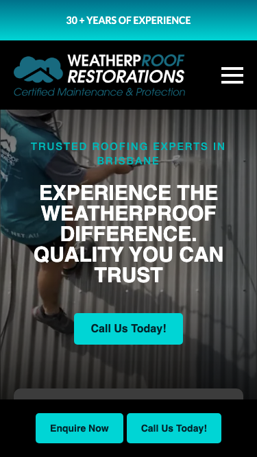

# WeatherpRoof Restorations · 现状审计与重构提议

> **61/100** · moderate_candidate · 行业：roofing · 地区：Brisbane · Google 评价：4.9★ （134 条）

## 内部分级 · 运营优先看这段

**投入分级：** `B` 预览试探 — ChatGPT 生成 mockup hero 图 + 短邮件试反应

**触发依据：**
- moderate_candidate + 134 评论 + audit 61（仍有改进空间）

**产品档位：** `T3` 多页 / 定制（quote separately）

- 134★4.9 强口碑底子
- 已投放过广告（懂月度预算）
- 数字成熟度 4/6
- 评论 trust strong

**建议报价：** 一次性 $1000+ 定制报价

**下一步行动：** 用 ChatGPT Image / Gemini Imagen 生成 hero mockup 预览图 + master.md PDF + 1 封 personalized 邮件试探 + 1 次跟进。回应后升级到 A 档处理。

## 一、店家现状速览

**线索来源 · 联系开场可用**:
- **来源**: Google Maps (gosom 抓取)
- **搜索关键词**: `roof restoration in Brisbane`
- **首次发现**: 2026-05-09

**审计结论：** audit_score=61 → moderate_candidate · weakest: seo 34, visual 50 · fired: high_traction_old_site · 1 critical issues

**已触发的 hard triggers：** `high_traction_old_site`

- 电话：(07) 3171 2855
- 地址：115/193 S Pine Rd, Brendale QLD 4500
- 网站：[https://weatherproof.net.au/](https://weatherproof.net.au/)
- 网站状态：`independent_https_site`

## 二、客户访问时看到的页面

## 四、客户在 Google 上怎么说

> Customers overwhelmingly praise the business for its honesty, professionalism, and clear communication, particularly valuing transparent assessments that avoid unnecessary upsells. A single severe complaint regarding poor workmanship and communication exists, but it appears to be an outlier against a backdrop of consistent high satisfaction.

**一致夸赞：** `honest assessments` · `excellent communication` · `professional workmanship` · `punctual service` · `fair pricing`

**抱怨 / 短板：** `poor communication` · `substandard workmanship` · `unreliability`

**可直接放上 redesign 后网站的 quote：**

> "Weatherproof Restoration was the only one that responded... I really appreciated his honesty and professionalism."
> — **Joe**, ★★★★★
>
> *放哪：Hero section proof of integrity and responsiveness*

> "Great response and quick resolution to a minor concern we raised - sign of a quality, trustworthy business."
> — **Sam**, ★★★★★
>
> *放哪：Trust section highlighting after-care and reliability*

> "From my first contact with them to my last contact they were very friendly, kept up communication."
> — **Julian**, ★★★★★
>
> *放哪：Process section emphasizing customer experience*

## 五、当前网站在哪里"漏水"

### 关键问题 · 1 项（立刻在伤害成交）

### 关键 · phone_visible_above_fold

**技术事实**

phone hidden below fold or missing

**普通话翻译**

电话号码在第一屏看不到 — 客户必须滚动才能找到怎么联系你。

**对客户的影响**

本地服务客户 60-70% 倾向打电话沟通（不是填表单）。电话号没在第一屏 = 这部分客户里很多人会直接关掉去搜下一家。这是最便宜的转化优化之一。

### 主要问题 · 2 项（影响转化的明显短板）

### 主要 · homepage_title_clear

**技术事实**

title='# EXPERIENCE THE WEATHERPROOF DIFFERENCE. QUALITY YOU CAN TR' contains-name=true contains-niche=false

**普通话翻译**

你网站的浏览器标签 title 没把业务名字 + 服务关键词写清楚（比如该写「WeatherpRoof Restorations - roofing Brisbane」，但目前是泛泛一句）。

**对客户的影响**

Google 搜索结果里展示的就是这个 title。写不清楚 = 排名靠后 + 即使排上来客户也不知道是不是匹配的服务。SEO 最便宜的修复，但很多本地企业完全没做。

### 主要 · local_schema_markup

**技术事实**

no LocalBusiness JSON-LD

**普通话翻译**

网站没有 LocalBusiness JSON-LD 结构化数据（让 Google / AI 知道你是本地企业、地址、电话、营业时间的标准格式）。

**对客户的影响**

Google「附近的服务」「Knowledge Panel」「AI Overview」都依赖这类结构化数据。没有 = 即使排名上去也不会出现在右侧 Knowledge Panel 或地图卡片里 — 错失高转化的展示位。AI agent / ChatGPT 引用本地商家时也是基于这些数据。

## 六、Redesign 的发力点（综合视觉 + 评论数据）

1. [评论] Feature Joe Lin's review prominently to counter 'scam' fears common in roofing by highlighting honest, no-upsell inspections.
2. [评论] Use Sam Pengelly's quote in a 'Why Choose Us' section to demonstrate proactive problem-solving and trustworthiness.
3. [评论] Highlight the peer endorsement from Elizabeth High to establish industry credibility and quality assurance.

## 七、推荐销售切入点

- 你已经有不错的 Google 流量基础（134 条 4.9★ 评论），但当前网站设计在浪费这些点击
- 客户口碑已经强（honest assessments / excellent communication / professional workmanship）— 网站只需要把这份信任承接住，不需要从零建立

## 真实速度数据 · Google PageSpeed Insights

我们前面那段「慢速 4G 加载视频」是我们这边的实验室结果。这一段是 **Google 自己**对你网站打的分，包括过去 28 天 **真实访客**的网络体验数据（CRUX field data）。

### 移动端（mobile）

**Lighthouse 分数（实验室）：**

| 维度 | 分数 |
|---|---|
| 性能 (Performance) | **99/100** |
| 可访问性 (Accessibility) | 88/100 |
| 最佳实践 (Best Practices) | 96/100 |
| SEO | 85/100 |

**Lab 关键指标：** LCP `2.0s` · FCP `1.4s` · CLS `0.002` · TBT `0ms`

**Google 建议的优化项（按节省时间排序，前 1）：**

- **Reduce unused CSS** — 节省 150ms · 节省 49KB

### 桌面端（desktop）

**Lighthouse 分数：** Performance 99 · A11y 88 · Best Practices 96 · SEO 85

## SEO 迁移评估 与 运营活跃度

客户最常担心的问题：「我重做网站，会不会丢掉 Google 排名？」这一段直接回答。

### 现有页面盘点

- **Sitemap 状态：** 已检测到 → `https://weatherproof.net.au/sitemap_index.xml`
- **页面总数：** 35
- **迁移复杂度：** 中（≤80 页 — 服务页 + 部分 blog）

**页面分类：**

| 类型 | 数量 |
|---|---|
| 顶层页面 | 27 |
| 内页 | 4 |
| 首页 | 1 |
| Blog 文章 | 1 |
| 关于 / 团队 | 1 |
| 联系 / 报价 | 1 |

**Sitemap lastmod 跨度：** 最旧 2025-06-10 → 最新 2025-12-02

**Redirect 计划承诺：** redesign 上线时我们会附一份 35 条 1:1 redirect 表（旧 URL → 新 URL），保证 Google 已经索引的页面权重无损迁移。已经在 Google 第一二页的关键词不会丢。

### 运营活跃度

- **整体活跃度：** 停滞（超过 3 个月没动） （最近一次更新 160 天前）
- **Blog 板块：** 有，共 1 篇文章 
- **社交媒体链接：** 网站上引用了 2 个平台 — facebook, instagram

## 联系表单与防垃圾设置

客户能不能 *方便地* 把信息留下来 = 直接的转化路径。这一段审视所有 `<form>` 元素的可用性 + 防 spam 配置。

### 表单 · 10 字段（摩擦：高（≥7 字段，会显著降低转化））

- **字段构成：** Full Name**(text,必填) · Email**(email,必填) · fields[text_suburb](text,必填) · fields[tel_phone-number](tel,必填) · Roof Cleaning(radio) · Roof Painting(radio) · Roof Repair(radio) · Roof Restoration(radio) · Write your message here(textarea) · HP Name(text)
- **必填字段数：** 4/10
- **常见关键字段：** email · phone · message
- **提交按钮：** 「Send Message」
- **Honeypot 防 spam：** 未检测到

### 表单 · 10 字段（摩擦：高（≥7 字段，会显著降低转化））

- **字段构成：** Full Name**(text,必填) · Email**(email,必填) · fields[text_suburb](text,必填) · fields[tel_phone-number](tel,必填) · Roof Cleaning(radio) · Roof Painting(radio) · Roof Repair(radio) · Roof Restoration(radio) · Write your message here(textarea) · HP Name(text)
- **必填字段数：** 4/10
- **常见关键字段：** email · phone · message
- **提交按钮：** 「Send Message」
- **Honeypot 防 spam：** 未检测到

### 表单 · 8 字段（摩擦：高（≥7 字段，会显著降低转化））

- **字段构成：** Full Name**(text,必填) · Last Name**(text,必填) · Email**(email,必填) · fields[tel_phone-number](tel,必填) · fields[text_suburb](text,必填) · What Service are you looking for?*(select-one,必填) · Write your message here(textarea) · HP Name(text)
- **必填字段数：** 6/8
- **常见关键字段：** email · phone · message
- **提交按钮：** 「Send Enquiry」
- **Honeypot 防 spam：** 未检测到

**已部署的人机验证：**
- reCAPTCHA v2 (visible "I'm not a robot") — 高摩擦
- reCAPTCHA v3 (invisible) — 低摩擦

**Audit 总结：**

- [关键] 表单字段数 10 — 远超行业标准 3-4 字段，会显著降低转化率
- [关键] 表单字段数 10 — 远超行业标准 3-4 字段，会显著降低转化率
- [关键] 表单字段数 8 — 远超行业标准 3-4 字段，会显著降低转化率
- [提示] reCAPTCHA v2 (visible "I'm not a robot") — 给真人增加额外操作（点击"我不是机器人"），轻微降低转化；redesign 可改用 v3/Turnstile 等 invisible 方案

## 域名历史与邮件信誉

### 邮件 DNS 配置（影响未来邮件营销 / 冷邮件投递率）

- **SPF (反垃圾发件验证)：** 已配置
- **DKIM (邮件签名)：** 已配置（selectors: mail, selector1, selector2）
- **DMARC (策略)：** 已配置（policy: `quarantine`）
- **整体邮件投递信誉：** `strong` (SPF + DKIM + DMARC 齐全)

## 技术栈与营销基建

从网站源码识别出来的工具，能帮我们判断这位客户的数字成熟度。

- **网站平台 (CMS)：** WordPress（迁移复杂度参考；WordPress / Wix / Squarespace 这类有标准导出工具，custom-coded 会复杂）
- **分析工具：** Google Tag Manager · Google Analytics 4 · Microsoft Clarity
- **广告 Pixel：** Meta (Facebook) Pixel · Google Ads Conversion — 客户已经在投放（或投放过）付费广告，对营销预算不陌生

**数字成熟度打分：** 4 / 6 （高 — 客户懂数字营销，redesign 谈预算时不必从零教育）

### Redesign 时必须保留 / 重新安装的追踪代码

客户可能有数月 / 数年的历史数据 + 广告投放受众 sit 在这些 ID 上面。重做时**必须用同一套 ID 重新接进新网站**，否则等于清零所有累积。

- Google Tag Manager
- Google Analytics 4
- Microsoft Clarity
- Meta (Facebook) Pixel
- Google Ads Conversion

我们 redesign 交付清单会把这些列为「必须 setup 项」。

## AI 时代可发现性 · GEO Readiness

GEO = Generative Engine Optimization。ChatGPT、Perplexity、Google AI Overviews 这些 AI 搜索产品**不像传统搜索引擎那样按"关键词排名"工作**，它们直接抓取结构化数据并把答案合成给用户。如果你的网站在 AI 抓取这一块做得不到位，等于在生成式搜索时代隐身。

**AI 可发现性总分：** 30 / 100 — AI agent / ChatGPT 几乎无法准确引用此网站 — 在生成式搜索时代等于隐身

### 已经做到的（4 项）

- [PASS] `breadcrumb_schema` — BreadcrumbList JSON-LD present
- [PASS] `eeat_business_credentials` — 2/4 credentials in copy: license/QBCC, years-in-business
- [PASS] `eeat_warranty_trust` — warranty/guarantee mentioned
- [PASS] `jsonld_at_least_one` — 3 JSON-LD block(s) detected on page

### 还缺的（8 项 — 这些是 redesign 时一并补上的标准动作）

- [缺失] `llms_txt_present` (5 分) — no /llms.txt at standard path
- [缺失] `ai_bot_robots_policy` (5 分) — robots.txt has no explicit policy for AI crawlers (GPTBot/ClaudeBot/etc)
- [缺失] `localbusiness_schema` (15 分) — no LocalBusiness or Organization JSON-LD
- [缺失] `service_schema` (10 分) — no Service JSON-LD
- [缺失] `faqpage_schema` (10 分) — no FAQPage JSON-LD (loses AI Overview / featured snippet eligibility)
- [缺失] `aggregaterating_schema` (5 分) — no AggregateRating JSON-LD (★ rating not shown in search snippets)
- [缺失] `semantic_landmarks` (10 分) — 3 semantic landmarks present: <nav, <header, <section
- [缺失] `faq_qa_pattern` (10 分) — 0 question-style heading(s) found (Q&A format helps AI extraction)

> **销售切入：** 「ChatGPT 现在每月 30 亿次搜索，本地服务用户问『Brisbane 哪家屋顶公司靠谱』，AI 回答时只引用结构化数据完整的网站。你目前在这个新阵地的得分是 30/100。」

## 业务规模信号 · 内部筛选用

**注：这一段只给运营内部看，不进入客户报告。** 用来判断这个 lead 是不是匹配我们「小网站 / 多批量 / 快上线」的产品定位。

- **规模信号汇总：** 中型客户特征
- **客户分级：** `mid` — 中型客户，可接但价格要往上提（基础包 + 配置项）

> 报价以上方 **建议报价** 为准（来自 entity.grade.recommended_pricing / PRODUCT_TIER_TABLE）。本段只用来判断 lead 是否匹配产品定位，不竞争报价。

**触发依据：**
- Google 评价 134 条（≥50，有规模基础）
- 网站页面数 35（≥30，中小规模）
- 已部署 5 个分析 / pixel 工具（高数字成熟度）

## Upsell 机会 · redesign 之外的月度营收

redesign 是一次性收入。以下是基于这个客户当前现状自动识别的**持续性服务包**机会，可以在 redesign 提案签字时一并捆绑进去。

### Social Media Management 月度包

**触发依据：** 客户活跃度为「停滞（3-12 月没动）」，但 Google 上有 134 条 4.9★ 评价的口碑底子 — 有内容素材却没在用。

**包内容：** 每月 8-12 帖（FB / IG / LinkedIn 至少 2 平台）+ 4 条工程现场 reels/short videos + 月度 GBP 帖子 2 条 + 评论回复代运营。

**月度费用区间：** $800-1,500/月（视平台数量与内容深度）

**销售切入：** 「你 Google 上的 134 条好评是金矿，但你的 Facebook 已经 160 天没动过 — 这等于你把口碑资产堆在仓库里没拿去卖。我们月度包就是把这部分自动化跑起来。」

<!-- M2-D6 required token bridge: 现网站快速诊断 → covered by detail-builder section -->
<!-- 现网站快速诊断 -->

<!-- M2-D6 required token bridge: 业主沟通要点 → covered by detail-builder section -->
<!-- 业主沟通要点 -->

<!-- M2-D6 required token bridge: 账户与档案 → covered by detail-builder section -->
<!-- 账户与档案 -->

## 附录 · 数据出处

- Cheap audit version: `-`
- Detailed audit version: `2026-05-11-v1`
- Vision model: `ollama-qwen3.6-27b-nothink`
- Review source: `Google Places Place Details · most_relevant`
- 完整 audit 报告 HTML：[internal-audit-report](./internal-audit-report.html)
