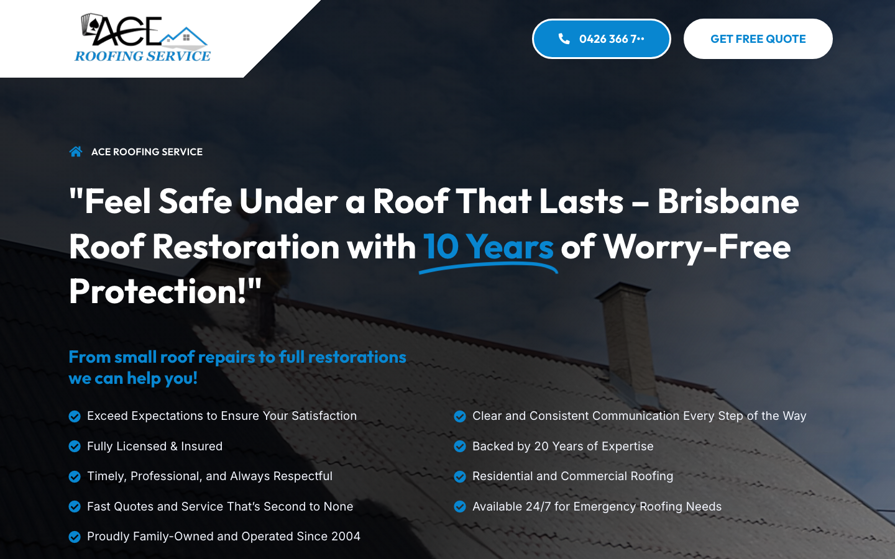
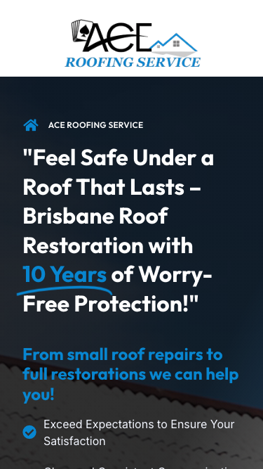

# Ace Roofing Service · 现状审计与重构提议

> **52/100** · moderate_candidate · 行业：roofer · 地区：Brisbane · Google 评价：5★ （0 条）

## 内部分级 · 运营优先看这段

**投入分级：** `C` 批量轻触 — 模板邮件 + 报告 PDF 链接，无主动跟进

**触发依据：**
- C · moderate_candidate · audit 52 · 0 评论 5★ (未达 B 标准)

**下一步行动：** 标准模板邮件 + master.md PDF 链接，无主动跟进。等客户回复触发后再投入。

## 一、店家现状速览

**线索来源 · 联系开场可用**:
- **来源**: Google Maps (gosom 抓取)
- **搜索关键词**: `roofer in brisbane`
- **首次发现**: 2026-05-14
- **Batch**: `pipe-roofing-brisbane-202605142244`

**审计结论：** audit_score=52 → moderate_candidate · weakest: gbp 20, seo 45 · 1 critical issues

- 电话：0449168985
- 地址：72 Queen St, Brisbane City QLD 4000
- 网站：[https://aceroofingservice.com.au/](https://aceroofingservice.com.au/)
- 网站状态：`independent_https_site`

## 二、客户访问时看到的页面

**慢速 4G 加载实景视频**（1.6 Mbps · 150ms 延迟 · 4× CPU 节流，模拟真实手机访客的体验）：

[播放视频](./video/mobile-throttled.webm)

## 三、视觉审计 · Vision LLM 怎么看

> The site has a clear roofing message and some useful trust claims, but the mobile view hides the main contact action and the desktop header makes the phone number hard to read.

新鲜度 **6/10** · 信任度 **6/10** · 转化准备度 **5/10** · 设计年代 `slightly_outdated`

**值得保留的优点：**
- The business name and roofing category are clear in both desktop and mobile screenshots.
- The blue accent color gives the phone and '10 Years' promise strong visibility.
- The page already includes useful trust claims such as licensed, insured, family-owned, and emergency availability.

## 五、当前网站在哪里"漏水"

### 关键问题 · 3 项（立刻在伤害成交）

### 关键 · phone_visible_above_fold

**技术事实**

phone hidden below fold or missing

**普通话翻译**

电话号码在第一屏看不到 — 客户必须滚动才能找到怎么联系你。

**对客户的影响**

本地服务客户 60-70% 倾向打电话沟通（不是填表单）。电话号没在第一屏 = 这部分客户里很多人会直接关掉去搜下一家。这是最便宜的转化优化之一。

### 关键 · No phone or quote button on mobile

**技术事实**

In the mobile screenshot, the top of the page shows only the large Ace Roofing Service logo, then the hero text; there is no visible phone button or quote button above the fold.

**普通话翻译**

手机版首屏看不到电话号码或报价按钮，客户想联系你时要自己往下找。

**对客户的影响**

本地搜索很多发生在手机上，常见行为是看几秒就决定打给谁。找不到一键拨号会直接流失急单，尤其是漏水、风暴损坏这类高价值客户。

**正确长啥样**

Mobile header with a compact logo and a sticky tap-to-call button visible at the top, plus a second quote button directly under the main headline.

**Redesign 怎么改**

Reduce the mobile logo height, add a sticky bottom or top phone CTA reading 'Call 0426 366 7xx', and place a 'Get Free Quote' button directly below the hero headline.

### 关键 · Phone number appears cut off

**技术事实**

In the desktop header, the blue phone button shows '0426 366 7...' with the final digits hidden or cropped.

**普通话翻译**

桌面版顶部电话号码被省略号截断，看起来像网站没做好。

**对客户的影响**

电话号码是本地服务网站最重要的入口之一。号码显示不完整会让客户犹豫或无法拨打，直接减少电话询盘。

**正确长啥样**

A full phone number displayed in one line with enough button width, strong contrast, and no ellipsis.

**Redesign 怎么改**

Widen the desktop phone button and set the phone text to never truncate; use a clear label such as 'Call 0426 366 7xx' with a phone icon.

### 主要问题 · 7 项（影响转化的明显短板）

### 主要 · review_volume_vs_peers

**技术事实**

0 reviews

**普通话翻译**

你的 Google 评价数量低于同行平均水平。

**对客户的影响**

本地搜索排名信号之一就是评价数量；不光是分数，连"有多少条"都算。短期可以做的：每个完工的客户群发一条「点评一下吧」的 SMS。

### 主要 · click_to_call_link

**技术事实**

no tel: link

**普通话翻译**

电话号码不是 click-to-call 链接（手机上点击不会自动拨号）。

**对客户的影响**

移动客户必须复制号码再切到拨号界面再粘贴 — 每多一步操作就流失一批客户。修复成本只是把 `<a href="tel:0712345678">` 写对，但能立刻拉高电话转化率。

### 主要 · homepage_title_clear

**技术事实**

title='# "Feel Safe Under a Roof That Lasts – Brisbane Roof Restora' contains-name=false contains-niche=false

**普通话翻译**

你网站的浏览器标签 title 没把业务名字 + 服务关键词写清楚（比如该写「Ace Roofing Service - roofer Brisbane」，但目前是泛泛一句）。

**对客户的影响**

Google 搜索结果里展示的就是这个 title。写不清楚 = 排名靠后 + 即使排上来客户也不知道是不是匹配的服务。SEO 最便宜的修复，但很多本地企业完全没做。

### 主要 · local_schema_markup

**技术事实**

no LocalBusiness JSON-LD

**普通话翻译**

网站没有 LocalBusiness JSON-LD 结构化数据（让 Google / AI 知道你是本地企业、地址、电话、营业时间的标准格式）。

**对客户的影响**

Google「附近的服务」「Knowledge Panel」「AI Overview」都依赖这类结构化数据。没有 = 即使排名上去也不会出现在右侧 Knowledge Panel 或地图卡片里 — 错失高转化的展示位。AI agent / ChatGPT 引用本地商家时也是基于这些数据。

### 主要 · Mobile headline overwhelms screen

**技术事实**

On mobile, the headline takes most of the visible screen height and wraps into many short lines before any contact action appears.

**普通话翻译**

手机版标题太长太大，客户第一眼看到的是一大段字，而不是联系方式。

**对客户的影响**

访客通常在几秒内判断是否继续看。首屏信息太挤会让人更快离开，特别是从 Google 商家资料点进来的手机用户。

**正确长啥样**

A shorter mobile headline in 32-40px type, followed immediately by one sentence of service detail and a visible call or quote button.

**Redesign 怎么改**

Rewrite the mobile hero to 'Brisbane Roof Repairs & Restoration' with a smaller support line about licensed, insured service and 10-year protection, then show phone and quote CTAs.

### 主要 · Roof image is overly dark

**技术事实**

The hero background is a very dark roof photo with a heavy navy overlay, making the actual roofing work hard to inspect.

**普通话翻译**

首页背景图太暗，看不清屋顶，也看不出施工质量。

**对客户的影响**

客户花钱修屋顶时很看重真实案例。图片像模板或看不清，会降低信任，让客户更倾向选择看起来更真实的同行。

**正确长啥样**

A brighter real project photo showing a clean Brisbane roof, with the text placed on a controlled dark panel or gradient only where needed for readability.

**Redesign 怎么改**

Replace the current dark hero image with a sharp completed-roof project photo and use a lighter overlay limited to the text area.

### 主要 · Trust points are scattered

**技术事实**

The desktop hero lists many checkmark claims across two columns, including licensed, insured, family-owned, emergency needs, and 20 years expertise.

**普通话翻译**

页面有很多可信信息，但排成一长串，重点不够突出。

**对客户的影响**

客户不会仔细读完所有项目。把最强的信任点放在按钮旁边，能更快打消顾虑，增加电话和报价请求。

**正确长啥样**

Three compact trust badges near the CTA: 'Licensed & Insured', '20+ Years Experience', and 'Emergency Roofing 24/7', followed by a short service line.

**Redesign 怎么改**

Condense the checklist into three high-priority badges directly under the CTA, then move secondary claims lower on the page.

## 六、Redesign 的发力点（综合视觉 + 评论数据）

1. [视觉] 1. Add visible mobile tap-to-call and quote CTAs above the fold.
2. [视觉] 2. Fix the desktop header so the full phone number is readable and contact actions dominate.
3. [视觉] 3. Replace the dark generic hero treatment with a brighter real roofing project image and three focused trust badges.

## 真实速度数据 · Google PageSpeed Insights

我们前面那段「慢速 4G 加载视频」是我们这边的实验室结果。这一段是 **Google 自己**对你网站打的分，包括过去 28 天 **真实访客**的网络体验数据（CRUX field data）。

### 移动端（mobile）

**Lighthouse 分数（实验室）：**

| 维度 | 分数 |
|---|---|
| 性能 (Performance) | **95/100** |
| 可访问性 (Accessibility) | 89/100 |
| 最佳实践 (Best Practices) | 100/100 |
| SEO | 100/100 |

**Lab 关键指标：** LCP `1.7s` · FCP `1.4s` · CLS `0.000` · TBT `0ms`

**Google 建议的优化项（按节省时间排序，前 2）：**

- **Reduce unused CSS** — 节省 280ms · 节省 40KB
- **Initial server response time was short** — 节省 144ms

### 桌面端（desktop）

**Lighthouse 分数：** Performance 93 · A11y 89 · Best Practices 100 · SEO 100

## 图片优化与第三方脚本体重

PSI 给的是宏观分数，下面是具体可改的两块：图片格式与 tracker 脚本。

### 图片优化（共 11 张）

- **优化率：** 0%（0/11 使用 WebP/AVIF/SVG）
- **响应式 srcset：** 45%
- **Lazy load：** 64%
- **Alt 文字（非空）：** 18%
- **显式 width/height：** 100%（防止 CLS 布局抖动）

**总评：** 部分优化 — 还有空间

**具体问题：**
- [minor] 11 张图仍是 JPG/PNG，建议转 WebP
- [major] 9/11 张图缺 alt 文字 — 影响 SEO + 可访问性 + AI 抓取

### 第三方脚本占用情况

- **总请求数：** 77（66 自有 + 11 第三方）
- **第三方占总下载量：** 49%（708 KB / 1459 KB）
- **Tracker 脚本数：** 3（合计 300 KB）

**已识别的 tracker：**

| 工具 | 类型 | 请求数 | 字节 |
|---|---|---|---|
| Google Tag Manager | analytics | 2 | 300.2 KB |
| Google Analytics | analytics | 1 | 0.0 KB |

> **观察：** 3 个 tracker 合计加载了 300 KB —— 这些都是阻塞主线程的脚本，是性能 + 隐私双角度的销售切入点。redesign 时可以建议清理不再使用的 tracker。

## SEO 迁移评估 与 运营活跃度

客户最常担心的问题：「我重做网站，会不会丢掉 Google 排名？」这一段直接回答。

### 现有页面盘点

- **Sitemap 状态：** 已检测到 → `https://aceroofingservice.com.au/sitemap_index.xml`
- **页面总数：** 1
- **迁移复杂度：** 低（≤15 页 — 1-2 周内可完成全站重做）

**页面分类：**

| 类型 | 数量 |
|---|---|
| 首页 | 1 |

**Sitemap lastmod 跨度：** 最旧 2024-10-14 → 最新 2024-10-14

**Redirect 计划承诺：** redesign 上线时我们会附一份 1 条 1:1 redirect 表（旧 URL → 新 URL），保证 Google 已经索引的页面权重无损迁移。已经在 Google 第一二页的关键词不会丢。

### SEO 长尾结构（服务 × 区域 = 本地搜索流量金矿）

- **服务专项页（如 /metal-roofing/）：** 0 个
- **区域页（如 /service-areas/brisbane/）：** 0 个
- **服务×区域组合页（如 /metal-roofing-brisbane/）：** 0 个

**长尾覆盖：** 无 — 没有服务专项页面，redesign 时是关键补点

### 运营活跃度

- **整体活跃度：** 休眠（超过 1 年没更新过） （最近一次更新 577 天前）
- **Blog 板块：** 未发现 — 没有内容营销基础
- **社交媒体链接：** 网站上没有 social 链接 — GBP 流量进来后没有第二触点

> **关键发现：** 客户的网站超过一年没动过。redesign 之后我们也建议帮忙建立最低限度的内容更新节奏（每月 1 篇 case study 即可），否则 AI / Google 都会判定网站「死站」。

## 联系表单与防垃圾设置

客户能不能 *方便地* 把信息留下来 = 直接的转化路径。这一段审视所有 `<form>` 元素的可用性 + 防 spam 配置。

### 表单 · 6 字段（摩擦：中（5-6 字段））

- **字段构成：** First Name(text,必填) · Last Name(text,必填) · Phone Number(tel,必填) · Email Address(email,必填) · Message(textarea,必填) · g-recaptcha-response(textarea)
- **必填字段数：** 5/6
- **常见关键字段：** email · phone · message
- **提交按钮：** 「Submit」
- **Honeypot 防 spam：** 未检测到

**已部署的人机验证：**
- reCAPTCHA v2 (visible "I'm not a robot") — 高摩擦
- reCAPTCHA v3 (invisible) — 低摩擦

**Audit 总结：**

- [提示] reCAPTCHA v2 (visible "I'm not a robot") — 给真人增加额外操作（点击"我不是机器人"），轻微降低转化；redesign 可改用 v3/Turnstile 等 invisible 方案

## 域名历史与邮件信誉

### 邮件 DNS 配置（影响未来邮件营销 / 冷邮件投递率）

- **SPF (反垃圾发件验证)：** 已配置
- **DKIM (邮件签名)：** ⚠ 常见 selector 未发现 DKIM 配置（不一定确凿，但提示有问题）
- **DMARC (策略)：** 已配置（policy: `quarantine`）
- **整体邮件投递信誉：** `partial` (只有 2/3 — 建议补全)

> 这是后续 **「Social Media Management 月度包」** 或 **「Cold Outreach 启动包」** 的前置条件 —— 邮件 DNS 没修好，发出去的邮件全进垃圾箱。redesign 时一并处理。

## 技术栈与营销基建

从网站源码识别出来的工具，能帮我们判断这位客户的数字成熟度。

- **网站平台 (CMS)：** WordPress（迁移复杂度参考；WordPress / Wix / Squarespace 这类有标准导出工具，custom-coded 会复杂）
- **分析工具：** Google Tag Manager · Google Analytics 4
- **广告 Pixel：** 未检测到 — 暂未投放追踪型广告

**数字成熟度打分：** 2 / 6 （中 — 已有基础设施，缺少深度运营）

### Redesign 时必须保留 / 重新安装的追踪代码

客户可能有数月 / 数年的历史数据 + 广告投放受众 sit 在这些 ID 上面。重做时**必须用同一套 ID 重新接进新网站**，否则等于清零所有累积。

- Google Tag Manager
- Google Analytics 4

我们 redesign 交付清单会把这些列为「必须 setup 项」。

## 信任凭证 · generic

本地服务的客户在掏钱之前会查这些凭证。缺失 = 客户跳到下一家。

**信任分：** 40/100

### 已显示的（3 项）

- **从业年限** (15 分) — "Since 2004"
- **行业证书** (15 分) — "Licensed"
- **免费报价** (10 分) — "Free Quote"

### 缺失的（4 项 — redesign 必补 / 提醒客户提供素材）

- [行业惯例] **ABN** (20 分)
- [行业惯例] **保险** (15 分)
- [行业惯例] **保修** (15 分)
- [行业惯例] **荣誉 / 奖项** (10 分)

## AI 时代可发现性 · GEO Readiness

GEO = Generative Engine Optimization。ChatGPT、Perplexity、Google AI Overviews 这些 AI 搜索产品**不像传统搜索引擎那样按"关键词排名"工作**，它们直接抓取结构化数据并把答案合成给用户。如果你的网站在 AI 抓取这一块做得不到位，等于在生成式搜索时代隐身。

**AI 可发现性总分：** 30 / 100 — AI agent / ChatGPT 几乎无法准确引用此网站 — 在生成式搜索时代等于隐身

### 已经做到的（3 项）

- [PASS] `localbusiness_schema` — Organization JSON-LD present (LocalBusiness preferred for local services)
- [PASS] `eeat_warranty_trust` — warranty/guarantee mentioned
- [PASS] `jsonld_at_least_one` — 6 JSON-LD block(s) detected on page

### 还缺的（9 项 — 这些是 redesign 时一并补上的标准动作）

- [缺失] `llms_txt_present` (5 分) — no /llms.txt at standard path
- [缺失] `ai_bot_robots_policy` (5 分) — robots.txt has no explicit policy for AI crawlers (GPTBot/ClaudeBot/etc)
- [缺失] `service_schema` (10 分) — no Service JSON-LD
- [缺失] `faqpage_schema` (10 分) — no FAQPage JSON-LD (loses AI Overview / featured snippet eligibility)
- [缺失] `aggregaterating_schema` (5 分) — no AggregateRating JSON-LD (★ rating not shown in search snippets)
- [缺失] `breadcrumb_schema` (5 分) — no BreadcrumbList JSON-LD
- [缺失] `semantic_landmarks` (10 分) — 0 semantic landmarks present: none
- [缺失] `faq_qa_pattern` (10 分) — 1 question-style heading(s) found (Q&A format helps AI extraction)
- [缺失] `eeat_business_credentials` (10 分) — only 1/4 credentials found (license/QBCC) — need ≥2 of: ABN, license/QBCC, years-in-business, insurance

> **销售切入：** 「ChatGPT 现在每月 30 亿次搜索，本地服务用户问『Brisbane 哪家屋顶公司靠谱』，AI 回答时只引用结构化数据完整的网站。你目前在这个新阵地的得分是 30/100。」

## 业务规模信号 · 内部筛选用

**注：这一段只给运营内部看，不进入客户报告。** 用来判断这个 lead 是不是匹配我们「小网站 / 多批量 / 快上线」的产品定位。

- **规模信号汇总：** 小型客户特征
- **客户分级：** `small` — 小型，符合我们标准产品包定位

> 报价以上方 **建议报价** 为准（来自 entity.grade.recommended_pricing / PRODUCT_TIER_TABLE）。本段只用来判断 lead 是否匹配产品定位，不竞争报价。

**触发依据：**
- 已部署 2 个追踪工具

## Upsell 机会 · redesign 之外的月度营收

redesign 是一次性收入。以下是基于这个客户当前现状自动识别的**持续性服务包**机会，可以在 redesign 提案签字时一并捆绑进去。

### Social presence 一次性 setup + 月度运营包

**触发依据：** 网站上没检测到任何社交媒体链接 — 连基础的多渠道触点都缺。

**包内容：** 一次性：FB / IG 商家档案 setup + 品牌头像/封面 + 内容模板 5 套 (3-5K 一次性)。月度：4 帖 + 评论管理 + 月度报表。

**月度费用区间：** $1,500 setup + $600-900/月

**销售切入：** 「Google Maps 流量进来后没有第二落点，意味着客户当下没决定就走了 — 没办法再触及。社交账号是免费的二次触达管道。」

### 内容写作月度包（Blog / 案例 / SEO 长尾）

**触发依据：** 网站没有 blog 板块 — 没有内容营销基础设施，长尾 SEO 流量为零。

**包内容：** 每月 2 篇 SEO-optimized blog（800-1,200 字）+ 每季度 1 篇 case study（含 before/after 图）+ 关键词研究报告。

**月度费用区间：** $400-800/月

**销售切入：** 「ChatGPT 时代搜索引擎更偏爱有「专家深度内容」的网站。你目前的网站只有服务介绍页 — AI 可引用的素材几乎为零。」

<!-- M2-D6 required token bridge: 现网站快速诊断 → covered by detail-builder section -->
<!-- 现网站快速诊断 -->

<!-- M2-D6 required token bridge: 业主沟通要点 → covered by detail-builder section -->
<!-- 业主沟通要点 -->

<!-- M2-D6 required token bridge: 账户与档案 → covered by detail-builder section -->
<!-- 账户与档案 -->

## 附录 · 数据出处

- Cheap audit version: `-`
- Detailed audit version: `2026-05-11-v1`
- Vision model: `codex_cli`
- Review source: `Google Places · most_relevant (max 5)`
- 完整 audit 报告 HTML：[internal-audit-report](./internal-audit-report.html)
