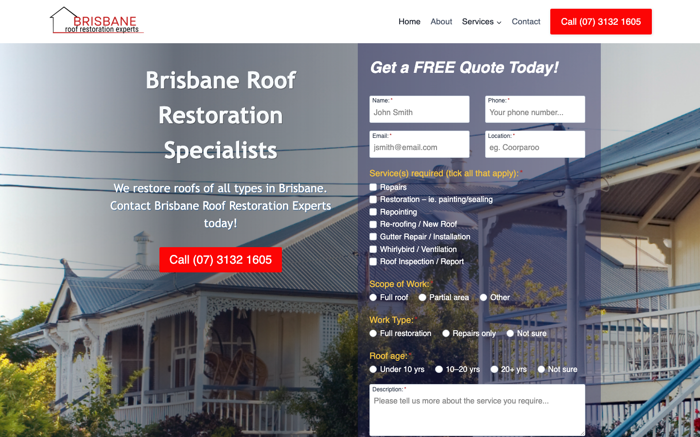

# Brisbane Roof Restoration Experts · 现状审计与重构提议

> **66/100** · low_priority · 行业：roofing · 地区：Brisbane · Google 评价：4.9★ （0 条）

## 内部分级 · 运营优先看这段

**投入分级：** `C` 批量轻触 — 模板邮件 + 报告 PDF 链接，无主动跟进

**触发依据：**
- C · low_priority · audit 66 · 0 评论 4.9★ (未达 B 标准)

**下一步行动：** 标准模板邮件 + master.md PDF 链接，无主动跟进。等客户回复触发后再投入。

## 一、店家现状速览

## 二、销售切入点

**TBD · audit 不完整**

**线索来源 · 联系开场可用**:
- **来源**: Google Maps (gosom 抓取)
- **搜索关键词**: `roofing in brisbane`
- **首次发现**: 2026-05-14
- **Batch**: `pipe-roofing-brisbane-202605142244`

**审计结论：** audit_score=66 → low_priority · weakest: gbp 20, visual 50

- 电话：(07)31321605
- 地址：Unit 22/104 Barwon St, Morningside QLD 4170
- 网站：[https://brisbaneroofrestorationexperts.com.au/](https://brisbaneroofrestorationexperts.com.au/)
- 网站状态：`independent_https_site`

## 三、客户访问时看到的页面

**慢速 4G 加载实景视频**（1.6 Mbps · 150ms 延迟 · 4× CPU 节流，模拟真实手机访客的体验）：

[播放视频](./video/mobile-throttled.webm)

## 三、视觉审计 · Vision LLM 怎么看

> The site has a visible phone number and quote form above the fold, but the dark overlay hero, cramped checkbox form layout, and dated typography undermine trust for a local visitor who is deciding in seconds.

新鲜度 **4/10** · 信任度 **4/10** · 转化准备度 **5/10** · 设计年代 `outdated`

**值得保留的优点：**
- Phone number is prominently displayed in the nav bar as a red call-to-action button — one of the most important conversion elements for a local tradie site.
- The quote form is positioned above the fold on desktop so a motivated visitor can immediately start an enquiry without scrolling.
- Navigation is simple and flat (Home / About / Services / Contact) — easy to scan and not overwhelming.

## 五、当前网站在哪里"漏水"

### 关键问题 · 1 项（立刻在伤害成交）

### 关键 · Dark hero overlay obscures house photo and headline

**技术事实**

A dark semi-transparent overlay covers the entire left-side hero image of a house, making the photo nearly black and reducing the headline 'Brisbane Roof Restoration Specialists' to low contrast white text on dark grey.

**普通话翻译**

网站主图被一层深色滤镜盖住，房屋照片几乎看不清，标题文字也很难辨认。

**对客户的影响**

访客在8秒内决定是否留下。主图看起来像加载失败，70%的用户会直接离开，转而点击竞争对手的网站。

**正确长啥样**

A bright, high-resolution before/after photo of a restored Brisbane roof (no overlay or a subtle bottom gradient only), with the headline rendered in a bold sans-serif at 40px+ on a clean background area so it reads instantly without straining.

**Redesign 怎么改**

Remove the dark overlay entirely. Use a photo with the sky in the upper third and the roof prominent. Place the headline text over a semi-opaque white card on the left side rather than directly on the image, ensuring WCAG AA contrast.

### 主要问题 · 5 项（影响转化的明显短板）

### 主要 · review_volume_vs_peers

**技术事实**

0 reviews

**普通话翻译**

你的 Google 评价数量低于同行平均水平。

**对客户的影响**

本地搜索排名信号之一就是评价数量；不光是分数，连"有多少条"都算。短期可以做的：每个完工的客户群发一条「点评一下吧」的 SMS。

### 主要 · homepage_title_clear

**技术事实**

title='# Brisbane Roof Restoration Specialists' contains-name=true contains-niche=false

**普通话翻译**

你网站的浏览器标签 title 没把业务名字 + 服务关键词写清楚（比如该写「Brisbane Roof Restoration Experts - roofing Brisbane」，但目前是泛泛一句）。

**对客户的影响**

Google 搜索结果里展示的就是这个 title。写不清楚 = 排名靠后 + 即使排上来客户也不知道是不是匹配的服务。SEO 最便宜的修复，但很多本地企业完全没做。

### 主要 · Quote form has 20+ checkboxes visible above fold

**技术事实**

The right-side 'Get a FREE Quote Today!' panel contains at least three separate checkbox groups — Services, Scope of Work, Work Type, and Roof Age — all visible in a single vertical scroll. The checkboxes are small (approx 12px targets) and tightly spaced.

**普通话翻译**

询价表单有超过20个勾选框，访客还没看到你的资质，就要回答一大堆问题，很容易直接放弃。

**对客户的影响**

每增加一个表单字段，提交率平均下降约11%。20个以上的选项可能导致超过一半的潜在客户在填写完成前离开，意味着大量询价直接流失。

**正确长啥样**

A three-field form: Name, Phone, and a single open textarea for 'Describe your roof issue'. A bold 'Get My Free Quote' button. Additional service detail can be collected after contact is made.

**Redesign 怎么改**

Reduce the quote form to Name + Phone + optional message. Move checkbox detail collection to a secondary step or the follow-up phone call. Make the CTA button full-width and red/orange to match the nav button colour.

### 主要 · Logo text is too small and difficult to read

**技术事实**

The top-left logo reads 'BRISBANE roof restoration experts' but the lower text lines are rendered at approximately 8–9px, making the business name effectively illegible without zooming in.

**普通话翻译**

导航栏左上角的公司名称字体太小，几乎无法阅读，访客不确定自己是否在对的网站上。

**对客户的影响**

品牌辨识度差会降低用户信任感，尤其是从谷歌地图点进来的访客——他们需要立刻确认这是他们要找的公司，否则会返回搜索结果。

**正确长啥样**

A two-line logo: 'Brisbane Roof Restoration' at 18–20px bold, 'Experts' or tagline at 13–14px. Minimum logo height 40px with clear whitespace. Alternatively, a simple wordmark at one font size that reads at arm's length.

**Redesign 怎么改**

Redesign logo as a single-weight wordmark at minimum 18px for the primary text. Use a roofline or house icon at 32px if icon is desired. Ensure it reads clearly on both white and dark backgrounds.

### 主要 · No reviews, licences, or years-in-business above the fold

**技术事实**

The visible above-fold area contains only the dark hero with headline and a quote form. There are no star ratings, review counts, licence badge, insurance logo, 'X years in Brisbane' text, or any third-party credibility markers anywhere in the viewport.

**普通话翻译**

网站首屏没有显示任何客户好评、营业执照或从业年限，访客无法判断这是否是一家靠谱的公司。

**对客户的影响**

88%的消费者在联系本地服务商之前会查看评价。没有信任标志，潜在客户更可能返回谷歌，选择显示了好评数量的竞争对手。

**正确长啥样**

A trust bar directly below the nav or overlaid on the hero containing: Google star rating + review count (e.g. '4.9 ★ 127 Google Reviews'), QBCC licence number, and 'Serving Brisbane for X years' — all visible without scrolling.

**Redesign 怎么改**

Add a horizontal trust strip below the nav: Google Reviews badge (pulled via API or screenshot), QBCC licence badge, and a '15+ years experience' stat. Keep it to one row, white background, dark text, 14px.

## 六、Redesign 的发力点（综合视觉 + 评论数据）

1. [视觉] 1. Replace dark hero overlay with a bright real-job photo and add a one-row trust strip (Google reviews + QBCC licence) directly below the nav.
2. [视觉] 2. Reduce the quote form to 3 fields (Name, Phone, Message) and standardise the CTA button colour to the existing nav red.
3. [视觉] 3. Increase logo legibility to minimum 18px and ensure business name reads clearly on both light and dark backgrounds.

## 真实速度数据 · Google PageSpeed Insights

我们前面那段「慢速 4G 加载视频」是我们这边的实验室结果。这一段是 **Google 自己**对你网站打的分，包括过去 28 天 **真实访客**的网络体验数据（CRUX field data）。

### 移动端（mobile）

**Lighthouse 分数（实验室）：**

| 维度 | 分数 |
|---|---|
| 性能 (Performance) | **70/100** |
| 可访问性 (Accessibility) | 95/100 |
| 最佳实践 (Best Practices) | 100/100 |
| SEO | 100/100 |

**Lab 关键指标：** LCP `14.7s` · FCP `2.0s` · CLS `0.000` · TBT `149ms`

**Google 建议的优化项（按节省时间排序，前 1）：**

- **Reduce unused JavaScript** — 节省 600ms · 节省 232KB

### 桌面端（desktop）

**Lighthouse 分数：** Performance 86 · A11y 92 · Best Practices 100 · SEO 100

## 图片优化与第三方脚本体重

PSI 给的是宏观分数，下面是具体可改的两块：图片格式与 tracker 脚本。

### 图片优化（共 5 张）

- **优化率：** 0%（0/5 使用 WebP/AVIF/SVG）
- **响应式 srcset：** 60%
- **Lazy load：** 0%
- **Alt 文字（非空）：** 100%
- **显式 width/height：** 100%（防止 CLS 布局抖动）

**总评：** 部分优化 — 还有空间

**具体问题：**
- [minor] 5 张图仍是 JPG/PNG，建议转 WebP

### 第三方脚本占用情况

- **总请求数：** 57（28 自有 + 29 第三方）
- **第三方占总下载量：** 25%（786 KB / 3099 KB）
- **Tracker 脚本数：** 2（合计 148 KB）

**已识别的 tracker：**

| 工具 | 类型 | 请求数 | 字节 |
|---|---|---|---|
| Google Tag Manager | analytics | 1 | 146.0 KB |
| DoubleClick | ad_serving | 1 | 2.2 KB |

## SEO 迁移评估 与 运营活跃度

客户最常担心的问题：「我重做网站，会不会丢掉 Google 排名？」这一段直接回答。

### 现有页面盘点

- **Sitemap 状态：** 未发现 sitemap.xml — 这本身就是个 SEO 短板（Google 爬虫漏抓页面），redesign 时会一并补上。

### 运营活跃度

- **整体活跃度：** 无法判断 
- **Blog 板块：** 未发现 — 没有内容营销基础
- **社交媒体链接：** 网站上没有 social 链接 — GBP 流量进来后没有第二触点

## 联系表单与防垃圾设置

客户能不能 *方便地* 把信息留下来 = 直接的转化路径。这一段审视所有 `<form>` 元素的可用性 + 防 spam 配置。

### 表单 · 25 字段（摩擦：高（≥7 字段，会显著降低转化））

- **字段构成：** Name:*(text,必填) · Phone:*(tel,必填) · Email:*(email,必填) · Location:*(text,必填) · Repairs(checkbox) · Restoration – ie. painting/sealing(checkbox) · Repointing(checkbox) · Re-roofing / New Roof(checkbox) · Gutter Repair / Installation(checkbox) · Whirlybird / Ventilation(checkbox) · Roof Inspection / Report(checkbox) · Tile Roof(radio) · Metal Roof(radio) · Other(radio) · Full roof(radio) · Partial area(radio) · Other(radio) · Full restoration(radio) · Repairs only(radio) · Not sure(radio) · Under 10 yrs(radio) · 10–20 yrs(radio) · 20+ yrs(radio) · Not sure(radio) · Description:*(textarea,必填)
- **必填字段数：** 5/25
- **常见关键字段：** email · phone · message
- **提交按钮：** 「Request Quote」
- **Honeypot 防 spam：** 未检测到

**未检测到任何 anti-spam 措施**（reCAPTCHA / hCaptcha / Turnstile / honeypot 都没有）— 表单极容易被自动机器人灌爆，垃圾询盘会让客户对真实询盘麻木。redesign 时建议加 Cloudflare Turnstile（不可见，免费）。

**Audit 总结：**

- [关键] 表单字段数 25 — 远超行业标准 3-4 字段，会显著降低转化率
- [中等] 表单未检测到任何 anti-spam 措施（reCAPTCHA / hCaptcha / Turnstile / honeypot 都没有）— 高 spam 风险

## 域名历史与邮件信誉

- **域名"在线已"约：** 1 年（Wayback 首次快照 2024-08-11 起算（.au 域名无公开创建日期））— 相对年轻的域名
- **Wayback Machine 快照：** 16 条（2024-08-11 → 2026-03-12）

### 邮件 DNS 配置（影响未来邮件营销 / 冷邮件投递率）

- **SPF (反垃圾发件验证)：** 已配置
- **DKIM (邮件签名)：** 已配置（selectors: mail）
- **DMARC (策略)：** 已配置（policy: `none`）
- **整体邮件投递信誉：** `strong` (SPF + DKIM + DMARC 齐全)

## 技术栈与营销基建

从网站源码识别出来的工具，能帮我们判断这位客户的数字成熟度。

- **网站平台 (CMS)：** WordPress（迁移复杂度参考；WordPress / Wix / Squarespace 这类有标准导出工具，custom-coded 会复杂）
- **分析工具：** 未检测到 — 客户目前看不到任何流量数据，等于在盲飞
- **广告 Pixel：** Google Ads Conversion — 客户已经在投放（或投放过）付费广告，对营销预算不陌生
- **托管 / CDN 线索：** Cloudflare-fronted

**数字成熟度打分：** 3 / 6 （中 — 已有基础设施，缺少深度运营）

### Redesign 时必须保留 / 重新安装的追踪代码

客户可能有数月 / 数年的历史数据 + 广告投放受众 sit 在这些 ID 上面。重做时**必须用同一套 ID 重新接进新网站**，否则等于清零所有累积。

- Google Ads Conversion

我们 redesign 交付清单会把这些列为「必须 setup 项」。

## 信任凭证 · AU 屋顶服务

本地服务的客户在掏钱之前会查这些凭证。缺失 = 客户跳到下一家。

**信任分：** 30/100

### 已显示的（3 项）

- **公共责任险** (15 分) — "fully insured"
- **从业年限** (10 分) — "over 10 years"
- **免费报价 / 上门估价** (5 分) — "FREE Quote"

### 缺失的（5 项 — redesign 必补 / 提醒客户提供素材）

- [法律要求] **QBCC 执照号** (25 分)
- [法律要求] **ABN** (15 分)
- [法律要求] **工伤 / WHS 合规** (10 分)
- [行业惯例] **行业协会会员** (10 分)
- [行业惯例] **保修 / 工艺保证** (10 分)

> 客户网站缺少 3 个法律 / 行业要求的信任凭证：QBCC 执照号、ABN、工伤 / WHS 合规。QLD 屋顶服务由 QBCC 监管，客户在花钱前会查这些；缺失等于直接给同行让单。

## AI 时代可发现性 · GEO Readiness

GEO = Generative Engine Optimization。ChatGPT、Perplexity、Google AI Overviews 这些 AI 搜索产品**不像传统搜索引擎那样按"关键词排名"工作**，它们直接抓取结构化数据并把答案合成给用户。如果你的网站在 AI 抓取这一块做得不到位，等于在生成式搜索时代隐身。

**AI 可发现性总分：** 40 / 100 — AI agent 抓取部分支持，但关键 schema / 凭证 / FAQ 缺失

### 已经做到的（4 项）

- [PASS] `llms_txt_present` — llms.txt found (166371 bytes)
- [PASS] `localbusiness_schema` — LocalBusiness JSON-LD present
- [PASS] `semantic_landmarks` — 6 semantic landmarks present: <main, <nav, <header, <footer, <article, <section
- [PASS] `jsonld_at_least_one` — 1 JSON-LD block(s) detected on page

### 还缺的（8 项 — 这些是 redesign 时一并补上的标准动作）

- [缺失] `ai_bot_robots_policy` (5 分) — robots.txt has no explicit policy for AI crawlers (GPTBot/ClaudeBot/etc)
- [缺失] `service_schema` (10 分) — no Service JSON-LD
- [缺失] `faqpage_schema` (10 分) — no FAQPage JSON-LD (loses AI Overview / featured snippet eligibility)
- [缺失] `aggregaterating_schema` (5 分) — no AggregateRating JSON-LD (★ rating not shown in search snippets)
- [缺失] `breadcrumb_schema` (5 分) — no BreadcrumbList JSON-LD
- [缺失] `faq_qa_pattern` (10 分) — 0 question-style heading(s) found (Q&A format helps AI extraction)
- [缺失] `eeat_business_credentials` (10 分) — only 1/4 credentials found (insurance) — need ≥2 of: ABN, license/QBCC, years-in-business, insurance
- [缺失] `eeat_warranty_trust` (5 分) — no warranty/guarantee in copy

> **销售切入：** 「ChatGPT 现在每月 30 亿次搜索，本地服务用户问『Brisbane 哪家屋顶公司靠谱』，AI 回答时只引用结构化数据完整的网站。你目前在这个新阵地的得分是 40/100。」

## Upsell 机会 · redesign 之外的月度营收

redesign 是一次性收入。以下是基于这个客户当前现状自动识别的**持续性服务包**机会，可以在 redesign 提案签字时一并捆绑进去。

### Social presence 一次性 setup + 月度运营包

**触发依据：** 网站上没检测到任何社交媒体链接 — 连基础的多渠道触点都缺。

**包内容：** 一次性：FB / IG 商家档案 setup + 品牌头像/封面 + 内容模板 5 套 (3-5K 一次性)。月度：4 帖 + 评论管理 + 月度报表。

**月度费用区间：** $1,500 setup + $600-900/月

**销售切入：** 「Google Maps 流量进来后没有第二落点，意味着客户当下没决定就走了 — 没办法再触及。社交账号是免费的二次触达管道。」

### 内容写作月度包（Blog / 案例 / SEO 长尾）

**触发依据：** 网站没有 blog 板块 — 没有内容营销基础设施，长尾 SEO 流量为零。

**包内容：** 每月 2 篇 SEO-optimized blog（800-1,200 字）+ 每季度 1 篇 case study（含 before/after 图）+ 关键词研究报告。

**月度费用区间：** $400-800/月

**销售切入：** 「ChatGPT 时代搜索引擎更偏爱有「专家深度内容」的网站。你目前的网站只有服务介绍页 — AI 可引用的素材几乎为零。」

<!-- M2-D6 required token bridge: 现网站快速诊断 → covered by detail-builder section -->
<!-- 现网站快速诊断 -->

<!-- M2-D6 required token bridge: 业主沟通要点 → covered by detail-builder section -->
<!-- 业主沟通要点 -->

<!-- M2-D6 required token bridge: 账户与档案 → covered by detail-builder section -->
<!-- 账户与档案 -->

## 附录 · 数据出处

- Cheap audit version: `-`
- Detailed audit version: `2026-05-11-v1`
- Vision model: `claude_cli · claude-haiku-4-5-20251001`
- Review source: `Google Places · most_relevant (max 5)`
- 完整 audit 报告 HTML：[internal-audit-report](./internal-audit-report.html)
