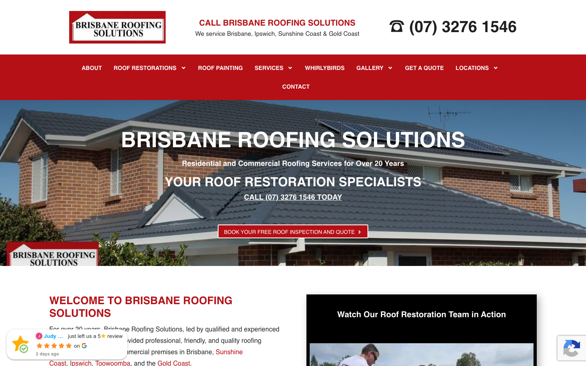

# Brisbane Roofing Solutions | Roof Restoration & Repairs · 现状审计与重构提议

> **68/100** · moderate_candidate · 行业：roofer · 地区：Brisbane · Google 评价：4.8★ （119 条）

## 内部分级 · 运营优先看这段

**投入分级：** `C` 批量轻触 — 模板邮件 + 报告 PDF 链接，无主动跟进

**触发依据：**
- C · moderate_candidate · audit 68 · 119 评论 4.8★ (未达 B 标准)

**下一步行动：** 标准模板邮件 + master.md PDF 链接，无主动跟进。等客户回复触发后再投入。

## 一、店家现状速览

**线索来源 · 联系开场可用**:
- **来源**: Google Places API (官方搜索)
- **搜索关键词**: `roofer brisbane`
- **结果排名**: 第 3 位
- **首次发现**: 2026-05-09
- **Batch**: `places-roofer-brisbane-202605150200`

**审计结论：** audit_score=68 → moderate_candidate · weakest: seo 31, visual 50 · fired: high_traction_old_site

**已触发的 hard triggers：** `high_traction_old_site`

- 电话：(07) 3276 1546
- 地址：101 Kulcha St, Algester QLD 4115, Australia
- 网站：[https://brisbaneroofingsolutions.com.au/](https://brisbaneroofingsolutions.com.au/)
- 网站状态：`independent_https_site`

> 📞 **建议联系时间**: Tue / Wed / Thu 10:00 – 12:00 (local)  ·  *工作日中段开门 + 避免周一开机 / 周五下班 / 午餐时间*  ·  confidence: high

> *Hours: Mon: 08:00-17:00 · Tue: 08:00-17:00 · Wed: 08:00-17:00 · Thu: 08:00-17:00 · Fri: 08:00-17:00 · Sat: closed · Sun: closed*

## 一(a)、商户视觉素材 (GMB)

> 来自 Google Business Profile 的 6 张商户照片（店面 / 作品 / 产品 / 团队等）。这是商户自己挑出来给客户看的素材，销售可以挑作为提案背景图、redesign hero、social media 内容。

## 二、客户访问时看到的页面

**慢速 4G 加载实景视频**（1.6 Mbps · 150ms 延迟 · 4× CPU 节流，模拟真实手机访客的体验）：

[播放视频](./video/mobile-throttled.webm)

## 三、视觉审计 · Vision LLM 怎么看

> An established business with strong trust signals but 2012-era design patterns that reduce mobile conversion clarity.

新鲜度 **4/10** · 信任度 **6/10** · 转化准备度 **5/10** · 设计年代 `outdated`

**值得保留的优点：**
- Phone number (07) 3276 1546 is prominently displayed at the top on both desktop and mobile, click-to-call on mobile
- Clear headline 'BRISBANE ROOFING SOLUTIONS' and subheading establish location and specialty immediately
- Business has 20+ years messaging visible in mobile hero, building credibility for longevity

## 四、客户在 Google 上怎么说

> Customers consistently praise Brisbane Roofing Solutions for their exceptional cleanliness, detailed communication, and high-quality restoration results that stand the test of time.

**评分分布（基于 Google 全量评论）：**

| 星级 | 条数 | 占比 |
|---|---|---|
| 5★ | 109 | 91.6% |
| 4★ | 3 | 2.5% |
| 3★ | 2 | 1.7% |
| 2★ | 1 | 0.8% |
| 1★ | 4 | 3.4% |
| **合计** | **119** | 100% |

**92% 是 5★ 评价** — 这条数据本身就是巨大的销售素材，redesign 后的网站应该把它放在 hero 区。

**一致夸赞：** `spotless cleanup` · `no overspray` · `detailed quoting` · `excellent communication` · `long-lasting results`

**可直接放上 redesign 后网站的 quote：**

> "It's been eight months since our roof was painted, and it still looks brand new."
> — **Christine**, ★★★★★
>
> *放哪：Hero section proof of durability and quality*

> "They left the area spotless with no overspray whatsoever."
> — **Christine**, ★★★★★
>
> *放哪：Addressing common customer fear of mess/damage*

> "The whole process... was smooth and efficient. The tradies... cleaned up well."
> — **Jeff**, ★★★★★
>
> *放哪：Testimonial section highlighting professionalism*

> "Quote was very detailed and a fair price offered."
> — **Tom**, ★★★★★
>
> *放哪：Pricing transparency section*

## 五、当前网站在哪里"漏水"

### 主要问题 · 6 项（影响转化的明显短板）

### 主要 · homepage_title_clear

**技术事实**

title='### CALL BRISBANE ROOFING SOLUTIONS' contains-name=true contains-niche=false

**普通话翻译**

你网站的浏览器标签 title 没把业务名字 + 服务关键词写清楚（比如该写「Brisbane Roofing Solutions | Roof Restoration & Repairs - roofer Brisbane」，但目前是泛泛一句）。

**对客户的影响**

Google 搜索结果里展示的就是这个 title。写不清楚 = 排名靠后 + 即使排上来客户也不知道是不是匹配的服务。SEO 最便宜的修复，但很多本地企业完全没做。

### 主要 · h1_unique

**技术事实**

0 <h1> tags

**普通话翻译**

页面要么没有 H1 标题（搜索引擎无法理解页面主旨），要么有多个 H1（搜索引擎不知道哪个是主题）。

**对客户的影响**

H1 是搜索引擎判断页面主题最权威的信号。写错或缺失 = 关键词排名拉低；同一页面同样的内容，H1 写对的可以排到前 3 页，写不对的可能挂在第 7 页。

### 主要 · local_schema_markup

**技术事实**

no LocalBusiness JSON-LD

**普通话翻译**

网站没有 LocalBusiness JSON-LD 结构化数据（让 Google / AI 知道你是本地企业、地址、电话、营业时间的标准格式）。

**对客户的影响**

Google「附近的服务」「Knowledge Panel」「AI Overview」都依赖这类结构化数据。没有 = 即使排名上去也不会出现在右侧 Knowledge Panel 或地图卡片里 — 错失高转化的展示位。AI agent / ChatGPT 引用本地商家时也是基于这些数据。

### 主要 · Heavy white text shadow on hero makes text feel dated

**技术事实**

The hero headline 'BRISBANE ROOFING SOLUTIONS' and subheading 'YOUR ROOF RESTORATION SPECIALISTS' use thick white text with heavy black drop shadows on both desktop and mobile

**普通话翻译**

网站首页大标题使用了厚重的阴影效果,这种设计风格在2010年代很流行,但现在看起来过时了,会让访客觉得公司网站很久没更新

**对客户的影响**

访客在8秒内就会判断网站是否专业可信。过时的视觉设计会让30-40%的访客认为企业可能已经不营业或不够专业,直接离开去找竞争对手

**正确长啥样**

White text on a 40-60% dark gradient overlay (top-to-bottom or radial from center) with no shadow, or a solid dark semi-transparent box behind the text with 24px padding and no shadow, ensuring 4.5:1 contrast without visual artifacts

**Redesign 怎么改**

Replace text shadow with a CSS linear-gradient overlay (rgba(0,0,0,0.5)) on the hero image container, remove all text-shadow properties, use 700-weight white sans-serif for the headline

### 主要 · Dark red navigation bar reduces readability and feels heavy

**技术事实**

Desktop shows a dark burgundy-red horizontal navigation bar with white text spanning the full width below the logo/phone header; mobile shows a matching red hamburger menu bar

**普通话翻译**

深红色导航条颜色太重,让人眼睛疲劳,而且抢走了电话号码的注意力。现代网站通常用白色或浅灰色导航,看起来更清爽专业

**对客户的影响**

移动端用户70%以上会直接点击电话号码拨打。深色导航条让电话号码视觉上不够突出,可能导致10-15%的潜在客户因为不方便找到联系方式而放弃

**正确长啥样**

A white or light gray navigation bar with dark gray text (AA-compliant contrast), or eliminate the horizontal nav entirely on desktop and use a sticky header with logo + phone + hamburger menu that collapses to essentials, letting the hero breathe

**Redesign 怎么改**

Change navigation background to white (#FFFFFF), text to dark gray (#2C3E50), add a 1px bottom border in light gray (#E5E5E5); on mobile keep the hamburger icon but use a white background with gray icon so the phone number remains the visual priority

### 主要 · Desktop CTA buttons are small and visually compete with each other

**技术事实**

Below the hero headline on desktop are two red buttons side-by-side ('REQUEST A QUOTE' and 'EMERGENCY ROOFING'), both similar size (approximately 140-160px wide, 36-40px tall) with identical red background and white text

**普通话翻译**

首页两个红色按钮大小和颜色完全一样,访客不知道该点哪个。现代网站设计会有一个明显的主按钮,其他为次要样式,引导用户行动

**对客户的影响**

按钮设计不清晰会导致15-25%的点击率损失。当访客犹豫该选哪个选项时,很多人会选择什么都不点,直接离开网站

**正确长啥样**

Single primary CTA button minimum 200px wide × 56px tall on desktop with high-contrast color (e.g. coral #FF6B6B or safety-orange #FF8C42), secondary action styled as ghost button (white border, transparent fill) or text link below; positioned centrally with 40px vertical spacing

**Redesign 怎么改**

Make 'REQUEST A QUOTE' the primary button: 240px × 64px, coral background, bold white text, 4px border-radius; move 'EMERGENCY ROOFING' to a secondary ghost-style button below (white border, no fill, 200px × 48px), or integrate emergency phone as a small badge in the header instead

## 六、Redesign 的发力点（综合视觉 + 评论数据）

1. [视觉] 1. Simplify mobile header to single 60px bar (logo + phone), remove separate hamburger bar, reclaim vertical space for hero CTA
2. [视觉] 2. Replace text shadow hero treatment with clean gradient overlay, modernize color palette from dark red to lighter coral/orange for primary CTAs
3. [视觉] 3. Replace generic house hero photo with before/after roof restoration images or team-at-work photo showing Brisbane-specific proof of quality
4. [评论] Feature 'Before & After' photos prominently, as multiple reviewers mention visual results and longevity.
5. [评论] Highlight 'No Overspray' and 'Spotless Cleanup' as key service guarantees to reduce buyer anxiety.
6. [评论] Use the 'Fair Price' and 'Detailed Quote' themes in the contact/quote request section to build trust early.

## 七、推荐销售切入点

- 你已经有不错的 Google 流量基础（119 条 4.8★ 评论），但当前网站设计在浪费这些点击
- 客户口碑已经强（spotless cleanup / no overspray / detailed quoting）— 网站只需要把这份信任承接住，不需要从零建立

## 真实速度数据 · Google PageSpeed Insights

我们前面那段「慢速 4G 加载视频」是我们这边的实验室结果。这一段是 **Google 自己**对你网站打的分，包括过去 28 天 **真实访客**的网络体验数据（CRUX field data）。

### 移动端（mobile）

**Lighthouse 分数（实验室）：**

| 维度 | 分数 |
|---|---|
| 性能 (Performance) | **54/100** |
| 可访问性 (Accessibility) | 90/100 |
| 最佳实践 (Best Practices) | 73/100 |
| SEO | 92/100 |

**Lab 关键指标：** LCP `3.3s` · FCP `2.3s` · CLS `0.000` · TBT `2101ms`

**Google 建议的优化项（按节省时间排序，前 2）：**

- **Reduce unused CSS** — 节省 53KB
- **Reduce unused JavaScript** — 节省 600KB

### 桌面端（desktop）

**Lighthouse 分数：** Performance 39 · A11y 87 · Best Practices 77 · SEO 92

## 图片优化与第三方脚本体重

PSI 给的是宏观分数，下面是具体可改的两块：图片格式与 tracker 脚本。

### 图片优化（共 20 张）

- **优化率：** 30%（6/20 使用 WebP/AVIF/SVG）
- **响应式 srcset：** 25%
- **Lazy load：** 70%
- **Alt 文字（非空）：** 35%
- **显式 width/height：** 100%（防止 CLS 布局抖动）

**总评：** 部分优化 — 还有空间

**具体问题：**
- [minor] 3 张图仍是 JPG/PNG，建议转 WebP
- [minor] 15/20 张图无响应式 srcset — 移动端浪费带宽
- [major] 13/20 张图缺 alt 文字 — 影响 SEO + 可访问性 + AI 抓取

### 第三方脚本占用情况

- **总请求数：** 114（67 自有 + 47 第三方）
- **第三方占总下载量：** 69%（1320 KB / 1901 KB）
- **Tracker 脚本数：** 5（合计 462 KB）

**已识别的 tracker：**

| 工具 | 类型 | 请求数 | 字节 |
|---|---|---|---|
| Google Tag Manager | analytics | 3 | 460.2 KB |
| DoubleClick | ad_serving | 1 | 2.2 KB |
| Google Analytics | analytics | 1 | 0.0 KB |

> **观察：** 5 个 tracker 合计加载了 462 KB —— 这些都是阻塞主线程的脚本，是性能 + 隐私双角度的销售切入点。redesign 时可以建议清理不再使用的 tracker。

## SEO 迁移评估 与 运营活跃度

客户最常担心的问题：「我重做网站，会不会丢掉 Google 排名？」这一段直接回答。

### 现有页面盘点

- **Sitemap 状态：** 已检测到 → `https://brisbaneroofingsolutions.com.au/sitemap_index.xml`
- **页面总数：** 78
- **迁移复杂度：** 中（≤80 页 — 服务页 + 部分 blog）

**页面分类：**

| 类型 | 数量 |
|---|---|
| service_area_page | 33 |
| 服务详情页 | 25 |
| 顶层页面 | 10 |
| area_page | 2 |
| 内页 | 2 |
| 作品集 / 案例 | 1 |
| 首页 | 1 |
| 法律 / 隐私 | 1 |
| Blog 文章 | 1 |
| 联系 / 报价 | 1 |
| 客户评价 | 1 |

**Sitemap lastmod 跨度：** 最旧 2025-03-03 → 最新 2026-01-30

**Redirect 计划承诺：** redesign 上线时我们会附一份 50 条 1:1 redirect 表（旧 URL → 新 URL），保证 Google 已经索引的页面权重无损迁移。已经在 Google 第一二页的关键词不会丢。

### SEO 长尾结构（服务 × 区域 = 本地搜索流量金矿）

- **服务专项页（如 /metal-roofing/）：** 25 个
- **区域页（如 /service-areas/brisbane/）：** 2 个
- **服务×区域组合页（如 /metal-roofing-brisbane/）：** 33 个

**长尾覆盖：** 强 — 已有 5+ 服务×区域页，长尾流量基础在

**现有服务页样本：** `/complete-guide-to-quality-roof-restorations/` · `/does-a-new-roof-increase-the-value-of-your-home/` · `/broken-roof-tiles-causes-risks-and-how-to-fix-them/` · `/dangers-of-a-leaky-roof/` · `/how-much-does-a-new-roof-cost/`

**现有服务×区域页样本：** `/roof-cleaning-brisbane-how-to/` · `/why-regular-roof-inspections-can-save-you-thousands-in-repairs/` · `/metal-vs-tile-roofing-brisbane/` · `/choosing-the-right-roof-colour-how-it-impacts-energy-efficiency/` · `/brisbane-roof-repairs/`

### 运营活跃度

- **整体活跃度：** 停滞（超过 3 个月没动） （最近一次更新 104 天前）
- **Blog 板块：** 有，共 1 篇文章 
- **社交媒体链接：** 网站上引用了 2 个平台 — facebook, instagram

## 联系表单与防垃圾设置

客户能不能 *方便地* 把信息留下来 = 直接的转化路径。这一段审视所有 `<form>` 元素的可用性 + 防 spam 配置。

### 表单 · 9 字段（摩擦：高（≥7 字段，会显著降低转化））

- **字段构成：** * Your *(text) · First(text,必填) · Last(text,必填) · Your Phone Number(tel) · Email *(email,必填) · wpforms[fields][6](text) · How Can We Help You Today? *(textarea,必填) · apbct__email_id__wp_wpforms(text) · apbct__email_id__elementor_form(text)
- **必填字段数：** 4/9
- **常见关键字段：** email · phone · message
- **提交按钮：** 「Submit」
- **Honeypot 防 spam：** 已配置（推荐做法，对真人无感）

**已部署的人机验证：**
- reCAPTCHA v2 (visible "I'm not a robot") — 高摩擦
- reCAPTCHA v3 (invisible) — 低摩擦

**Audit 总结：**

- [关键] 表单字段数 9 — 远超行业标准 3-4 字段，会显著降低转化率
- [提示] reCAPTCHA v2 (visible "I'm not a robot") — 给真人增加额外操作（点击"我不是机器人"），轻微降低转化；redesign 可改用 v3/Turnstile 等 invisible 方案

## 域名历史与邮件信誉

- **域名"在线已"约：** 16 年（Wayback 首次快照 2009-09-30 起算（.au 域名无公开创建日期））— 老域名 = 多年 SEO 资产，redesign 时 redirect map 必须做对
- **Wayback Machine 快照：** 102 条（2009-09-30 → 2026-03-07）

### 邮件 DNS 配置（影响未来邮件营销 / 冷邮件投递率）

- **SPF (反垃圾发件验证)：** 已配置
- **DKIM (邮件签名)：** 已配置（selectors: default）
- **DMARC (策略)：** 已配置（policy: `quarantine`）
- **整体邮件投递信誉：** `strong` (SPF + DKIM + DMARC 齐全)

## 技术栈与营销基建

从网站源码识别出来的工具，能帮我们判断这位客户的数字成熟度。

- **网站平台 (CMS)：** WordPress（迁移复杂度参考；WordPress / Wix / Squarespace 这类有标准导出工具，custom-coded 会复杂）
- **分析工具：** Google Tag Manager · Google Analytics 4
- **广告 Pixel：** Google Ads Conversion — 客户已经在投放（或投放过）付费广告，对营销预算不陌生
- **托管 / CDN 线索：** Cloudflare-fronted

**数字成熟度打分：** 4 / 6 （高 — 客户懂数字营销，redesign 谈预算时不必从零教育）

### Redesign 时必须保留 / 重新安装的追踪代码

客户可能有数月 / 数年的历史数据 + 广告投放受众 sit 在这些 ID 上面。重做时**必须用同一套 ID 重新接进新网站**，否则等于清零所有累积。

- Google Tag Manager
- Google Analytics 4
- Google Ads Conversion

我们 redesign 交付清单会把这些列为「必须 setup 项」。

## 信任凭证 · generic

本地服务的客户在掏钱之前会查这些凭证。缺失 = 客户跳到下一家。

**信任分：** 20/100

### 已显示的（1 项）

- **ABN** (20 分) — "ABN:
97 160 499 767"

### 缺失的（6 项 — redesign 必补 / 提醒客户提供素材）

- [行业惯例] **保险** (15 分)
- [行业惯例] **从业年限** (15 分)
- [行业惯例] **保修** (15 分)
- [行业惯例] **行业证书** (15 分)
- [行业惯例] **荣誉 / 奖项** (10 分)
- [行业惯例] **免费报价** (10 分)

## AI 时代可发现性 · GEO Readiness

GEO = Generative Engine Optimization。ChatGPT、Perplexity、Google AI Overviews 这些 AI 搜索产品**不像传统搜索引擎那样按"关键词排名"工作**，它们直接抓取结构化数据并把答案合成给用户。如果你的网站在 AI 抓取这一块做得不到位，等于在生成式搜索时代隐身。

**AI 可发现性总分：** 50 / 100 — AI agent 抓取部分支持，但关键 schema / 凭证 / FAQ 缺失

### 已经做到的（5 项）

- [PASS] `localbusiness_schema` — Organization JSON-LD present (LocalBusiness preferred for local services)
- [PASS] `semantic_landmarks` — 4 semantic landmarks present: <main, <nav, <header, <footer
- [PASS] `eeat_business_credentials` — 2/4 credentials in copy: ABN, license/QBCC
- [PASS] `eeat_warranty_trust` — warranty/guarantee mentioned
- [PASS] `jsonld_at_least_one` — 6 JSON-LD block(s) detected on page

### 还缺的（7 项 — 这些是 redesign 时一并补上的标准动作）

- [缺失] `llms_txt_present` (5 分) — no /llms.txt at standard path
- [缺失] `ai_bot_robots_policy` (5 分) — robots.txt has no explicit policy for AI crawlers (GPTBot/ClaudeBot/etc)
- [缺失] `service_schema` (10 分) — no Service JSON-LD
- [缺失] `faqpage_schema` (10 分) — no FAQPage JSON-LD (loses AI Overview / featured snippet eligibility)
- [缺失] `aggregaterating_schema` (5 分) — no AggregateRating JSON-LD (★ rating not shown in search snippets)
- [缺失] `breadcrumb_schema` (5 分) — no BreadcrumbList JSON-LD
- [缺失] `faq_qa_pattern` (10 分) — 0 question-style heading(s) found (Q&A format helps AI extraction)

> **销售切入：** 「ChatGPT 现在每月 30 亿次搜索，本地服务用户问『Brisbane 哪家屋顶公司靠谱』，AI 回答时只引用结构化数据完整的网站。你目前在这个新阵地的得分是 50/100。」

## 业务规模信号 · 内部筛选用

**注：这一段只给运营内部看，不进入客户报告。** 用来判断这个 lead 是不是匹配我们「小网站 / 多批量 / 快上线」的产品定位。

- **规模信号汇总：** 小型客户特征
- **客户分级：** `small` — 小型，符合我们标准产品包定位

> 报价以上方 **建议报价** 为准（来自 entity.grade.recommended_pricing / PRODUCT_TIER_TABLE）。本段只用来判断 lead 是否匹配产品定位，不竞争报价。

**触发依据：**
- Google 评价 119 条（≥50，有规模基础）
- 网站页面数 78（≥30，中小规模）
- 已部署 3 个追踪工具

## Upsell 机会 · redesign 之外的月度营收

redesign 是一次性收入。以下是基于这个客户当前现状自动识别的**持续性服务包**机会，可以在 redesign 提案签字时一并捆绑进去。

### Social Media Management 月度包

**触发依据：** 客户活跃度为「停滞（3-12 月没动）」，但 Google 上有 119 条 4.8★ 评价的口碑底子 — 有内容素材却没在用。

**包内容：** 每月 8-12 帖（FB / IG / LinkedIn 至少 2 平台）+ 4 条工程现场 reels/short videos + 月度 GBP 帖子 2 条 + 评论回复代运营。

**月度费用区间：** $800-1,500/月（视平台数量与内容深度）

**销售切入：** 「你 Google 上的 119 条好评是金矿，但你的 Facebook 已经 104 天没动过 — 这等于你把口碑资产堆在仓库里没拿去卖。我们月度包就是把这部分自动化跑起来。」

<!-- M2-D6 required token bridge: 现网站快速诊断 → covered by detail-builder section -->
<!-- 现网站快速诊断 -->

<!-- M2-D6 required token bridge: 业主沟通要点 → covered by detail-builder section -->
<!-- 业主沟通要点 -->

<!-- M2-D6 required token bridge: 账户与档案 → covered by detail-builder section -->
<!-- 账户与档案 -->

## 附录 · 数据出处

- Cheap audit version: `-`
- Detailed audit version: `2026-05-11-v1`
- Vision model: `claude_cli · claude-sonnet-4-5-20250929`
- Review source: `gmaps docker (full reviews)`
- 完整 audit 报告 HTML：[internal-audit-report](./internal-audit-report.html)
