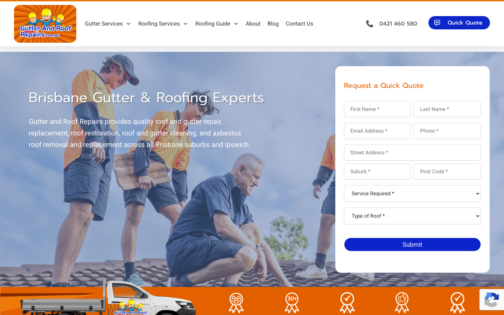

# Gutter and Roof Repairs · 现状审计与重构提议

> **69/100** · moderate_candidate · 行业：roofer · 地区：Brisbane · Google 评价：4.6★ （150 条）

## 内部分级 · 运营优先看这段

**投入分级：** `C` 批量轻触 — 模板邮件 + 报告 PDF 链接，无主动跟进

**触发依据：**
- C · moderate_candidate · audit 69 · 150 评论 4.6★ (未达 B 标准)

**下一步行动：** 标准模板邮件 + master.md PDF 链接，无主动跟进。等客户回复触发后再投入。

## 一、店家现状速览

**线索来源 · 联系开场可用**:
- **来源**: Google Places API (官方搜索)
- **搜索关键词**: `roofer brisbane`
- **结果排名**: 第 9 位
- **首次发现**: 2026-05-09
- **Batch**: `places-roofer-brisbane-202605150200`

**审计结论：** audit_score=69 → moderate_candidate · weakest: seo 31, visual 50 · fired: high_traction_old_site

**已触发的 hard triggers：** `high_traction_old_site`

- 电话：0421 460 580
- 地址：1/41 Steel Pl, Morningside QLD 4170, Australia
- 网站：[https://gutterandroofrepairs.com.au/](https://gutterandroofrepairs.com.au/)
- 网站状态：`independent_https_site`

> 📞 **建议联系时间**: Tue / Wed / Thu 10:00 – 12:00 (local)  ·  *工作日中段开门 + 避免周一开机 / 周五下班 / 午餐时间*  ·  confidence: high

> *Hours: Mon: 08:00-16:00 · Tue: 08:00-16:00 · Wed: 08:00-16:00 · Thu: 08:00-16:00 · Fri: 08:00-16:00 · Sat: closed · Sun: closed*

## 一(a)、商户视觉素材 (GMB)

> 来自 Google Business Profile 的 6 张商户照片（店面 / 作品 / 产品 / 团队等）。这是商户自己挑出来给客户看的素材，销售可以挑作为提案背景图、redesign hero、social media 内容。

## 二、客户访问时看到的页面

**慢速 4G 加载实景视频**（1.6 Mbps · 150ms 延迟 · 4× CPU 节流，模拟真实手机访客的体验）：

[播放视频](./video/mobile-throttled.webm)

## 三、视觉审计 · Vision LLM 怎么看

> Generic stock photo hero with low-contrast text and dated orange navigation reduces trust for local searchers seeking Brisbane roof repair.

新鲜度 **3/10** · 信任度 **4/10** · 转化准备度 **5/10** · 设计年代 `outdated`

**值得保留的优点：**
- Clear phone number visible in top header bar with click-to-call functionality
- Quote form is above the fold and captures structured lead data (name, contact, location, roof type)
- Hero headline immediately states location (Brisbane) and core service (Gutter & Roofing)

## 四、客户在 Google 上怎么说

> Customers consistently praise the business for its professionalism, clear communication, and high-quality workmanship, with specific appreciation for handling complex or difficult jobs safely and efficiently.

**评分分布（基于 Google 全量评论）：**

| 星级 | 条数 | 占比 |
|---|---|---|
| 5★ | 129 | 86.0% |
| 4★ | 5 | 3.3% |
| 3★ | 1 | 0.7% |
| 2★ | 1 | 0.7% |
| 1★ | 14 | 9.3% |
| **合计** | **150** | 100% |

**86% 是 5★ 评价** — 这条数据本身就是巨大的销售素材，redesign 后的网站应该把它放在 hero 区。

**一致夸赞：** `clear communication` · `professional workmanship` · `punctual and reliable` · `clean job site` · `fair pricing`

**可直接放上 redesign 后网站的 quote：**

> "The whole process was businesslike and professional. I cannot imagine a better experience."
> — **Bernard**, ★★★★★
>
> *放哪：Hero section proof of reliability for complex jobs*

> "They didn’t grumble. They didn’t cut corners. Instead, they explained the problem, got my approval..."
> — **Chris**, ★★★★★
>
> *放哪：Testimonial section highlighting transparency and problem-solving*

> "One of their team members showed a week later for a free, no-obligation quote - none of that “pay us just to take a look” nonsense."
> — **Chris**, ★★★★★
>
> *放哪：Service page to highlight no-obligation quotes*

> "The team kept us updated every step of the way, arrived right on schedule, and did a brilliant job."
> — **Mark**, ★★★★★
>
> *放哪：General trust signal for homepage*

## 五、当前网站在哪里"漏水"

### 关键问题 · 1 项（立刻在伤害成交）

### 关键 · Hero shows generic family photo, not actual Brisbane roofing work

**技术事实**

The hero section displays a stock photo of a family (parents and children) sitting on a roof, with overlaid white text reading 'Brisbane Gutter & Roofing Experts' — the image is clearly a generic stock photo with no connection to the business or actual completed work in Brisbane

**普通话翻译**

首页大图用的是从图库下载的家庭照片,不是你们在布里斯班实际完成的屋顶工程。看起来像模板网站,不像真实的本地公司。

**对客户的影响**

本地搜索「布里斯班屋顶维修」的客户看到通用图片会怀疑你不是真实企业,72%的消费者表示看到实际工程照片才会信任本地服务商。这直接导致他们关闭页面去找竞争对手。

**正确长啥样**

Hero image showing actual completed roof or gutter work in recognizable Brisbane locations (e.g. Queenslander homes, Brisbane suburbs), or photos of the real team on a Brisbane job site with branded uniforms and equipment

**Redesign 怎么改**

Replace stock photo with client-supplied project photos from Brisbane — before/after roof repairs on local home styles (Queenslanders, contemporary builds). If unavailable, use team photo on actual Brisbane job site with branded van/uniforms visible.

### 主要问题 · 7 项（影响转化的明显短板）

### 主要 · homepage_title_clear

**技术事实**

title='# Brisbane Gutter & Roof Repairs' contains-name=true contains-niche=false

**普通话翻译**

你网站的浏览器标签 title 没把业务名字 + 服务关键词写清楚（比如该写「Gutter and Roof Repairs - roofer Brisbane」，但目前是泛泛一句）。

**对客户的影响**

Google 搜索结果里展示的就是这个 title。写不清楚 = 排名靠后 + 即使排上来客户也不知道是不是匹配的服务。SEO 最便宜的修复，但很多本地企业完全没做。

### 主要 · h1_unique

**技术事实**

3 <h1> tags

**普通话翻译**

页面要么没有 H1 标题（搜索引擎无法理解页面主旨），要么有多个 H1（搜索引擎不知道哪个是主题）。

**对客户的影响**

H1 是搜索引擎判断页面主题最权威的信号。写错或缺失 = 关键词排名拉低；同一页面同样的内容，H1 写对的可以排到前 3 页，写不对的可能挂在第 7 页。

### 主要 · local_schema_markup

**技术事实**

no LocalBusiness JSON-LD

**普通话翻译**

网站没有 LocalBusiness JSON-LD 结构化数据（让 Google / AI 知道你是本地企业、地址、电话、营业时间的标准格式）。

**对客户的影响**

Google「附近的服务」「Knowledge Panel」「AI Overview」都依赖这类结构化数据。没有 = 即使排名上去也不会出现在右侧 Knowledge Panel 或地图卡片里 — 错失高转化的展示位。AI agent / ChatGPT 引用本地商家时也是基于这些数据。

### 主要 · White headline text lacks contrast over busy photo background

**技术事实**

The main headline 'Brisbane Gutter & Roofing Experts' and the body copy below it are rendered in white text with no background overlay or shadow, placed directly over a busy photo of people on a roof — the text bleeds into the sky and clothing colors, making it hard to read at a glance

**普通话翻译**

首页标题用白色字直接放在繁忙的照片上,没有深色背景保护,在手机上特别是阳光下根本看不清楚。

**对客户的影响**

70%的本地搜索在手机上进行,访客需要在3-5秒内看懂你的服务。看不清标题的人会直接离开,你错失了Google地图来的流量。

**正确长啥样**

Dark semi-transparent overlay (40-60% opacity black or navy) behind all hero text, OR solid-color hero section with image offset to one side, ensuring WCAG AA contrast ratio of at least 4.5:1 for body text and 3:1 for headlines

**Redesign 怎么改**

Add 50% opacity black gradient overlay behind hero text extending from left edge, OR place text on solid coral/navy background panel overlaying left third of hero, ensuring white text has 4.5:1+ contrast ratio

### 主要 · Bright orange bottom icon navigation looks like 2010-era web design

**技术事实**

Below the hero is a bright orange horizontal bar containing 6+ white icons (appears to show services/features) with small text labels — the icons have a glowing or highlighted treatment against the saturated orange background, using a visual style common in mid-2000s to early 2010s web design

**普通话翻译**

底部亮橙色的图标栏看起来像2010年代的老式网站设计,让人觉得公司可能也过时了、不活跃了。

**对客户的影响**

75%的访客根据网站设计判断公司是否可信。过时的视觉风格让他们怀疑你的公司是否还在营业、服务质量是否跟得上时代,直接影响询价率。

**正确长啥样**

Services presented as clean cards or text blocks with subtle iconography (24-32px outlined icons in brand accent color), generous white space, and readable 16-18px labels — or removed entirely in favor of a simple 'Our Services' section with larger type and real project images

**Redesign 怎么改**

Remove orange icon bar entirely. Replace with clean 'Services' section using 2-3 column grid on desktop (stacked on mobile), each service as a card with small accent-color icon, 20px+ heading, and 1-sentence description. Use neutral background (off-white or light gray) with brand coral as accent only.

### 主要 · Right-side quote form uses desktop-era layout pattern

**技术事实**

The hero section includes a multi-field quote form in a white box positioned on the right side with fields for Name, Email, Phone, Address, Post Code, and a 'What is Roof?' dropdown — this is a classic desktop-optimized layout where forms sit beside hero content

**普通话翻译**

首页右侧放了一个多字段表单,在手机上会很难用,而且字段太多(6个)让人觉得麻烦。本地客户更想直接打电话,而不是先填表。

**对客户的影响**

每增加一个表单字段,提交率下降5-10%。本地搜索的客户70%在手机上,他们想要一键拨号,而不是在到达页面就被要求填6个字段。这会让大部分人直接离开。

**正确长啥样**

On mobile: single prominent 'Call Now' button with phone number, secondary 'Request Quote' button that opens simple 2-3 field modal (name, phone, brief message). On desktop: same button priority, with optional compact form below hero limited to Name + Phone + 'Send' button.

**Redesign 怎么改**

Replace above-fold form with two large buttons: '(07) XXXX XXXX Call Now' (primary) and 'Get Free Quote' (secondary outline style). Move full form to dedicated section below services, reduce to 3 fields max (Name, Phone, Message). Ensure mobile design stacks vertically with thumb-friendly 48px+ tap targets.

### 主要 · No reviews, credentials, or local proof visible without scrolling

**技术事实**

The visible above-fold area shows only the generic family photo, headline, form, and orange icon bar — there are no Google star ratings, review counts, badges (licensed/insured), years in business, or recognizable Brisbane suburb names visible without scrolling

**普通话翻译**

首屏(不用滚动就能看到的部分)没有显示Google评分、客户评价数量、营业执照或者服务年限等信任证明。

**对客户的影响**

本地客户会同时打开3-5家公司网站对比,他们最信任Google评价和资质证明。如果首屏看不到这些,他们会认为你是新公司、评价差、或者不正规,直接去找显示了4.8星评价的竞争对手。

**正确长啥样**

Directly below or next to hero headline: '4.8★★★★★ (127 Google Reviews)' in readable 18-20px text, plus 1-2 badge icons (QBCC Licensed, Insured, 15+ Years) with small labels. Optionally: 'Serving [specific Brisbane suburbs]' to reinforce local presence.

**Redesign 怎么改**

Add trust bar immediately below hero headline containing: Google star rating + review count (linked to GBP), 2-3 credential badges (QBCC license, insurance, years), and served suburbs list. Use coral or gold stars, keep badges grayscale or subtle color, ensure mobile-friendly size (32-40px icons).

## 六、Redesign 的发力点（综合视觉 + 评论数据）

1. [视觉] 1. Replace generic stock photo with real Brisbane project photos showing completed roof/gutter work on local home styles
2. [视觉] 2. Add trust signals above fold: Google star rating + review count, QBCC license badge, years in business, served suburbs
3. [视觉] 3. Simplify above-fold CTA to primary 'Call Now' button + secondary 'Get Quote' button, move multi-field form below hero, reduce to 3 fields
4. [评论] Highlight the 'free, no-obligation quote' aspect prominently to reduce friction for new leads.
5. [评论] Use Bernard's review to showcase capability in handling difficult, high-risk jobs (e.g., near electrical lines).
6. [评论] Feature Chris's review to demonstrate transparency when unforeseen issues arise, building trust in pricing integrity.

## 七、推荐销售切入点

- 你已经有不错的 Google 流量基础（150 条 4.6★ 评论），但当前网站设计在浪费这些点击
- 客户口碑已经强（clear communication / professional workmanship / punctual and reliable）— 网站只需要把这份信任承接住，不需要从零建立

## 真实速度数据 · Google PageSpeed Insights

我们前面那段「慢速 4G 加载视频」是我们这边的实验室结果。这一段是 **Google 自己**对你网站打的分，包括过去 28 天 **真实访客**的网络体验数据（CRUX field data）。

### 移动端（mobile）

**Lighthouse 分数（实验室）：**

| 维度 | 分数 |
|---|---|
| 性能 (Performance) | **35/100** |
| 可访问性 (Accessibility) | 90/100 |
| 最佳实践 (Best Practices) | 100/100 |
| SEO | 85/100 |

**Lab 关键指标：** LCP `5.7s` · FCP `3.1s` · CLS `0.000` · TBT `2829ms`

**真实用户体验（过去 28 天 CRUX field data）总评：** `SLOW`

| 指标 | 75% 用户值 | Google 评级 |
|---|---|---|
| LCP（最大内容绘制 p75） | 2.82s | AVERAGE |
| FCP（首次内容绘制 p75） | 2.67s | AVERAGE |
| TTFB（服务器响应 p75） | 1.90s | SLOW |
| CLS（布局抖动 p75） | 0.000 | FAST |

**这意味着：** 过去 28 天访问你网站的实际用户里，75% 的人遇到的体验就是上面这些数字 — 不是我们测的、是 Google 用真实 Chrome 用户数据统计出来的。

**Google 建议的优化项（按节省时间排序，前 3）：**

- **Reduce initial server response time** — 节省 581ms
- **Reduce unused JavaScript** — 节省 1127KB
- **Reduce unused CSS** — 节省 69KB

### 桌面端（desktop）

**Lighthouse 分数：** Performance 58 · A11y 90 · Best Practices 100 · SEO 85

## 图片优化与第三方脚本体重

PSI 给的是宏观分数，下面是具体可改的两块：图片格式与 tracker 脚本。

### 图片优化（共 38 张）

- **优化率：** 11%（4/38 使用 WebP/AVIF/SVG）
- **响应式 srcset：** 39%
- **Lazy load：** 89%
- **Alt 文字（非空）：** 26%
- **显式 width/height：** 100%（防止 CLS 布局抖动）

**总评：** 部分优化 — 还有空间

**具体问题：**
- [minor] 34 张图仍是 JPG/PNG，建议转 WebP
- [major] 28/38 张图缺 alt 文字 — 影响 SEO + 可访问性 + AI 抓取

### 第三方脚本占用情况

- **总请求数：** 105（68 自有 + 37 第三方）
- **第三方占总下载量：** 57%（1617 KB / 2832 KB）
- **Tracker 脚本数：** 11（合计 877 KB）

**已识别的 tracker：**

| 工具 | 类型 | 请求数 | 字节 |
|---|---|---|---|
| Google Tag Manager | analytics | 6 | 854.1 KB |
| Google Analytics | analytics | 4 | 20.3 KB |
| DoubleClick | ad_serving | 1 | 2.2 KB |

> **观察：** 11 个 tracker 合计加载了 877 KB —— 这些都是阻塞主线程的脚本，是性能 + 隐私双角度的销售切入点。redesign 时可以建议清理不再使用的 tracker。

## SEO 迁移评估 与 运营活跃度

客户最常担心的问题：「我重做网站，会不会丢掉 Google 排名？」这一段直接回答。

### 现有页面盘点

- **Sitemap 状态：** 已检测到 → `https://gutterandroofrepairs.com.au/sitemap_index.xml`
- **页面总数：** 114
- **迁移复杂度：** 高（>80 页 — 需要分阶段迁移 + 完整 redirect map）

**页面分类：**

| 类型 | 数量 |
|---|---|
| 服务详情页 | 51 |
| service_area_page | 37 |
| 顶层页面 | 7 |
| 内页 | 6 |
| 首页 | 3 |
| 联系 / 报价 | 3 |
| area_page | 2 |
| 法律 / 隐私 | 2 |
| Blog 文章 | 1 |
| FAQ | 1 |
| 关于 / 团队 | 1 |

**Sitemap lastmod 跨度：** 最旧 2023-06-26 → 最新 2026-04-15

**Redirect 计划承诺：** redesign 上线时我们会附一份 50 条 1:1 redirect 表（旧 URL → 新 URL），保证 Google 已经索引的页面权重无损迁移。已经在 Google 第一二页的关键词不会丢。

### SEO 长尾结构（服务 × 区域 = 本地搜索流量金矿）

- **服务专项页（如 /metal-roofing/）：** 51 个
- **区域页（如 /service-areas/brisbane/）：** 2 个
- **服务×区域组合页（如 /metal-roofing-brisbane/）：** 37 个

**长尾覆盖：** 强 — 已有 5+ 服务×区域页，长尾流量基础在

**现有服务页样本：** `/how-to-deal-with-storm-damage-to-your-roof/` · `/why-it-can-be-challenging-to-fix-a-leaking-roof/` · `/why-do-i-have-moss-and-mould-on-my-terracotta-roof-mark-norman-park/` · `/what-to-do-if-your-roof-is-leaking/` · `/6-benefits-of-replacing-your-gutters-rather-than-repairing-them/`

**现有服务×区域页样本：** `/roof-repair-karen-and-mark-woolloongabba-qld/` · `/asbestos-removal-and-tile-garry-camp-hill-qld/` · `/finally-a-roofie-who-turns-up-on-time-ingrid-redcliffe-qld/` · `/why-roof-sarking-is-important-to-protect-your-roof/` · `/why-its-important-to-have-clean-gutters/`

### 运营活跃度

- **整体活跃度：** 活跃（30 天内有更新） （最近一次更新 29 天前）
- **Blog 板块：** 有，共 1 篇文章 
- **社交媒体链接：** 网站上没有 social 链接 — GBP 流量进来后没有第二触点

## 联系表单与防垃圾设置

客户能不能 *方便地* 把信息留下来 = 直接的转化路径。这一段审视所有 `<form>` 元素的可用性 + 防 spam 配置。

### 表单 · 12 字段（摩擦：高（≥7 字段，会显著降低转化））

- **字段构成：** Instagram(text) · First(text) · Last(text) · Email*(email) · Phone*(tel) · Street Address(text) · Suburb(text) · Post Code(text) · Service Required*(select-one) · Type of roof*(select-one) · Additional Information(text) · g-recaptcha-response(textarea)
- **必填字段数：** 0/12
- **常见关键字段：** email · phone · message
- **提交按钮：** 「Submit」
- **Honeypot 防 spam：** 未检测到

### 表单 · 12 字段（摩擦：高（≥7 字段，会显著降低转化））

- **字段构成：** Phone(text) · First(text) · Last(text) · Email*(email) · Phone*(tel) · Street Address(text) · Suburb(text) · Post Code(text) · Service Required*(select-one) · Type of roof*(select-one) · Additional Information(text) · g-recaptcha-response(textarea)
- **必填字段数：** 0/12
- **常见关键字段：** email · phone · message
- **提交按钮：** 「Submit」
- **Honeypot 防 spam：** 未检测到

### 表单 · 12 字段（摩擦：高（≥7 字段，会显著降低转化））

- **字段构成：** Comments(text) · First(text) · Last(text) · Email*(email) · Phone*(tel) · Address(text) · Suburb(text) · Post Code(text) · Service Required*(select-one) · Type of roof*(select-one) · Additional Information(text) · g-recaptcha-response(textarea)
- **必填字段数：** 0/12
- **常见关键字段：** email · phone · message
- **提交按钮：** 「Submit」
- **Honeypot 防 spam：** 未检测到

**已部署的人机验证：**
- reCAPTCHA v2 (visible "I'm not a robot") — 高摩擦

**Audit 总结：**

- [关键] 表单字段数 12 — 远超行业标准 3-4 字段，会显著降低转化率
- [关键] 表单字段数 12 — 远超行业标准 3-4 字段，会显著降低转化率
- [关键] 表单字段数 12 — 远超行业标准 3-4 字段，会显著降低转化率
- [提示] reCAPTCHA v2 (visible "I'm not a robot") — 给真人增加额外操作（点击"我不是机器人"），轻微降低转化；redesign 可改用 v3/Turnstile 等 invisible 方案

## 域名历史与邮件信誉

- **域名"在线已"约：** 11 年（Wayback 首次快照 2014-09-19 起算（.au 域名无公开创建日期））— 老域名 = 多年 SEO 资产，redesign 时 redirect map 必须做对
- **Wayback Machine 快照：** 65 条（2014-09-19 → 2026-03-11）

### 邮件 DNS 配置（影响未来邮件营销 / 冷邮件投递率）

- **SPF (反垃圾发件验证)：** 已配置
- **DKIM (邮件签名)：** 已配置（selectors: s1, s2）
- **DMARC (策略)：** ⚠ 未配置 — 域名易被仿冒做钓鱼
- **整体邮件投递信誉：** `partial` (只有 2/3 — 建议补全)

> 这是后续 **「Social Media Management 月度包」** 或 **「Cold Outreach 启动包」** 的前置条件 —— 邮件 DNS 没修好，发出去的邮件全进垃圾箱。redesign 时一并处理。

## 技术栈与营销基建

从网站源码识别出来的工具，能帮我们判断这位客户的数字成熟度。

- **网站平台 (CMS)：** WordPress（迁移复杂度参考；WordPress / Wix / Squarespace 这类有标准导出工具，custom-coded 会复杂）
- **分析工具：** Google Tag Manager · Google Analytics 4 · Google Analytics (Universal)
- **广告 Pixel：** Google Ads Conversion — 客户已经在投放（或投放过）付费广告，对营销预算不陌生

**数字成熟度打分：** 4 / 6 （高 — 客户懂数字营销，redesign 谈预算时不必从零教育）

### Redesign 时必须保留 / 重新安装的追踪代码

客户可能有数月 / 数年的历史数据 + 广告投放受众 sit 在这些 ID 上面。重做时**必须用同一套 ID 重新接进新网站**，否则等于清零所有累积。

- Google Tag Manager
- Google Analytics 4
- Google Analytics (Universal)
- Google Ads Conversion

我们 redesign 交付清单会把这些列为「必须 setup 项」。

> **关键发现：客户网站还装着 Universal Analytics**，这套工具 Google 已于 2023 年 7 月停止收集数据。也就是说，**他们至少 2 年没有看过任何真实的网站访客数据**。这是销售切入的强角度。

## 信任凭证 · generic

本地服务的客户在掏钱之前会查这些凭证。缺失 = 客户跳到下一家。

**信任分：** 60/100

### 已显示的（4 项）

- **保险** (15 分) — "Fully Insured"
- **从业年限** (15 分) — "30 years experience"
- **保修** (15 分) — "Workmanship Guarantee"
- **行业证书** (15 分) — "Licensed"

### 缺失的（3 项 — redesign 必补 / 提醒客户提供素材）

- [行业惯例] **ABN** (20 分)
- [行业惯例] **荣誉 / 奖项** (10 分)
- [行业惯例] **免费报价** (10 分)

## AI 时代可发现性 · GEO Readiness

GEO = Generative Engine Optimization。ChatGPT、Perplexity、Google AI Overviews 这些 AI 搜索产品**不像传统搜索引擎那样按"关键词排名"工作**，它们直接抓取结构化数据并把答案合成给用户。如果你的网站在 AI 抓取这一块做得不到位，等于在生成式搜索时代隐身。

**AI 可发现性总分：** 55 / 100 — AI agent 抓取部分支持，但关键 schema / 凭证 / FAQ 缺失

### 已经做到的（6 项）

- [PASS] `localbusiness_schema` — Organization JSON-LD present (LocalBusiness preferred for local services)
- [PASS] `breadcrumb_schema` — BreadcrumbList JSON-LD present
- [PASS] `semantic_landmarks` — 4 semantic landmarks present: <header, <footer, <article, <section
- [PASS] `eeat_business_credentials` — 3/4 credentials in copy: license/QBCC, years-in-business, insurance
- [PASS] `eeat_warranty_trust` — warranty/guarantee mentioned
- [PASS] `jsonld_at_least_one` — 7 JSON-LD block(s) detected on page

### 还缺的（6 项 — 这些是 redesign 时一并补上的标准动作）

- [缺失] `llms_txt_present` (5 分) — no /llms.txt at standard path
- [缺失] `ai_bot_robots_policy` (5 分) — robots.txt has no explicit policy for AI crawlers (GPTBot/ClaudeBot/etc)
- [缺失] `service_schema` (10 分) — no Service JSON-LD
- [缺失] `faqpage_schema` (10 分) — no FAQPage JSON-LD (loses AI Overview / featured snippet eligibility)
- [缺失] `aggregaterating_schema` (5 分) — no AggregateRating JSON-LD (★ rating not shown in search snippets)
- [缺失] `faq_qa_pattern` (10 分) — 1 question-style heading(s) found (Q&A format helps AI extraction)

> **销售切入：** 「ChatGPT 现在每月 30 亿次搜索，本地服务用户问『Brisbane 哪家屋顶公司靠谱』，AI 回答时只引用结构化数据完整的网站。你目前在这个新阵地的得分是 55/100。」

## 业务规模信号 · 内部筛选用

**注：这一段只给运营内部看，不进入客户报告。** 用来判断这个 lead 是不是匹配我们「小网站 / 多批量 / 快上线」的产品定位。

- **规模信号汇总：** 中型客户特征
- **客户分级：** `mid` — 中型客户，可接但价格要往上提（基础包 + 配置项）

> 报价以上方 **建议报价** 为准（来自 entity.grade.recommended_pricing / PRODUCT_TIER_TABLE）。本段只用来判断 lead 是否匹配产品定位，不竞争报价。

**触发依据：**
- Google 评价 150 条（≥50，有规模基础）
- 网站页面数 114（≥100，中等复杂度）
- 已部署 4 个分析 / pixel 工具（高数字成熟度）

## Upsell 机会 · redesign 之外的月度营收

redesign 是一次性收入。以下是基于这个客户当前现状自动识别的**持续性服务包**机会，可以在 redesign 提案签字时一并捆绑进去。

### Social presence 一次性 setup + 月度运营包

**触发依据：** 网站上没检测到任何社交媒体链接 — 连基础的多渠道触点都缺。

**包内容：** 一次性：FB / IG 商家档案 setup + 品牌头像/封面 + 内容模板 5 套 (3-5K 一次性)。月度：4 帖 + 评论管理 + 月度报表。

**月度费用区间：** $1,500 setup + $600-900/月

**销售切入：** 「Google Maps 流量进来后没有第二落点，意味着客户当下没决定就走了 — 没办法再触及。社交账号是免费的二次触达管道。」

<!-- M2-D6 required token bridge: 现网站快速诊断 → covered by detail-builder section -->
<!-- 现网站快速诊断 -->

<!-- M2-D6 required token bridge: 业主沟通要点 → covered by detail-builder section -->
<!-- 业主沟通要点 -->

<!-- M2-D6 required token bridge: 账户与档案 → covered by detail-builder section -->
<!-- 账户与档案 -->

## 附录 · 数据出处

- Cheap audit version: `-`
- Detailed audit version: `2026-05-11-v1`
- Vision model: `claude_cli · claude-sonnet-4-5-20250929`
- Review source: `gmaps docker (full reviews)`
- 完整 audit 报告 HTML：[internal-audit-report](./internal-audit-report.html)
