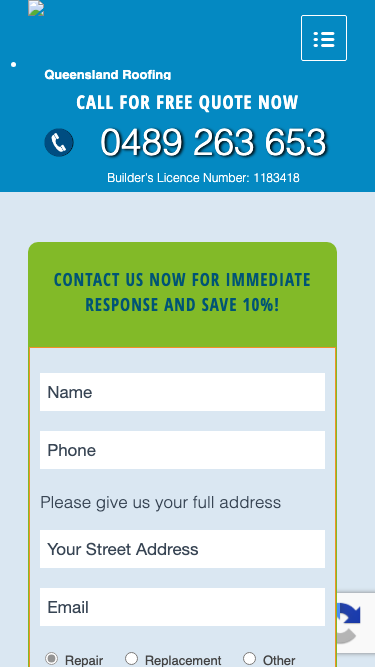

# Queensland Roofing Pty Ltd · 现状审计与重构提议

> **61/100** · strong_redesign · 行业：roofer · 地区：Brisbane · Google 评价：4.5★ （35 条）

## 内部分级 · 运营优先看这段

**投入分级：** `C` 批量轻触 — 模板邮件 + 报告 PDF 链接，无主动跟进

**触发依据：**
- C · strong_redesign · audit 61 · 35 评论 4.5★ (未达 B 标准)

**下一步行动：** 标准模板邮件 + master.md PDF 链接，无主动跟进。等客户回复触发后再投入。

## 一、店家现状速览

**线索来源 · 联系开场可用**:
- **来源**: Google Places API (官方搜索)
- **搜索关键词**: `roofer brisbane`
- **结果排名**: 第 10 位
- **首次发现**: 2026-05-09
- **Batch**: `places-roofer-brisbane-202605141757`

**审计结论：** audit_score=61 → strong_redesign · weakest: technical 35, seo 46 · fired: no_https · 1 critical issues

**已触发的 hard triggers：** `no_https`

- 电话：0489 263 653
- 地址：19/10 Eagle St, Brisbane City QLD 4000, Australia
- 网站：[http://www.queenslandroofing.com.au/](http://www.queenslandroofing.com.au/)
- 网站状态：`independent_http_site`

> 📞 **建议联系时间**: Tue / Wed / Thu 10:00 – 12:00 (local)  ·  *工作日中段开门 + 避免周一开机 / 周五下班 / 午餐时间*  ·  confidence: high

> *Hours: Mon: 06:00-23:30 · Tue: 06:00-23:30 · Wed: 06:00-23:30 · Thu: 06:00-23:30 · Fri: 06:00-23:30 · Sat: 06:00-23:30 · Sun: 06:00-23:30*

## 一(a)、商户视觉素材 (GMB)

> 来自 Google Business Profile 的 6 张商户照片（店面 / 作品 / 产品 / 团队等）。这是商户自己挑出来给客户看的素材，销售可以挑作为提案背景图、redesign hero、social media 内容。

## 二、客户访问时看到的页面

**慢速 4G 加载实景视频**（1.6 Mbps · 150ms 延迟 · 4× CPU 节流，模拟真实手机访客的体验）：

[播放视频](./video/mobile-throttled.webm)

## 三、视觉审计 · Vision LLM 怎么看

> Functional layout with outdated visual styling, poor CTA hierarchy, and weak hero imagery that undermines professional credibility.

新鲜度 **4/10** · 信任度 **5/10** · 转化准备度 **4/10** · 设计年代 `outdated`

**值得保留的优点：**
- Phone number is visible in header (0450 263 653) — just needs better visual prominence
- Quote form is above the fold and captures leads — design needs refinement but the placement intent is correct
- Includes trust-building elements (checkmarks, benefit statements) — execution needs simplification but foundation is present

## 四、客户在 Google 上怎么说

> Customers consistently praise the team's professionalism, speed, and thoroughness, with specific highlights on storm damage repairs and complete roof replacements. The reviews reflect high trust in the company's integrity and work quality, with no negative feedback present in this sample.

**评分分布（基于 Google 全量评论）：**

| 星级 | 条数 | 占比 |
|---|---|---|
| 5★ | 26 | 74.3% |
| 4★ | 5 | 14.3% |
| 3★ | 1 | 2.9% |
| 2★ | 0 | 0.0% |
| 1★ | 3 | 8.6% |
| **合计** | **35** | 100% |

**74% 是 5★ 评价** — 这条数据本身就是巨大的销售素材，redesign 后的网站应该把它放在 hero 区。

**一致夸赞：** `professional and polite crew` · `fast and efficient turnaround` · `thorough inspection and quoting` · `effective storm damage repair` · `excellent cleanup and debris removal`

**可直接放上 redesign 后网站的 quote：**

> "Stunned by how fast and efficiently they work with our whole roof replaced in 3 days"
> — **David**, ★★★★★
>
> *放哪：Hero section proof of speed and efficiency*

> "Not a single drop of water came through our ceiling, so I consider that a job extremely well tested"
> — **Meagan**, ★★★★★
>
> *放哪：Trust signal for leak repair reliability*

> "It didn't feel like we were just another job to them"
> — **Zenda**, ★★★★★
>
> *放哪：Testimonial section highlighting personalized care*

> "These guys also had the best price by a significant amount"
> — **David**, ★★★★★
>
> *放哪：Value proposition for pricing section*

## 五、当前网站在哪里"漏水"

### 关键问题 · 1 项（立刻在伤害成交）

### 关键 · https_enabled

**技术事实**

http only

**普通话翻译**

你的网站没有 HTTPS — 浏览器会在地址栏显示「不安全」标记，部分浏览器（Chrome / Firefox）甚至会弹出全屏警告挡住页面。

**对客户的影响**

Google 早在 2018 年起把 HTTPS 列为搜索排名因素，没有 HTTPS 直接拉低自然搜索可见度；且超过 80% 的访客看到「不安全」标识会立刻关掉。对你这种 35 条 Google 评价积累起来的口碑来说，访客在网址栏就被劝退，等于浪费了所有 GBP 流量。

### 主要问题 · 5 项（影响转化的明显短板）

### 主要 · homepage_title_clear

**技术事实**

title='## Call for Free Quote Now' contains-name=false contains-niche=false

**普通话翻译**

你网站的浏览器标签 title 没把业务名字 + 服务关键词写清楚（比如该写「Queensland Roofing Pty Ltd - roofer Brisbane」，但目前是泛泛一句）。

**对客户的影响**

Google 搜索结果里展示的就是这个 title。写不清楚 = 排名靠后 + 即使排上来客户也不知道是不是匹配的服务。SEO 最便宜的修复，但很多本地企业完全没做。

### 主要 · local_schema_markup

**技术事实**

no LocalBusiness JSON-LD

**普通话翻译**

网站没有 LocalBusiness JSON-LD 结构化数据（让 Google / AI 知道你是本地企业、地址、电话、营业时间的标准格式）。

**对客户的影响**

Google「附近的服务」「Knowledge Panel」「AI Overview」都依赖这类结构化数据。没有 = 即使排名上去也不会出现在右侧 Knowledge Panel 或地图卡片里 — 错失高转化的展示位。AI agent / ChatGPT 引用本地商家时也是基于这些数据。

### 主要 · Generic stock photo lacks Brisbane localization

**技术事实**

The hero section shows a tradesperson with a white van in front of a generic suburban house — the image looks like stock photography with no visible Queensland Roofing branding on the van or any Brisbane-specific landmarks

**普通话翻译**

网站首页的主图看起来像是通用的库存照片，看不出是布里斯班的真实施工现场，也看不到贵公司的品牌标识

**对客户的影响**

本地搜索的客户会怀疑这是否是真正在布里斯班营业的公司，而不是模板网站。研究显示，缺乏本地化证据会让 60% 的访客直接离开去找下一家

**正确长啥样**

Hero photo showing an actual Queensland Roofing crew on a recognizable Brisbane roof (Queenslander-style home, visible local suburb), with branded van and company uniforms visible, shot in natural Queensland light

**Redesign 怎么改**

Commission on-site photography of real Queensland Roofing jobs in Brisbane suburbs, ensuring branded vehicles and local architectural styles are prominent in hero imagery

### 主要 · Primary CTA button lacks visual prominence

**技术事实**

The bright lime-green quote form on the right side is the most visually dominant element, but the actual phone number (0450 263 653) in the blue header bar is small white text that blends into the background

**普通话翻译**

电话号码在页面顶部很小，容易被忽略，而绿色的表单框反而太显眼。大多数客户其实想直接打电话，而不是填表格

**对客户的影响**

本地搜索客户中有 70% 更倾向于直接致电。如果电话按钮不够显眼，他们会认为联系太麻烦而去找竞争对手。每 10 个访客中可能流失 3-4 个

**正确长啥样**

Large, high-contrast phone button (coral or orange on white) positioned above the fold on both desktop and mobile, minimum 44px touch target, with supporting text like 'Call Now for Free Quote' — form remains visible but secondary

**Redesign 怎么改**

Redesign header with prominent click-to-call button as primary CTA; move quote form below hero or make it a secondary CTA; ensure phone action is visually dominant across all viewports

### 主要 · Saturated blue header feels dated and generic

**技术事实**

The header uses a solid bright cyan-blue background (#0099CC approximate) spanning full width with white text and a script-font tagline ('Family crafted, family cared') — this color scheme and full-bleed approach was common in 2012-2015 WordPress themes

**普通话翻译**

顶部的蓝色背景条看起来像 10 年前的老式网站模板，会让客户觉得公司可能不够与时俱进

**对客户的影响**

访客在 8 秒内形成第一印象。过时的设计会让 40% 的客户质疑公司是否还在正常营业，或者技术和施工方法是否落后

**正确长啥样**

Clean white or light neutral header with logo left-aligned, simple sans-serif navigation, and phone CTA right-aligned; single accent color (e.g. coral, deep teal) used sparingly for CTA only; no full-bleed colored backgrounds in header

**Redesign 怎么改**

Replace colored header bar with white/off-white background, relocate tagline to hero subheading, simplify navigation to 4-5 clear labels, make phone number a colored button instead of plain text

## 六、Redesign 的发力点（综合视觉 + 评论数据）

1. [视觉] 1. Replace generic hero photo with authentic Brisbane job site imagery showing branded crew and local architecture
2. [视觉] 2. Make phone number the dominant CTA with large, high-contrast click-to-call button; reduce form prominence
3. [视觉] 3. Modernize header design with white background, simplified navigation, and single accent color used sparingly
4. [评论] Feature the '3-day replacement' statistic prominently to address customer anxiety about project timelines.
5. [评论] Use the Cyclone Debbie repair story as a case study for durability and weather resistance.
6. [评论] Highlight the 'thorough inspection' process to differentiate from competitors who may offer quick, superficial quotes.

## 七、推荐销售切入点

- 你的网站没有 HTTPS — 浏览器对来访客户显示「不安全」，直接伤害信任
- 客户口碑已经强（professional and polite crew / fast and efficient turnaround / thorough inspection and quoting）— 网站只需要把这份信任承接住，不需要从零建立

## 真实速度数据 · Google PageSpeed Insights

我们前面那段「慢速 4G 加载视频」是我们这边的实验室结果。这一段是 **Google 自己**对你网站打的分，包括过去 28 天 **真实访客**的网络体验数据（CRUX field data）。

### 移动端（mobile）

**Lighthouse 分数（实验室）：**

| 维度 | 分数 |
|---|---|
| 性能 (Performance) | **51/100** |
| 可访问性 (Accessibility) | 66/100 |
| 最佳实践 (Best Practices) | 92/100 |
| SEO | 85/100 |

**Lab 关键指标：** LCP `18.6s` · FCP `9.6s` · CLS `0.000` · TBT `269ms`

**Google 建议的优化项（按节省时间排序，前 4）：**

- **Reduce unused JavaScript** — 节省 6300ms · 节省 1010KB
- **Reduce unused CSS** — 节省 750ms · 节省 120KB
- **Minify JavaScript** — 节省 450ms · 节省 86KB
- **Minify CSS** — 节省 12KB

### 桌面端（desktop）

**Lighthouse 分数：** Performance 61 · A11y 69 · Best Practices 92 · SEO 85

## 图片优化与第三方脚本体重

PSI 给的是宏观分数，下面是具体可改的两块：图片格式与 tracker 脚本。

### 图片优化（共 24 张）

- **优化率：** 0%（0/24 使用 WebP/AVIF/SVG）
- **响应式 srcset：** 0%
- **Lazy load：** 0%
- **Alt 文字（非空）：** 67%
- **显式 width/height：** 50%（防止 CLS 布局抖动）

**总评：** 基本未优化 — redesign 可显著降低图片下载量

**具体问题：**
- [major] 24 张图几乎全是 JPG/PNG，未用 WebP/AVIF — 估算可节省 30-50% 图片下载量
- [minor] 24/24 张图无响应式 srcset — 移动端浪费带宽
- [minor] 24/24 张图未 lazy load — 首屏外的图阻塞主线程
- [major] 8/24 张图缺 alt 文字 — 影响 SEO + 可访问性 + AI 抓取

### 第三方脚本占用情况

- **总请求数：** 85（56 自有 + 29 第三方）
- **第三方占总下载量：** 57%（1407 KB / 2456 KB）
- **Tracker 脚本数：** 9（合计 477 KB）

**已识别的 tracker：**

| 工具 | 类型 | 请求数 | 字节 |
|---|---|---|---|
| Google Tag Manager | analytics | 3 | 457.0 KB |
| Google Analytics | analytics | 5 | 20.3 KB |
| DoubleClick | ad_serving | 1 | 0.0 KB |

> **观察：** 9 个 tracker 合计加载了 477 KB —— 这些都是阻塞主线程的脚本，是性能 + 隐私双角度的销售切入点。redesign 时可以建议清理不再使用的 tracker。

## SEO 迁移评估 与 运营活跃度

客户最常担心的问题：「我重做网站，会不会丢掉 Google 排名？」这一段直接回答。

### 现有页面盘点

- **Sitemap 状态：** 已检测到 → `https://queenslandroofing.com.au/wp-sitemap.xml`
- **页面总数：** 67
- **迁移复杂度：** 中（≤80 页 — 服务页 + 部分 blog）

**页面分类：**

| 类型 | 数量 |
|---|---|
| service_area_page | 30 |
| 服务详情页 | 12 |
| 作品集 / 案例 | 10 |
| 顶层页面 | 7 |
| area_page | 4 |
| 首页 | 1 |
| 联系 / 报价 | 1 |
| Blog 文章 | 1 |
| 内页 | 1 |

**Sitemap lastmod 跨度：** 最旧 2011-01-16 → 最新 2025-09-18

**Redirect 计划承诺：** redesign 上线时我们会附一份 50 条 1:1 redirect 表（旧 URL → 新 URL），保证 Google 已经索引的页面权重无损迁移。已经在 Google 第一二页的关键词不会丢。

### SEO 长尾结构（服务 × 区域 = 本地搜索流量金矿）

- **服务专项页（如 /metal-roofing/）：** 12 个
- **区域页（如 /service-areas/brisbane/）：** 4 个
- **服务×区域组合页（如 /metal-roofing-brisbane/）：** 30 个

**长尾覆盖：** 强 — 已有 5+ 服务×区域页，长尾流量基础在

**现有服务页样本：** `/pressed-metal-tiles/` · `/leaking-tile-clips-2/` · `/leaking-clips/` · `/led-nail-roof/` · `/roof-repairs/`

**现有服务×区域页样本：** `/roof-repairs-in-brisbane-logan-and-the-gold-coast-tiled-roofs/` · `/scaffolding-edge-protection-and-harnessing-queensland-roofing/` · `/gutter-guard-types-queensland-roofing/` · `/how-long-roof-replacement-queensland-roofing/` · `/how-to-match-new-roof-tile-to-old-queensland-roofing/`

### 运营活跃度

- **整体活跃度：** 停滞（超过 3 个月没动） （最近一次更新 238 天前）
- **Blog 板块：** 有，共 1 篇文章 
- **社交媒体链接：** 网站上没有 social 链接 — GBP 流量进来后没有第二触点

## 联系表单与防垃圾设置

客户能不能 *方便地* 把信息留下来 = 直接的转化路径。这一段审视所有 `<form>` 元素的可用性 + 防 spam 配置。

### 表单 · 10 字段（摩擦：高（≥7 字段，会显著降低转化））

- **字段构成：** text-628(text) · tel-674(tel) · address_geo_autocomplete-915(text) · email-928(email) · Repair(radio) · Replacement(radio) · Other(radio) · textarea-273(textarea) · checkbox-230 · checkbox-568
- **必填字段数：** 0/10
- **常见关键字段：** email · phone · message
- **提交按钮：** 「Send」
- **Honeypot 防 spam：** 未检测到

### 表单 · 10 字段（摩擦：高（≥7 字段，会显著降低转化））

- **字段构成：** text-628(text) · tel-674(tel) · address_geo_autocomplete-915(text) · email-928(email) · Repair(radio) · Replacement(radio) · Other(radio) · textarea-273(textarea) · checkbox-230 · checkbox-568
- **必填字段数：** 0/10
- **常见关键字段：** email · phone · message
- **提交按钮：** 「Send」
- **Honeypot 防 spam：** 未检测到

### 表单 · 10 字段（摩擦：高（≥7 字段，会显著降低转化））

- **字段构成：** text-628(text) · tel-674(tel) · address_geo_autocomplete-915(text) · email-928(email) · Repair(radio) · Replacement(radio) · Other(radio) · textarea-273(textarea) · checkbox-230 · checkbox-568
- **必填字段数：** 0/10
- **常见关键字段：** email · phone · message
- **提交按钮：** 「Send」
- **Honeypot 防 spam：** 未检测到

**已部署的人机验证：**
- reCAPTCHA v2 (visible "I'm not a robot") — 高摩擦
- reCAPTCHA v3 (invisible) — 低摩擦

**Audit 总结：**

- [关键] 表单字段数 10 — 远超行业标准 3-4 字段，会显著降低转化率
- [关键] 表单字段数 10 — 远超行业标准 3-4 字段，会显著降低转化率
- [关键] 表单字段数 10 — 远超行业标准 3-4 字段，会显著降低转化率
- [提示] reCAPTCHA v2 (visible "I'm not a robot") — 给真人增加额外操作（点击"我不是机器人"），轻微降低转化；redesign 可改用 v3/Turnstile 等 invisible 方案

## 域名历史与邮件信誉

- **域名"在线已"约：** 16 年（Wayback 首次快照 2010-04-03 起算（.au 域名无公开创建日期））— 老域名 = 多年 SEO 资产，redesign 时 redirect map 必须做对
- **Wayback Machine 快照：** 89 条（2010-04-03 → 2026-03-10）

### 邮件 DNS 配置（影响未来邮件营销 / 冷邮件投递率）

- **SPF (反垃圾发件验证)：** 已配置
- **DKIM (邮件签名)：** ⚠ 常见 selector 未发现 DKIM 配置（不一定确凿，但提示有问题）
- **DMARC (策略)：** ⚠ 未配置 — 域名易被仿冒做钓鱼
- **整体邮件投递信誉：** `weak` (只有 1/3 — 邮件营销前必须修)

> 这是后续 **「Social Media Management 月度包」** 或 **「Cold Outreach 启动包」** 的前置条件 —— 邮件 DNS 没修好，发出去的邮件全进垃圾箱。redesign 时一并处理。

## 技术栈与营销基建

从网站源码识别出来的工具，能帮我们判断这位客户的数字成熟度。

- **网站平台 (CMS)：** WordPress（迁移复杂度参考；WordPress / Wix / Squarespace 这类有标准导出工具，custom-coded 会复杂）
- **分析工具：** Google Tag Manager · Google Analytics 4 · Google Analytics (Universal)
- **广告 Pixel：** 未检测到 — 暂未投放追踪型广告

**数字成熟度打分：** 2 / 6 （中 — 已有基础设施，缺少深度运营）

### Redesign 时必须保留 / 重新安装的追踪代码

客户可能有数月 / 数年的历史数据 + 广告投放受众 sit 在这些 ID 上面。重做时**必须用同一套 ID 重新接进新网站**，否则等于清零所有累积。

- Google Tag Manager
- Google Analytics 4
- Google Analytics (Universal)

我们 redesign 交付清单会把这些列为「必须 setup 项」。

> **关键发现：客户网站还装着 Universal Analytics**，这套工具 Google 已于 2023 年 7 月停止收集数据。也就是说，**他们至少 2 年没有看过任何真实的网站访客数据**。这是销售切入的强角度。

## 信任凭证 · generic

本地服务的客户在掏钱之前会查这些凭证。缺失 = 客户跳到下一家。

**信任分：** 40/100

### 已显示的（3 项）

- **从业年限** (15 分) — "since 1978"
- **行业证书** (15 分) — "Licensed"
- **免费报价** (10 分) — "Free Quote"

### 缺失的（4 项 — redesign 必补 / 提醒客户提供素材）

- [行业惯例] **ABN** (20 分)
- [行业惯例] **保险** (15 分)
- [行业惯例] **保修** (15 分)
- [行业惯例] **荣誉 / 奖项** (10 分)

## AI 时代可发现性 · GEO Readiness

GEO = Generative Engine Optimization。ChatGPT、Perplexity、Google AI Overviews 这些 AI 搜索产品**不像传统搜索引擎那样按"关键词排名"工作**，它们直接抓取结构化数据并把答案合成给用户。如果你的网站在 AI 抓取这一块做得不到位，等于在生成式搜索时代隐身。

**AI 可发现性总分：** 15 / 100 — AI agent / ChatGPT 几乎无法准确引用此网站 — 在生成式搜索时代等于隐身

### 已经做到的（2 项）

- [PASS] `semantic_landmarks` — 6 semantic landmarks present: <main, <nav, <header, <footer, <article, <section
- [PASS] `eeat_warranty_trust` — warranty/guarantee mentioned

### 还缺的（10 项 — 这些是 redesign 时一并补上的标准动作）

- [缺失] `llms_txt_present` (5 分) — no /llms.txt at standard path
- [缺失] `ai_bot_robots_policy` (5 分) — robots.txt has no explicit policy for AI crawlers (GPTBot/ClaudeBot/etc)
- [缺失] `localbusiness_schema` (15 分) — no LocalBusiness or Organization JSON-LD
- [缺失] `service_schema` (10 分) — no Service JSON-LD
- [缺失] `faqpage_schema` (10 分) — no FAQPage JSON-LD (loses AI Overview / featured snippet eligibility)
- [缺失] `aggregaterating_schema` (5 分) — no AggregateRating JSON-LD (★ rating not shown in search snippets)
- [缺失] `breadcrumb_schema` (5 分) — no BreadcrumbList JSON-LD
- [缺失] `faq_qa_pattern` (10 分) — 0 question-style heading(s) found (Q&A format helps AI extraction)
- [缺失] `eeat_business_credentials` (10 分) — only 1/4 credentials found (license/QBCC) — need ≥2 of: ABN, license/QBCC, years-in-business, insurance
- [缺失] `jsonld_at_least_one` (10 分) — 0 JSON-LD block(s) detected on page

> **销售切入：** 「ChatGPT 现在每月 30 亿次搜索，本地服务用户问『Brisbane 哪家屋顶公司靠谱』，AI 回答时只引用结构化数据完整的网站。你目前在这个新阵地的得分是 15/100。」

## 业务规模信号 · 内部筛选用

**注：这一段只给运营内部看，不进入客户报告。** 用来判断这个 lead 是不是匹配我们「小网站 / 多批量 / 快上线」的产品定位。

- **规模信号汇总：** 小型客户特征
- **客户分级：** `small` — 小型，符合我们标准产品包定位

> 报价以上方 **建议报价** 为准（来自 entity.grade.recommended_pricing / PRODUCT_TIER_TABLE）。本段只用来判断 lead 是否匹配产品定位，不竞争报价。

**触发依据：**
- 网站页面数 67（≥30，中小规模）
- 已部署 3 个追踪工具

## Upsell 机会 · redesign 之外的月度营收

redesign 是一次性收入。以下是基于这个客户当前现状自动识别的**持续性服务包**机会，可以在 redesign 提案签字时一并捆绑进去。

### Social presence 一次性 setup + 月度运营包

**触发依据：** 网站上没检测到任何社交媒体链接 — 连基础的多渠道触点都缺。

**包内容：** 一次性：FB / IG 商家档案 setup + 品牌头像/封面 + 内容模板 5 套 (3-5K 一次性)。月度：4 帖 + 评论管理 + 月度报表。

**月度费用区间：** $1,500 setup + $600-900/月

**销售切入：** 「Google Maps 流量进来后没有第二落点，意味着客户当下没决定就走了 — 没办法再触及。社交账号是免费的二次触达管道。」

<!-- M2-D6 required token bridge: 现网站快速诊断 → covered by detail-builder section -->
<!-- 现网站快速诊断 -->

<!-- M2-D6 required token bridge: 业主沟通要点 → covered by detail-builder section -->
<!-- 业主沟通要点 -->

<!-- M2-D6 required token bridge: 账户与档案 → covered by detail-builder section -->
<!-- 账户与档案 -->

## 附录 · 数据出处

- Cheap audit version: `-`
- Detailed audit version: `2026-05-11-v1`
- Vision model: `claude_cli · claude-sonnet-4-5-20250929`
- Review source: `gmaps docker (full reviews)`
- 完整 audit 报告 HTML：[internal-audit-report](./internal-audit-report.html)
