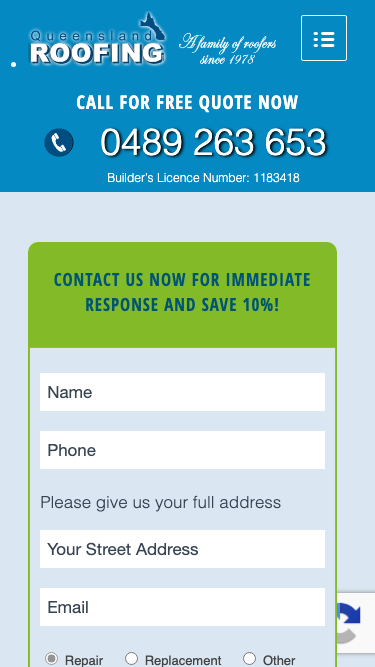

# Queensland Roofing Pty Ltd · 现状审计与重构提议

> **57/100** · strong_redesign · 行业：roofer · 地区：Brisbane · Google 评价：4.5★ （0 条）

## 内部分级 · 运营优先看这段

**投入分级：** `C` 批量轻触 — 模板邮件 + 报告 PDF 链接，无主动跟进

**触发依据：**
- C · strong_redesign · audit 57 · 0 评论 4.5★ (未达 B 标准)

**下一步行动：** 标准模板邮件 + master.md PDF 链接，无主动跟进。等客户回复触发后再投入。

## 一、店家现状速览

**线索来源 · 联系开场可用**:
- **来源**: Google Maps (gosom 抓取)
- **搜索关键词**: `roofer in brisbane`
- **首次发现**: 2026-05-13
- **Batch**: `pipe-roofing-brisbane-202605142244`

**审计结论：** audit_score=57 → strong_redesign · weakest: gbp 20, technical 35 · fired: no_https · 1 critical issues

**已触发的 hard triggers：** `no_https`

- 电话：0489263653
- 地址：19/10 Eagle St, Brisbane City QLD 4000
- 网站：[http://www.queenslandroofing.com.au/](http://www.queenslandroofing.com.au/)
- 网站状态：`independent_http_site`

## 二、客户访问时看到的页面

**慢速 4G 加载实景视频**（1.6 Mbps · 150ms 延迟 · 4× CPU 节流，模拟真实手机访客的体验）：

[播放视频](./video/mobile-throttled.webm)

## 三、视觉审计 · Vision LLM 怎么看

> Queensland Roofing's website carries a 2012-era aesthetic — gradient navigation, split hero with no headline, and a high-friction lead form — that will undermine trust and reduce quote requests from Google-searching Brisbane homeowners.

新鲜度 **3/10** · 信任度 **5/10** · 转化准备度 **4/10** · 设计年代 `outdated`

**值得保留的优点：**
- 'A family of roofers since 1975' tagline communicates genuine longevity and local roots — preserve this messaging prominently in the redesign, ideally in the hero headline
- The lead capture form is correctly positioned above the fold on the right side of the page — the placement strategy is sound, only the form length and styling need to change
- Phone number is placed in the top-right header where desktop users expect to find it — the location is correct, only the visual treatment needs upgrading to a button

## 五、当前网站在哪里"漏水"

### 关键问题 · 3 项（立刻在伤害成交）

### 关键 · https_enabled

**技术事实**

http only

**普通话翻译**

你的网站没有 HTTPS — 浏览器会在地址栏显示「不安全」标记，部分浏览器（Chrome / Firefox）甚至会弹出全屏警告挡住页面。

**对客户的影响**

Google 早在 2018 年起把 HTTPS 列为搜索排名因素，没有 HTTPS 直接拉低自然搜索可见度；且超过 80% 的访客看到「不安全」标识会立刻关掉。对你这种 0 条 Google 评价积累起来的口碑来说，访客在网址栏就被劝退，等于浪费了所有 GBP 流量。

### 关键 · 2012-era gradient nav bar and embossed logo erode credibility

**技术事实**

The horizontal navigation bar uses a dark teal-to-near-black gradient fill typical of early-2010s web design. The 'Queensland ROOFING' logo text uses a heavy drop-shadow/emboss effect on the lettering. Both elements together immediately signal an unmaintained, aging website.

**普通话翻译**

网站的导航栏有明显的深色渐变效果，标志文字有浮雕阴影，这是2012年左右流行的设计风格。整个网站看上去已经十年没有更新过了。

**对客户的影响**

访客在8秒内判断一个网站是否可信。过时的外观会让大约40%的首次访客直接关闭页面，转而点击Google搜索结果中下一家公司的网站，即使您的服务更好、价格更合理。

**正确长啥样**

A flat white or off-white header with clean sans-serif logo type and a single roof icon. Navigation as flat text links in a single color with one visually distinct 'Get Free Quote' button. Zero gradients, zero emboss effects.

**Redesign 怎么改**

Replace gradient nav with a flat #FFFFFF or #F8F8F8 header. Redesign logo as flat text (e.g. Montserrat Bold) + simple roof outline icon in brand color. Remove all drop shadows from all type elements site-wide.

### 关键 · Lead form demands full address and 6+ fields up front

**技术事实**

The right-side form under the teal 'CONTACT US NOW FOR IMMEDIATE RESPONSE AND SAVE 10%!' header contains at minimum: Name, Phone, a 'Please give us your full address' label, a 'Your Street Address' text field, Email, radio buttons (Repair / Replacement / Other), and a 'Details or questions?' textarea — all presented to a cold visitor who has not yet read a single word about the business.

**普通话翻译**

您的联系表单要求访客一开始就填写姓名、电话、完整地址、电子邮件等六个以上的栏位，让人感觉很麻烦，大多数人会直接放弃。

**对客户的影响**

研究显示每增加一个表单字段，填写完成率下降约11%。一个有6个栏位的表单，与只有2个栏位的表单相比，潜在客户提交量可能减少50%以上——这意味着每个月可能有几十个询盘白白流失。

**正确长啥样**

A 2–3 field form: Name, Phone, and a one-line 'What do you need?' dropdown (Repair / Replacement / Restoration). The address and email can be collected by the salesperson when they call back.

**Redesign 怎么改**

Reduce the primary contact form to Name + Mobile + Service Type (dropdown). Remove the street address field and email field entirely from this form. Add a single submit button labelled 'Get My Free Quote'. Collect remaining details by phone after initial contact.

### 主要问题 · 6 项（影响转化的明显短板）

### 主要 · review_volume_vs_peers

**技术事实**

0 reviews

**普通话翻译**

你的 Google 评价数量低于同行平均水平。

**对客户的影响**

本地搜索排名信号之一就是评价数量；不光是分数，连"有多少条"都算。短期可以做的：每个完工的客户群发一条「点评一下吧」的 SMS。

### 主要 · homepage_title_clear

**技术事实**

title='## Call for Free Quote Now' contains-name=false contains-niche=false

**普通话翻译**

你网站的浏览器标签 title 没把业务名字 + 服务关键词写清楚（比如该写「Queensland Roofing Pty Ltd - roofer Brisbane」，但目前是泛泛一句）。

**对客户的影响**

Google 搜索结果里展示的就是这个 title。写不清楚 = 排名靠后 + 即使排上来客户也不知道是不是匹配的服务。SEO 最便宜的修复，但很多本地企业完全没做。

### 主要 · local_schema_markup

**技术事实**

no LocalBusiness JSON-LD

**普通话翻译**

网站没有 LocalBusiness JSON-LD 结构化数据（让 Google / AI 知道你是本地企业、地址、电话、营业时间的标准格式）。

**对客户的影响**

Google「附近的服务」「Knowledge Panel」「AI Overview」都依赖这类结构化数据。没有 = 即使排名上去也不会出现在右侧 Knowledge Panel 或地图卡片里 — 错失高转化的展示位。AI agent / ChatGPT 引用本地商家时也是基于这些数据。

### 主要 · No Google reviews or star rating visible above the fold

**技术事实**

The entire above-fold area — header, hero, and right-side form — contains no Google review star rating, review count, or customer testimonial quote. The only trust signal present is the small tagline 'A family of roofers since 1975' in the logo area.

**普通话翻译**

整个首屏区域看不到任何客户评价或星级评分，新访客无法快速判断这家公司是否值得信任。

**对客户的影响**

超过90%的消费者在预约本地服务商之前会查看在线评价。把Google评分放在首屏可以让询盘量增加20-30%，因为访客不需要离开页面去单独搜索您的口碑，减少了流失到竞争对手的机会。

**正确长啥样**

A row of 5 gold stars + '4.9 ★ — 143 Google Reviews' displayed in the header bar next to the phone number, plus a single customer quote ('They re-roofed our Paddington home in one day — highly recommend — Sarah M., Paddington') placed directly below the hero.

**Redesign 怎么改**

Add a Google review badge (auto-synced widget or static image with star count) to the header beside the phone number. Place one featured testimonial with customer first name and Brisbane suburb immediately below the hero section, before the three-column features block.

### 主要 · Split 50/50 hero has no H1 headline to confirm relevance

**技术事实**

The hero area is divided 50/50: the left half shows a roofer worker against a teal/blue-tinted background, the right half shows a residential house photo. There is no large overlaid headline text anywhere in the hero — the closest headline copy is the small nav tagline and the body text in the three-column block below.

**普通话翻译**

网站主图区域被分成两半，左边是工人照片，右边是房屋照片，但没有任何大标题文字，访客很难在3秒内确认这家公司能解决他们的问题。

**对客户的影响**

访客平均在一个页面上停留不到15秒。如果没有清晰的大标题，许多人会因为找不到明确信息而立刻离开。加上清晰的首屏标题，访客停留时间通常可以提高约30%，大幅增加询价机会。

**正确长啥样**

A single full-width hero image (roofer working on a Brisbane residential roof, bright daylight) with a white 36–42px headline overlaid: 'Brisbane's Trusted Roofer Since 1975' and a sub-line 'Roof Repairs, Restoration & Replacement — Free Quotes, Same-Day Response'. A large high-contrast CTA button directly below.

**Redesign 怎么改**

Replace the 50/50 split layout with one full-bleed hero photo. Overlay an H1 headline in white, minimum 36px, naming Brisbane specifically. Add a large primary CTA button (orange, 18px white text, 'Call for Your Free Quote') directly beneath the headline, above the fold on 1280px desktop.

### 主要 · Phone number is plain text, not a visually dominant button

**技术事实**

The 'CALL FOR FREE QUOTE NOW' label and '0489 263 653' number in the top-right corner appear as styled text in a small block without a colored button background, border, or clear interactive affordance. It is visually similar weight to the nav links.

**普通话翻译**

页面右上角的电话号码只是普通文字样式，没有按钮的外观，很容易被访客忽视，不够显眼。

**对客户的影响**

对于本地服务类网站，电话是最重要的转化方式。没有明显的按钮样式，大约30-40%的访客可能不会注意到或点击电话号码，每个月可能因此损失数十个潜在询盘。

**正确长啥样**

A high-contrast button in the header: solid orange (#FF6B00) or green (#28A745) background, white 18px bold text, rounded corners (4–6px), a phone handset icon to the left, reading 'Call 0489 263 653'. It should be the heaviest visual element in the header.

**Redesign 怎么改**

Wrap the phone number in a proper button element with a high-contrast solid background color (orange or green), white text, padding 12px 20px, and a phone icon. Make it the largest interactive element in the header, visually outweighing all nav links.

## 六、Redesign 的发力点（综合视觉 + 评论数据）

1. [视觉] 1. Replace split hero with a full-width Brisbane roofing photo + 36px H1 headline naming the city + high-contrast orange 'Call for Free Quote' button visible above the fold without scrolling
2. [视觉] 2. Reduce lead form to 3 fields (Name, Mobile, Service Type dropdown) and add a Google star rating badge next to the form header to provide immediate social proof
3. [视觉] 3. Modernise the visual shell: flat white header, flat logo, remove all gradients and drop shadows, style phone number as a high-contrast button — this alone will meaningfully increase perceived trustworthiness

## 七、推荐销售切入点

- 你的网站没有 HTTPS — 浏览器对来访客户显示「不安全」，直接伤害信任

## 真实速度数据 · Google PageSpeed Insights

我们前面那段「慢速 4G 加载视频」是我们这边的实验室结果。这一段是 **Google 自己**对你网站打的分，包括过去 28 天 **真实访客**的网络体验数据（CRUX field data）。

### 移动端（mobile）

**Lighthouse 分数（实验室）：**

| 维度 | 分数 |
|---|---|
| 性能 (Performance) | **37/100** |
| 可访问性 (Accessibility) | 66/100 |
| 最佳实践 (Best Practices) | 92/100 |
| SEO | 85/100 |

**Lab 关键指标：** LCP `12.9s` · FCP `4.2s` · CLS `0.014` · TBT `953ms`

**Google 建议的优化项（按节省时间排序，前 4）：**

- **Reduce unused JavaScript** — 节省 3020ms · 节省 1009KB
- **Reduce unused CSS** — 节省 580ms · 节省 120KB
- **Minify JavaScript** — 节省 430ms · 节省 86KB
- **Minify CSS** — 节省 130ms · 节省 12KB

## 图片优化与第三方脚本体重

PSI 给的是宏观分数，下面是具体可改的两块：图片格式与 tracker 脚本。

### 图片优化（共 24 张）

- **优化率：** 0%（0/24 使用 WebP/AVIF/SVG）
- **响应式 srcset：** 0%
- **Lazy load：** 0%
- **Alt 文字（非空）：** 67%
- **显式 width/height：** 50%（防止 CLS 布局抖动）

**总评：** 基本未优化 — redesign 可显著降低图片下载量

**具体问题：**
- [major] 24 张图几乎全是 JPG/PNG，未用 WebP/AVIF — 估算可节省 30-50% 图片下载量
- [minor] 24/24 张图无响应式 srcset — 移动端浪费带宽
- [minor] 24/24 张图未 lazy load — 首屏外的图阻塞主线程
- [major] 8/24 张图缺 alt 文字 — 影响 SEO + 可访问性 + AI 抓取

### 第三方脚本占用情况

- **总请求数：** 85（56 自有 + 29 第三方）
- **第三方占总下载量：** 57%（1407 KB / 2456 KB）
- **Tracker 脚本数：** 9（合计 477 KB）

**已识别的 tracker：**

| 工具 | 类型 | 请求数 | 字节 |
|---|---|---|---|
| Google Tag Manager | analytics | 3 | 457.0 KB |
| Google Analytics | analytics | 5 | 20.3 KB |
| DoubleClick | ad_serving | 1 | 0.0 KB |

> **观察：** 9 个 tracker 合计加载了 477 KB —— 这些都是阻塞主线程的脚本，是性能 + 隐私双角度的销售切入点。redesign 时可以建议清理不再使用的 tracker。

## SEO 迁移评估 与 运营活跃度

客户最常担心的问题：「我重做网站，会不会丢掉 Google 排名？」这一段直接回答。

### 现有页面盘点

- **Sitemap 状态：** 已检测到 → `https://queenslandroofing.com.au/wp-sitemap.xml`
- **页面总数：** 67
- **迁移复杂度：** 中（≤80 页 — 服务页 + 部分 blog）

**页面分类：**

| 类型 | 数量 |
|---|---|
| service_area_page | 30 |
| 服务详情页 | 12 |
| 作品集 / 案例 | 10 |
| 顶层页面 | 7 |
| area_page | 4 |
| 首页 | 1 |
| 联系 / 报价 | 1 |
| Blog 文章 | 1 |
| 内页 | 1 |

**Sitemap lastmod 跨度：** 最旧 2011-01-16 → 最新 2025-09-18

**Redirect 计划承诺：** redesign 上线时我们会附一份 50 条 1:1 redirect 表（旧 URL → 新 URL），保证 Google 已经索引的页面权重无损迁移。已经在 Google 第一二页的关键词不会丢。

### SEO 长尾结构（服务 × 区域 = 本地搜索流量金矿）

- **服务专项页（如 /metal-roofing/）：** 12 个
- **区域页（如 /service-areas/brisbane/）：** 4 个
- **服务×区域组合页（如 /metal-roofing-brisbane/）：** 30 个

**长尾覆盖：** 强 — 已有 5+ 服务×区域页，长尾流量基础在

**现有服务页样本：** `/pressed-metal-tiles/` · `/leaking-tile-clips-2/` · `/leaking-clips/` · `/led-nail-roof/` · `/roof-repairs/`

**现有服务×区域页样本：** `/roof-repairs-in-brisbane-logan-and-the-gold-coast-tiled-roofs/` · `/scaffolding-edge-protection-and-harnessing-queensland-roofing/` · `/gutter-guard-types-queensland-roofing/` · `/how-long-roof-replacement-queensland-roofing/` · `/how-to-match-new-roof-tile-to-old-queensland-roofing/`

### 运营活跃度

- **整体活跃度：** 停滞（超过 3 个月没动） （最近一次更新 239 天前）
- **Blog 板块：** 有，共 1 篇文章 
- **社交媒体链接：** 网站上没有 social 链接 — GBP 流量进来后没有第二触点

## 联系表单与防垃圾设置

客户能不能 *方便地* 把信息留下来 = 直接的转化路径。这一段审视所有 `<form>` 元素的可用性 + 防 spam 配置。

### 表单 · 10 字段（摩擦：高（≥7 字段，会显著降低转化））

- **字段构成：** text-628(text) · tel-674(tel) · address_geo_autocomplete-915(text) · email-928(email) · Repair(radio) · Replacement(radio) · Other(radio) · textarea-273(textarea) · checkbox-230 · checkbox-568
- **必填字段数：** 0/10
- **常见关键字段：** email · phone · message
- **提交按钮：** 「Send」
- **Honeypot 防 spam：** 未检测到

### 表单 · 10 字段（摩擦：高（≥7 字段，会显著降低转化））

- **字段构成：** text-628(text) · tel-674(tel) · address_geo_autocomplete-915(text) · email-928(email) · Repair(radio) · Replacement(radio) · Other(radio) · textarea-273(textarea) · checkbox-230 · checkbox-568
- **必填字段数：** 0/10
- **常见关键字段：** email · phone · message
- **提交按钮：** 「Send」
- **Honeypot 防 spam：** 未检测到

### 表单 · 10 字段（摩擦：高（≥7 字段，会显著降低转化））

- **字段构成：** text-628(text) · tel-674(tel) · address_geo_autocomplete-915(text) · email-928(email) · Repair(radio) · Replacement(radio) · Other(radio) · textarea-273(textarea) · checkbox-230 · checkbox-568
- **必填字段数：** 0/10
- **常见关键字段：** email · phone · message
- **提交按钮：** 「Send」
- **Honeypot 防 spam：** 未检测到

**已部署的人机验证：**
- reCAPTCHA v2 (visible "I'm not a robot") — 高摩擦
- reCAPTCHA v3 (invisible) — 低摩擦

**Audit 总结：**

- [关键] 表单字段数 10 — 远超行业标准 3-4 字段，会显著降低转化率
- [关键] 表单字段数 10 — 远超行业标准 3-4 字段，会显著降低转化率
- [关键] 表单字段数 10 — 远超行业标准 3-4 字段，会显著降低转化率
- [提示] reCAPTCHA v2 (visible "I'm not a robot") — 给真人增加额外操作（点击"我不是机器人"），轻微降低转化；redesign 可改用 v3/Turnstile 等 invisible 方案

## 域名历史与邮件信誉

### 邮件 DNS 配置（影响未来邮件营销 / 冷邮件投递率）

- **SPF (反垃圾发件验证)：** 已配置
- **DKIM (邮件签名)：** ⚠ 常见 selector 未发现 DKIM 配置（不一定确凿，但提示有问题）
- **DMARC (策略)：** ⚠ 未配置 — 域名易被仿冒做钓鱼
- **整体邮件投递信誉：** `weak` (只有 1/3 — 邮件营销前必须修)

> 这是后续 **「Social Media Management 月度包」** 或 **「Cold Outreach 启动包」** 的前置条件 —— 邮件 DNS 没修好，发出去的邮件全进垃圾箱。redesign 时一并处理。

## 技术栈与营销基建

从网站源码识别出来的工具，能帮我们判断这位客户的数字成熟度。

- **网站平台 (CMS)：** WordPress（迁移复杂度参考；WordPress / Wix / Squarespace 这类有标准导出工具，custom-coded 会复杂）
- **分析工具：** Google Tag Manager · Google Analytics 4 · Google Analytics (Universal)
- **广告 Pixel：** 未检测到 — 暂未投放追踪型广告

**数字成熟度打分：** 2 / 6 （中 — 已有基础设施，缺少深度运营）

### Redesign 时必须保留 / 重新安装的追踪代码

客户可能有数月 / 数年的历史数据 + 广告投放受众 sit 在这些 ID 上面。重做时**必须用同一套 ID 重新接进新网站**，否则等于清零所有累积。

- Google Tag Manager
- Google Analytics 4
- Google Analytics (Universal)

我们 redesign 交付清单会把这些列为「必须 setup 项」。

> **关键发现：客户网站还装着 Universal Analytics**，这套工具 Google 已于 2023 年 7 月停止收集数据。也就是说，**他们至少 2 年没有看过任何真实的网站访客数据**。这是销售切入的强角度。

## 信任凭证 · generic

本地服务的客户在掏钱之前会查这些凭证。缺失 = 客户跳到下一家。

**信任分：** 40/100

### 已显示的（3 项）

- **从业年限** (15 分) — "since 1978"
- **行业证书** (15 分) — "Licensed"
- **免费报价** (10 分) — "Free Quote"

### 缺失的（4 项 — redesign 必补 / 提醒客户提供素材）

- [行业惯例] **ABN** (20 分)
- [行业惯例] **保险** (15 分)
- [行业惯例] **保修** (15 分)
- [行业惯例] **荣誉 / 奖项** (10 分)

## AI 时代可发现性 · GEO Readiness

GEO = Generative Engine Optimization。ChatGPT、Perplexity、Google AI Overviews 这些 AI 搜索产品**不像传统搜索引擎那样按"关键词排名"工作**，它们直接抓取结构化数据并把答案合成给用户。如果你的网站在 AI 抓取这一块做得不到位，等于在生成式搜索时代隐身。

**AI 可发现性总分：** 15 / 100 — AI agent / ChatGPT 几乎无法准确引用此网站 — 在生成式搜索时代等于隐身

### 已经做到的（2 项）

- [PASS] `semantic_landmarks` — 6 semantic landmarks present: <main, <nav, <header, <footer, <article, <section
- [PASS] `eeat_warranty_trust` — warranty/guarantee mentioned

### 还缺的（10 项 — 这些是 redesign 时一并补上的标准动作）

- [缺失] `llms_txt_present` (5 分) — no /llms.txt at standard path
- [缺失] `ai_bot_robots_policy` (5 分) — robots.txt has no explicit policy for AI crawlers (GPTBot/ClaudeBot/etc)
- [缺失] `localbusiness_schema` (15 分) — no LocalBusiness or Organization JSON-LD
- [缺失] `service_schema` (10 分) — no Service JSON-LD
- [缺失] `faqpage_schema` (10 分) — no FAQPage JSON-LD (loses AI Overview / featured snippet eligibility)
- [缺失] `aggregaterating_schema` (5 分) — no AggregateRating JSON-LD (★ rating not shown in search snippets)
- [缺失] `breadcrumb_schema` (5 分) — no BreadcrumbList JSON-LD
- [缺失] `faq_qa_pattern` (10 分) — 0 question-style heading(s) found (Q&A format helps AI extraction)
- [缺失] `eeat_business_credentials` (10 分) — only 1/4 credentials found (license/QBCC) — need ≥2 of: ABN, license/QBCC, years-in-business, insurance
- [缺失] `jsonld_at_least_one` (10 分) — 0 JSON-LD block(s) detected on page

> **销售切入：** 「ChatGPT 现在每月 30 亿次搜索，本地服务用户问『Brisbane 哪家屋顶公司靠谱』，AI 回答时只引用结构化数据完整的网站。你目前在这个新阵地的得分是 15/100。」

## 业务规模信号 · 内部筛选用

**注：这一段只给运营内部看，不进入客户报告。** 用来判断这个 lead 是不是匹配我们「小网站 / 多批量 / 快上线」的产品定位。

- **规模信号汇总：** 小型客户特征
- **客户分级：** `small` — 小型，符合我们标准产品包定位

> 报价以上方 **建议报价** 为准（来自 entity.grade.recommended_pricing / PRODUCT_TIER_TABLE）。本段只用来判断 lead 是否匹配产品定位，不竞争报价。

**触发依据：**
- 网站页面数 67（≥30，中小规模）
- 已部署 3 个追踪工具

## Upsell 机会 · redesign 之外的月度营收

redesign 是一次性收入。以下是基于这个客户当前现状自动识别的**持续性服务包**机会，可以在 redesign 提案签字时一并捆绑进去。

### Social presence 一次性 setup + 月度运营包

**触发依据：** 网站上没检测到任何社交媒体链接 — 连基础的多渠道触点都缺。

**包内容：** 一次性：FB / IG 商家档案 setup + 品牌头像/封面 + 内容模板 5 套 (3-5K 一次性)。月度：4 帖 + 评论管理 + 月度报表。

**月度费用区间：** $1,500 setup + $600-900/月

**销售切入：** 「Google Maps 流量进来后没有第二落点，意味着客户当下没决定就走了 — 没办法再触及。社交账号是免费的二次触达管道。」

<!-- M2-D6 required token bridge: 现网站快速诊断 → covered by detail-builder section -->
<!-- 现网站快速诊断 -->

<!-- M2-D6 required token bridge: 业主沟通要点 → covered by detail-builder section -->
<!-- 业主沟通要点 -->

<!-- M2-D6 required token bridge: 账户与档案 → covered by detail-builder section -->
<!-- 账户与档案 -->

## 附录 · 数据出处

- Cheap audit version: `-`
- Detailed audit version: `2026-05-11-v1`
- Vision model: `claude_cli · claude-haiku-4-5-20251001`
- Review source: `Google Places · most_relevant (max 5)`
- 完整 audit 报告 HTML：[internal-audit-report](./internal-audit-report.html)
