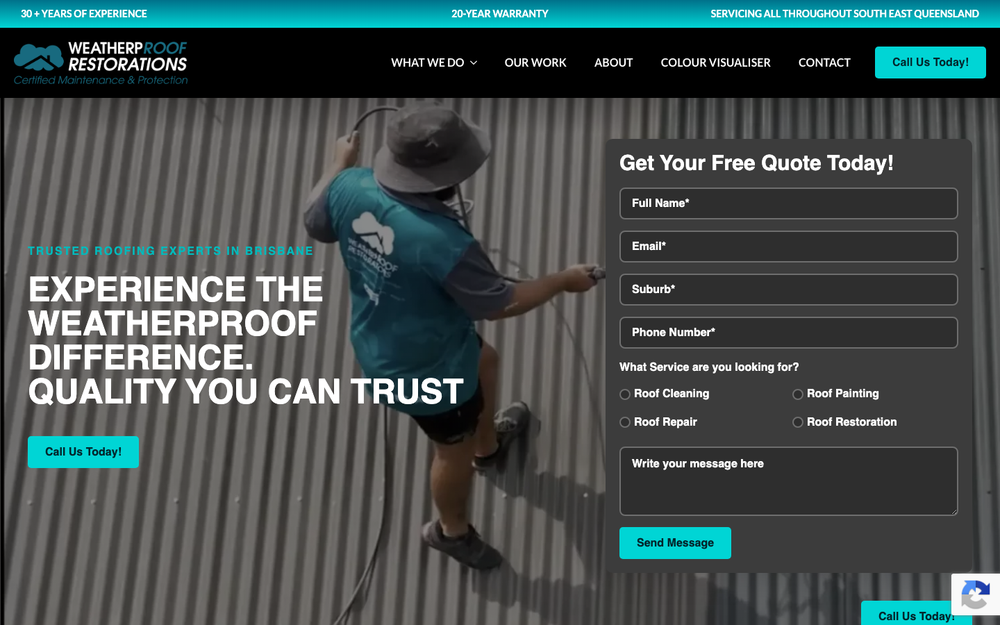

# WeatherpRoof Restorations · 现状审计与重构提议

> **61/100** · moderate_candidate · 行业：roofing · 地区：Brisbane · Google 评价：4.9★ （134 条）

## 内部分级 · 运营优先看这段

**投入分级：** `C` 批量轻触 — 模板邮件 + 报告 PDF 链接，无主动跟进

**触发依据：**
- C · moderate_candidate · audit 61 · 134 评论 4.9★ (未达 B 标准)

**下一步行动：** 标准模板邮件 + master.md PDF 链接，无主动跟进。等客户回复触发后再投入。

## 一、店家现状速览

**线索来源 · 联系开场可用**:
- **来源**: Google Maps (gosom 抓取)
- **搜索关键词**: `roof restoration in Brisbane`
- **首次发现**: 2026-05-09

**审计结论：** audit_score=61 → moderate_candidate · weakest: seo 34, visual 50 · fired: high_traction_old_site · 1 critical issues

**已触发的 hard triggers：** `high_traction_old_site`

- 电话：(07) 3171 2855
- 地址：115/193 S Pine Rd, Brendale QLD 4500
- 网站：[https://weatherproof.net.au/](https://weatherproof.net.au/)
- 网站状态：`independent_https_site`

> 📞 **建议联系时间**: Tue / Wed / Thu 10:00 – 12:00 (local)  ·  *工作日中段开门 + 避免周一开机 / 周五下班 / 午餐时间*  ·  confidence: high

> *Hours: Mon: 07:00-16:00 · Tue: 07:00-16:00 · Wed: 07:00-16:00 · Thu: 07:00-16:00 · Fri: 08:00-12:00 · Sat: closed · Sun: closed*

## 一(a)、商户视觉素材 (GMB)

> 来自 Google Business Profile 的 6 张商户照片（店面 / 作品 / 产品 / 团队等）。这是商户自己挑出来给客户看的素材，销售可以挑作为提案背景图、redesign hero、social media 内容。

## 二、客户访问时看到的页面

**慢速 4G 加载实景视频**（1.6 Mbps · 150ms 延迟 · 4× CPU 节流，模拟真实手机访客的体验）：

[播放视频](./video/mobile-throttled.webm)

## 三、视觉审计 · Vision LLM 怎么看

> The site uses an outdated teal/black color scheme with busy hero imagery and multiple conflicting CTAs that reduce clarity for mobile visitors.

新鲜度 **4/10** · 信任度 **5/10** · 转化准备度 **6/10** · 设计年代 `outdated`

**值得保留的优点：**
- The headline 'EXPERIENCE THE WEATHERPROOF DIFFERENCE. QUALITY YOU CAN TRUST' clearly communicates the value proposition and brand name
- The site displays a real worker photo (even if generic) which is better than pure stock imagery and shows an actual person doing roofing work
- Mobile version is responsive and text is legible at standard zoom levels

## 四、客户在 Google 上怎么说

> Customers overwhelmingly praise the business for its honesty, professionalism, and clear communication, particularly valuing transparent assessments that avoid unnecessary upsells. A single severe complaint regarding poor workmanship and communication exists, but it appears to be an outlier against a backdrop of consistent high satisfaction.

**评分分布（基于 Google 全量评论）：**

| 星级 | 条数 | 占比 |
|---|---|---|
| 5★ | 128 | 94.1% |
| 4★ | 2 | 1.5% |
| 3★ | 3 | 2.2% |
| 2★ | 1 | 0.7% |
| 1★ | 2 | 1.5% |
| **合计** | **136** | 100% |

**94% 是 5★ 评价** — 这条数据本身就是巨大的销售素材，redesign 后的网站应该把它放在 hero 区。

**一致夸赞：** `honest assessments` · `excellent communication` · `professional workmanship` · `punctual service` · `fair pricing`

**抱怨 / 短板：** `poor communication` · `substandard workmanship` · `unreliability`

**可直接放上 redesign 后网站的 quote：**

> "Weatherproof Restoration was the only one that responded... I really appreciated his honesty and professionalism."
> — **Joe**, ★★★★★
>
> *放哪：Hero section proof of integrity and responsiveness*

> "Great response and quick resolution to a minor concern we raised - sign of a quality, trustworthy business."
> — **Sam**, ★★★★★
>
> *放哪：Trust section highlighting after-care and reliability*

> "From my first contact with them to my last contact they were very friendly, kept up communication."
> — **Julian**, ★★★★★
>
> *放哪：Process section emphasizing customer experience*

## 五、当前网站在哪里"漏水"

### 关键问题 · 2 项（立刻在伤害成交）

### 关键 · phone_visible_above_fold

**技术事实**

phone hidden below fold or missing

**普通话翻译**

电话号码在第一屏看不到 — 客户必须滚动才能找到怎么联系你。

**对客户的影响**

本地服务客户 60-70% 倾向打电话沟通（不是填表单）。电话号没在第一屏 = 这部分客户里很多人会直接关掉去搜下一家。这是最便宜的转化优化之一。

### 关键 · Phone number not displayed on mobile or desktop

**技术事实**

Neither screenshot shows an actual phone number anywhere — only 'Call Us Today!' buttons; the top navigation on desktop has a 'CONTACT' link but no visible click-to-call number in the header or hero area

**普通话翻译**

网站上没有显示电话号码,访客必须点按钮才能打电话,这会流失很多着急的客户。

**对客户的影响**

移动端搜索'Brisbane 屋顶维修'的人,80%是遇到紧急问题(漏水、风暴损坏),他们想立刻打电话。如果看不到号码,60-70%会直接返回搜索结果打给下一家。您每个月可能因此损失20-40个电话咨询。

**正确长啥样**

Phone number displayed in the top-right of desktop header and directly below the logo on mobile (e.g. '07 3XXX XXXX' or '1300 XXX XXX') so it's tap-to-call without any extra steps

**Redesign 怎么改**

Add the business phone number in the desktop header top-right in a large, bold font; on mobile, place it directly below the logo in a tap-to-call format; keep it visible on scroll (sticky header)

### 主要问题 · 6 项（影响转化的明显短板）

### 主要 · homepage_title_clear

**技术事实**

title='# EXPERIENCE THE WEATHERPROOF DIFFERENCE. QUALITY YOU CAN TR' contains-name=true contains-niche=false

**普通话翻译**

你网站的浏览器标签 title 没把业务名字 + 服务关键词写清楚（比如该写「WeatherpRoof Restorations - roofing Brisbane」，但目前是泛泛一句）。

**对客户的影响**

Google 搜索结果里展示的就是这个 title。写不清楚 = 排名靠后 + 即使排上来客户也不知道是不是匹配的服务。SEO 最便宜的修复，但很多本地企业完全没做。

### 主要 · local_schema_markup

**技术事实**

no LocalBusiness JSON-LD

**普通话翻译**

网站没有 LocalBusiness JSON-LD 结构化数据（让 Google / AI 知道你是本地企业、地址、电话、营业时间的标准格式）。

**对客户的影响**

Google「附近的服务」「Knowledge Panel」「AI Overview」都依赖这类结构化数据。没有 = 即使排名上去也不会出现在右侧 Knowledge Panel 或地图卡片里 — 错失高转化的展示位。AI agent / ChatGPT 引用本地商家时也是基于这些数据。

### 主要 · 2010s-era teal/cyan accent color throughout

**技术事实**

The primary accent color is a bright teal/cyan (#00CED1 range) used for all buttons, the top banner text '30+ YEARS OF EXPERIENCE', and overlay text like 'TRUSTED ROOFING EXPERTS IN BRISBANE'

**普通话翻译**

网站用的青绿色(teal)是2012-2016年流行的颜色,现在看起来过时了,会让访客觉得公司可能也不是最新的专业水平。

**对客户的影响**

访客在8秒内会判断一个公司是否可信。过时的颜色会让人觉得这是一家老旧公司,可能技术和服务也跟不上,导致30-40%的访客直接离开去找看起来更现代的竞争对手。

**正确长啥样**

A 2025 roofing site would use a deep charcoal or navy base with a warm accent like coral, terracotta, or gold — colors that evoke trust, permanence, and Australian roofing heritage

**Redesign 怎么改**

Replace all teal/cyan (#00CED1) with a warm coral or terracotta accent (#FF6B4A, #E07856); update all button backgrounds, banner backgrounds, and overlay text to use the new palette

### 主要 · Three different CTAs on mobile confuse the visitor

**技术事实**

On mobile, there are three teal buttons: 'Call Us Today!' appears twice (once mid-hero, once at bottom), plus an 'Enquire Now' button at the bottom — all identical in style with no hierarchy

**普通话翻译**

手机页面上有三个一模一样的按钮,访客不知道该点哪个,造成混乱。

**对客户的影响**

移动端访客占本地搜索的70%以上,他们平均只会在页面停留10秒。如果CTA按钮不清晰,50%的访客会直接离开。一个清晰的'立即致电'按钮可以让电话咨询增加2-3倍。

**正确长啥样**

A single prominent phone CTA above the fold ('Call Now' with the actual phone number visible) and one secondary form button below, with clear visual hierarchy — primary is larger/bolder, secondary is outlined or smaller

**Redesign 怎么改**

Remove duplicate CTAs; show one primary 'Call [phone number]' button above fold in a warm accent color, make it tap-to-call; add one secondary 'Get Free Quote' button lower down in outlined style

### 主要 · Busy corrugated iron background reduces text legibility

**技术事实**

The hero image shows a worker on a corrugated metal roof with strong vertical line patterns; white text is overlaid with a dark semi-transparent overlay, but the corrugation ridges create visual noise behind 'EXPERIENCE THE WEATHERPROOF DIFFERENCE'

**普通话翻译**

英雄区的波纹铁皮背景太花了,白色文字不够清晰,访客需要费力才能看清主标题。

**对客户的影响**

如果访客在3秒内看不清您的核心卖点,他们会按返回键去找下一个搜索结果。特别是50岁以上的房主(屋顶修复的主要客户群),对低对比度文字更不耐烦,会直接流失掉20-30%的潜在客户。

**正确长啥样**

A hero image with a simpler background (e.g. a finished roof against sky, a clean roofline) or a solid color block behind the text so white letters have clean contrast without competing patterns

**Redesign 怎么改**

Either use a different hero image with a less busy background (blue sky, clean facade), or add a solid 80% black rectangle behind the headline text to ensure crisp legibility on all screens

### 主要 · Desktop quote form asks for 7 fields above the fold

**技术事实**

The right-side form on desktop labeled 'Get Your Free Quote Today!' contains 7 input fields (Name, Email, Phone Number, Service Type dropdown with 4 options including 'Roof Cleaning', 'Roof Painting', plus 'How long have you had your roofing for?' and 'Body text message box') all visible before scrolling

**普通话翻译**

桌面版的报价表单要求填7个字段,对于刚找到网站的访客来说太多了,会让人觉得麻烦而放弃。

**对客户的影响**

研究显示,表单每增加一个字段,完成率就下降10-15%。7个字段的表单只有5-8%的人会填完,而3个字段的表单有25-30%的人会提交。简化表单可以让您的询盘量翻3倍。

**正确长啥样**

A 2-3 field micro-form above the fold: Name, Phone, and a single-line 'What do you need?' text box, with a prominent submit button; or just a big 'Call Now' button with the phone number visible

**Redesign 怎么改**

Replace the 7-field form with a 3-field form: Name, Phone, and 'Tell us briefly what you need' (single line); move all other fields to a secondary detailed form on a separate 'Get Quote' page

## 六、Redesign 的发力点（综合视觉 + 评论数据）

1. [视觉] 1. Replace teal/cyan accent with a warm modern color (coral/terracotta) and simplify to one primary CTA above fold with visible phone number
2. [视觉] 2. Reduce desktop form from 7 fields to 3 fields (Name, Phone, Brief description) and display phone number prominently in header on all devices
3. [视觉] 3. Replace hero image with a recognizable Brisbane Queenslander roof project and add a solid text background for clean legibility
4. [评论] Feature Joe Lin's review prominently to counter 'scam' fears common in roofing by highlighting honest, no-upsell inspections.
5. [评论] Use Sam Pengelly's quote in a 'Why Choose Us' section to demonstrate proactive problem-solving and trustworthiness.
6. [评论] Highlight the peer endorsement from Elizabeth High to establish industry credibility and quality assurance.

## 七、推荐销售切入点

- 你已经有不错的 Google 流量基础（134 条 4.9★ 评论），但当前网站设计在浪费这些点击
- 客户口碑已经强（honest assessments / excellent communication / professional workmanship）— 网站只需要把这份信任承接住，不需要从零建立

## 真实速度数据 · Google PageSpeed Insights

我们前面那段「慢速 4G 加载视频」是我们这边的实验室结果。这一段是 **Google 自己**对你网站打的分，包括过去 28 天 **真实访客**的网络体验数据（CRUX field data）。

### 移动端（mobile）

**Lighthouse 分数（实验室）：**

| 维度 | 分数 |
|---|---|
| 性能 (Performance) | **92/100** |
| 可访问性 (Accessibility) | 88/100 |
| 最佳实践 (Best Practices) | 96/100 |
| SEO | 85/100 |

**Lab 关键指标：** LCP `2.9s` · FCP `1.4s` · CLS `0.002` · TBT `0ms`

**Google 建议的优化项（按节省时间排序，前 2）：**

- **Reduce unused CSS** — 节省 150ms · 节省 49KB
- **Initial server response time was short** — 节省 148ms

### 桌面端（desktop）

**Lighthouse 分数：** Performance 98 · A11y 88 · Best Practices 96 · SEO 85

## 图片优化与第三方脚本体重

PSI 给的是宏观分数，下面是具体可改的两块：图片格式与 tracker 脚本。

### 图片优化（共 19 张）

- **优化率：** 21%（4/19 使用 WebP/AVIF/SVG）
- **响应式 srcset：** 89%
- **Lazy load：** 89%
- **Alt 文字（非空）：** 0%
- **显式 width/height：** 11%（防止 CLS 布局抖动）

**总评：** 部分优化 — 还有空间

**具体问题：**
- [minor] 14 张图仍是 JPG/PNG，建议转 WebP
- [major] 19/19 张图缺 alt 文字 — 影响 SEO + 可访问性 + AI 抓取
- [minor] 17/19 张图无显式 width/height — 加重 CLS 布局抖动

### 第三方脚本占用情况

- **总请求数：** 111（76 自有 + 35 第三方）
- **第三方占总下载量：** 55%（2700 KB / 4938 KB）
- **Tracker 脚本数：** 11（合计 620 KB）

**已识别的 tracker：**

| 工具 | 类型 | 请求数 | 字节 |
|---|---|---|---|
| Google Tag Manager | analytics | 3 | 475.4 KB |
| Meta Pixel | ad_pixel | 2 | 142.0 KB |
| DoubleClick | ad_serving | 1 | 2.2 KB |
| Microsoft Clarity | analytics | 4 | 0.7 KB |
| Google Analytics | analytics | 1 | 0.0 KB |

> **观察：** 11 个 tracker 合计加载了 620 KB —— 这些都是阻塞主线程的脚本，是性能 + 隐私双角度的销售切入点。redesign 时可以建议清理不再使用的 tracker。

## SEO 迁移评估 与 运营活跃度

客户最常担心的问题：「我重做网站，会不会丢掉 Google 排名？」这一段直接回答。

### 现有页面盘点

- **Sitemap 状态：** 已检测到 → `https://weatherproof.net.au/sitemap_index.xml`
- **页面总数：** 35
- **迁移复杂度：** 中（≤80 页 — 服务页 + 部分 blog）

**页面分类：**

| 类型 | 数量 |
|---|---|
| 顶层页面 | 11 |
| 服务详情页 | 10 |
| service_area_page | 5 |
| 内页 | 3 |
| area_page | 2 |
| 首页 | 1 |
| Blog 文章 | 1 |
| 关于 / 团队 | 1 |
| 联系 / 报价 | 1 |

**Sitemap lastmod 跨度：** 最旧 2025-06-10 → 最新 2025-12-02

**Redirect 计划承诺：** redesign 上线时我们会附一份 35 条 1:1 redirect 表（旧 URL → 新 URL），保证 Google 已经索引的页面权重无损迁移。已经在 Google 第一二页的关键词不会丢。

### SEO 长尾结构（服务 × 区域 = 本地搜索流量金矿）

- **服务专项页（如 /metal-roofing/）：** 10 个
- **区域页（如 /service-areas/brisbane/）：** 2 个
- **服务×区域组合页（如 /metal-roofing-brisbane/）：** 5 个

**长尾覆盖：** 强 — 已有 5+ 服务×区域页，长尾流量基础在

**现有服务页样本：** `/all-you-need-to-know-about-our-full-roof-restorations/` · `/9-signs-your-roof-needs-repair/` · `/what-is-a-green-roof-are-they-a-good-idea/` · `/planning-to-sell-hows-your-roof/` · `/why-choose-weatherproof-restorations/`

**现有服务×区域页样本：** `/top-signs-your-roof-needs-immediate-attention/` · `/why-brisbanes-climate-affects-your-roof-more-than-you-think/` · `/dont-diy-your-roof-restoration/` · `/why-is-roof-maintenance-important/` · `/roof-painting/`

### 运营活跃度

- **整体活跃度：** 停滞（超过 3 个月没动） （最近一次更新 163 天前）
- **Blog 板块：** 有，共 1 篇文章 
- **社交媒体链接：** 网站上引用了 2 个平台 — facebook, instagram

## 联系表单与防垃圾设置

客户能不能 *方便地* 把信息留下来 = 直接的转化路径。这一段审视所有 `<form>` 元素的可用性 + 防 spam 配置。

### 表单 · 10 字段（摩擦：高（≥7 字段，会显著降低转化））

- **字段构成：** Full Name**(text,必填) · Email**(email,必填) · fields[text_suburb](text,必填) · fields[tel_phone-number](tel,必填) · Roof Cleaning(radio) · Roof Painting(radio) · Roof Repair(radio) · Roof Restoration(radio) · Write your message here(textarea) · HP Name(text)
- **必填字段数：** 4/10
- **常见关键字段：** email · phone · message
- **提交按钮：** 「Send Message」
- **Honeypot 防 spam：** 未检测到

### 表单 · 10 字段（摩擦：高（≥7 字段，会显著降低转化））

- **字段构成：** Full Name**(text,必填) · Email**(email,必填) · fields[text_suburb](text,必填) · fields[tel_phone-number](tel,必填) · Roof Cleaning(radio) · Roof Painting(radio) · Roof Repair(radio) · Roof Restoration(radio) · Write your message here(textarea) · HP Name(text)
- **必填字段数：** 4/10
- **常见关键字段：** email · phone · message
- **提交按钮：** 「Send Message」
- **Honeypot 防 spam：** 未检测到

### 表单 · 8 字段（摩擦：高（≥7 字段，会显著降低转化））

- **字段构成：** Full Name**(text,必填) · Last Name**(text,必填) · Email**(email,必填) · fields[tel_phone-number](tel,必填) · fields[text_suburb](text,必填) · What Service are you looking for?*(select-one,必填) · Write your message here(textarea) · HP Name(text)
- **必填字段数：** 6/8
- **常见关键字段：** email · phone · message
- **提交按钮：** 「Send Enquiry」
- **Honeypot 防 spam：** 未检测到

**已部署的人机验证：**
- reCAPTCHA v2 (visible "I'm not a robot") — 高摩擦
- reCAPTCHA v3 (invisible) — 低摩擦

**Audit 总结：**

- [关键] 表单字段数 10 — 远超行业标准 3-4 字段，会显著降低转化率
- [关键] 表单字段数 10 — 远超行业标准 3-4 字段，会显著降低转化率
- [关键] 表单字段数 8 — 远超行业标准 3-4 字段，会显著降低转化率
- [提示] reCAPTCHA v2 (visible "I'm not a robot") — 给真人增加额外操作（点击"我不是机器人"），轻微降低转化；redesign 可改用 v3/Turnstile 等 invisible 方案

## 域名历史与邮件信誉

- **域名"在线已"约：** 4 年（Wayback 首次快照 2021-12-28 起算（.au 域名无公开创建日期））— 中等年龄
- **Wayback Machine 快照：** 33 条（2021-12-28 → 2026-03-10）

### 邮件 DNS 配置（影响未来邮件营销 / 冷邮件投递率）

- **SPF (反垃圾发件验证)：** 已配置
- **DKIM (邮件签名)：** 已配置（selectors: mail, selector1, selector2）
- **DMARC (策略)：** 已配置（policy: `quarantine`）
- **整体邮件投递信誉：** `strong` (SPF + DKIM + DMARC 齐全)

## 技术栈与营销基建

从网站源码识别出来的工具，能帮我们判断这位客户的数字成熟度。

- **网站平台 (CMS)：** WordPress（迁移复杂度参考；WordPress / Wix / Squarespace 这类有标准导出工具，custom-coded 会复杂）
- **分析工具：** Google Tag Manager · Google Analytics 4 · Microsoft Clarity
- **广告 Pixel：** Meta (Facebook) Pixel · Google Ads Conversion — 客户已经在投放（或投放过）付费广告，对营销预算不陌生

**数字成熟度打分：** 4 / 6 （高 — 客户懂数字营销，redesign 谈预算时不必从零教育）

### Redesign 时必须保留 / 重新安装的追踪代码

客户可能有数月 / 数年的历史数据 + 广告投放受众 sit 在这些 ID 上面。重做时**必须用同一套 ID 重新接进新网站**，否则等于清零所有累积。

- Google Tag Manager
- Google Analytics 4
- Microsoft Clarity
- Meta (Facebook) Pixel
- Google Ads Conversion

我们 redesign 交付清单会把这些列为「必须 setup 项」。

## 信任凭证 · AU 屋顶服务

本地服务的客户在掏钱之前会查这些凭证。缺失 = 客户跳到下一家。

**信任分：** 25/100

### 已显示的（3 项）

- **从业年限** (10 分) — "25 Years Of Experience"
- **保修 / 工艺保证** (10 分) — "20-YEAR WARRANTY"
- **免费报价 / 上门估价** (5 分) — "Free Quote"

### 缺失的（5 项 — redesign 必补 / 提醒客户提供素材）

- [法律要求] **QBCC 执照号** (25 分)
- [法律要求] **ABN** (15 分)
- [行业惯例] **公共责任险** (15 分)
- [法律要求] **工伤 / WHS 合规** (10 分)
- [行业惯例] **行业协会会员** (10 分)

> 客户网站缺少 3 个法律 / 行业要求的信任凭证：QBCC 执照号、ABN、工伤 / WHS 合规。QLD 屋顶服务由 QBCC 监管，客户在花钱前会查这些；缺失等于直接给同行让单。

## AI 时代可发现性 · GEO Readiness

GEO = Generative Engine Optimization。ChatGPT、Perplexity、Google AI Overviews 这些 AI 搜索产品**不像传统搜索引擎那样按"关键词排名"工作**，它们直接抓取结构化数据并把答案合成给用户。如果你的网站在 AI 抓取这一块做得不到位，等于在生成式搜索时代隐身。

**AI 可发现性总分：** 30 / 100 — AI agent / ChatGPT 几乎无法准确引用此网站 — 在生成式搜索时代等于隐身

### 已经做到的（4 项）

- [PASS] `breadcrumb_schema` — BreadcrumbList JSON-LD present
- [PASS] `eeat_business_credentials` — 2/4 credentials in copy: license/QBCC, years-in-business
- [PASS] `eeat_warranty_trust` — warranty/guarantee mentioned
- [PASS] `jsonld_at_least_one` — 3 JSON-LD block(s) detected on page

### 还缺的（8 项 — 这些是 redesign 时一并补上的标准动作）

- [缺失] `llms_txt_present` (5 分) — no /llms.txt at standard path
- [缺失] `ai_bot_robots_policy` (5 分) — robots.txt has no explicit policy for AI crawlers (GPTBot/ClaudeBot/etc)
- [缺失] `localbusiness_schema` (15 分) — no LocalBusiness or Organization JSON-LD
- [缺失] `service_schema` (10 分) — no Service JSON-LD
- [缺失] `faqpage_schema` (10 分) — no FAQPage JSON-LD (loses AI Overview / featured snippet eligibility)
- [缺失] `aggregaterating_schema` (5 分) — no AggregateRating JSON-LD (★ rating not shown in search snippets)
- [缺失] `semantic_landmarks` (10 分) — 3 semantic landmarks present: <nav, <header, <section
- [缺失] `faq_qa_pattern` (10 分) — 0 question-style heading(s) found (Q&A format helps AI extraction)

> **销售切入：** 「ChatGPT 现在每月 30 亿次搜索，本地服务用户问『Brisbane 哪家屋顶公司靠谱』，AI 回答时只引用结构化数据完整的网站。你目前在这个新阵地的得分是 30/100。」

## 业务规模信号 · 内部筛选用

**注：这一段只给运营内部看，不进入客户报告。** 用来判断这个 lead 是不是匹配我们「小网站 / 多批量 / 快上线」的产品定位。

- **规模信号汇总：** 中型客户特征
- **客户分级：** `mid` — 中型客户，可接但价格要往上提（基础包 + 配置项）

> 报价以上方 **建议报价** 为准（来自 entity.grade.recommended_pricing / PRODUCT_TIER_TABLE）。本段只用来判断 lead 是否匹配产品定位，不竞争报价。

**触发依据：**
- Google 评价 134 条（≥50，有规模基础）
- 网站页面数 35（≥30，中小规模）
- 已部署 5 个分析 / pixel 工具（高数字成熟度）

## Upsell 机会 · redesign 之外的月度营收

redesign 是一次性收入。以下是基于这个客户当前现状自动识别的**持续性服务包**机会，可以在 redesign 提案签字时一并捆绑进去。

### Social Media Management 月度包

**触发依据：** 客户活跃度为「停滞（3-12 月没动）」，但 Google 上有 134 条 4.9★ 评价的口碑底子 — 有内容素材却没在用。

**包内容：** 每月 8-12 帖（FB / IG / LinkedIn 至少 2 平台）+ 4 条工程现场 reels/short videos + 月度 GBP 帖子 2 条 + 评论回复代运营。

**月度费用区间：** $800-1,500/月（视平台数量与内容深度）

**销售切入：** 「你 Google 上的 134 条好评是金矿，但你的 Facebook 已经 163 天没动过 — 这等于你把口碑资产堆在仓库里没拿去卖。我们月度包就是把这部分自动化跑起来。」

<!-- M2-D6 required token bridge: 现网站快速诊断 → covered by detail-builder section -->
<!-- 现网站快速诊断 -->

<!-- M2-D6 required token bridge: 业主沟通要点 → covered by detail-builder section -->
<!-- 业主沟通要点 -->

<!-- M2-D6 required token bridge: 账户与档案 → covered by detail-builder section -->
<!-- 账户与档案 -->

## 附录 · 数据出处

- Cheap audit version: `-`
- Detailed audit version: `2026-05-11-v1`
- Vision model: `claude_cli · claude-sonnet-4-5-20250929`
- Review source: `gmaps docker (full reviews)`
- 完整 audit 报告 HTML：[internal-audit-report](./internal-audit-report.html)
