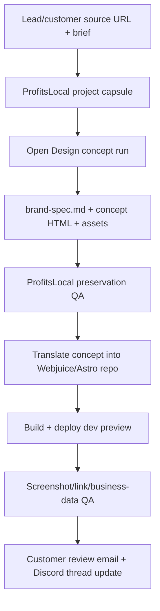

# Open Design Integration

Updated: 2026-05-06

## Decision

Use Open Design as the primary high-fidelity design concept engine for website redesign work.

Do not rebuild a parallel ProfitsLocal redesign skill that tries to copy Open Design's design logic. ProfitsLocal should wrap Open Design, preserve project memory, enforce business facts, translate approved concepts into the production Astro framework, deploy, and run QA.

## Why

Open Design already contains the design loop we need:

- first-turn discovery form;
- brand/reference-site branch;
- brand-spec extraction from URL, files, CSS, screenshots, and public brand pages;
- deterministic design directions when no brand exists;
- skill and design-system injection;
- local agent adapter support for Codex, Claude Code, Hermes, OpenCode, Cursor, Devin, and others;
- filesystem-backed artifacts;
- checklist and five-dimensional critique before shipping.

The important lesson from the Rich & Rare redesign test is that design quality came from Open Design's whole loop, not from a single prompt line. The app asked the right questions, extracted brand context, wrote `brand-spec.md`, built a concept, and checked itself before returning the artifact.

## Boundary

Open Design owns:

- design discovery;
- visual direction;
- brand/design-system extraction;
- high-fidelity concept generation;
- artifact workspace;
- concept-level critique.

ProfitsLocal owns:

- lead and customer intake;
- evidence collection and provenance;
- niche completeness rules;
- business fact preservation;
- customer/project memory;
- Discord/Hermes task thread;
- production Astro/Webjuice implementation;
- Cloudflare deploy;
- screenshot/link/content QA;
- customer emails;
- checkout, approval, revision, and domain workflow;
- finance and ROI records.

## Recommended Redesign Flow



## Minimal Input Packet For Open Design

For redesigns, keep the input intentionally light:

- official website URL;
- business type;
- target audience;
- desired tone;
- target scope: homepage only, homepage plus key section, or 3-4 key pages;
- non-negotiables: preserve logo, core pages, contact details, booking/order links, menu/services, and existing URL intent;
- production note: concept will later be translated into the Webjuice/Astro framework.

Avoid over-preparing design direction before Open Design has inspected the source site. Heavy pre-processing should be reserved for evidence and QA, not for replacing Open Design's brand extraction.

## Output We Expect

An Open Design concept run should produce, or be exported into, a concept folder:

```text
clients/<client>/concept/open-design/
├── index.html
├── brand-spec.md
├── assets/
├── screenshots/
└── notes.md
```

For multi-page redesigns, the concept may contain several HTML files or one page-switching prototype. Production translation decides the final Astro route structure.

## Quality Gate After Open Design

Open Design can create the concept, but ProfitsLocal must still verify:

- official business name, address, phone, email, hours, and CTA links are accurate;
- menu/service/product content was not deleted or invented;
- old sitemap URLs are preserved or redirected;
- logo/favicon/brand assets are carried over where available;
- design is responsive and does not overflow;
- copy is specific to the business, not generic filler;
- generated imagery is labeled when real imagery is missing;
- pages build and deploy on Cloudflare Pages.

## Tool Strategy

Preferred:

1. Native Open Design app/daemon for concept generation.
2. Export concept folder.
3. ProfitsLocal production translator applies the concept to the Webjuice/Astro repo.

Fallback:

1. Use Open Design's prompt stack and skills through a compatible local agent.
2. Keep the same minimal input packet.
3. Save outputs into the same concept folder contract.

Do not make manual Open Design app usage a permanent bottleneck. The short-term manual app flow is acceptable for quality calibration; the long-term path is headless/native Open Design orchestration.

Headless/API details are documented in `docs/OPEN_DESIGN_HEADLESS_ORCHESTRATION.md`.

## Rich & Rare Evidence

The Open Design desktop app output for Rich & Rare produced:

- extracted brand tokens in `brand-spec.md`;
- local assets;
- responsive concept HTML;
- multi-page concept intent: home, menus, private dining, visit/contact.

The production translation was deployed at:

- `https://rich-and-rare-restaurant-dev.pages.dev/`
- `https://rich-and-rare-restaurant-dev.pages.dev/menu/`
- `https://rich-and-rare-restaurant-dev.pages.dev/private-dining/`
- `https://rich-and-rare-restaurant-dev.pages.dev/visit/`

QA artifacts:

- `data/qa/rich-and-rare-open-design-production/qa-results-verified.json`
- desktop/mobile screenshots in `data/qa/rich-and-rare-open-design-production/`

## Next Implementation Work

1. Add an Open Design concept runner or export importer.
2. Store imported concepts under `clients/<client>/concept/open-design/`.
3. Add a concept-to-Webjuice translation checklist.
4. Add QA that compares production routes against the concept and preservation packet.
5. Add Discord handoff fields for `openDesignConceptPath` and `brandSpecPath`.
