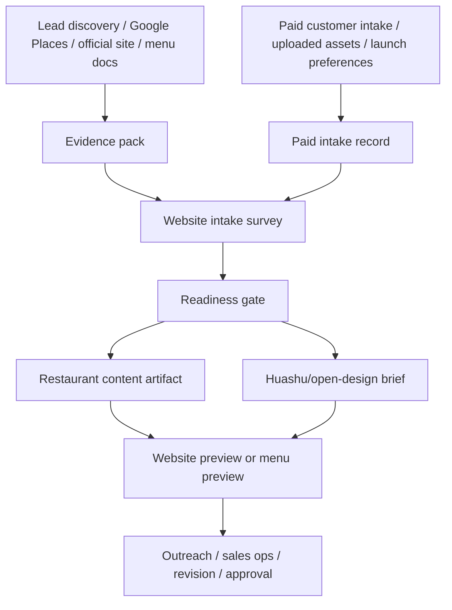

# Website Intake Survey Standard

Updated: 2026-05-06

## Purpose

Every local business website build must start from one unified intake survey, whether the information came from Google Places, an official website, a menu/service PDF or image, a customer checkout form, or an operator briefing an agent manually.

This file defines the standard we should follow before any renderer, Codex run, Hermes website-agent run, Claude Code session, OpenCode session, or Open Design app session starts changing the website.

The goal is simple:

```text
scraped facts + customer facts + brand/design choices
  -> one website-ready package
  -> first preview build or revision task
```

## Why This Exists

Open Design treats the first survey as the start of the design system, not as optional admin work. Its core discovery prompt requires a `question-form id="discovery"` before a new design task starts, locking the surface, audience, tone, brand context, scale, and constraints before the model writes UI.

For ProfitsLocal, the same principle becomes:

- do not start a restaurant website from a vague chat request;
- do not let an agent improvise brand direction from memory;
- do not mix customer website requirements with ProfitsLocal internal sales/fulfillment pages;
- do not mix a formal website route with a niche-specific utility route such as a restaurant mobile menu;
- do not render menu items, phone numbers, addresses, or CTAs without evidence;
- do not create a first paid version until the intake is content-ready and the customer confirms generation.

Important boundary: the survey is a readiness and guardrail layer, not a
replacement for Open Design's own brand extraction. For redesign work, pass the
official URL and minimal constraints into Open Design, let Open Design inspect
the current site and produce `brand-spec.md`/concept assets, then run
ProfitsLocal evidence and QA checks after the concept exists.

## Relationship To Existing Modules

The unified survey sits between evidence gathering and website generation.



Existing code already covers pieces of this:

| Existing piece | Current role |
|---|---|
| `clients/<client>/evidence/evidence.json` | Source-backed business, menu, photo, brand, and link facts. |
| `clients/<client>/content.restaurant.json` | Restaurant renderer content. |
| `clients/<client>/design.restaurant.json` | Huashu-ready restaurant design brief. |
| `clients/<client>/brand-spec.md` | Human-readable brand/design spec. |
| `data/paid-intakes/<client>/<order>.json` | Paid structured customer intake. |
| `data/cases/<client>/<order>/context.md` | Agent memory and handoff context. |
| `data/agent-tasks/<client>/*.json` | Executable agent task packet. |

The missing consolidation is a first-class survey output that both scraped leads and paid customers can produce.

Recommended future file shape:

```text
clients/<client>/intake/website-survey.json
clients/<client>/intake/website-survey.md
clients/<client>/intake/readiness.json
```

For paid direct intake, the same normalized survey should be embedded or referenced from:

```text
data/paid-intakes/<client>/<order>.json
```

## Survey Groups

### 1. Business Identity

Required:

- business name
- niche, currently `restaurant`
- city and country
- address or service area
- phone, email, or contact URL
- Google Place ID or Google Maps URL when available
- official website URL when available

Optional:

- social links
- owner/operator contact
- legal trading name
- preferred public display name

Every field should carry source metadata when it is scraped:

```json
{
  "value": "Opa Bar & Mezze",
  "source": "google_places",
  "sourceUrl": "https://maps.google.com/...",
  "confidence": "high"
}
```

### 2. Customer And Conversion Goal

Required:

- primary audience
- primary customer action: `call`, `reserve`, `order`, `directions`, `view_menu`, or `contact`
- lead recipient email for form submissions

Optional:

- secondary action
- target customer notes
- campaign goal
- trust proof to emphasize: reviews, awards, rating, years, press, chef/owner story

### 3. Product, Service, Menu, And Offer

Required for restaurants:

- menu source: official page, PDF, image, OCR text, customer upload, or explicitly verified manual source
- menu sections or core offers
- opening hours when available
- reservation, ordering, delivery, or booking URL when available

Rules:

- Menu items must come from evidence.
- If OCR is used, store the source file, OCR provider, and confidence notes.
- If a menu is missing, the build can only proceed as a website with placeholder-free non-menu sections, or must ask for a menu.
- A menu-only product should stay minimal and mobile-first.

Required for standard lead-generation niches such as roofing:

- service list;
- service area;
- primary lead action, usually `contact` or `estimate`;
- trust credentials such as license, insurance, warranty, reviews, or years in business when available.

Rules:

- Do not invent license numbers, warranty claims, project counts, or emergency availability.
- Services and proof claims must come from evidence or customer intake.

### 4. Brand And Design Context

Required:

- current design route: `website` by default, or a niche-specific route such as restaurant `menu`
- design direction: one of the approved ProfitsLocal/Open Design directions or a customer-supplied reference
- asset status for logo, photos, menu images, and brand colors

Optional:

- official logo URL or upload
- palette colors extracted from the official site
- font hints from official CSS
- visual references
- things to avoid

The Open Design discovery fields map into our survey like this:

| Open Design field | ProfitsLocal survey field |
|---|---|
| `output` | `route`: website, landing, full site, or niche utility route |
| `platform` | `surface`: mobile-first, desktop, responsive |
| `audience` | target customer |
| `tone` | brand mood and design direction |
| `brand` | logo, official site, screenshots, reference assets, or generated direction |
| `scale` | sections/pages/menu depth |
| `constraints` | evidence rules, content limits, launch restrictions, customer notes |

The Open Design `design-brief` skill's eight dimensions should also be resolvable before a major website build:

- color palette
- accent color
- body typography
- display typography
- layout model
- mood
- density
- constraints

If the customer does not choose these explicitly, the system may select defaults from the approved direction library, but it must record the defaults.

### 5. Assets And Evidence

Required:

- official source URLs where possible
- photo source inventory
- menu source inventory
- brand asset inventory

Optional:

- customer uploads
- Google Drive or Dropbox references
- generated image prompts and generated image URLs

Rules:

- Real assets come first.
- Generated imagery is allowed only when real imagery is missing or unusable, and must be labeled in evidence.
- Raw uploads live in Cloudinary in v1; GitHub stores references and summaries.

### 6. Page Structure

Required:

- route type: `website` or a niche-specific utility route such as restaurant `menu`
- section list
- primary CTA placement
- preview utility controls, when this is a ProfitsLocal sales preview

Website route:

- should look like an official, formal website;
- should have brand hierarchy, hero, sections, trust proof, location/contact, and conversion CTA;
- should not look like a spreadsheet or menu dump.
- should default to contact form lead generation unless the niche/customer calls for another CTA.

Restaurant menu route:

- should be mobile-first;
- should contain as little non-menu content as possible;
- should prioritize scan speed, item names, descriptions, prices, phone, address, directions, and reservation/order links.

ProfitsLocal sales and fulfillment routes:

- checkout, thank-you, revise, approve, order status, and domain setup belong to the internal sales/fulfillment layer;
- they may be available on preview sites;
- they should not be treated as required customer website content.

### 7. Domain And Launch Preference

Required after purchase:

- preferred launch route: ProfitsLocal subdomain, customer subdomain, customer root domain, or path under an existing domain
- requested domain or subdomain
- DNS provider when known

Rules:

- ProfitsLocal subdomain is the easiest route when the customer does not want DNS work.
- Customer subdomain is safer than root domain when they already have a website or email setup.
- Customer root domain requires more careful DNS/email review.
- Domain setup instructions must be generated from the selected route, not generic text.

### 8. Delivery And Workflow

Required for paid intake:

- order ID
- checkout email
- tier and revision entitlement
- customer confirmation to generate first version
- refund/scope acknowledgement

Rules:

- Before first-version confirmation, intake updates do not consume revisions.
- After first version is generated, clear in-scope revisions consume quota.
- Major redesigns, new pages, or custom functionality are quoted separately.

## Readiness Gate

The survey can produce these statuses:

| Status | Meaning |
|---|---|
| `evidence_collecting` | Lead exists, but required scraped/customer facts are missing. |
| `lead_ready` | Enough evidence exists to prepare a first preview lead package. |
| `website_ready` | Enough content and design context exists to build a website preview. |
| `menu_ready` | Enough verified menu content exists to build a menu route. |
| `needs_customer_info` | Missing facts must come from the customer. |
| `needs_generation_confirmation` | Content is complete, but paid first-version confirmation is missing. |
| `ready_for_agent_task` | Agent may build/update the customer-facing `dev` version. |

Minimum restaurant `ready_for_agent_task` requirements:

- business name
- restaurant niche
- address or service area
- at least one customer contact method
- primary customer action
- lead recipient email
- real menu/services/offers source
- route type: website or menu
- design direction or brand context
- required source URLs or asset references
- paid first-version confirmation when this is a paid direct intake

Minimum standard lead-generation website requirements:

- business name
- niche
- address or service area
- at least one customer contact method
- primary lead action, usually contact form or call
- lead recipient email
- service/product/offer source
- website route and section list
- design direction or brand context
- required source URLs or asset references
- paid first-version confirmation when this is a paid direct intake

## Agent Contract

Every website-agent task should receive or derive:

- `websiteSurveyPath`
- `readinessPath`
- `evidencePath`
- `contentPath`
- `designPath`
- `brandSpecPath`
- `caseContextPath` for paid work

Before visual edits, the task prompt must tell the agent:

- load `huashu-design`;
- load Open Design `web-prototype`, `saas-landing`, `design-brief`, and critique skills when available;
- preserve the distinction between website and menu routes;
- use verified evidence/design/brand files;
- push customer-facing changes to `dev` only until approval.

The agent run record should continue recording `designProtocolUsed`, and should add a future `websiteSurveyUsed` audit field once the normalized survey exists in code.

## Implementation Tasks

1. Add a `core/intake/website-survey.js` normalizer that can read evidence packs and paid intake records.
2. Add `clients/<client>/intake/website-survey.json` output to `npm run pipeline:build-client`.
3. Add readiness validation that maps current `assessPaidIntakeReadiness` plus restaurant evidence validation into one status model.
4. Add `websiteSurveyPath` and `readinessPath` to routed agent tasks.
5. Update the Discord handoff packet so the website-agent sees the survey path before content/design paths.
6. Update local AI audit to check the survey route rule: website is formal/brand-led; menu is minimal/mobile-first.
7. Add a high-level `profitslocal-local-business-design` skill that wraps Open Design discovery, Huashu taste review, ProfitsLocal evidence rules, and the active niche adapter.
8. Add smoke tests:
   - scraped lead -> survey -> website-ready;
   - paid intake incomplete -> needs customer info;
   - paid intake complete without confirmation -> needs generation confirmation;
   - paid intake complete with confirmation -> ready for agent task.

## References

- Open Design repository: https://github.com/nexu-io/open-design
- Open Design discovery prompt: `apps/daemon/src/prompts/discovery.ts`
- Open Design design brief skill: `skills/design-brief/SKILL.md`
- Open Design web prototype skill: `skills/web-prototype/SKILL.md`
- ProfitsLocal Open Design integration decision: `docs/OPEN_DESIGN_INTEGRATION.md`
- ProfitsLocal paid intake rules: `docs/PROFITSLOCAL_OPERATING_RULES.md`
- ProfitsLocal Hermes website-agent protocol: `docs/HERMES_WEBSITE_AGENT.md`
